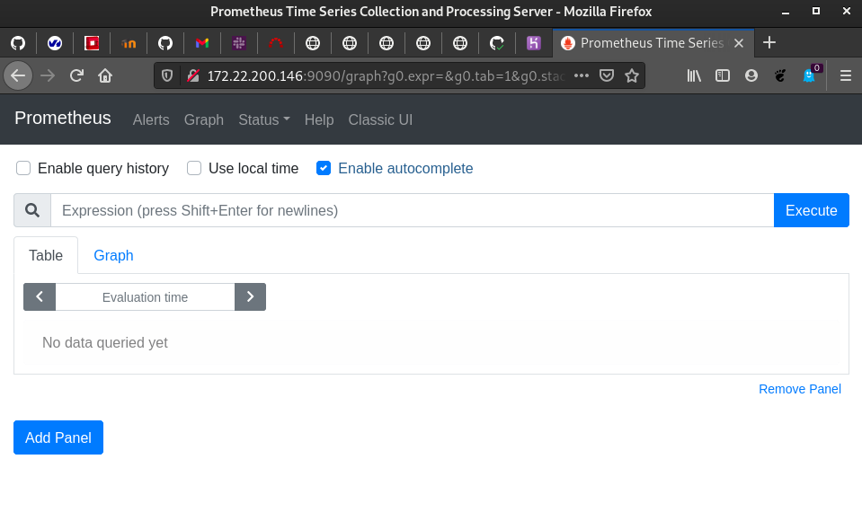
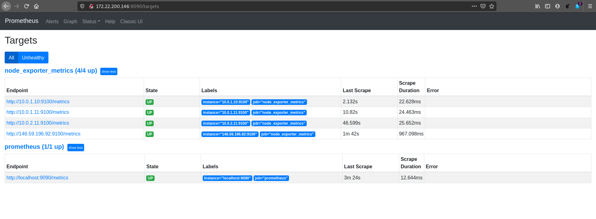
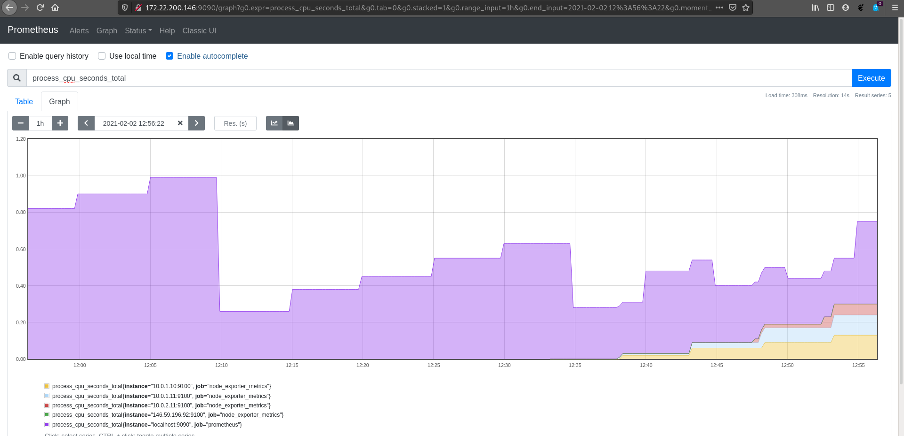
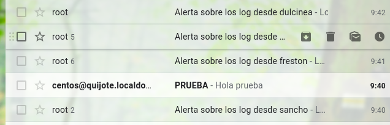

# Métricas, logs o monitorización

Utiliza una de las instancias de OpenStack y realiza una de las partes que 
elijas entre las siguientes sobre el servidor de OVH, dulcinea, sancho, 
quijote y frestón:

* Métricas: recolección, gestión centralizada, filtrado o selección de los 
parámetros relevantes y representación gráfica que permita controlar la 
evolución temporal de parámetros esenciales de todos los servidores.
    
* Monitorización: Configuración de un sistema de monitorización que controle 
servidores y servicios en tiempo real y envíe alertas por uso excesivo de 
recursos (memoria, disco raíz, etc.) y disponibilidad de los servicios. 
Alertas por correo, telegram, etc.
    
* Gestión de logs: Implementa un sistema que centralice los logs de todos los 
servidores y que filtre los registros con prioridad error, critical, alert o 
emergency. Representa gráficamente los datos relevantes extraídos de los logs 
o configura el envío por correo al administrador de los logs relevantes 
(una opción o ambas).

Detalla en la documentación claramente las características de la implementación 
elegida, así como la forma de poder verificarla (envía si es necesario usuario 
y contraseña por correo a los profesores, para el panel web si lo hubiera, 
p.ej.).


He escogido las herramientas Prometheus y Rsyslog para realizar esta práctica.

En primer lugar, vamos a utilizar la máquina Quijote (CentOS 8) para 
la instalación y configuración de la herramienta Prometheus.

Una cuestión importante antes de comenzar con la instalación, es que 
Prometheus utiliza el puerto 9090, por lo tanto, tendríamos que incorporar
nuevas reglas en nuestro cortafuegos en Dulcinea y en el propio cortafuegos
de Quijote.

```
iptables -t nat -A PREROUTING -i eth1 -p tcp --dport 9090 -j DNAT --to 10.0.2.10

iptables -A FORWARD -i eth1 -o eth2 -p tcp --dport 9090 -m state --state NEW,ESTABLISHED -j ACCEPT
iptables -A FORWARD -i eth2 -o eth1 -p tcp --sport 9090 -m state --state ESTABLISHED -j ACCEPT
```

Y en Quijote debemos realizar adicionalmente:

```
[centos@quijote ~]$ sudo firewall-cmd --zone=public --permanent --add-port 9090/tcp
success
[centos@quijote ~]$ sudo firewall-cmd --reload
success
[centos@quijote ~]$ sudo firewall-cmd --zone=public --permanent --add-port 9100/tcp
success
[centos@quijote ~]$ sudo firewall-cmd --reload
success
```

Terminada la preconfiguración, vamos a proceder a la instalación y posterior
configuración de Prometheus. En primer lugar, en nuestra máquina Quijote,
vamos a realizar un ```dnf update -y ```. 

Hecho esto, vamos a dirigirnos hacia la página oficial de [Prometheus](https://prometheus.io/download/)
y nos descargamos de la pestaña de "prometheus" la versión para Linux:

```
[centos@quijote ~]$ curl -LO url -LO https://github.com/prometheus/prometheus/releases/download/v2.24.1/prometheus-2.24.1.linux-amd64.tar.gz
curl: Remote file name has no length!
curl: try 'curl --help' or 'curl --manual' for more information
  % Total    % Received % Xferd  Average Speed   Time    Time     Time  Current
                                 Dload  Upload   Total   Spent    Left  Speed
100   640  100   640    0     0    935      0 --:--:-- --:--:-- --:--:--   934
100 62.4M  100 62.4M    0     0  8444k      0  0:00:07  0:00:07 --:--:-- 10.7M
[centos@quijote ~]$ ls
ifcfg-eth0  mikey.pubkey  prometheus-2.24.1.linux-amd64.tar.gz
[centos@quijote ~]$ tar -xvf prometheus-2.24.1.linux-amd64.tar.gz 
prometheus-2.24.1.linux-amd64/
prometheus-2.24.1.linux-amd64/consoles/
prometheus-2.24.1.linux-amd64/consoles/index.html.example
prometheus-2.24.1.linux-amd64/consoles/node-cpu.html
prometheus-2.24.1.linux-amd64/consoles/node-disk.html
prometheus-2.24.1.linux-amd64/consoles/node-overview.html
prometheus-2.24.1.linux-amd64/consoles/node.html
prometheus-2.24.1.linux-amd64/consoles/prometheus-overview.html
prometheus-2.24.1.linux-amd64/consoles/prometheus.html
prometheus-2.24.1.linux-amd64/console_libraries/
prometheus-2.24.1.linux-amd64/console_libraries/menu.lib
prometheus-2.24.1.linux-amd64/console_libraries/prom.lib
prometheus-2.24.1.linux-amd64/prometheus.yml
prometheus-2.24.1.linux-amd64/LICENSE
prometheus-2.24.1.linux-amd64/NOTICE
prometheus-2.24.1.linux-amd64/prometheus
prometheus-2.24.1.linux-amd64/promtool
[centos@quijote ~]$ mv prometheus-2.24.1.linux-amd64
mv: missing destination file operand after 'prometheus-2.24.1.linux-amd64'
Try 'mv --help' for more information.
[centos@quijote ~]$ ls
ifcfg-eth0    prometheus-2.24.1.linux-amd64
mikey.pubkey  prometheus-2.24.1.linux-amd64.tar.gz
[centos@quijote ~]$ mv prometheus-2.24.1.linux-amd64 prometheus-files
[centos@quijote ~]$ ls
ifcfg-eth0    prometheus-2.24.1.linux-amd64.tar.gz
mikey.pubkey  prometheus-files
```

A continuación, crearemos un usuario y un grupo para Prometheus, con sus 
respectivos directorios:

```
[centos@quijote ~]$ sudo useradd --no-create-home --shell /bin/false prometheus
[centos@quijote ~]$ sudo mkdir /etc/prometheus
[centos@quijote ~]$ sudo mkdir /var/lib/prometheus
[centos@quijote ~]$ sudo chown prometheus:prometheus /etc/prometheus
[centos@quijote ~]$ sudo chown prometheus:prometheus /var/lib/prometheus/
```

Copiaremos tanto el binario de prometheus y de promtool en el directorio
_/usr/local/bin_ y cambiaremos sus propietarios:

```
[centos@quijote ~]$ sudo cp prometheus-files/prometheus /usr/local/bin
[centos@quijote ~]$ sudo cp prometheus-files/promtool /usr/local/bin
[centos@quijote ~]$ sudo chown prometheus:prometheus /usr/local/bin/prometheus
[centos@quijote ~]$ sudo chown prometheus:prometheus /usr/local/bin/promtool 
```

Y haremos lo mismo con las consolas y las librerias en _/etc/prometheus_:

```
[centos@quijote ~]$ sudo cp -r prometheus-files/consoles /etc/prometheus/
[centos@quijote ~]$ sudo cp -r prometheus-files/console_libraries/ /etc/prometheus/
[centos@quijote ~]$ sudo chown prometheus:prometheus /etc/prometheus/consoles
[centos@quijote ~]$ sudo chown prometheus:prometheus /etc/prometheus/console_libraries/
[centos@quijote ~]$ 
```

Terminada la instalación, pasamos a la configuración. Toda la configuración
para Prometheus debe de estar en un fichero llamado _prometheus.yml_
ubicado en el directorio _/etc/prometheus_.

Vamos a crearlo y a añadirle el siguiente contenido:

```
global:
  scrape_interval: 10s

scrape_configs:
  - job_name: 'prometheus'
    scrape_interval: 5s
    static_configs:
      - targets: ['localhost:9090']
```

Y le cambiamos el propietario:

```
[centos@quijote ~]$ sudo chown prometheus:prometheus /etc/prometheus/prometheus.yml
```

Seguidamente, vamos a crear un servicio para Prometheus y le copiamos el 
siguiente contenido:

```
[centos@quijote ~]$ sudo nano /etc/systemd/system/prometheus.service

[Unit]
Description=Prometheus
Wants=network-online.target
After=network-online.target

[Service]
Type=simple
User=prometheus
Group=prometheus
ExecStart=/usr/local/bin/prometheus \
  --config.file /etc/prometheus/prometheus.yml \
  --storage.tsdb.path /var/lib/prometheus \
  --web.console.templates=/etc/prometheus/consoles \
  --web.console.libraries=/etc/prometheus/console_libraries \

SyslogIdentifier=prometheus
Restart=always

[Install]
WantedBy=multi-user.target
```

Y reiniciamos el servicio de systemd para registrar el servicio de Prometheus:

```
[centos@quijote ~]$ sudo systemctl daemon-reload
[centos@quijote ~]$ sudo systemctl start prometheus
[centos@quijote ~]$ sudo systemctl status prometheus
● prometheus.service - Prometheus
   Loaded: loaded (/etc/systemd/system/prometheus.service; disabled; vendor preset: disabled)
   Active: active (running) since Mon 2021-02-01 17:24:45 UTC; 1min 43s ago
 Main PID: 45582 (prometheus)
    Tasks: 6 (limit: 2731)
   Memory: 24.0M
   CGroup: /system.slice/prometheus.service
           └─45582 /usr/local/bin/prometheus --config.file /etc/prometheus/prometheus.yml --storage.tsdb>

Feb 01 17:24:46 quijote prometheus[45582]: level=info ts=2021-02-01T17:24:46.092Z caller=head.go:659 com>
Feb 01 17:24:46 quijote prometheus[45582]: level=info ts=2021-02-01T17:24:46.092Z caller=head.go:665 com>
Feb 01 17:24:46 quijote prometheus[45582]: level=info ts=2021-02-01T17:24:46.095Z caller=head.go:717 com>
Feb 01 17:24:46 quijote prometheus[45582]: level=info ts=2021-02-01T17:24:46.095Z caller=head.go:722 com>
Feb 01 17:24:46 quijote prometheus[45582]: level=info ts=2021-02-01T17:24:46.098Z caller=main.go:758 fs_>
Feb 01 17:24:46 quijote prometheus[45582]: level=info ts=2021-02-01T17:24:46.098Z caller=main.go:761 msg>
Feb 01 17:24:46 quijote prometheus[45582]: level=info ts=2021-02-01T17:24:46.098Z caller=main.go:887 msg>
Feb 01 17:24:46 quijote prometheus[45582]: level=info ts=2021-02-01T17:24:46.099Z caller=main.go:918 msg>
Feb 01 17:24:46 quijote prometheus[45582]: level=info ts=2021-02-01T17:24:46.099Z caller=main.go:710 msg>
Feb 01 17:24:46 quijote prometheus[45582]: level=info ts=2021-02-01T17:24:46.099Z caller=tls_config.go:1>
```

Ahora podremos acceder a Prometheus mediante la web:



Con esto, tendríamos ya configurado el servidor Prometheus. Pero las gráficas 
mostradas son solo de Quijote. Para mostrar las demás máquinas, debemos instalar 
el paquete _node exporter_. Para ello, vamos a hacer lo mismo que cuando 
instalamos prometheus. Nos vamos a la página de Prometheus
y nos descargamos la versión de Linux:

```
[centos@quijote ~]$ curl -LO url -LO https://github.com/prometheus/node_exporter/releases/download/v1.0.1/node_exporter-1.0.1.linux-amd64.tar.gz
curl: Remote file name has no length!
curl: try 'curl --help' or 'curl --manual' for more information
  % Total    % Received % Xferd  Average Speed   Time    Time     Time  Current
                                 Dload  Upload   Total   Spent    Left  Speed
100   642  100   642    0     0    524      0  0:00:01  0:00:01 --:--:--   524
100 9297k  100 9297k    0     0  3101k      0  0:00:02  0:00:02 --:--:-- 5764k
[centos@quijote tmp]$ ls
node_exporter-1.0.1.linux-amd64.tar.gz
systemd-private-30531daec3cd45b8aacf947f06994c4c-chronyd.service-sRDyYS
systemd-private-30531daec3cd45b8aacf947f06994c4c-httpd.service-JYr0pp
systemd-private-30531daec3cd45b8aacf947f06994c4c-php-fpm.service-pLTxF8
systemd-private-30531daec3cd45b8aacf947f06994c4c-postfix.service-YYeCcG
```

Lo descomprimimos y movemos el binario hacia el directorio _/usr/local/bin/_:

```
[centos@quijote ~]$ tar -xvf node_exporter-1.0.1.linux-amd64.tar.gz 
node_exporter-1.0.1.linux-amd64/
node_exporter-1.0.1.linux-amd64/NOTICE
node_exporter-1.0.1.linux-amd64/node_exporter
node_exporter-1.0.1.linux-amd64/LICENSE
[centos@quijote ~]$ sudo mv node_exporter-1.0.1.linux-amd64/node_exporter /usr/local/bin/
```

Vamos a crear un usuario y un servicio para _node_exporter_:

```
[centos@quijote ~]$ sudo useradd -rs /bin/false node_exporter
[centos@quijote ~]$ sudo nano /etc/systemd/system/node_exporter.service

[Unit]
Description=Node Exporter
After=network.target

[Service]
User=node_exporter
Group=node_exporter
Type=simple
ExecStart=/usr/local/bin/node_exporter

[Install]
WantedBy=multi-user.target
```

Recargamos la configuración de systemd e iniciamos el servicio:

```
[centos@quijote ~]$ sudo systemctl daemon-reload
[centos@quijote ~]$ sudo systemctl start node_exporter
[centos@quijote ~]$ sudo systemctl enable node_exporter
Created symlink /etc/systemd/system/multi-user.target.wants/node_exporter.service → /etc/systemd/system/node_exporter.service.
```

Y comprobamos el status:

```
[centos@quijote ~]$ sudo systemctl status node_exporter.service
● node_exporter.service - Node Exporter
   Loaded: loaded (/etc/systemd/system/node_exporter.service; enabled; vendor preset: disabled)
   Active: active (running) since Tue 2021-02-02 11:04:13 UTC; 1min 17s ago
 Main PID: 48850 (node_exporter)
    Tasks: 3 (limit: 2731)
   Memory: 10.5M
   CGroup: /system.slice/node_exporter.service
           └─48850 /usr/local/bin/node_exporter

Feb 02 11:04:13 quijote node_exporter[48850]: level=info ts=2021-02-02T11:04:13.424Z caller=node_exporter.go:112 collector=thermal_zone
Feb 02 11:04:13 quijote node_exporter[48850]: level=info ts=2021-02-02T11:04:13.424Z caller=node_exporter.go:112 collector=time
Feb 02 11:04:13 quijote node_exporter[48850]: level=info ts=2021-02-02T11:04:13.424Z caller=node_exporter.go:112 collector=timex
Feb 02 11:04:13 quijote node_exporter[48850]: level=info ts=2021-02-02T11:04:13.424Z caller=node_exporter.go:112 collector=udp_queues
Feb 02 11:04:13 quijote node_exporter[48850]: level=info ts=2021-02-02T11:04:13.424Z caller=node_exporter.go:112 collector=uname
Feb 02 11:04:13 quijote node_exporter[48850]: level=info ts=2021-02-02T11:04:13.424Z caller=node_exporter.go:112 collector=vmstat
Feb 02 11:04:13 quijote node_exporter[48850]: level=info ts=2021-02-02T11:04:13.424Z caller=node_exporter.go:112 collector=xfs
Feb 02 11:04:13 quijote node_exporter[48850]: level=info ts=2021-02-02T11:04:13.424Z caller=node_exporter.go:112 collector=zfs
Feb 02 11:04:13 quijote node_exporter[48850]: level=info ts=2021-02-02T11:04:13.424Z caller=node_exporter.go:191 msg="Listening on" address=:9100
Feb 02 11:04:13 quijote node_exporter[48850]: level=info ts=2021-02-02T11:04:13.424Z caller=tls_config.go:170 msg="TLS is disabled and it cannot be enabled on the fly." http2=false
```

Este proceso, debemos hacerlo en cada máquina. Una vez terminada la instalación
en las tres máquinas, procedemos a configurar de nuevo Quijote.


A continuación, vamos a añadir al fichero _prometheus.yml_ las 
siguientes líneas de configuración:

```
global:
  scrape_interval: 5m

scrape_configs:
  - job_name: 'prometheus'
    scrape_interval: 5m
    static_configs:
      - targets: ['localhost:9090']

  - job_name: 'node_exporter_metrics'
    scrape_interval: 5m
    static_configs:
      - targets: ['10.0.1.10:9100','10.0.1.11:9100','10.0.2.11:9100','146.59.196.92:9100']
```

Por último, vamos a configurar las reglas iptables para
poder conectar:

```
* Red interna a DMZ y viceversa

iptables -A FORWARD -i eth0 -o eth2 -p tcp --dport 9100 -m state --state NEW,ESTABLISHED -j ACCEPT
iptables -A FORWARD -i eth2 -o eth0 -p tcp --sport 9100 -m state --state ESTABLISHED -j ACCEPT


iptables -A FORWARD -i eth2 -o eth0 -p tcp --dport 9100 -m state --state NEW,ESTABLISHED -j ACCEPT
iptables -A FORWARD -i eth0 -o eth2 -p tcp --sport 9100 -m state --state ESTABLISHED -j ACCEPT

* Dulcinea a DMZ

iptables -A INPUT -s 10.0.2.10 -p tcp --sport 9100 -j ACCEPT
iptables -A OUTPUT -d 10.0.2.10 -p tcp --dport 9100 -j ACCEPT

iptables -A INPUT -s 10.0.2.10 -p tcp --dport 9100 -j ACCEPT
iptables -A OUTPUT -d 10.0.2.10 -p tcp --sport 9100 -j ACCEPT


* Exterior a DMZ

iptables -A FORWARD -i eth1 -o eth2 -p tcp --dport 9100 -m state --state NEW,ESTABLISHED -j ACCEPT
iptables -A FORWARD -i eth2 -o eth1 -p tcp --sport 9100 -m state --state ESTABLISHED -j ACCEPT


iptables -A FORWARD -i eth2 -o eth1 -p tcp --dport 9100 -m state --state NEW,ESTABLISHED -j ACCEPT
iptables -A FORWARD -i eth1 -o eth2 -p tcp --sport 9100 -m state --state ESTABLISHED -j ACCEPT
```

E introducidas las reglas en el cortafuegos, reiniciamos el servicio prometheus
y accedemos a la página:






Ahora pasaremos a la instalación de rsyslog.

Vamos a comprobar que disponemos del servicio de manera predeterminada
en nuestro sistema CentOS 8:

```
[centos@quijote ~]$ sudo systemctl status rsyslog
● rsyslog.service - System Logging Service
   Loaded: loaded (/usr/lib/systemd/system/rsyslog.service; enabled; vendor pre>
   Active: active (running) since Mon 2021-02-01 16:33:22 UTC; 22h ago
     Docs: man:rsyslogd(8)
           https://www.rsyslog.com/doc/
 Main PID: 8896 (rsyslogd)
    Tasks: 3 (limit: 2731)
   Memory: 2.8M
   CGroup: /system.slice/rsyslog.service
           └─8896 /usr/sbin/rsyslogd -n

Feb 01 16:33:22 quijote systemd[1]: Starting System Logging Service...
Feb 01 16:33:22 quijote rsyslogd[8896]: [origin software="rsyslogd" swVersion=">
Feb 01 16:33:22 quijote systemd[1]: Started System Logging Service.
Feb 01 16:33:22 quijote rsyslogd[8896]: imjournal: journal files changed, reloa>
Feb 01 16:36:01 quijote rsyslogd[8896]: imjournal: journal files changed, reloa>
Feb 01 16:37:07 quijote rsyslogd[8896]: imjournal: journal files changed, reloa>
Feb 01 16:38:06 quijote rsyslogd[8896]: imjournal: journal files changed, reloa>
Feb 02 09:40:40 quijote rsyslogd[8896]: imjournal: journal files changed, reloa>
Feb 02 09:40:40 quijote rsyslogd[8896]: imjournal: journal files changed, reloa>
lines 1-20/20 (END)
```

Como ya lo tenemos instalado, vamos a pasar al siguiente punto, descomentando
las siguientes líneas del fichero _/etc/rsyslog.conf_:

```
# Provides TCP syslog reception
# for parameters see http://www.rsyslog.com/doc/imtcp.html
module(load="imtcp") # needs to be done just once
input(type="imtcp" port="514")
```

Si preferimos conexión udp, descomentamos este otro par de líneas:

```
# Provides UDP syslog reception
# for parameters see http://www.rsyslog.com/doc/imudp.html
#module(load="imudp") # needs to be done just once
#input(type="imudp" port="514")
```

Adicionalmente, vamos a añadir las siguientes líneas justo después
de la sección ```#RULES#```:

```
$template TmplAuth, "/var/log/rsyslog/%HOSTNAME%/%PROGRAMNAME%.log"
$template TmplMsg, "/var/log/rsyslog/%HOSTNAME%/%PROGRAMNAME%.log"
authpriv.*   ?TmplAuth
*.info,mail.none,authpriv.none,cron.none   ?TmplMsg
```

Guardamos los cambios y vamos a crear el directorio para los logs:

```
[centos@quijote ~]$ sudo mkdir /var/log/rsyslog
```

Incluimos el puerto 514 en el firewall de Quijote:

```
[centos@quijote ~]$ sudo firewall-cmd --zone=public --permanent --add-port=514/tcp
success
[centos@quijote ~]$ sudo firewall-cmd --reload
success
```

Y reiniciamos el servicio de rsyslog y habilitamos el inicio en el arranque:

```
[centos@quijote ~]$ sudo systemctl restart rsyslog
[centos@quijote ~]$ sudo systemctl enable rsyslog
```

Haciendo ```netstat -pnltu``` podemos ver que efectivamos Rsyslog está
escuchando en el puerto 514:

```
[centos@quijote ~]$ sudo netstat -pnltu
Active Internet connections (only servers)
Proto Recv-Q Send-Q Local Address           Foreign Address         State       PID/Program name    
tcp        0      0 0.0.0.0:514             0.0.0.0:*               LISTEN      49583/rsyslogd      
tcp        0      0 0.0.0.0:9102            0.0.0.0:*               LISTEN      1948/bacula-fd      
tcp        0      0 0.0.0.0:111             0.0.0.0:*               LISTEN      1/systemd           
tcp        0      0 0.0.0.0:22              0.0.0.0:*               LISTEN      9038/sshd           
tcp6       0      0 ::1:25                  :::*                    LISTEN      1374/master         
tcp6       0      0 :::443                  :::*                    LISTEN      1061/httpd          
tcp6       0      0 :::514                  :::*                    LISTEN      49583/rsyslogd      
tcp6       0      0 :::9090                 :::*                    LISTEN      49464/prometheus    
tcp6       0      0 :::9100                 :::*                    LISTEN      49026/node_exporter 
tcp6       0      0 :::111                  :::*                    LISTEN      1/systemd           
tcp6       0      0 :::80                   :::*                    LISTEN      1061/httpd          
tcp6       0      0 :::22                   :::*                    LISTEN      9038/sshd           
udp        0      0 127.0.0.1:323           0.0.0.0:*                           717/chronyd         
udp        0      0 0.0.0.0:111             0.0.0.0:*                           1/systemd           
udp6       0      0 ::1:323                 :::*                                717/chronyd         
udp6       0      0 :::111                  :::*                                1/systemd         
```

Ya tendríamos configurado el servidor de Rsyslog en Quijote. Ahora vamos
a configurar las demás máquinas. El procedimiento a seguir es el siguiente:

1. Instalación del paquete rsyslog en caso de no estar instalado.

2. Editar el fichero _/etc/rsyslog.conf_ y añadir la siguiente línea
al final del mismo:

```
*. *  @@quijote.manuel-lora.gonzalonazareno.org:514
```

Haremos lo siguiente para todas las máquinas. Después de esto, tenemos
que permitir el paso de las conexiones mediante el cortafuegos:

```
* Red interna a DMZ

iptables -A FORWARD -i eth0 -o eth2 -p tcp --dport 514 -m state --state NEW,ESTABLISHED -j ACCEPT
iptables -A FORWARD -i eth2 -o eth0 -p tcp --sport 514 -m state --state ESTABLISHED -j ACCEPT

* Dulcinea a DMZ

iptables -A INPUT -s 10.0.2.10 -p tcp --sport 514 -j ACCEPT
iptables -A OUTPUT -d 10.0.2.10 -p tcp --dport 514 -j ACCEPT

* Exterior a DMZ

iptables -t nat -A PREROUTING -i eth1 -p tcp --dport 514 -j DNAT --to 10.0.2.10

iptables -A FORWARD -i eth1 -o eth2 -p tcp --dport 514 -j ACCEPT
iptables -A FORWARD -i eth2 -o eth1 -p tcp --sport 514 -j ACCEPT

```

Y ahora, para comprobar su funcionamiento, vamos a enviar un mensaje desde
los clientes, y Quijote debería de verlo:

```
debian@dulcinea:~$ logger "Hola, esto es una prueba"

[root@quijote centos]# tail -f /var/log/rsyslog/dulcinea/debian.log 
Feb  2 16:07:40 dulcinea debian: Hola, esto es una prueba
```

```
debian@freston:~$ logger "Esto es una prueba"

[root@quijote centos]# tail -f /var/log/rsyslog/freston/debian.log 
Feb  2 16:20:15 freston debian: Esto es una prueba
```

```
ubuntu@sancho:~$ logger "Hola esto es una prueba"

[root@quijote centos]# tail -f /var/log/rsyslog/sancho/ubuntu.log 
Feb  2 16:20:10 sancho ubuntu: Hola esto es una prueba
```

```
debian@pandora:~$ logger "Hola esto es una prueba"

[root@quijote centos]# tail -f /var/log/rsyslog/pandora/debian.log 
Feb  3 13:10:27 pandora debian: Hola esto es una prueba
```

La configuración en el servidor rsyslog para que nos avise mediante email
debe incluirse en el fichero _/etc/rsyslog.conf_ y tiene la siguiente
estructura:

```
module(load="ommail")

$ActionMailSMTPServer localhost
 $ActionMailFrom root@manuel-lora.gonzalonazareno.org
 $ActionMailTo manuelloraroman@gmail.com
 $template mailSubject,"Alerta sobre los log desde %hostname%"
 $template mailBody,"Log de la maquina %hostname% Alerta='%msg%'"
 $ActionMailSubject mailSubject

if $msg contains 'New session' then :ommail:;mailBody
 $ActionExecOnlyOnceEveryInterval 0


$ActionMailSMTPServer localhost
 $ActionMailFrom root@manuel-lora.gonzalonazareno.org
 $ActionMailTo manuelloraroman@gmail.com
 $template mailSubject,"Alerta en %hostname%"
 $template mailBody,"Log de la maquina %hostname% Alerta='%msg%'"
 $ActionMailSubject mailSubject

if $msg contains 'Stopping' then :ommail:;mailBody
 $ActionExecOnlyOnceEveryInterval 0


$ActionMailSMTPServer localhost
 $ActionMailFrom root@manuel-lora.gonzalonazareno.org
 $ActionMailTo manuelloraroman@gmail.com
 $template mailSubject,"Alerta sobre los log desde %hostname%"
 $template mailBody,"Log de la maquina %hostname% Alerta='%msg%'"
 $ActionMailSubject mailSubject

if $msg contains 'fatal' or $msg contains 'error' or $msg contains 'warning' or $msg contains 'critical' then :ommail:;mailBody
 $ActionExecOnlyOnceEveryInterval 0

```

Esto permitirá enviar un email al destinatario cuando inicie sesión un usuario,
no esté funcionando un servicio o hay un error fatal, critico, un warning....

Para que se pueda enviar el email debemos incorporar las siguientes reglas:

```
iptables -A FORWARD -i eth2 -o eth1 -p tcp --dport 25 -j ACCEPT
iptables -A FORWARD -i eth1 -o eth2 -p tcp --sport 25 -j ACCEPT
```

Y ya nos enviaría un mensaje al email en cualquiera de los casos anteriores.



Por último, vamos a configurar Alertmanager para que nos notifique via email
cuando alguno de los nodos se caiga.

Vamos a descargarnos el paquete al igual que con prometheus, y descomprimirlo:

```
[centos@quijote ~]$ curl -LO curl -LO https://github.com/prometheus/alertmanager/releases/download/v0.21.0/alertmanager-0.21.0.linux-amd64.tar.gz
curl: Remote file name has no length!
curl: try 'curl --help' or 'curl --manual' for more information
  % Total    % Received % Xferd  Average Speed   Time    Time     Time  Current
                                 Dload  Upload   Total   Spent    Left  Speed
100   644  100   644    0     0    471      0  0:00:01  0:00:01 --:--:--   471
100 24.5M  100 24.5M    0     0  3858k      0  0:00:06  0:00:06 --:--:-- 5865k
[centos@quijote ~]$ ls
alertmanager-0.21.0.linux-amd64.tar.gz  node_exporter-1.0.1.linux-amd64
ifcfg-eth0                              prometheus-files
mikey.pubkey
[centos@quijote ~]$ tar -xvf alertmanager-0.21.0.linux-amd64.tar.gz 
alertmanager-0.21.0.linux-amd64/
alertmanager-0.21.0.linux-amd64/alertmanager
alertmanager-0.21.0.linux-amd64/amtool
alertmanager-0.21.0.linux-amd64/NOTICE
alertmanager-0.21.0.linux-amd64/LICENSE
alertmanager-0.21.0.linux-amd64/alertmanager.yml
[centos@quijote ~]$ ls
alertmanager-0.21.0.linux-amd64         mikey.pubkey
alertmanager-0.21.0.linux-amd64.tar.gz  node_exporter-1.0.1.linux-amd64
ifcfg-eth0                              prometheus-files
[centos@quijote ~]$ rm alertmanager-0.21.0.linux-amd64.tar.gz 
```

Movemos los binarios del directorio recién descomprimido al directorio 
_/usr/local/bin_ y le asignamos los propietarios adecuados (para ello, vamos a
crear el usuario alertamanager):

```
[centos@quijote ~]$ sudo useradd --no-create-home --shell /bin/false alertmanager
[centos@quijote ~]$ sudo mv alertmanager-0.21.0.linux-amd64/alertmanager /usr/local/bin/
[centos@quijote ~]$ sudo mv alertmanager-0.21.0.linux-amd64/amtool /usr/local/bin/
[centos@quijote ~]$ sudo chown alertmanager:alertmanager /usr/local/bin/alertmanager 
[centos@quijote ~]$ sudo chown alertmanager:alertmanager /usr/local/bin/amtool 
```

Y ya podriamos eliminar el directorio descomprimido. Ahora pasaremos a la
configuración del propio Alertmanager.

Primero crearemos el directorio adecuado y acto seguido, crearemos un fichero
_alertmanager.yml_ que tendrá la siguiente configuración:

```
global:
  smtp_smarthost: 'localhost:25'
  smtp_from: 'AlertManager <mailer@domain.com>'
  smtp_hello: 'alertmanager'


route:
  group_by: ['instance', 'alert']
  group_wait: 30s
  group_interval: 5m
  repeat_interval: 3h
  receiver: team-1

receivers:
  - name: 'team-1'
    email_configs:
      - to: 'manuelloraroman@gmail.com'
```

