# Documentación instalación Debian

## Requisitos previos a la instalación

* PC 

* CD o USB booteable para la iso de Debian 10 (en nuestro caso, USB)

* Acceso a Internet para descargar los paquetes necesarios (por cable)

## Pasos para la instalación

En primer lugar, se ha de hacer la instalación normal, no la gráfica, pero
para mayor legibilidad, usaré la instalación gráfica.

1. Modificaremos el boot de arranque de nuestro PC en la BIOS. (En nuestro caso, era
necesario pulsar el botón F2 unas cinco veces mientras aparecía el logotipo de Lenovo)

2. A continuación, veremos el Menú de instalación de Debian 10. Aparecen varias opciones
para instalarlo, y nosotros elegiremos la opción de **Install**.

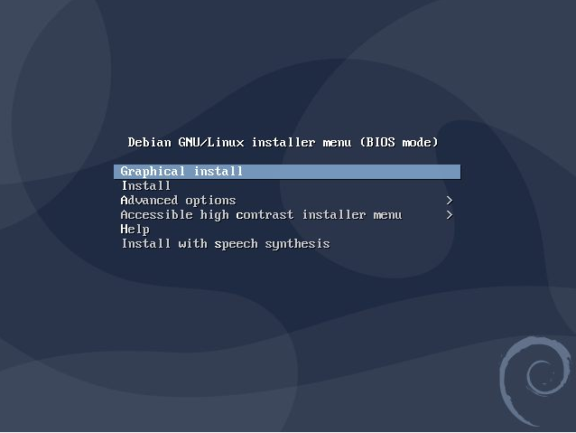

3. Lo siguiente en aparecer será el idioma, el cual elegiremos **Spanish - Español**. Una
vez hecho esto, debemos seleccionar nuestro país. Esto le permite al instalador asignar
las opciones de nuestra localización (_zona horaria, distancia, moneda, etc_)

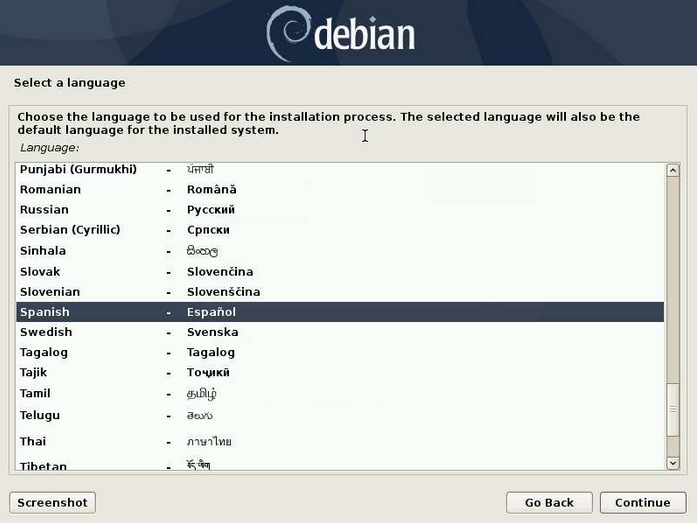

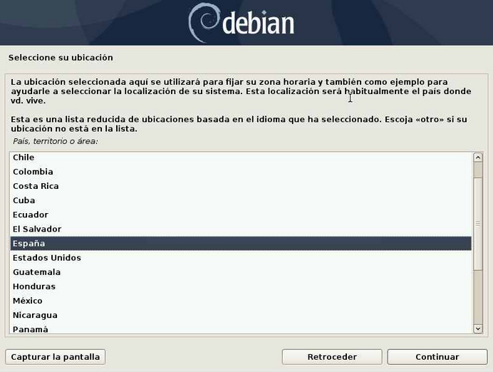

4. En la siguiente pantalla, configuraremos la distribución del teclado. En nuestro caso,
pondremos **Español**.

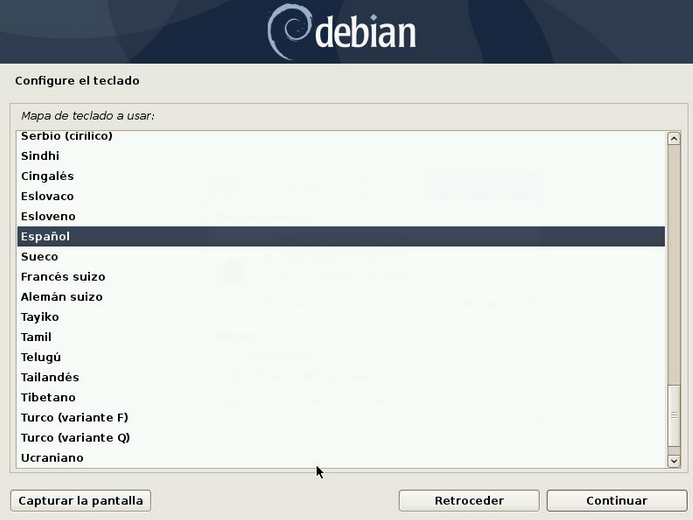

5. Ahora el instalador ejecutará una serie de instrucciones previas al proceso de
instalación, siendo estas la detección y configuración de los adaptadores de red, para la
descarga de paquetes adicionales necesarios.

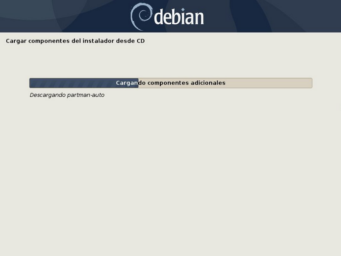

6. Introducimos el nombre que queremos ponerle a nuestra máquina. Recomendable ponerle
un nombre indicativo, por ejemplo **debian**.

7. A continuación, si nuestro ordenador pertenece a un grupo de red exclusivo de un
conjunto de ordenadores, deberíamos poner el nombre de dominio.

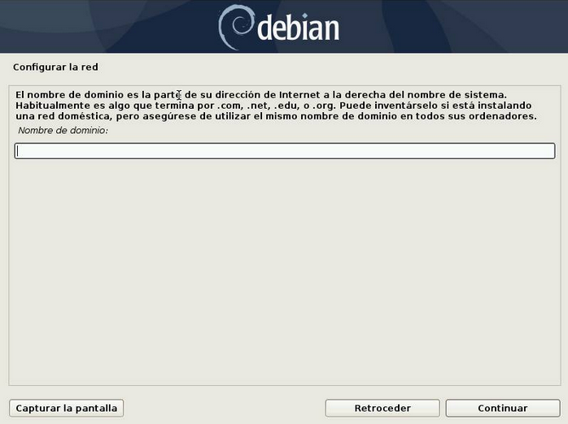

8. Toca elegir contraseña para super-usuario y la verificación de dicha contraseña.

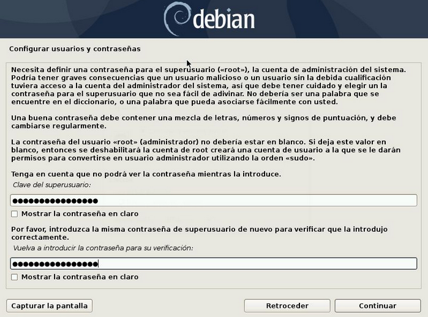

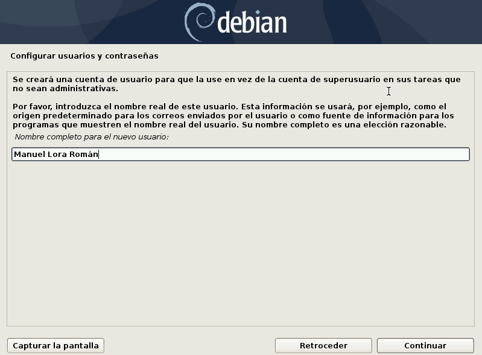

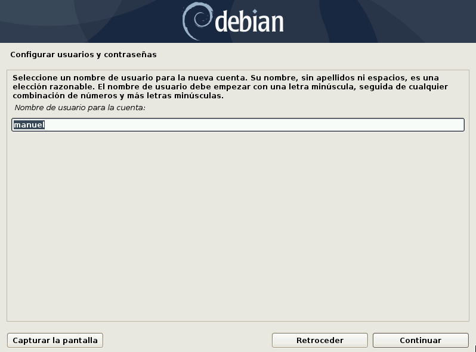

9. Las siguientes ventanas que nos aparecerán son la de la configuración del usuario 
(Nombre completo y nombre de usuario) y la de la contraseña para dicho usuario.

10. Según el país que hayamos elegido, nos tocará ahora configurar el reloj según la
localización de donde estemos. En nuestro caso, elegiremos **Península**.

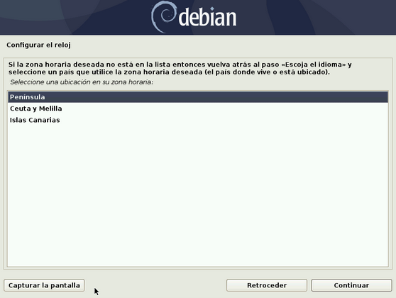

11. Debian, después de la anterior opción, comenzará la detección de los discos presentes
en nuestro sistema, para acto seguido, presentarte las opciones de particionado de disco.
De entre ellas elegiremos **Manual**.

Seleccionaremos nuestro disco, y al hacerlo, nos aparecerá la siguiente pantalla:

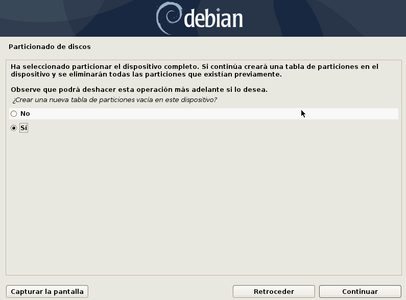

Crearemos el grupo de volúmenes:

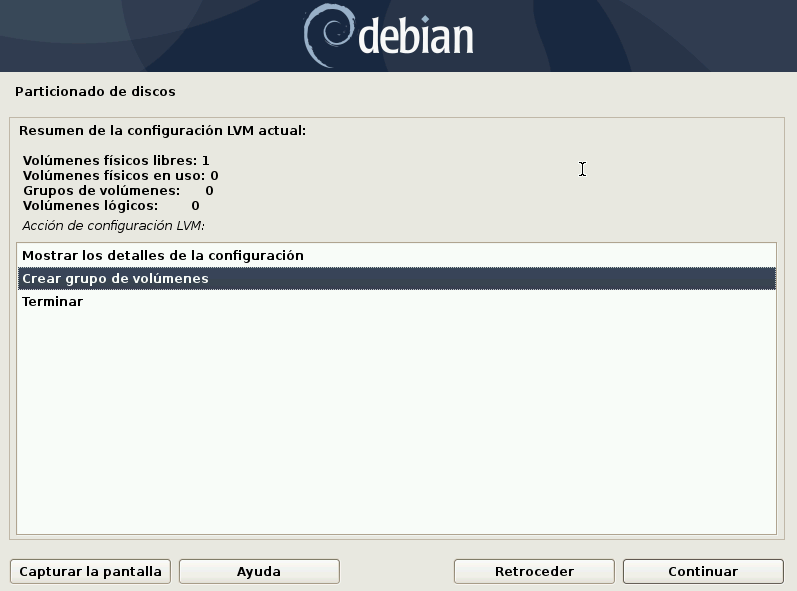

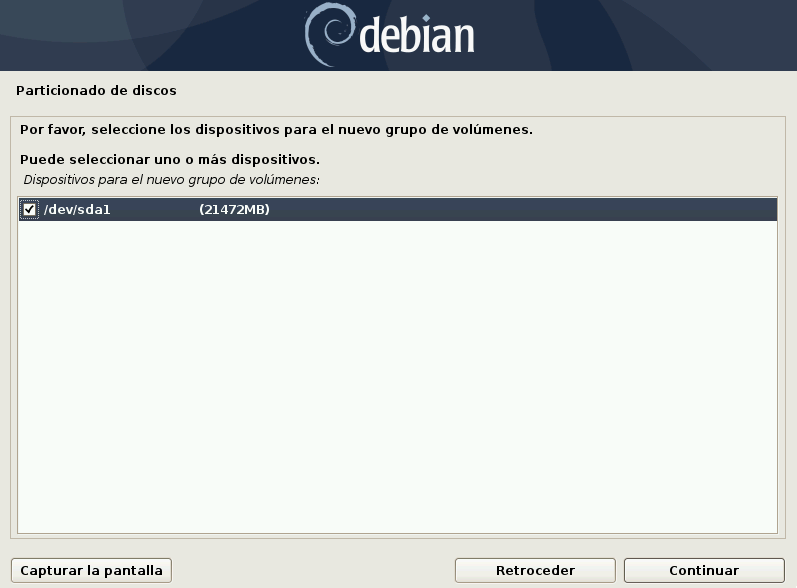

Y después, creamos los volúmenes lógicos raíz, home y boot (los pasos a seguir son los
mismos):

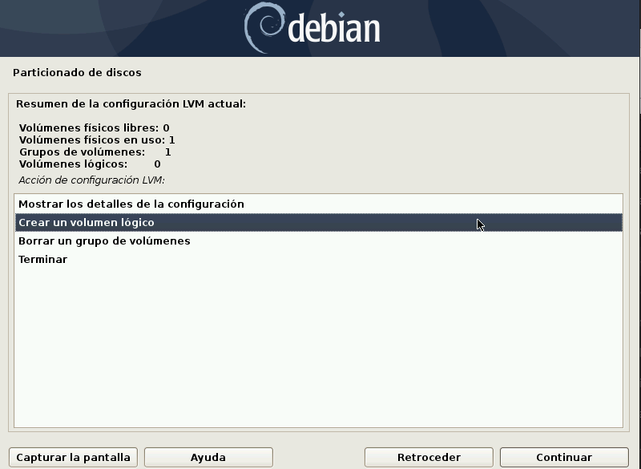


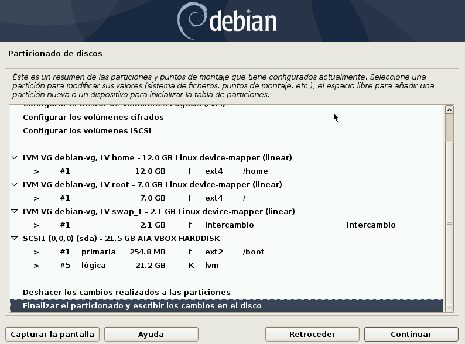

12. Después del particionado, nos preguntará si queremos participar en una encuesta de
popularidad. Elige tu respuesta, y haz clic en **Continuar**.

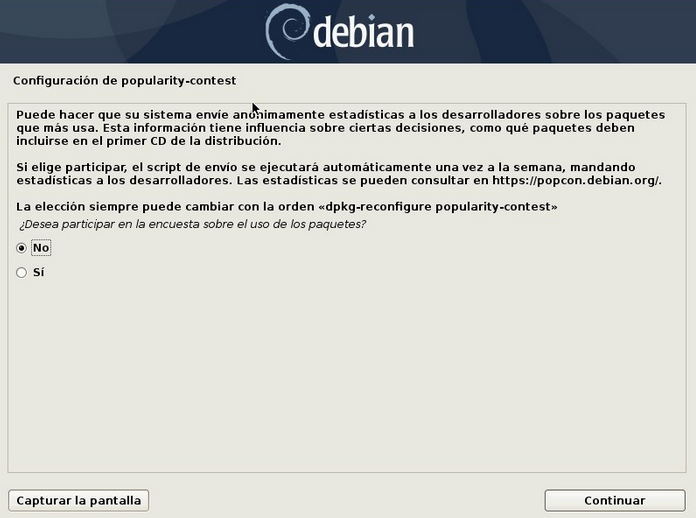

13. Ahora, el instalador nos da la opción de emplear métodos de instalación 
adicionales. En nuestro caso, seleccionamos **No** y continuamos.

14. Lo siguiente que nos aparece en la selección de una réplica, que es el servidor donde 
se descargaran los ficheros. Primero debemos escoger el País y después la réplica.

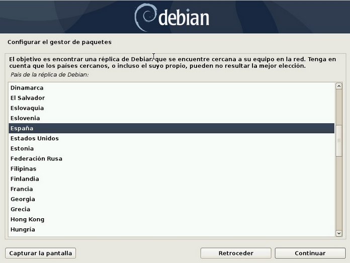

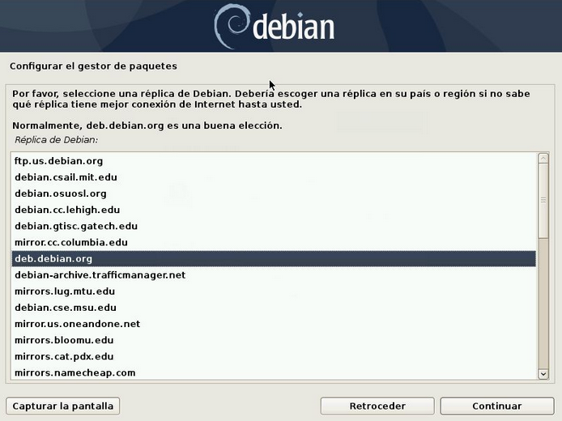

15. Si quieres un proxy para salir a Internet, escribe en el campo en blanco. En nuestro
caso, no escribiremos nada y pasaremos al siguiente paso.

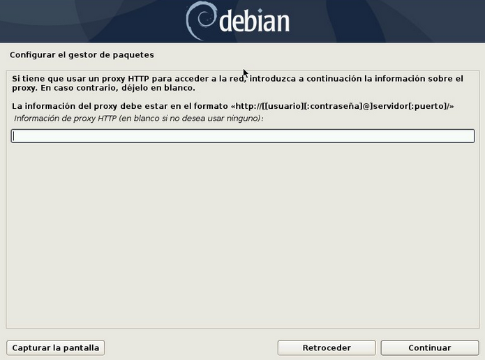

16. Lo que toca ahora es elegir si queremos una interfaz gráfica, además de elegir cual 
es la que quieras. Seleccionamos las otras opciones si queremos instalar diferentes
paquetes como **SSH_Server**.

17. Una vez ya configurado todo lo anterior, procederá a la descarga de paquetes.

18. El gestor de arranque de GNU-Linux es el GRUB, y es requerido para completar 
la instalación. Se nos pregunta si instalamos el cargador de arranque en el registro
principal de arranque. Le decimos que no, seleccionamos **/boot** para cargar el GRUB
y le damos a continuar.

19. Fin de la instalación. 

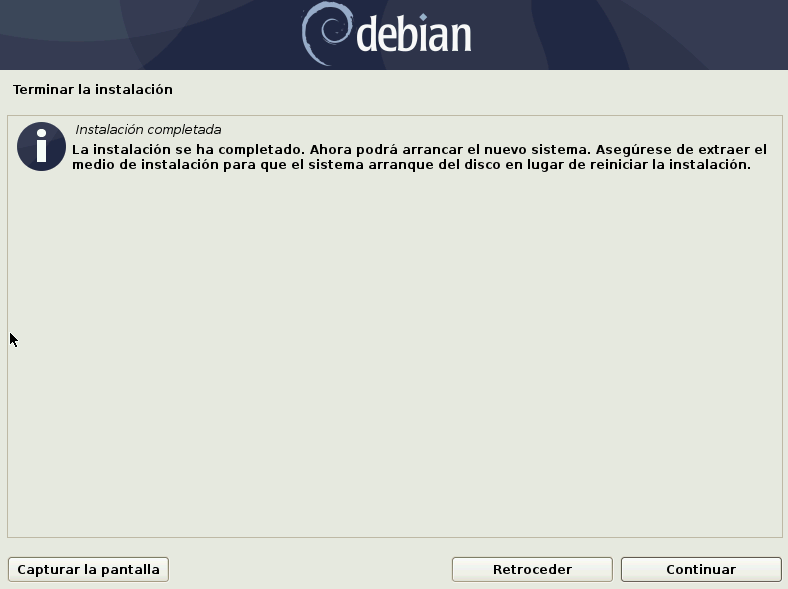
  
  
La instalación de Debian Buster estaría ya completada. Lo siguiente que vamos
a comprobar es si tenemos a nuestra disposición la red WiFi. Para comprobarlo,
haremos lo siguiente:

```sudo ip a```

Y nos saldrán los dispositivos, interfaces y túneles de red:

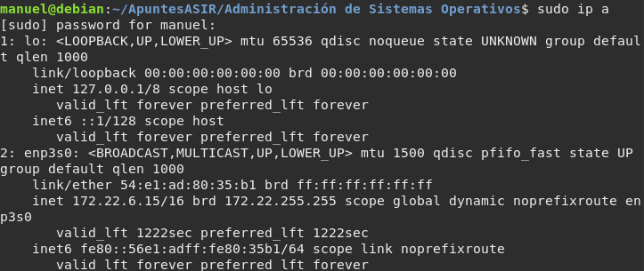

Nosotros no disponemos por ahora de una interfaz de red correspondiente al WiFi,
así que en primer lugar vamos a comprobar nuestra tarjeta de red inalámbrica.

```lspci | grep Network```

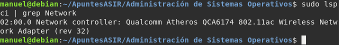

En mi caso, nuestra tarjeta de red, no se encuentra en la configuración de 
Linux [aquí](https://wiki.debian.org/es/WiFi). Por lo tanto, investigaremos
como poder solucionar dicho incidente. En esta práctica, yo he cogido varios
ficheros de configuración de una página de Github, aunque dicho ficheros,
tras investigar más detenidamente, se encuentran en los repositorios de Debian
de la version de _sid_.

Ahora, los comandos que usé para lograr tener WiFi:

```sudo apt-get install curl```  
```curl -L -O https://github.com/kvalo/ath10k-firmware/archive/master.zip```  
```unzip master.zip```  
```mkdir -p /lib/firmware/ath10k/QCA6174/hw3.0/```  
```cp ./ath10k-firmware-master/ath10k/QCA6174/hw3.0/*.bin* /lib/firmware/ath10k/QCA6174/hw3.0/```  
```cp ./ath10k-firmware-master/ath10k/QCA6174/hw3.0/4.4/*.bin*  /lib/firmware/ath10k/QCA6174/hw3.0/```  
```sudo update-initramfs -u```  
```sudo reboot```  

Una vez terminado con el WiFi, nos pondremos con la tarjeta gráfica. Al usar
este comando:

```lspci | grep VGA```

Nos aparecerá las tarjetas gráficas que tenemos en ese momento.

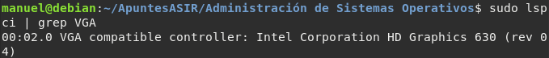

En mi caso, el ordenador posee una tarjeta gráfica Nvidia GeForce GTX 1060 y no
la estaría detectando. Por lo tanto, vamos a hacer lo siguiente:


1. Ejecutaremos _sudo apt-get install nvidia-detect_ y luego ejecutaremos 
la instrucción _sudo nvidia detect_ para ver que drivers son los que
necesitariamos instalarnos para que funcionase.

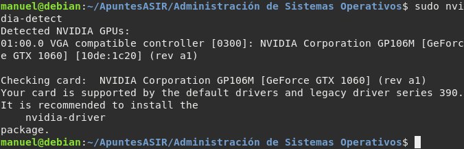

En nuestro caso, nos recomienda que instalemos el driver _nvidia-driver_, por
lo tanto procedemos a la descarga de dicho paquete:

```sudo apt-get install nvidia-driver```

Y una vez acabada la instalación, reiniciamos el sistema.

Ahora nuestro siguiente objetivo es que comprobar las tarjetas gráficas que 
tenemos activa.

```lspci -vnnn | perl -lne 'print if /^\d+\:.+(\[\S+\:\S+\])/' | grep VGA```

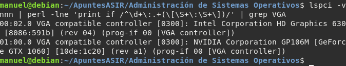

Si al final de cada línea vemos _[VGA controller]_, quiere decir que tenemos 
activa y funcionando dicha tarjeta gráfica. En nuestro caso, tenemos 
funcionando ambas.

Otra forma de ver si tenemos los drivers instalados y operativos sería de la
siguiente manera:

```sudo lsmod | grep nvidia```

Con este comando vemos los drivers de nvidia y sus dependencias.

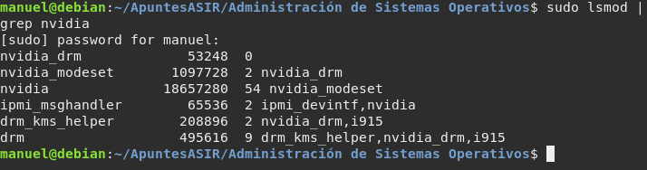

```sudo lshw | less```

Veo los componentes hardware de nuestro ordenador, y podemos ver que la 
tarjeta gráfica, efectivamente, está cargando los drivers de nvidia.

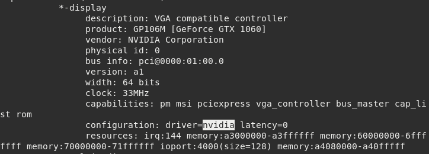


