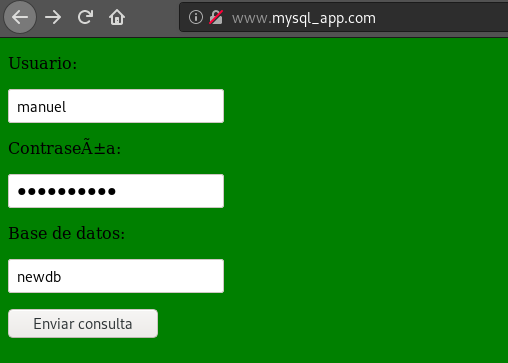
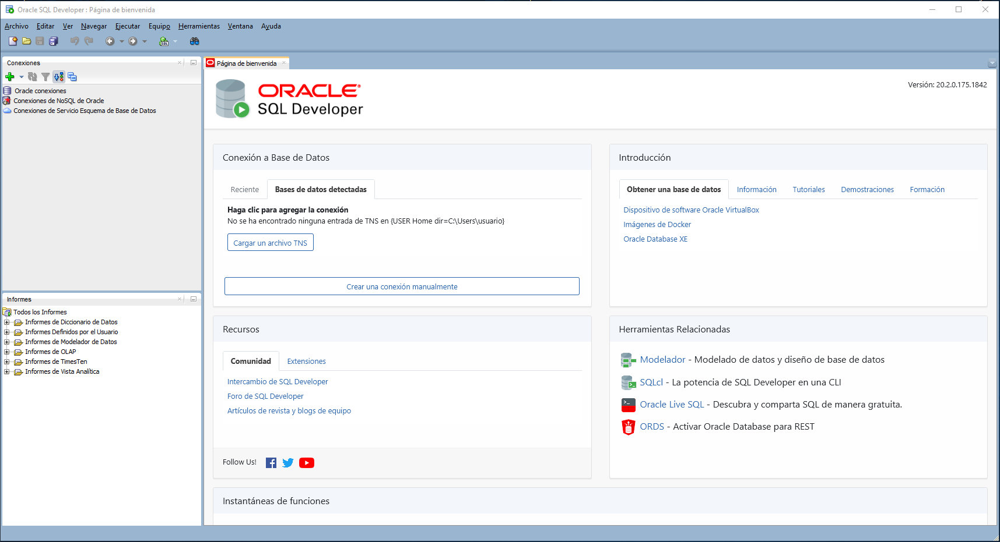
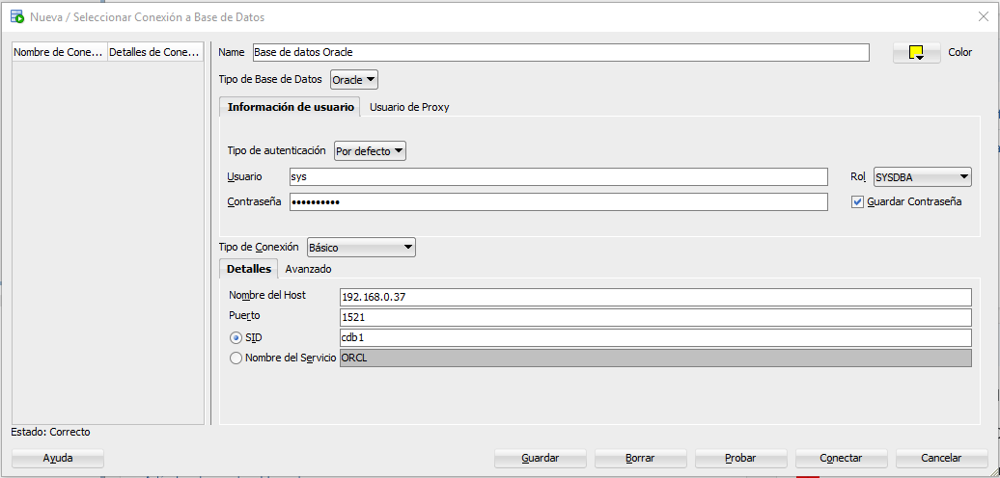
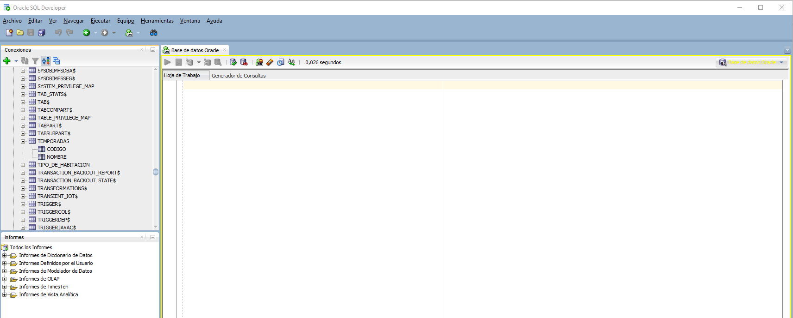
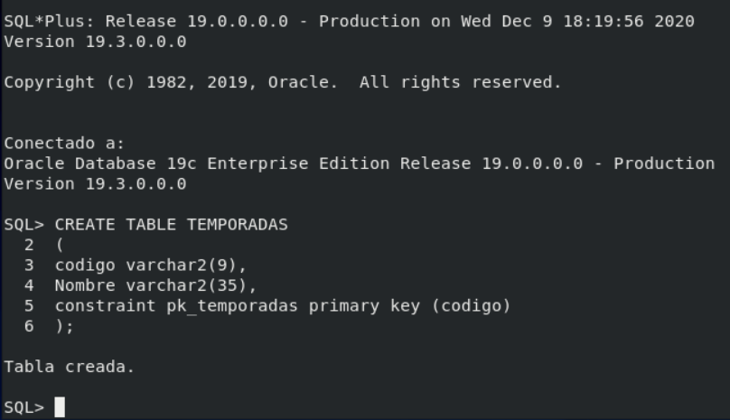
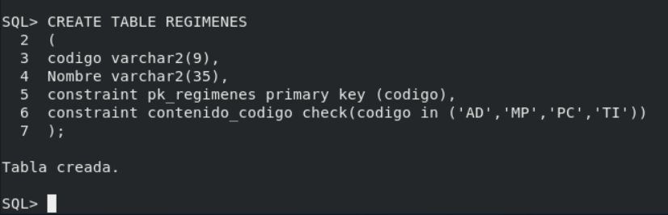
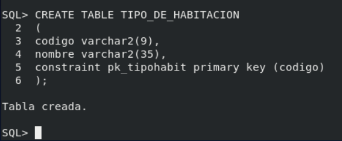
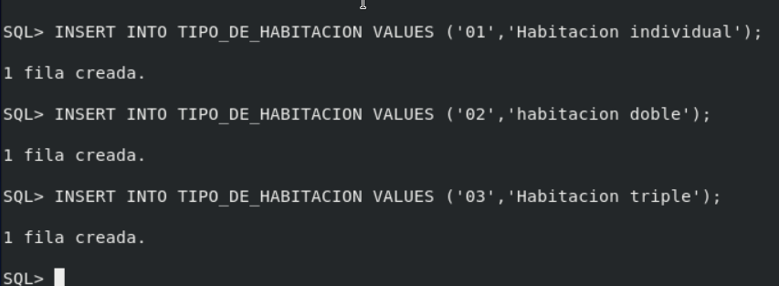
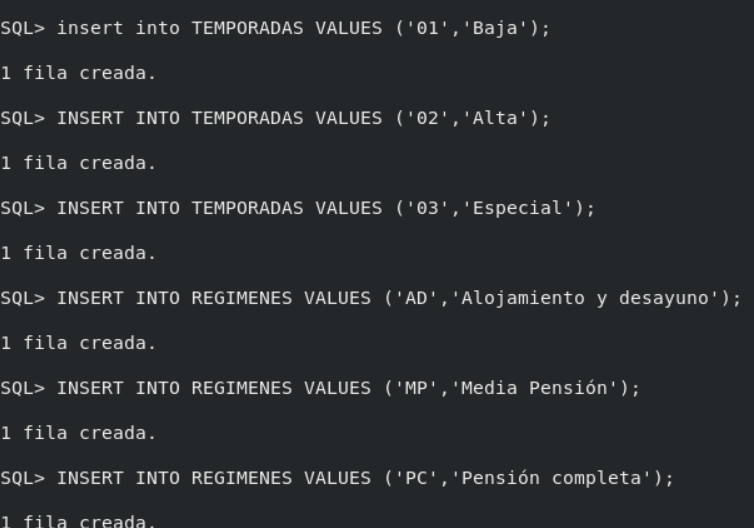

<div align="center">

# Instalación de Servidores y Clientes

</div>

Tras la instalación de cada servidor,  debe crearse una base de datos con al 
menos tres tablas o colecciones y poblarse de datos adecuadamente. Debe crearse 
un usuario y dotarlo de los privilegios necesarios para acceder remotamente a 
los datos. Se proporcionará esta información al resto de los miembros del grupo.
Los clientes deben estar siempre en máquinas diferentes de los respectivos 
servidores a los que acceden.

* Instalación de un servidor Postgres y configuración para permitir el acceso
remoto desde la red local.

Primero, procederemos a instalarnos en Debian 10 el servidor Postgres mediante
la descarga del paquete llamado _postgresql-11_:

```
debian@bbdd:~$ sudo apt-get install postgresql-11
Leyendo lista de paquetes... Hecho
Creando árbol de dependencias       
Leyendo la información de estado... Hecho
Los paquetes indicados a continuación se instalaron de forma automática y ya no son necesarios.
  ffmpeg gnome-session-canberra libavdevice58 libdc1394-utils libqt5test5
  libsdl2-2.0-0
Utilice «sudo apt autoremove» para eliminarlos.
Se instalarán los siguientes paquetes adicionales:
  libpq5 postgresql-client-11 postgresql-client-common postgresql-common
  sysstat
Paquetes sugeridos:
  postgresql-doc-11 libjson-perl isag
Se instalarán los siguientes paquetes NUEVOS:
  libpq5 postgresql-11 postgresql-client-11 postgresql-client-common
  postgresql-common sysstat
0 actualizados, 6 nuevos se instalarán, 0 para eliminar y 41 no actualizados.
Se necesita descargar 16,5 MB de archivos.
Se utilizarán 55,4 MB de espacio de disco adicional después de esta operación.
¿Desea continuar? [S/n] S
Des:1 http://deb.debian.org/debian buster/main amd64 libpq5 amd64 11.9-0+deb10u1 [167 kB]
.
.
.
Completado. Ahora puede iniciar el servidor de bases de datos usando:

    pg_ctlcluster 11 main start

Ver Cluster Port Status Owner    Data directory              Log file
11  main    5432 down   postgres /var/lib/postgresql/11/main /var/log/postgresql/postgresql-11-main.log
update-alternatives: utilizando /usr/share/postgresql/11/man/man1/postmaster.1.gz para proveer /usr/share/man/man1/postmaster.1.gz (postmaster.1.gz) en modo automático
Configurando sysstat (12.0.3-2) ...

Creating config file /etc/default/sysstat with new version
update-alternatives: utilizando /usr/bin/sar.sysstat para proveer /usr/bin/sar (sar) en modo automático
Created symlink /etc/systemd/system/multi-user.target.wants/sysstat.service → /lib/systemd/system/sysstat.service.
Procesando disparadores para systemd (241-7~deb10u4) ...
Procesando disparadores para man-db (2.8.5-2) ...
Procesando disparadores para libc-bin (2.28-10) ...
```

Cuando descargamos el paquete, la base de datos de Postgres debería
inicializarse. Para comprobar si efectivamente lo está, ejecutamos uno de los
dos comandos:

```
debian@bbdd:~$ pg_isready
/var/run/postgresql:5432 - aceptando conexiones

manuel@debian:~$ sudo systemctl status postgresql
● postgresql.service - PostgreSQL RDBMS
   Loaded: loaded (/lib/systemd/system/postgresql.service; enabled; vendor preset: enab
   Active: active (exited) since Tue 2020-12-01 08:38:38 CET; 4min 3s ago
 Main PID: 5311 (code=exited, status=0/SUCCESS)
    Tasks: 0 (limit: 4915)
   Memory: 0B
   CGroup: /system.slice/postgresql.service

dic 01 08:38:38 debian systemd[1]: Starting PostgreSQL RDBMS...
dic 01 08:38:38 debian systemd[1]: Started PostgreSQL RDBMS.
```

Una vez ya instalado el servidor y comprobado que funciona, vamos a hacer lo
siguiente. Como al instalarse el servidor se nos crea automáticamente un
nuevo usuario llamado "postgres", vamos a cambiar la contraseña:

```
debian@bbdd:~$ sudo passwd postgres
Nueva contraseña: 
Vuelva a escribir la nueva contraseña: 
passwd: contraseña actualizada correctamente
debian@bbdd:~$ sudo su postgres
postgres@debian:/home/debian$ exit
exit
```

A continuación, crearemos un nuevo usuario para el gestor con:

``` 
postgres@bbdd:/home/debian$ createuser -s manuel -P 
Ingrese la contraseña para el nuevo rol: 
Ingrésela nuevamente: 
```

Con la opción -s le asignamos permisos de superusuario.

Ahora vamos a proceder a crear propiamente la base de datos. Para ello vamos a
ejecutar:

```
debian@bbdd:~$ createdb bbddprueba
debian@bbdd:~$ psql bbddprueba 
psql (11.9 (Debian 11.9-0+deb10u1))
Digite «help» para obtener ayuda.

bbddprueba=# 
```

Como nos pide el ejercicio, crearemos varias tablas y las poblaremos de datos.

```
bbddprueba=# create table temporadas
bbddprueba-# (
bbddprueba(#  codigo   varchar(9),
bbddprueba(#  Nombre   varchar(35),
bbddprueba(#  constraint pk_temporadas primary key (codigo)
bbddprueba(# );
CREATE TABLE

bbddprueba=# insert into temporadas
bbddprueba-# values ('01','Baja');
INSERT 0 1
bbddprueba=# insert into temporadas
bbddprueba-# values ('02','Alta');
INSERT 0 1
bbddprueba=# insert into temporadas
bbddprueba-# values ('03','Especial');
INSERT 0 1


bbddprueba=# create table regimenes
bbddprueba-# (
bbddprueba(#  codigo   varchar(9),
bbddprueba(#  Nombre   varchar(35),
bbddprueba(#  constraint pk_regimenes primary key (codigo),
bbddprueba(#  constraint contenido_codigo check( codigo in ('AD','MP','PC','TI'))
bbddprueba(# );
CREATE TABLE

bbddprueba=# insert into regimenes
bbddprueba-# values ('AD','Alojamiento y Desayuno');
INSERT 0 1
bbddprueba=# insert into regimenes
bbddprueba-# values ('MP','Media pension');
INSERT 0 1
bbddprueba=# insert into regimenes
bbddprueba-# values ('PC','Pension completa');
INSERT 0 1
bbddprueba=# insert into regimenes
bbddprueba-# values ('TI','Todo incluido');


bbddprueba=# create table tipos_de_habitacion
bbddprueba-# (
bbddprueba(#  codigo   varchar(9),
bbddprueba(#  nombre   varchar(35),
bbddprueba(#  constraint pk_tipohabit primary key (codigo)
bbddprueba(# );
CREATE TABLE

bbddprueba=# insert into tipos_de_habitacion
bbddprueba-# values ('01','Habitacion individual');
INSERT 0 1
bbddprueba=# insert into tipos_de_habitacion
bbddprueba-# values ('02','Habitacion doble');
INSERT 0 1
bbddprueba=# insert into tipos_de_habitacion
bbddprueba-# values ('03','Habitacion triple');
INSERT 0 1


bbddprueba=# create table habitaciones
bbddprueba-# (
bbddprueba(#  numero   varchar(4),
bbddprueba(#  codigotipo  varchar(9),
bbddprueba(#  constraint pk_habitaciones primary key (numero),
bbddprueba(#  constraint fk_habitaciones foreign key (codigotipo) references tipos_de_habitacion(codigo)
bbddprueba(# );
CREATE TABLE

bbddprueba=# insert into habitaciones
bbddprueba-# values ('00','01');
INSERT 0 1
bbddprueba=# insert into habitaciones
bbddprueba-# values ('01','02');
INSERT 0 1
bbddprueba=# insert into habitaciones
bbddprueba-# values ('02','03');
INSERT 0 1
bbddprueba=# insert into habitaciones
bbddprueba-# values ('03','01');
INSERT 0 1
bbddprueba=# insert into habitaciones
bbddprueba-# values ('04','02');
INSERT 0 1
bbddprueba=# insert into habitaciones
bbddprueba-# values ('05','02');
INSERT 0 1
bbddprueba=# insert into habitaciones
bbddprueba-# values ('06','02');
INSERT 0 1
bbddprueba=# insert into habitaciones
bbddprueba-# values ('07','02');
INSERT 0 1
bbddprueba=# insert into habitaciones
bbddprueba-# values ('08','03');
INSERT 0 1
bbddprueba=# insert into habitaciones
bbddprueba-# values ('09','02');
INSERT 0 1
bbddprueba=# insert into habitaciones
bbddprueba-# values ('10','01');
INSERT 0 1
bbddprueba=# insert into habitaciones
bbddprueba-# values ('11','03');
INSERT 0 1
```

Y por último, nos quedaría conectarnos mediante un usuario remoto desde nuestra 
red local. Para que esto sea posible, primero es necesario modificar algunos
ficheros de configuración. 

En primer lugar, nos iremos al directorio _/etc/postgresql/11/main_ y 
modificamos el fichero _postgresql.conf_. Descomentamos la siguiente línea, y
como queremos que sea de nuestra red local, pondremos lo siguiente:

```
listen_addresses = '*'
```

Esto nos permitirá aceptar solo peticiones de dichas redes (la del instituto y
la personal)

Ahora, modificaremos el fichero de configuración de clientes, que se llama
_/etc/postgresql/11/main/pg_hba.conf_ y cambiamos la siguiente información:

```
# IPv4 local connections:
host    all             all             0.0.0.0/0            md5
```

Una vez ya configurado, reiniciamos el servicio de Postgresql.

Ahora para comprobar que efectivamente nos podemos conectar mediante un usuario
a nuestro servidor, nos meteremos en una máquina cuya IP es 172.22.200.190
(IP permitida) y nos descargaremos el paquete ```postgresql-cliente-11```.

Una vez descargado, comprobamos la conexión desde la máquina cliente:

```
manuel@debian:~$ psql -h 172.22.200.117 -p 5432 -U bbdd -d bbddprueba
Contraseña para usuario bbdd: 
psql (11.9 (Debian 11.9-0+deb10u1))
conexión SSL (protocolo: TLSv1.3, cifrado: TLS_AES_256_GCM_SHA384, bits: 256, compresión: desactivado)
Digite «help» para obtener ayuda.

bbddprueba=# \dt
             Listado de relaciones
 Esquema |       Nombre        | Tipo  | Dueño  
---------+---------------------+-------+--------
 public  | habitaciones        | tabla | debian
 public  | regimenes           | tabla | debian
 public  | temporadas          | tabla | debian
 public  | tipos_de_habitacion | tabla | debian
(4 filas)

bbddprueba=# 
```

Tras indagar en el problema hallado con el problema de conexión al permitir 
solamente la red X (aún teniendo la configuración correctamente), hemos acordado
con el profesor que permitamos todo, y continuar con los ejercicios.

* Prueba desde un cliente remoto el intérprete de comandos de MongoDB.

En primer lugar instalaremos en una máquina, el servidor de MongoDB. Para ello,
debemos realizar los siguientes pasos:

Primero, debemos ejecutar el siguiente comando para añadir las keys necesarias
del servidor de MongoDB:

```
vagrant@mongo:~$ wget https://www.mongodb.org/static/pgp/server-4.4.asc -qO- | sudo apt-key add -
OK
```

Después, editaremos el fichero _/etc/apt/sources.list.d/mongodb-org.list_ y le
añadiremos la siguiente línea:

```
deb http://repo.mongodb.org/apt/debian buster/mongodb-org/4.4 main
```

Hecho esto, hacemos un update del sistema y a continuación, nos descargamos el 
paquete llamado _mongodb-org_:

```
vagrant@mongo:~$ sudo apt-get install mongodb-org
Reading package lists... Done
Building dependency tree       
Reading state information... Done
The following additional packages will be installed:
  mongodb-database-tools mongodb-org-database-tools-extra mongodb-org-mongos
  mongodb-org-server mongodb-org-shell mongodb-org-tools
The following NEW packages will be installed:
  mongodb-database-tools mongodb-org mongodb-org-database-tools-extra
  mongodb-org-mongos mongodb-org-server mongodb-org-shell mongodb-org-tools
0 upgraded, 7 newly installed, 0 to remove and 55 not upgraded.
Need to get 104 MB of archives.
After this operation, 200 MB of additional disk space will be used.
Do you want to continue? [Y/n] Y
Get:1 http://repo.mongodb.org/apt/debian buster/mongodb-org/4.4/main amd64 mongodb-database-tools amd64 100.2.1 [54.5 MB]
Get:2 http://repo.mongodb.org/apt/debian buster/mongodb-org/4.4/main amd64 mongodb-org-shell amd64 4.4.2 [13.2 MB]
Get:3 http://repo.mongodb.org/apt/debian buster/mongodb-org/4.4/main amd64 mongodb-org-server amd64 4.4.2 [20.4 MB]
Get:4 http://repo.mongodb.org/apt/debian buster/mongodb-org/4.4/main amd64 mongodb-org-mongos amd64 4.4.2 [15.7 MB]
Get:5 http://repo.mongodb.org/apt/debian buster/mongodb-org/4.4/main amd64 mongodb-org-database-tools-extra amd64 4.4.2 [5,636 B]
Get:6 http://repo.mongodb.org/apt/debian buster/mongodb-org/4.4/main amd64 mongodb-org-tools amd64 4.4.2 [2,892 B]
Get:7 http://repo.mongodb.org/apt/debian buster/mongodb-org/4.4/main amd64 mongodb-org amd64 4.4.2 [3,520 B]
Fetched 104 MB in 23s (4,496 kB/s)                                             
Selecting previously unselected package mongodb-database-tools.
(Reading database ... 32165 files and directories currently installed.)
Preparing to unpack .../0-mongodb-database-tools_100.2.1_amd64.deb ...
Unpacking mongodb-database-tools (100.2.1) ...
Selecting previously unselected package mongodb-org-shell.
Preparing to unpack .../1-mongodb-org-shell_4.4.2_amd64.deb ...
Unpacking mongodb-org-shell (4.4.2) ...
Selecting previously unselected package mongodb-org-server.
Preparing to unpack .../2-mongodb-org-server_4.4.2_amd64.deb ...
Unpacking mongodb-org-server (4.4.2) ...
Selecting previously unselected package mongodb-org-mongos.
Preparing to unpack .../3-mongodb-org-mongos_4.4.2_amd64.deb ...
Unpacking mongodb-org-mongos (4.4.2) ...
Selecting previously unselected package mongodb-org-database-tools-extra.
Preparing to unpack .../4-mongodb-org-database-tools-extra_4.4.2_amd64.deb ...
Unpacking mongodb-org-database-tools-extra (4.4.2) ...
Selecting previously unselected package mongodb-org-tools.
Preparing to unpack .../5-mongodb-org-tools_4.4.2_amd64.deb ...
Unpacking mongodb-org-tools (4.4.2) ...
Selecting previously unselected package mongodb-org.
Preparing to unpack .../6-mongodb-org_4.4.2_amd64.deb ...
Unpacking mongodb-org (4.4.2) ...
Setting up mongodb-org-server (4.4.2) ...
Setting up mongodb-org-shell (4.4.2) ...
Setting up mongodb-database-tools (100.2.1) ...
Setting up mongodb-org-mongos (4.4.2) ...
Setting up mongodb-org-database-tools-extra (4.4.2) ...
Setting up mongodb-org-tools (4.4.2) ...
Setting up mongodb-org (4.4.2) ...
Processing triggers for man-db (2.8.5-2) ...
```

Una vez hecho esto, debemos activar el servicio con:

```
sudo systemctl restart mongod.service
```

Ahora configuraremos el acceso. En primer lugar ejecutamos mongo:

```
vagrant@mongo:~$ mongo
MongoDB shell version v4.4.2
connecting to: mongodb://127.0.0.1:27017/?compressors=disabled&gssapiServiceName=mongodb
Implicit session: session { "id" : UUID("39a6b935-e95c-495c-b6c5-e37471fbe92c") }
MongoDB server version: 4.4.2
---
The server generated these startup warnings when booting: 
        2020-12-05T17:39:41.197+00:00: Using the XFS filesystem is strongly recommended with the WiredTiger storage engine. See http://dochub.mongodb.org/core/prodnotes-filesystem
        2020-12-05T17:39:41.656+00:00: Access control is not enabled for the database. Read and write access to data and configuration is unrestricted
---
---
        Enable MongoDB's free cloud-based monitoring service, which will then receive and display
        metrics about your deployment (disk utilization, CPU, operation statistics, etc).

        The monitoring data will be available on a MongoDB website with a unique URL accessible to you
        and anyone you share the URL with. MongoDB may use this information to make product
        improvements and to suggest MongoDB products and deployment options to you.

        To enable free monitoring, run the following command: db.enableFreeMonitoring()
        To permanently disable this reminder, run the following command: db.disableFreeMonitoring()
---
> 
```

Y ahora seleccionamos la base de datos admin y creamos un usuario:

```
> use admin
switched to db admin
> db.createUser({user: "mongodb", pwd: "1q2w3e4r5t", roles: [{role: "root", db: "admin"}]})
Successfully added user: {
	"user" : "mongodb",
	"roles" : [
		{
			"role" : "root",
			"db" : "admin"
		}
	]
}
> exit
bye
```

Con esto, ya podremos ejecutar el servicio de MongoDB correctamente. Ahora, 
para poder acceder remotamente, debemos modificar el fichero _/etc/mongod.conf_,
la directiva de _bindIP_:

```
net:
  port: 27017
  bindIp: 127.0.0.1
```

Y modificamos dicho parámetro por _0.0.0.0_.

En caso necesario, si tenemos activado el firewall UFW, debemos añadir la regla:

```
sudo ufw allow 27017/tcp
```

Ahora pasando al cliente, seguiremos los mismo pasos hasta llegar a iniciar el 
servicio por primera vez, y para conectarnos debemos ejecutar el siguiente
comando:

```
vagrant@mongocliente:~$ mongo --host 172.28.128.7 -u mongodb
MongoDB shell version v4.4.2
Enter password: 
connecting to: mongodb://172.28.128.7:27017/?compressors=disabled&gssapiServiceName=mongodb
Implicit session: session { "id" : UUID("e7777754-7e99-46ba-a9fa-e22516c95c8d") }
MongoDB server version: 4.4.2
Welcome to the MongoDB shell.
For interactive help, type "help".
For more comprehensive documentation, see
	https://docs.mongodb.com/
Questions? Try the MongoDB Developer Community Forums
	https://community.mongodb.com
---
The server generated these startup warnings when booting: 
        2020-12-05T17:52:27.652+00:00: Using the XFS filesystem is strongly recommended with the WiredTiger storage engine. See http://dochub.mongodb.org/core/prodnotes-filesystem
        2020-12-05T17:52:28.359+00:00: Access control is not enabled for the database. Read and write access to data and configuration is unrestricted
---
---
        Enable MongoDB's free cloud-based monitoring service, which will then receive and display
        metrics about your deployment (disk utilization, CPU, operation statistics, etc).

        The monitoring data will be available on a MongoDB website with a unique URL accessible to you
        and anyone you share the URL with. MongoDB may use this information to make product
        improvements and to suggest MongoDB products and deployment options to you.

        To enable free monitoring, run the following command: db.enableFreeMonitoring()
        To permanently disable this reminder, run the following command: db.disableFreeMonitoring()
---
> exit
bye
```

Y ya nos podríamos conectar.


* Realización de una aplicación web en cualquier lenguaje que conecte con el 
servidor MySQL desde un cliente remoto tras autenticarse y muestre alguna 
información almacenada en el mismo.

Instalamos el paquete _mariadb-server_ en nuestra máquina. Una vez instalado
ejecutaremos lo siguiente:

```
root@ldapej:~# mysql_secure_installation 

NOTE: RUNNING ALL PARTS OF THIS SCRIPT IS RECOMMENDED FOR ALL MariaDB
      SERVERS IN PRODUCTION USE!  PLEASE READ EACH STEP CAREFULLY!

In order to log into MariaDB to secure it, we'll need the current
password for the root user.  If you've just installed MariaDB, and
you haven't set the root password yet, the password will be blank,
so you should just press enter here.

Enter current password for root (enter for none): 
OK, successfully used password, moving on...

Setting the root password ensures that nobody can log into the MariaDB
root user without the proper authorisation.

Set root password? [Y/n] Y
New password: 
Re-enter new password: 
Password updated successfully!
Reloading privilege tables..
 ... Success!


By default, a MariaDB installation has an anonymous user, allowing anyone
to log into MariaDB without having to have a user account created for
them.  This is intended only for testing, and to make the installation
go a bit smoother.  You should remove them before moving into a
production environment.

Remove anonymous users? [Y/n] Y
 ... Success!

Normally, root should only be allowed to connect from 'localhost'.  This
ensures that someone cannot guess at the root password from the network.

Disallow root login remotely? [Y/n] Y
 ... Success!

By default, MariaDB comes with a database named 'test' that anyone can
access.  This is also intended only for testing, and should be removed
before moving into a production environment.

Remove test database and access to it? [Y/n] Y
 - Dropping test database...
 ... Success!
 - Removing privileges on test database...
 ... Success!

Reloading the privilege tables will ensure that all changes made so far
will take effect immediately.

Reload privilege tables now? [Y/n] Y
 ... Success!

Cleaning up...

All done!  If you've completed all of the above steps, your MariaDB
installation should now be secure.

Thanks for using MariaDB!
```

Después crearemos una nueva base de datos con un usuario con privilegios sobre
dicha base de datos:

```
debian@ldapej:~$ sudo mysql -u root -p
Enter password: 
Welcome to the MariaDB monitor.  Commands end with ; or \g.
Your MariaDB connection id is 57
Server version: 10.3.23-MariaDB-0+deb10u1 Debian 10

Copyright (c) 2000, 2018, Oracle, MariaDB Corporation Ab and others.

Type 'help;' or '\h' for help. Type '\c' to clear the current input statement.

MariaDB [(none)]> CREATE DATABASE newdb;
Query OK, 1 row affected (0.001 sec)

MariaDB [(none)]> CREATE USER manuel@localhost IDENTIFIED BY '1q2w3e4r5t'
    -> ;
Query OK, 0 rows affected (0.001 sec)

MariaDB [(none)]> GRANT ALL PRIVILEGES ON newdb.* to manuel@localhost;
Query OK, 0 rows affected (0.001 sec)
```

Hecho esto, poblaremos dicha base de datos:

```
MariaDB [newdb]> create table temporadas
    -> (
    -> codigo varchar(9),
    -> Nombre varchar(35),
    -> constraint pk_temporadas primary key (codigo)
    -> );
Query OK, 0 rows affected, 1 warning (0.120 sec)

MariaDB [newdb]> create table regimenes
    -> (
    -> codigo varchar(9),
    -> Nombre varchar(35),
    -> constraint pk_regimenes primary key (codigo),
    -> constraint contenido_codigo check( codigo in ('AD','MP','PC','TI'))
    -> );
Query OK, 0 rows affected, 1 warning (0.097 sec)

MariaDB [newdb]> create table tipos_de_habitacion
    -> (
    -> codigo varchar(9),
    -> nombre varchar(35),
    -> constraint pk_tipohabit primary key (codigo)
    -> );
Query OK, 0 rows affected, 1 warning (0.085 sec)

MariaDB [newdb]> create table habitaciones
    -> (
    -> numero varchar(4),
    -> codigotipo varchar(9),
    -> constraint pk_habitaciones primary key (numero),
    -> constraint fk_habitaciones foreign key (codigotipo) references tipos_de_habitacion(codigo)
    -> );
Query OK, 0 rows affected, 1 warning (0.186 sec)

MariaDB [newdb]> insert into temporadas
    -> values ('01','Baja');
Query OK, 1 row affected (0.012 sec)

MariaDB [newdb]> insert into temporadas
    -> values ('02','Alta');
Query OK, 1 row affected (0.018 sec)

MariaDB [newdb]> insert into temporadas
    -> values ('03','Especial');
Query OK, 1 row affected (0.013 sec)

MariaDB [newdb]> insert into regimenes
    -> values ('AD','Alojamiento y Desayuno');
Query OK, 1 row affected (0.004 sec)

MariaDB [newdb]> insert into regimenes
    -> values ('MP','Media pension');
Query OK, 1 row affected (0.029 sec)

MariaDB [newdb]> insert into regimenes
    -> values ('PC','Pension completa');
Query OK, 1 row affected (0.002 sec)

MariaDB [newdb]> insert into regimenes
    -> values ('TI','Todo incluido');
Query OK, 1 row affected (0.003 sec)

MariaDB [newdb]> insert into tipos_de_habitacion
    -> values ('01','Habitacion individual');
Query OK, 1 row affected (0.004 sec)

MariaDB [newdb]> insert into tipos_de_habitacion
    -> values ('02','Habitacion doble');
Query OK, 1 row affected (0.014 sec)

MariaDB [newdb]> insert into tipos_de_habitacion
    -> values ('03','Habitacion triple');
Query OK, 1 row affected (0.011 sec)

MariaDB [newdb]> insert into habitaciones
    -> values ('00','01');
Query OK, 1 row affected (0.009 sec)

MariaDB [newdb]> insert into habitaciones
    -> values ('01','02');
Query OK, 1 row affected (0.011 sec)

MariaDB [newdb]> insert into habitaciones
    -> values ('02','03');
Query OK, 1 row affected (0.013 sec)

MariaDB [newdb]> insert into habitaciones
    -> values ('03','01');
Query OK, 1 row affected (0.002 sec)

MariaDB [newdb]> insert into habitaciones
    -> values ('04','02');
Query OK, 1 row affected (0.001 sec)

MariaDB [newdb]> insert into habitaciones
    -> values ('05','02');
Query OK, 1 row affected (0.001 sec)

MariaDB [newdb]> insert into habitaciones
    -> values ('06','02');
Query OK, 1 row affected (0.015 sec)

MariaDB [newdb]> insert into habitaciones
    -> values ('07','02');
Query OK, 1 row affected (0.013 sec)

MariaDB [newdb]> insert into habitaciones
    -> values ('08','03');
Query OK, 1 row affected (0.013 sec)

MariaDB [newdb]> insert into habitaciones
    -> values ('09','02');
Query OK, 1 row affected (0.016 sec)

MariaDB [newdb]> insert into habitaciones
    -> values ('10','01');
Query OK, 1 row affected (0.002 sec)

MariaDB [newdb]> insert into habitaciones
    -> values ('11','03');
Query OK, 1 row affected (0.020 sec) 
```

Una vez hecho esto, instalaremos el paquete de apache2 y el paquete que
permite el uso de php y configuraremos un virtualhost:

```
<VirtualHost *:80>
        ServerName www.mysql_app.com

        ServerAdmin webmaster@localhost
        DocumentRoot /var/www/html
        ErrorLog ${APACHE_LOG_DIR}/error.log
        CustomLog ${APACHE_LOG_DIR}/access.log combined

</VirtualHost>
```

Nos descargamos el paquete php y ejecutamos el siguiente comando:

```
debian@ldapej:~$ echo "<?php phpinfo(); ?>" | sudo tee /var/www/html/phpinfo.php
<?php phpinfo(); ?>
```

Y ahora crearemos 3 ficheros en el DocumentRoot: otro index.html, datos.php,
y all.php.

Configuración index.html:

```

<!DOCTYPE html>
<html lang="es">
  <head></head>
        <body style= "background: green">
        <title>Aplicación Mysql: Manuel Lora Román</title>
         <form action="all.php" name="form" method="POST">
                <p>Usuario:</p>
                <input type="text" name="user">
                <p>Contraseña:</p>
                <input type="password" name="pw">
                <p>Base de datos:</p>
                <input type="text" name="db">
                <p></p>
                <input type="submit" name="Enviar" value"Enviar" />
         </form>
        </body>
</html>
```


```
<?php

$server = "172.22.201.0";
$user = $_POST['user'];
$pw = $_POST['pw'];
$db = $_POST['db'];
$connect = new mysqli($server, $user, $pw, $db);

if ($connect->connect_error) {
        die("ERROR. <br> Alguno de los parametros introducidos son incorrectos.");
}


$sql = "select table_name from information_schema.tables where table_schema like '$db'";

echo '<html>';
echo '<body style= "background: blue">';

$result = $connect->query($sql);
if ($result->num_rows > 0) {
        echo "Base de datos $db";
        echo "<br>";
        echo "<br>";
        while($row = $result->fetch_assoc()) {
                echo "<form method=post action=tabla.php>";
                echo "<input type=hidden name=user value={$user}>";
                echo "<input type=hidden name=pw value={$pw}>";
                echo "<input type=hidden name=db value={$db}>";
                echo "<input type=submit name=table value={$row['table_name']}>";
                echo "<br>";
                echo "</form>";

        }
} else {
        echo "La tabla esta vacia";
}

echo '</body>';
echo '</html>';

$connect->close();

?>
```

Y la comprobación:



* Instalación de SQL Developer sobre Windows como cliente remoto de ORACLE.

En primer lugar, nos descargaremos el archivo .zip de SQL Developer de la 
sección de descarga de recursos de la página web de Oracle.

Una vez descargado, extraeremos dicho archivo y ejecutaremos el binario
SQLDeveloper.exe.

Y empezará la instalación. Nos dirá si queremos importar alguna configuración
anterior. Le damos que no y una vez haya terminado la instalación, nos 
aparece la ventana de inicio de SQL Developer:



Una vez aquí, pulsamos el botón verde e intentamos rellenar la información
necesaria para conectarnos al servidor de Oracle que queramos (en nuestro caso,
el servidor creado anteriormente). 

Ejemplo:







* Instalación y prueba desde un cliente remoto de Oracle Enterprise Manager.

Instalaremos la versión 19c para CentOS 8.

En primer lugar, ejecutaremos un update a la máquina antes de instalar 
cualquier servidor. Una vez hecho esto, deshabilitaremos _Transparent HugePages_
ya que puede causar un retraso en el acceso a la memoria, pudiendo resultar en 
problemas con las bases de datos de Oracle.

Para ello, ejecutaremos lo siguiente para comprobar que efectivamente está 
activado por defecto:

```
[root@localhost ~]# cat /sys/kernel/mm/transparent_hugepage/enabled
[always] madvise never
```

Entonces, para desactivarlo, modificaremos el fichero _/etc/default/grub_
añadiendo al final de la línea de _GRUB___CMDLINE___LINUX_

```
transparent_hugepage=never
```

Hecho esto, generamos el fichero _/boot/grub2/grub.cfg_ usando las configuraciones
modificadas:

```
[root@localhost ~]# grub2-mkconfig -o /boot/grub2/grub.cfg
Generating grub configuration file ...
done
```

Después de esto, reiniciamos la máquina para guardar los cambios.

Y al volver a comprobar el estado:

```
[root@localhost ~]# cat /sys/kernel/mm/transparent_hugepage/enabled
always madvise [never]
```

Ahora, pasaremos a la instalación de paquetería necesaria antes de instalar
Oracle:

```
[root@localhost ~]# yum install -y bc \
> binutils \
> elfutils-libelf \
> elfutils-libelf-devel \
> fontconfig-devel \
> glibc \
> glibc-devel \
> ksh \
> libaio \
> libaio-devel \
> libXrender \
> libXrender-devel \
> libX11 \
> libXau \
> libXi \
> libXtst \
> libgcc \
> librdmacm-devel \
> libstdc++ \
> libstdc++-devel \
> libxcb \
> make \
> net-tools \
> smartmontools \
> sysstat \
> unzip \
> libnsl \
> libnsl2
```

Una vez descargado los paquetes necesarios, pasaremos a la creación de usuarios
y grupos para Oracle:

```
[root@localhost ~]# groupadd -g 1501 oinstall
[root@localhost ~]# groupadd -g 1502 dba
[root@localhost ~]# groupadd -g 1503 oper
[root@localhost ~]# groupadd -g 1504 backupdba
[root@localhost ~]# groupadd -g 1505 dgdba
[root@localhost ~]# groupadd -g 1506 kmdba
[root@localhost ~]# groupadd -g 1507 racdba
[root@localhost ~]# useradd -u 1501 -g oinstall -G dba,oper,backupdba,dgdba,kmdba,racdba oracle
[root@localhost ~]# echo "oracle" | passwd oracle --stdin
Changing password for user oracle.
passwd: all authentication tokens updated successfully.
```

Ahora crearemos una configuración llamada _/etc/security/limits.d/30-oracle.conf_
para marcar los límites de seguridad del usuario de Oracle:

```
oracle   soft   nofile    1024
oracle   hard   nofile    65536
oracle   soft   nproc    16384
oracle   hard   nproc    16384
oracle   soft   stack    10240
oracle   hard   stack    32768
oracle   hard   memlock    134217728
oracle   soft   memlock    134217728
```

Ahora ajustaremos los parámetros del kernel de CentOS 8 editando la 
configuración del fichero _/etc/sysctl.d/98-oracle.conf:

```
fs.file-max = 6815744
kernel.sem = 250 32000 100 128
kernel.shmmni = 4096
kernel.shmall = 1073741824
kernel.shmmax = 4398046511104
kernel.panic_on_oops = 1
net.core.rmem_default = 262144
net.core.rmem_max = 4194304
net.core.wmem_default = 262144
net.core.wmem_max = 1048576
net.ipv4.conf.all.rp_filter = 2
net.ipv4.conf.default.rp_filter = 2
fs.aio-max-nr = 1048576
net.ipv4.ip_local_port_range = 9000 65500
```

Y recargamos los parámetros del kernel con el siguiente comando:

```
[root@localhost ~]# sysctl -p
```

De manera persistente, configuramos SELinux en modo permisivo:

```
[root@localhost ~]# sed -i 's/^SELINUX=.*/SELINUX=permissive/g' /etc/sysconfig/selinux
[root@localhost ~]# setenforce permissive
```

A continuación, permitiremos el puerto de escucha de Oracle SQL en el firewall 
de CentOs:

```
[root@localhost ~]# firewall-cmd --permanent --add-port=1521/tcp
success
[root@localhost ~]# firewall-cmd --reload
success
```

Ahora pasaremos a la creación de directorios y ajuste de permisos y propietarios
para Oracle:

```
[root@localhost ~]# mkdir -p /u01/app/oracle/product/19.3.0/dbhome_1
[root@localhost ~]# mkdir -p /u02/oradata
[root@localhost ~]# chown -R oracle:oinstall /u01 /u02
[root@localhost ~]# chmod -R 775 /u01 /u02
```

Con esto, creamos 2 directorios, uno para Oracle RDBMS y otro para Oracle 
Databases.

Ahora configuraremos el entorno de CentOs para el usuario de Oracle:

* Nos conectamos con el usuario oracle

* Editamos el fichero _.bash_profile y añadimos la siguiente configuración:

```
# Oracle Settings
export TMP=/tmp
export TMPDIR=$TMP

export ORACLE_HOSTNAME=localhost
export ORACLE_UNQNAME=cdb1
export ORACLE_BASE=/u01/app/oracle
export ORACLE_HOME=$ORACLE_BASE/product/19.3.0/dbhome_1
export ORA_INVENTORY=/u01/app/oraInventory
export ORACLE_SID=cdb1
export PDB_NAME=pdb1
export DATA_DIR=/u02/oradata

export PATH=$ORACLE_HOME/bin:$PATH

export LD_LIBRARY_PATH=$ORACLE_HOME/lib:/lib:/usr/lib
export CLASSPATH=$ORACLE_HOME/jlib:$ORACLE_HOME/rdbms/jlib
```

* Y ejecutamos dicho fichero para que se quede el entorno cambiado para esta
sesión:

```
[oracle@localhost ~]$ source ~/.bash_profile
```

Ahora instalaremos Oracle en modo silencioso. Para ello, nos descargamos 
Oracle Database 19c y lo transferimos al directorio del usuario oracle.

Descomprimimos el fichero en el directorio _$ORACLE___HOME_:

```
[oracle@localhost ~]$ unzip LINUX.X64_193000_db_home.zip -d $ORACLE_HOME
```

Debido a que el instalador de Oracle Database 19c tiene problemas detectando
el SO de CentOS 8, podemos trabajar con ello ejecutando el siguiente comando:

```
[oracle@localhost ~]$ export CV_ASSUME_DISTID=RHEL8.0 
```

A continuación, nos dirigimos al directorio $ORACLE_HOME y procedemos a la 
instalación:

```
[oracle@localhost dbhome_1]$ ./runInstaller -ignorePrereq -waitforcompletion -silent \
> oracle.install.option=INSTALL_DB_SWONLY \
> ORACLE_HOSTNAME=${ORACLE_HOSTNAME} \
> UNIX_GROUP_NAME=oinstall \
> INVENTORY_LOCATION=${ORA_INVENTORY} \
> ORACLE_HOME=${ORACLE_HOME} \
> ORACLE_BASE=${ORACLE_BASE} \
> oracle.install.db.InstallEdition=EE \
> oracle.install.db.OSDBA_GROUP=dba \
> oracle.install.db.OSBACKUPDBA_GROUP=backupdba \
> oracle.install.db.OSDGDBA_GROUP=dgdba \
> oracle.install.db.OSKMDBA_GROUP=kmdba \
> oracle.install.db.OSRACDBA_GROUP=racdba \
> SECURITY_UPDATES_VIA_MYORACLESUPPORT=false \
> DECLINE_SECURITY_UPDATES=true
```

Una vez instalado, ejecutaremos lo siguiente:

```
[oracle@localhost dbhome_1]$ su -
Password:
Last login: Tue Apr 28 14:09:02 PKT 2020 on pts/2
[root@localhost ~]# /u01/app/oraInventory/orainstRoot.sh
Changing permissions of /u01/app/oraInventory.
Adding read,write permissions for group.
Removing read,write,execute permissions for world.

Changing groupname of /u01/app/oraInventory to oinstall.
The execution of the script is complete.
[root@localhost ~]# /u01/app/oracle/product/19.3.0/dbhome_1/root.sh
Check /u01/app/oracle/product/19.3.0/dbhome_1/install/root_oracle-db-19c.centlinux.com_2020-04-28_15-01-30-090367646.log for the output of root script
```

Y ya tendriamos Oracle Database 19c instalado en CentOS 8.

Ahora configuramos Oracle Listener y creamos una base de datos:

```
[oracle@localhost ~]$ lsnrctl start

LSNRCTL for Linux: Version 19.0.0.0.0 - Production on 28-APR-2020 15:04:29

Copyright (c) 1991, 2019, Oracle.  All rights reserved.

Starting /u01/app/oracle/product/19.3.0/dbhome_1/bin/tnslsnr: please wait...

TNSLSNR for Linux: Version 19.0.0.0.0 - Production
Log messages written to /u01/app/oracle/diag/tnslsnr/oracle-db-19c/listener/alert/log.xml
Listening on: (DESCRIPTION=(ADDRESS=(PROTOCOL=tcp)(HOST=localhost)(PORT=1521)))

Connecting to (ADDRESS=(PROTOCOL=tcp)(HOST=)(PORT=1521))
STATUS of the LISTENER
------------------------
Alias                     LISTENER
Version                   TNSLSNR for Linux: Version 19.0.0.0.0 - Production
Start Date                28-APR-2020 15:04:30
Uptime                    0 days 0 hr. 0 min. 0 sec
Trace Level               off
Security                  ON: Local OS Authentication
SNMP                      OFF
Listener Log File         /u01/app/oracle/diag/tnslsnr/oracle-db-19c/listener/alert/log.xml
Listening Endpoints Summary...
  (DESCRIPTION=(ADDRESS=(PROTOCOL=tcp)(HOST=localhost)(PORT=1521)))
The listener supports no services
The command completed successfully
```

Y ahora creamos la base de datos:

```
[oracle@localhost ~]$ dbca -silent -createDatabase \
> -templateName General_Purpose.dbc \
> -gdbname ${ORACLE_SID} -sid  ${ORACLE_SID} \
> -responseFile NO_VALUE \
> -characterSet AL32UTF8 \
> -sysPassword V3ryStr@ng \
> -systemPassword V3ryStr@ng \
> -createAsContainerDatabase true \
> -numberOfPDBs 1 \
> -pdbName ${PDB_NAME} \
> -pdbAdminPassword V3ryStr@ng \
> -databaseType MULTIPURPOSE \
> -memoryMgmtType auto_sga \
> -totalMemory 1536 \
> -storageType FS \
> -datafileDestination "${DATA_DIR}" \
> -redoLogFileSize 50 \
> -emConfiguration NONE \
> -ignorePreReqs
Prepare for db operation
8% complete
Copying database files
31% complete
Creating and starting Oracle instance
32% complete
36% complete
40% complete
43% complete
46% complete
Completing Database Creation
51% complete
53% complete
54% complete
Creating Pluggable Databases
58% complete
77% complete
Executing Post Configuration Actions
100% complete
Database creation complete. For details check the logfiles at:
 /u01/app/oracle/cfgtoollogs/dbca/cdb1.
Database Information:
Global Database Name:cdb1
System Identifier(SID):cdb1
Look at the log file "/u01/app/oracle/cfgtoollogs/dbca/cdb1/cdb1.log" for further details.
```

Ahora nos conectaremos como root y ejecutaremos lo siguiente para habilitar el 
comienzo automático de la base de datos de Oracle:

```
[root@localhost ~]# sed -i 's/:N$/:Y/g' /etc/oratab
```

Nos conectamos a continuación usando sqlplus:

```
[oracle@localhost ~]$ sqlplus / as sysdba

SQL*Plus: Release 19.0.0.0.0 - Production on Tue Apr 28 15:57:06 2020
Version 19.3.0.0.0

Copyright (c) 1982, 2019, Oracle.  All rights reserved.


Connected to:
Oracle Database 19c Enterprise Edition Release 19.0.0.0.0 - Production
Version 19.3.0.0.0

SQL>
```
Ahora, para simplificar la creación de las bases de datos, ejecutaremos:

```
SQL> ALTER SYSTEM SET DB_CREATE_FILE_DEST='/u02/oradata' SCOPE=BOTH;

System altered.
```

Antes de esto, debemos ejecutar _startup_ para iniciar Oracle:

```
SQL> startup
ORACLE instance started.

Total System Global Area 1207955552 bytes
Fixed Size 9134176 bytes
Variable Size 318767104 bytes
Database Buffers 872415232 bytes
Redo Buffers 7639040 bytes
Database mounted.
Database opened.
```

También habilitaremos el comienzo automático de las "pluggable databases":

```
SQL> ALTER PLUGGABLE DATABASE PDB1 SAVE STATE;

Pluggable database altered.
```

Ahora pasaremos a la creación de tablas:










