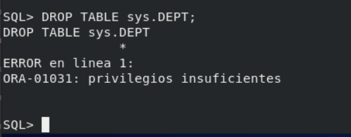
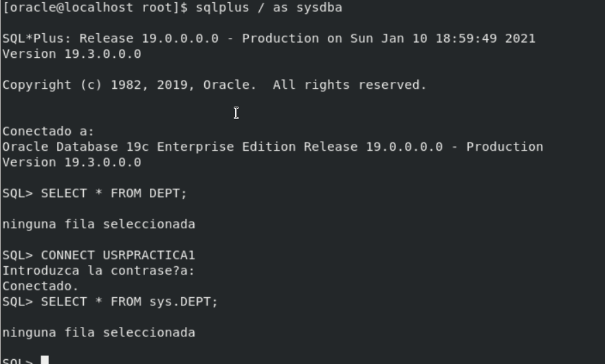
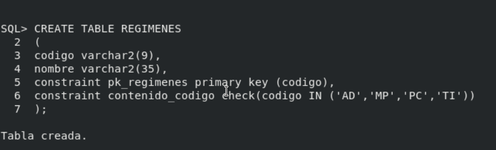
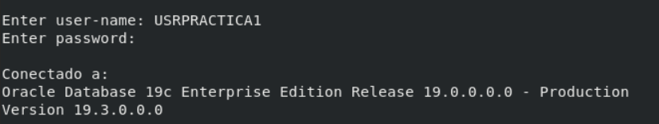

# Práctica Usuarios

## Oracle

Antes de nada, para poder usar Oracle, debemos realizar los siguientes pasos:

- Como usuario de Oracle, ejecutar en la terminal ```source ~/.bash_profile```.

- ```lsnrctl start```

- sqlplus / as sysdba

- startup

- ALTER SESSION SET "_ORACLE_SCRIPT"=true;

1. Crea un rol ROLPRACTICA1 con los privilegios necesarios para conectarse a 
la base de datos, crear tablas y vistas e insertar datos en la tabla EMP de 
SCOTT.

```
SQL> CREATE ROLE ROLPRACTICA1;

Rol creado.

SQL> GRANT CREATE SESSION TO ROLPRACTICA1;

Concesión terminada correctamente.

SQL> GRANT CREATE TABLE, CREATE VIEW TO ROLPRACTICA1;

Concesion terminada correctamente.

SQL> GRANT INSERT ON EMP TO ROLPRACTICA1;

Concesion terminada correctamente.
```

2. Crea un usuario USRPRACTICA1 con el tablespace USERS por defecto y 
averigua que cuota se le ha asignado por defecto en el mismo. Sustitúyela por 
una cuota de 1M.

```
SQL> CREATE USER USRPRACTICA1
  2  IDENTIFIED BY "V3ryStr@ng"
  3  DEFAULT TABLESPACE USERS;

Usuario creado.
```

Al no especificarle una cuota al usuario, este no tiene cuota asignada y por
lo tanto no podrá crear objetos en el tablespace.

Para modificarla, usaremos el siguiente comando:

```
SQL> ALTER USER USRPRACTICA1
  2  QUOTA 1M ON USERS;

Usuario modificado.
```

3. Modifica el usuario USRPRACTICA1 para que tenga cuota 0 en el tablespace 
SYSTEM.

```
SQL> ALTER USER USRPRACTICA1 
  2  QUOTA 0 ON SYSTEM;

Usuario modificado.
```

4. Concede a USRPRACTICA1 el ROLPRACTICA1.

```
SQL> GRANT ROLPRACTICA1 TO USRPRACTICA1;

Concesion terminada correctamente.
```

5. Concede a USRPRACTICA1 el privilegio de crear tablas e insertar datos en el 
esquema de cualquier usuario. Prueba el privilegio. Comprueba si puede 
modificar la estructura o eliminar las tablas creadas.

En este caso, debemos asignarle los permisos al rol, y no al usuario:

```
SQL> GRANT CREATE ANY TABLE, INSERT ANY TABLE TO USRPRACTICA1;

Concesion terminada correctamente.
```

No se pueden borrar las tablas creadas puesto que carecemos de privilegios.

6. Concede a USRPRACTICA1 el privilegio de leer la tabla DEPT de SCOTT con la 
posibilidad de que lo pase a su vez a terceros usuarios.

```
SQL> GRANT SELECT ON DEPT TO USRPRACTICA WITH GRANT OPTIONS;

Concesion terminada correctamente.
```

7. Comprueba que USRPRACTICA1 puede realizar todas las operaciones previstas 
en el rol.







8. Quita a USRPRACTICA1 el privilegio de crear vistas. Comprueba que ya no 
puede hacerlo.

```
SQL> REVOKE CREATE ANY VIEW FROM USRPRACTICA1;

Revocacion terminada correctamente.
```

9. Crea un perfil NOPARESDECURRAR que limita a dos el número de minutos de 
inactividad permitidos en una sesión.

```
SQL> CREATE PROFILE NOPARESDECURRAR LIMIT
  2  IDLE_TIME 2;

Perfil creado.
```
10. Activa el uso de perfiles en ORACLE.

No sé a que se refiere dicha cuestión, pero el uso de los perfiles en Oracle
viene activado de manera predeterminada.

11. Asigna el perfil creado a USRPRACTICA1 y comprueba su correcto 
funcionamiento.

```
SQL> ALTER USER USRPRACTICA1 PROFILE NOPARESDECURRAR;

Usuario modificado.
```

12. Crea un perfil CONTRASEÑASEGURA especificando que la contraseña caduca 
mensualmente y sólo se permiten tres intentos fallidos para acceder a la 
cuenta. En caso de superarse, la cuenta debe quedar bloqueada indefinidamente.

```
SQL> CREATE PROFILE CONTRASENASEGURA LIMIT
  2  PASSWORD_REUSE_TIME 30
  3  FAILED_LOGIN_ATTEMPTS 3;

Perfil creado.
``` 

13. Asigna el perfil creado a USRPRACTICA1 y comprueba su funcionamiento. 
Desbloquea posteriormente al usuario.

```
SQL> ALTER USER USRPRACTICA1 PROFILE CONTRASENASEGURA;

Usuario modificado.
```

14. Consulta qué usuarios existen en tu base de datos.

De entre todos los usuarios creados automáticamente, está nuestro usuario
creado anteriormente:

```
SQL> SELECT * FROM ALL_USERS;

USERNAME	USER_ID		CREATED		COM O INH	DEFAULT_COLLATION	IMP	ALL
------------------------------------------------------------------------------------------------------------------------------------------------

USRPRACTICA1	106		04/01/21	YES Y NO	USING_NLS_COMP		NO	NO
```

15. Elige un usuario concreto y consulta qué cuota tiene sobre cada uno de 
los tablespaces.

Elegimos el usuario creado anteriormente "USRPRACTICA1":

```
SQL> SELECT SUBSTR(USERNAME,1,15), TABLESPACE_NAME, MAX_BYTES
  2  FROM DBA_TS_QUOTAS
  3  WHERE USERNAME IN ('SYS','SYSTEM','USRPRACTICA1');

SUBSTR(USERNAME,1,15)		TABLESPACE_NAME		MAX_BYTES
------------------------------------------------------------------------------

USRPRACTICA1			USERS			1048576
```

16. Elige un usuario concreto y muestra qué privilegios de sistema tiene 
asignados.

```
SQL> SELECT GRANTED_ROLE
  2  FROM DBA_ROLE_PRIVS
  3  WHERE GRANTEE='USRPRACTICA1';

GRANTED_ROLE
------------------------

ROLPRACTICA1

SQL> SELECT * FROM DBA_SYS_PRIVS WHERE GRANTEE='USRPRACTICA1';

GRANTEE		PRIVILEGE		ADM	COM	INH
--------------------------------------------------------------

USRPRACTICA1	CREATE ANY TABLE	NO	YES	NO
USRPRACTICA1	INSERT ANY TABLE	NO	YES	NO
```

17. Elige un usuario concreto y muestra qué privilegios sobre objetos tiene 
asignados.

```
SQL> SELECT PRIVILEGE, TABLE_NAME FROM DBA_TAB_PRIVS
  2  WHERE GRANTEE='USRPRACTICA1';

PRIVILEGE               TABLE_NAME
-------------------------------------
SELECT                  DEPT
```

18. Consulta qué roles existen en tu base de datos.

```
SQL> SELECT COUNT(GRANTED_ROLE) FROM DBA_ROLE_PRIVS;

COUNT(GRANTED_ROLE)
--------------------
	158

```

Siendo alguno de los roles: JAVA_ADMIN, JAVAUSERPRIV, OLAP_DBA, JAVADEBUGPRIV,...

19. Elige un rol concreto y consulta qué usuarios lo tienen asignado.

```
SQL> SELECT GRANTEE
  2  FROM DBA_ROLE_PRIVS
  3  WHERE GRANTED_ROLE='ROLPRACTICA1';

GRANTEE
---------------

USRPRACTICA1
SYS
```

20. Elige un rol concreto y averigua si está compuesto por otros roles o no.

```
SQL> SELECT GRANTEE,GRANTED_ROLE
  2  FROM DBA_ROLE_PRIVS
  3  WHERE GRANTEE IN ('CONNECT','RESOURCE','DBA');

GRANTEE			GRANTED_ROLE
-------------------------------------------

DBA			EXECUTE_CATALOG_ROLE
DBA			DATAPUMP_IMP_FULL_DATABASE
DBA			SCHEDULER_ADMIN
DBA			XDBADMIN
DBA			OLAP_DBA
DBA			CAPTURE_ADMIN
DBA			SELECT_CATALOG_ROLE
DBA			DATAPUMP_EXP_FULL_DATABASE
DBA			WM_ADMIN_ROLE
DBA			EXP_FULL_DATABASE
DBA			XDB_SET_INVOKER
DBA			JAVA_ADMIN
DBA			OLAP_XS_ADMIN
```

21. Consulta qué perfiles existen en tu base de datos.

```
SQL> SELECT DISTINCT SUBSTR(PROFILE,1,12) PERFIL, SUBSTR(RESOURCE_NAME,1,25)
  2  FROM DBA_PROFILES;

PERFIL
-----------------
NOPARESDECUR
DEFAULT
ORA_STIG_PRO
CONTRASENASE
```

22. Elige un perfil y consulta qué límites se establecen en el mismo.

```
SQL> SELECT RESOURCE_NAME, LIMIT
  2  FROM DBA_PROFILES
  3  WHERE PROFILE='NOPARESDECURRAR';

RESOURCE_NAME			LIMIT		
--------------------------------------------
COMPOSITE_LIMIT			DEFAULT
SESSIONS_PER_USER		DEFAULT
CPU_PER_SESSION			DEFAULT
CPU_PER_CALL			DEFAULT
LOGICAL_READS_PER_SESSION	DEFAULT
LOGICAL_READS_PER_CALL		DEFAULT
IDLE_TIME			2
CONNECT_TIME			DEFAULT
PRIVATE_SGA			DEFAULT
FAILED_LOGIN_ATTEMPTS		DEFAULT
PASSWORD_LIFE_TIME		30
PASSWORD_REUSE_TIME		DEFAULT
PASSWORD_REUSE_MAX		DEFAULT
PASSWORD_VERIFY_FUNCTION	DEFAULT
PASSWORD_LOCK_TIME		DEFAULT
PASSWORD_GRACE_TIME		DEFAULT
INACTIVE_ACCOUNT_TIME		DEFAULT
```

23. Muestra los nombres de los usuarios que tienen limitado el número de 
sesiones concurrentes.

```
SQL> SELECT USERNAME
  2  FROM DBA_USERS
  3  WHERE PROFILE IN (SELECT PROFILE
  4  FROM DBA_PROFILES
  5  WHERE RESOURCE_NAME='SESSIONS_PER_USER' AND LIMIT!='DEFAULT');

USERNAME
------------------------------

CTXSYS
SI_INFORMTN_SCHEMA
AUDSYS
ORACLE_OCM
GSMUSER
DVSYS
DVF
ORDDATA
SYS$UMF
SYSDG
APPQOSSYS
SYSBACKUP
ANONYMOUS
SYSRAC
OJVMSYS
MDSYS
SYSKM
GSMADMIN_INTERNAL
WMSYS
GSMROOTUSER
DIP
SYS
SYSTEM
GGSYS
ORDSYS
XS$NULL
GSMCATUSER
MDDATA
DBSFWUSER
ORDPLUGINS
OLAPSYS
LBACSYS
OUTLN
DBSNMP
REMOTE_SCHEDULER_AGENT
XDB
```

24. Realiza un procedimiento que reciba un nombre de usuario y un privilegio 
de sistema y nos muestre el mensaje 'SI, DIRECTO' si el usuario tiene ese 
privilegio concedido directamente, 'SI, POR ROL' si el usuario tiene ese 
privilegio en alguno de los roles que tiene concedidos y un 'NO' si el usuario 
no tiene dicho privilegio.

```
SQL> CREATE OR REPLACE FUNCTION rolusuario
  2  (p_nombreusuario GRANTEE.DBA_ROLE_PRIVS%TYPE)
  4  RETURN NUMBER
  5  IS
  6  v_rolsi NUMBER:=0;
  7  BEGIN
  8  SELECT COUNT(GRANTEE) INTO v_rolsi
  9  FROM DBA_ROLE_PRIVS
 10  WHERE p_nombreusuario=GRANTEE;
 11  RETURN v_rolsi;
 12  END rolusuario;
 13  /

SQL> CREATE OR REPLACE PROCEDURE privilegusuario 
  2  (p_nombreusuario GRANTEE.DBA_SYS_PRIVS%TYPE, 
  3  p_privilegio PRIVILEGE.DBA_SYS_PRIVS%TYPE) IS
  4  v_cuenta NUMBER:=0;
  5  v_rol NUMBER:=0;
  6  BEGIN
  7  v_rol = rolusuario(p_nombreusuario);
  7  SELECT COUNT(GRANTEE) INTO v_cuenta
  8  FROM DBA_SYS_PRIVS
  9  WHERE p_nombreusuario=GRANTEE AND p_privilegio=PRIVILEGE;
 10  IF v_cuenta !=0 THEN
 11  dbms_output.put_line("SI,DIRECTO");
 12  ELSIF v_cuenta=0 AND v_rol!=0 THEN
 13  dbms_output.put__line("SI,ROL");
 14  ELSE
 15  dbms_output.put_line("NO");
 16  END privilegusuario;
 17  /
```

25. Realiza un procedimiento llamado MostrarNumSesiones que reciba un nombre 
de usuario y muestre el número de sesiones concurrentes que puede tener abiertas
como máximo y las que tiene abiertas realmente.

```
SQL> CREATE OR REPLACE PROCEDURE MostrarNumSesiones
  2  (p_nombreusuario GRANTEE.DBA_SYS_PRIVS%TYPE)
  3  IS
  4  v_maxsesiones VARCHAR2(10);
  5  BEGIN
  6  SELECT PROFILE INTO v_maxsesiones
  7  FROM DBA_USERS
  8  WHERE p_nombreusuario=USERNAME;
  9  IF v_maxsesiones='DEFAULT' THEN
 10  dbms_output.put_line("El número máximo de sesiones es ilimitado de manera predeterminada");
 11  ELSE
 12  dbms_output_line("El número máximo de sesiones es" || v_maxsesiones);


 SELECT USERNAME
  2  FROM DBA_USERS
  3  WHERE PROFILE IN (SELECT PROFILE
  4  FROM DBA_PROFILES
  5  WHERE RESOURCE_NAME='SESSIONS_PER_USER' AND LIMIT!='DEFAULT');

```

26. (ORACLE, Postgres) Realiza un procedimiento que reciba dos nombres de 
usuario y genere un script que asigne al primero los privilegios de inserción 
y modificación sobre todas las tablas del segundo, así como el de ejecución 
de cualquier procedimiento que tenga el segundo usuario.

```

```

## Postgres

27. Averigua que privilegios de sistema hay en Postgres y como se asignan a 
un usuario.

```
                                   List of roles
 Role name |                         Attributes                         | Member of 
-----------+------------------------------------------------------------+-----------
 manuel    | Superuser, Create role, Create DB                          | {}
 postgres  | Superuser, Create role, Create DB, Replication, Bypass RLS | {}

```

Para asignar privilegios, se hace de la misma manera que en ORACLE, y con la
misma sintaxis:

```
bbddprueba=# GRANT SELECT ON ALL TABLES IN SCHEMA public TO manuel;
GRANT
```

28. Averigua cual es la forma de asignar y revocar privilegios sobre una 
tabla concreta en Postgres.

Anteriormente, le he puesto un ejemplo con referencia a una tabla en concreto,
así que lo siguiente es la revocación:

```
bbddprueba=# GRANT SELECT ON TABLE temporadas TO manuel;
GRANT
bbddprueba=# REVOKE SELECT ON TABLE temporadas FROM manuel;
REVOKE
```

29. Averigua si existe el concepto de rol en Postgres y señala las diferencias
con los roles de ORACLE.

Si existe el concepto de rol en Postgresql y la diferencia fundamental es que
los roles en Oracle se usan como un conjunto de privilegios que puedes 
asignarselo a un usuario para administrar las bases de datos, mientras que un 
rol en Postgresql es una entidad en sí que puede tener objetos y base de datos
(con sus respectivos privilegios).

30. Averigua si existe el concepto de perfil como conjunto de límites sobre 
el uso de recursos o sobre la contraseña en Postgres y señala las diferencias 
con los perfiles de ORACLE.

Postgres no tiene nada similar a los perfiles como Oracle, lo único similar
son algunas de las características que se pueden implementar en los roles de
los mismos como _CONNECTION LIMIT_ o _VALID UNTIL_.

31. Realiza consultas al diccionario de datos de Postgres para averiguar 
todos los privilegios que tiene un usuario concreto.

```
bbddprueba=# SELECT PRIVILEGE_TYPE
bbddprueba-# FROM information_schema.role_table_grants
bbddprueba-# WHERE GRANTEE='manuel';
 privilege_type 
----------------
 SELECT
(1 row)

```

32. Realiza consultas al diccionario de datos en Postgres para averiguar qué 
usuarios pueden consultar una tabla concreta.

```
bbddprueba=# SELECT GRANTEE
bbddprueba-# FROM information_schema.role_table_grants
bbddprueba-# WHERE TABLE_NAME='temporadas';
 grantee  
----------
 postgres
 postgres
 postgres
 postgres
 postgres
 postgres
 postgres
 manuel
(8 rows)

```
