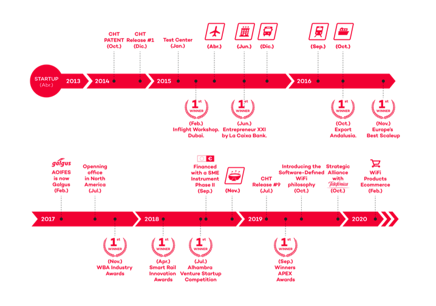

# Empresa de éxito / Tipo de innovación

En esta tarea, vamos a realizar la búsqueda de una empresa de éxito y explicar
lo siguiente en una pequeña presentación:

* **Introducción** --> breve introducción a la empresa (historia, mercados,
productos que ofrece, fundador, etc.)

* **Idea innovadora** --> Utilizando la teoría vista en clase, vamos a analizar
la idea innovadora que esta empresa ha desarrollado.

* **Tipo de innovación** --> de producto, proceso o tecnológica.

# GALGUS

Galgus es una empresa tecnológica sevillana, fundada por José González
(actualmente CEO de la empresa),que ofrece redes WiFi de alto rendimiento 
por todo el mundo, especializada en la investigación y desarrollo de 
dichas tecnologías para ambientes de gran densidad de usuarios.  

Sus valores son:

1. **Profesionalidad** --> son un equipo cualificado, especializado y 
comprometido.

2. **Voluntad para enfrentar desafíos** --> preparados para comprender y
responder rápidamente a las necesidades y demandas del mercado.

3. **Actitud de "Puede hacerse"** --> seguros de su habilidad para lidiar con los
problemas y lograr el éxito de cada proyecto.

4. **Búsqueda incansable de resultados** --> comprometidos con los proyectos de
los clientes hasta su finalización.

## Cronología de su empresa

Su producto más comercializado es el CHT (Cognitive Hotspot Technology), una
herramienta que optimiza la eficiencia espectral de puntos de acceso WiFi y 
routers, aumentando el rendimiento WiFi hasta en 5 veces, reduciendo el 
consumo de energía y las interferencias en el aire.

Su actuación es meramente en el mercado vertical.

Algunos de sus clientes habituales son Telefónica, Barceló hotel group,
ACKSYS, Nomad Digital o Eltec Systems.
