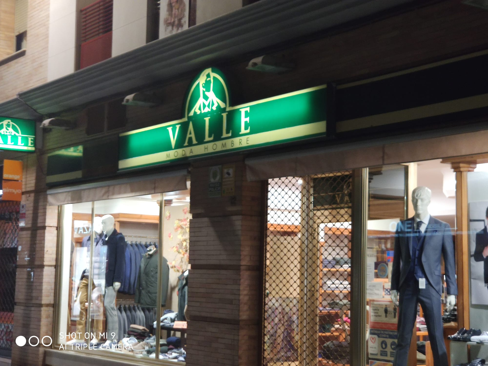
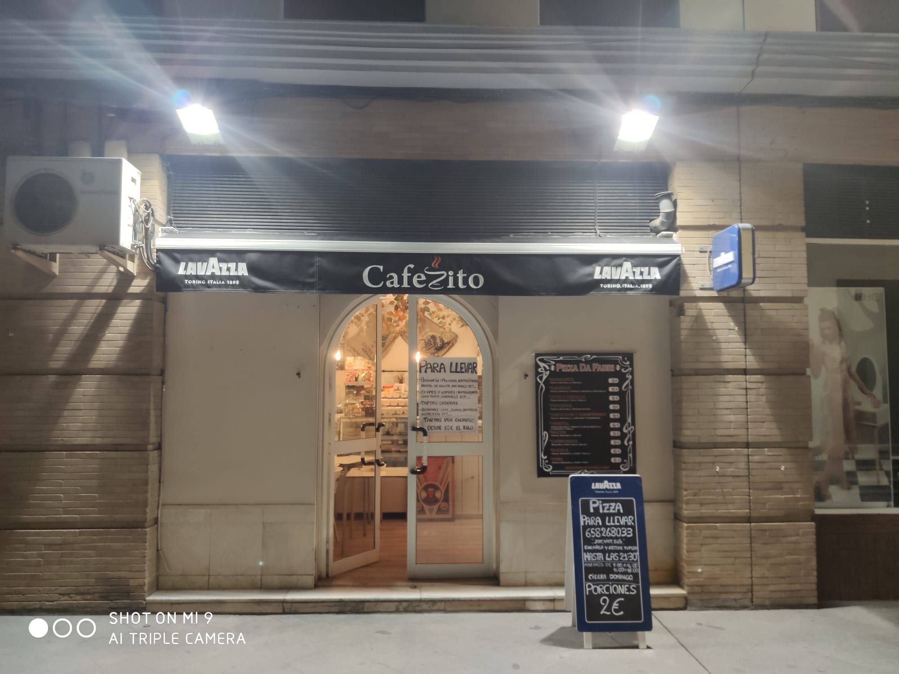
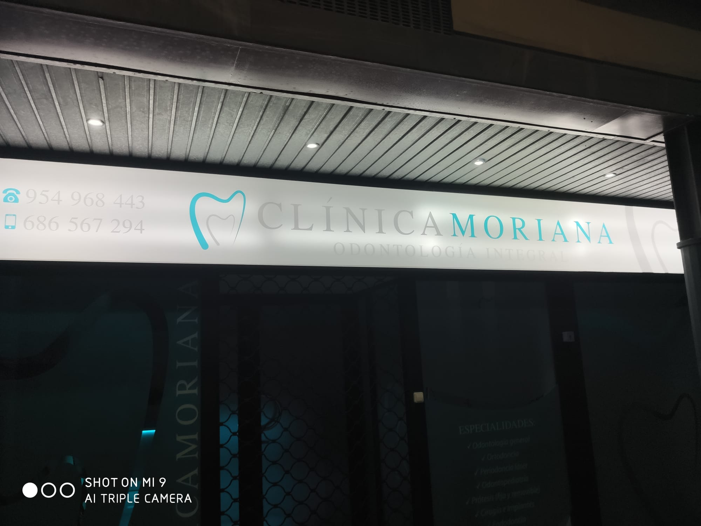
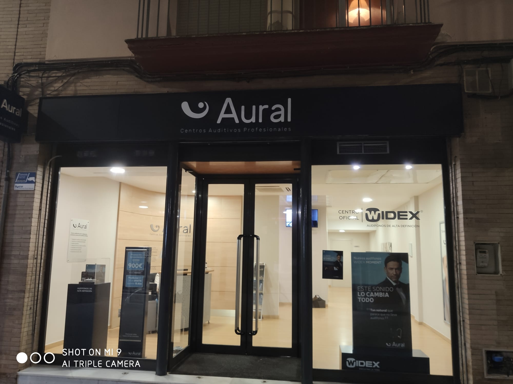

Añade una foto de la imagen de un comercio o negocio de la zona donde residas, 
realizando un análisis de la misma. Comenta qué tipo de información te aporta, 
si tiene relación con el producto o servicio que oferta, si te parece adecuada 
o añadirías/eliminarías algo.

* Primera tienda: **Tienda Valle: Moda Hombre**

Esta tienda vende exclusivamente ropa de hombre, por lo tanto, se ajusta en
gran parte a la información añadida en el rótulo de la tienda. En el logo 
se alza la figura de un hombre, escarpado como una montaña, el cual va a vestir
su ropa, en lo que sería la depresión de esa misma montaña. 

En el diseño, se utiliza mucho los vértices y las puntas para reflejar un 
aspecto agresivo/dominante o dinamismo/surspicacia, siendo el punto contrario
los circulos que se asocian como algo amigable/bonito.

Los colores usados son el marfil usado en los perfiles y en el nombre
de la tienda, y verde en todo lo demás. El verde oscuro se usa en el fondo para
resaltar el nombre y la figura del hombre, como haría la ropa llevada en una
persona.

* Segunda tienda: **Cafecito**

Esta cafetería llamada Cafecito, muestra de manera clara una parte de los 
productos que venden. Por una parte, nos muestra que venden cafés (además
de lo típicos dulces que se pueden comprar en una cafetería), pero por la otra
también ofrecen un servicio de comida a domicilio/comer en el local de pizzas.

Si investigamos un poco más, en los laterales del toldo podemos encontrar el
nombre LAVAZZA. Lavazza es una empresa comerciante de café italiano, por lo 
tanto, se podría en cierta parte, aceptar el hecho de que vendan pizzas, puesto
que son una comida popular de allí.

El toldo de color negro representa en cierta parte, el color del café recién
hecho, el cual en su forma de grano marrón, al mezclarse con el agua, 
adquieren el tono ennegrecido que conocemos. Además, la letra C del nombre
de la cafetería se ve representada por una imagen de una taza de café.
Ese café tiene mucho parecido al logotipo de Java.

* Tercera tienda: **Clínica Moriana**

Esta clínica de odontología, cuyo logo es una muela, representa con claridad 
lo que su servicio ofrece. Con colores con una tonalidad clara, como puede ser
el blanco, gris o turquesa, se usan para tranquilizar en ambientes de 
"tensión". 

Aparte, estos colores destacan en las calles o por la noche, dando
un contraste con el habitual escaparate semi-opaco, para dar privacidad
a los clientes. 

El logo de la muela, representa en parte el tratamiento del sistema estogmático 
de los odontólogos. 

* Cuarta tienda: **Aural: Centros Auditivos Profesionales**

El logotipo representa un audífono, que en grante parte representa a esta tienda
ya que el servicio que ofrece es el tratamiento de los problemas auditivos a 
través de estos aparatos.

El interior de la tienda está hecha especialmente, para que la voz adquiera
una gran resonancia, ya que la altura y el espacio vacío provoca esta sensación.

Los colores que se muestran en el logo y el rótulo, muestran el antes y el 
después del cliente. El fondo negro representa la falta de audición del cliente
al entrar al establecimiento, y el blanco representa la claridad auditiva 
del cliente cuando utiliza el audífono de dicha marca.
