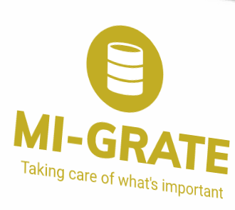

# Plan de Marketing


A) **Descripción del Mercado**

El servicio de migración de datos, está especialmente dirigida hacia
medianas y grandes empresas, que buscan una manera de ahorrar costes en la 
migración y mantenimiento de sus bases de datos.

Con un total de 506.080 empresas que desarrollaron su actividad económica en
Andalucía según el instituto de Estadística y Cartografía de la Junta, 
alrededor del 97,7% son PYMES, y el otro porcentaje son de grandes empresas.

Se calcula que tendríamos aproximadamente del 10-15% de clientes potenciales,
siendo un 2,3% de grandes empresas (11640 clientes). Los posibles
prescriptores serían los CEOs o los CMs de las empresas. Debido a que
nuestro servicio es una actividad que no se realiza de cara al público, se
espera que no haya mucho interés por parte de los prescriptores.

Se espera mayor actividad de clientes entre las fechas del 22 de Junio al 
22 de Septiembre, período en el cual, alrededor de un 18% de las empresas
cierran por vacaciones y un 45% de ellas reduce su actividad económica, momento
en el cual se aprovecharía la oportunidad para hacer dicho mantenimiento y
no perjudicar la actividad económica de nuestro cliente.


Basándonos en las necesidades de cada cliente, nuestro servicio satiface a 
cada cliente por igual.

Clientes potenciales: Page Group, Experis, ALTEN Spain, Everis Spain, entre otras.


B) **Descripción del Producto / Servicio**

Mi-Grate es un servicio que ofrece mantenimiento y migración de las bases de 
datos de nuestros clientes. 

Las empresas habitualmente, no tienen una persona o entidad que se ocupe de 
las tareas relacionadas con la gestión de los datos, y si la tienen, no son
especialistas en dicha labor. Una mala gestión de los datos de una empresa
puede provocar desde un desajuste en la contabilidad, pérdida de clientela 
o hasta pérdidas con valor de un 20% de las ganancias anuales.

Eso mismo es lo que queremos evitar a toda costa, ofreciendo diferentes
planes personalizados según el cliente. Nuestros planes fijos solo dan una
idea del precio aproximado, siempre a tener en cuenta las funcionalidades que
quiera cada cliente. 

Trabajamos bajo demanda, y en la primera toma de contacto con el cliente, se le
ofrecerá la posibilidad de que alguno de nuestros expertos midan la cantidad 
de trabajo que llevará el mantenimiento y/o otra funcionalidad para fijar una
fecha aproximada de finalización del servicio.

Cuando nuestro servicio es contratado, se firmará un acuerdo de
confidencialidad para que nuestro cliente quede protegido en todo momento,
además de poner a disposición del mismo un número de contacto de atención al
cliente disponible 24h.

Mi-Grate se encuentra en el inicio del que se espera una larga vida en el sector
de los administradores de bases de datos. Gracias al apoyo de sus trabajadores
expertos en la gestión de datos, se espera que no haya competidor alguno.


C) **Política de Precios**

Mi-Grate ofrece dos planes indicativos, los cuales se pueden adaptar a las 
necesidades del cliente:

* **Plan básico de gestión**:

Este plan incluye las siguientes tareas:

* Decidir el SGBD idóneo, instalación y configuración.

* Supervisión del diseño lógico del mismo.

* Realizar el diseño físico de la base de datos, es decir, estructura de
almacenamiento.

* Creación del esquema del mismo.

* Creación de cuentas de usuarios y gestión de los mismos.

* Detección y resolución de problemas de rendimiento de la BD usando
herramientos de monitorización.


* **Plan avanzado de gestión**:

* Los servicios anteriores.

* Realización de copias de seguridad y auditorias de seguridad.

* Migraciones e importaciones/ exportaciones.

* Recuperación de instancias dañadas.

* Instalación y configuración middleware de la BD.

No seguimos una estrategias de precios directa, sino un mix de varias.
Como nuestros servicios se ofrecen en planes con varios de ellos, una parte de
nuestra estrategia se basa en la fijación de precios para paquetes de
productos/servicios o combos. Otra parte de nuestra estrategia de precios es la
fijación de ellos mediante la segmentación, con el lema:

> Las compañías venderán el producto adecuado a los consumidores adecuados en
> el tiempo adecuado por el precio adecuado.

Por último y no menos importante, la fijación de precios por producto opcional.


* Para calcular el margen de beneficio deberemos usar la siguiente fórmula:

```
Beneficio / Ingresos * 100% = Margen de beneficio
```

Esperamos un margen de beneficio del 75%, es decir, de cada euro de ingreso, 
nuestra empresa obtiene 75 céntimos de ganancia.

Mientras tanto, para evaluar la rentabilidad de la empresa, debemos profundizar
un poco más y observar el margen de beneficio bruto. Así es como se calcula:

```
(Ingresos - Costo de los bienes vendidos) / Ingresos = Margen de beneficio bruto
```

* Un elemento cobrado en el precio de nuestros servicios es el coste de asesoría
y notaria.

* Nuestros servicios se pagan mensualmente, con la opción de pago trimestral.
Ha de pagarse todo mediante transferencia bancaria. Un anticipo del
pago ha de hacerse para asegurar la compra del servicio, a pagar lo restante
cuando el servicio contratado haya terminado.


D) **Política de Comunicación**

Algunas de las promociones ofrecidas serán:

* Campañas de promoción conjuntas, en la que participamos con otras marcas, 
sobretodo relacionadas con el marketing, y/o Big Data.

* Cupones descuento al contratar nuestros servicios de manera continuada.


Por otra parte, la mayor parte de nuestra publicidad se realizará mediante la
publicidd en RRSS y el email marketing. Estos canales son los más usados y los
que mejor se adaptan a nuestra audiencia. El email marketing además nos
ofrecerá la oportunidad de conseguir nuevos leads que se convertirán en 
clientes potenciales.

Se usará Facebook y Twitter como redes sociales de contacto directo, y la
plataforma de Youtube, para una forma de venta más pasiva.

Nuestros clientes tendrán acceso a nuestra página web, en la cuál podrán ver
quiénes somos y a que nos dedicamos, nuestras políticas, experiencias y 
testimonios reales de clientes satisfechos por nuestro trabajo y las
maneras de contactar con nosotros y nuestros asesores.

Durante todo el año, participamos en varios meetups y siempre que podemos,
intentamos asistir a diferentes encuentros en ecosistemas de emprendimiento
como puede Andalucía Open Future, para aconsejar a nuevas incorporaciones al
mercado, y si es posible, para nuevas colaboraciones.


E) Marca

El nombre de nuestra marca, define en cierta parte, algunas de nuestros 
servicios, y la definición del mismo refleja adecuadamente nuestra misión,
visión y valores.

Nuestro slogan: ```Taking care of what's important```

Nuestro logotipo, el siguiente:



Queremos que nuestros clientes se sientan seguros, confiando el manejo de sus
datos en nuestras manos. Aunque seamos jóvenes, queremos que sepan que somos
profesionales en el sector y que cuentan con la mayor de las seguridades.

F) **Plan de Ventas:**

* Canales de comercialización: se hará de manera directa en nuestro local, o en
una ubicación acordada entre las dos partes. No requeriremos de la acción de 
distribuidores.

* Relación con el cliente: debido a la naturaleza de nuestros servicios,
existen varios modos de comunicación. Desde nuestra página web con nuestro 
asistente online, hasta la presencialidad en diferentes eventos, buscamos
abarcar todas las formas posibles de comunicación con nuestros clientes, para
así, mantener una relación de confianza y profesionalidad.

* Fuentes de ingresos: nuestros ingresos provienen directamente de los 
servicios contratados y de los encargos de mantenimiento.


