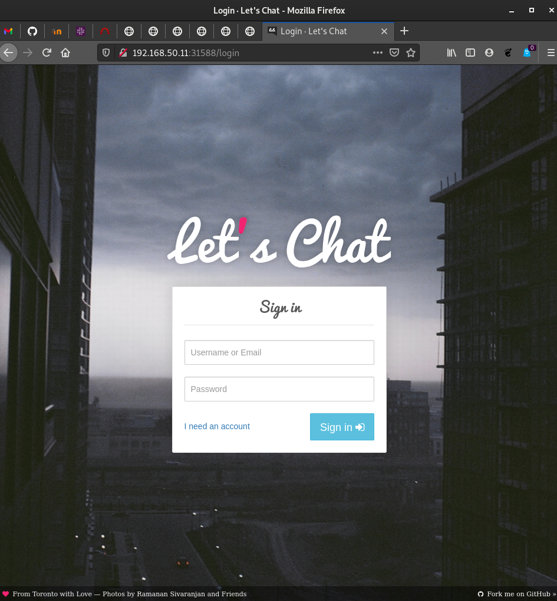

# Despliegue de un cluster de Kubernetes

* Elige un método de instalación para crear un cluster de k8s con tres nodos 
(un controlador y dos workers), puedes usar kubeadm, k3s o cualquier otra 
opción equivalente que encuentres.
   
* Describe en la tarea los pasos principales de la instalación y configuración 
del cluster.
   
* Configura kubectl adecuadamente para gestionar el cluster desde tu máquina, 
no desde el nodo controlador.
   
* Realiza un despliegue de la aplicación del ejemplo 8 del curso:
_https://github.com/iesgn/kubernetes-storm/tree/master/unidad3/ejemplos-3.2/ejemplo8_.
   
* Comprueba que es posible escalar a varias réplicas el despliegue del 
componente letschat y funciona correctamente el componente ingress.


## Configuración del espacio de trabajo

Crearemos un directorio en nuestra máquina física que funcionará como espacio de
trabajo para ubicar nuestro escenario Vagrant. 

``` 
manuel@debian:~/Vagrant/Kubernetes$ nano Vagrantfile

# -*- mode: ruby -*-
# vi: set ft=ruby :

IMAGE_NAME = "bento/ubuntu-16.04"
N = 2

Vagrant.configure("2") do |config|
    config.ssh.insert_key = false

    config.vm.provider "virtualbox" do |v|
        v.memory = 3072
        v.cpus = 2
    end

    config.vm.define "k8s-master" do |master|
        master.vm.box = IMAGE_NAME
        master.vm.network "private_network", ip: "192.168.50.10"
        master.vm.hostname = "k8s-master"
        master.vm.provision "ansible" do |ansible|
            ansible.playbook = "kubernetes-setup/master-playbook.yml"
            ansible.extra_vars = {
                node_ip: "192.168.50.10",
            }
        end
    end

    (1..N).each do |i|
        config.vm.define "node-#{i}" do |node|
            node.vm.box = IMAGE_NAME
            node.vm.network "private_network", ip: "192.168.50.#{i + 10}"
            node.vm.hostname = "node-#{i}"
            node.vm.provision "ansible" do |ansible|
                ansible.playbook = "kubernetes-setup/node-playbook.yml"
                ansible.extra_vars = {
                    node_ip: "192.168.50.#{i + 10}",
                }
            end
        end
    end
end
```

En este escenario vamos a crear una máquina llamada _k8s-master_ en una red 
privada, en el cual instalará ansible y ejecutará el _playbook_ llamado
_master-playbook_. Hará lo mismo con las dos máquinas _node_ pero con el
_playbook_ llamado _node-playbook.yml_.

Creamos ambos _playbooks_ y los meteremos en un directorio llamado
_kubernetes-setup_:

```
manuel@debian:~/Vagrant/Kubernetes/kubernetes-setup$ nano master-playbook.yml 

---
- hosts: all
  become: true
  tasks:
  - name: Instala los paquetes que permite usar APT con HTTPS
    apt:
      name: "{{ packages }}"
      state: present
      update_cache: yes
    vars:
      packages:
      - apt-transport-https
      - ca-certificates
      - curl
      - gnupg-agent
      - software-properties-common

  - name: Añade la clave apt para Docker
    apt_key:
      url: https://download.docker.com/linux/ubuntu/gpg
      state: present

  - name: Añade el repositorio apt de la versión estable
    apt_repository:
      repo: deb [arch=amd64] https://download.docker.com/linux/ubuntu xenial stable
      state: present

  - name: Instala Docker y sus dependencias
    apt: 
      name: "{{ packages }}"
      state: present
      update_cache: yes
    vars:
      packages:
      - docker-ce 
      - docker-ce-cli 
      - containerd.io
    notify:
      - docker status

  - name: Añade al usuario vagrant al grupo de docker
    user:
      name: vagrant
      group: docker

  - name: Elimina el fichero swap de /etc/fstab
    mount:
      name: "{{ item }}"
      fstype: swap
      state: absent
    with_items:
      - swap
      - none

  - name: Deshabilita el swap
    command: swapoff -a
    when: ansible_swaptotal_mb > 0

  - name: Añade la clave apt para Kubernetes
    apt_key:
      url: https://packages.cloud.google.com/apt/doc/apt-key.gpg
      state: present

  - name: Añade el repositorio apt para Kubernetes
    apt_repository:
      repo: deb https://apt.kubernetes.io/ kubernetes-xenial main
      state: present
      filename: kubernetes.list

  - name: Instala los binarios de Kubernetes
    apt: 
      name: "{{ packages }}"
      state: present
      update_cache: yes
    vars:
      packages:
        - kubelet 
        - kubeadm 
        - kubectl

  - name: Configura el node ip
    lineinfile:
      path: /etc/default/kubelet
      line: KUBELET_EXTRA_ARGS=--node-ip={{ node_ip }}
      create: yes

  - name: Reinicia kubelet
    service:
      name: kubelet
      daemon_reload: yes
      state: restarted

  - name: Reinicia Docker
    systemd:
     name: docker
     state: restarted

  - name: Inicializa el cluster de Kubernetes usando kubeadm
    command: kubeadm init --apiserver-advertise-address="192.168.50.10" --apiserver-cert-extra-sans="192.168.50.10" --pod-network-cidr=192.168.0.0/16 --node-name k8s-master

  - name: Organiza el kubeconfig del usuario vagrant
    command: "{{ item }}"
    with_items:
     - mkdir -p /home/vagrant/.kube
     - cp -i /etc/kubernetes/admin.conf /home/vagrant/.kube/config
     - chown vagrant:vagrant /home/vagrant/.kube/config

  - name: Instala el pod de red Calico
    become: false
    command: kubectl create -f https://docs.projectcalico.org/manifests/tigera-operator.yaml

  - name: Instala el pod de red Calico 2
    become: false
    command: kubectl create -f https://docs.projectcalico.org/manifests/custom-resources.yaml

  - name: Genera el comando de join
    command: kubeadm token create --print-join-command
    register: join_command
    

  - name: Copia el comando de join a un fichero local
    become: false
    local_action: copy content="{{ join_command.stdout_lines[0] }}" dest="./join-command"

  handlers:
    - name: docker status
      service: name=docker state=started
```

Lo que hace cada tarea está propiamente explicado en el _playbook_.

Para los nodos tendremos el fichero _node-playbook.yml_ que tiene el siguiente
contenido:

```
---
- hosts: all
  become: true
  tasks:
  - name: Instala los paquetes que permite usar APT con HTTPS
    apt:
      name: "{{ packages }}"
      state: present
      update_cache: yes
    vars:
      packages:
      - apt-transport-https
      - ca-certificates
      - curl
      - gnupg-agent
      - software-properties-common

  - name: Añade la clave apt para Docker
    apt_key:
      url: https://download.docker.com/linux/ubuntu/gpg
      state: present

  - name: Añade el repositorio apt de la versión estable
    apt_repository:
      repo: deb [arch=amd64] https://download.docker.com/linux/ubuntu xenial stable
      state: present

  - name: Instala Docker y sus dependencias
    apt: 
      name: "{{ packages }}"
      state: present
      update_cache: yes
    vars:
      packages:
      - docker-ce 
      - docker-ce-cli 
      - containerd.io
    notify:
      - docker status

  - name: Añade al usuario vagrant al grupo de Docker
    user:
      name: vagrant
      group: docker

  - name: Elimina el fichero de swap de /etc/fstab
    mount:
      name: "{{ item }}"
      fstype: swap
      state: absent
    with_items:
      - swap
      - none

  - name: Deshabilita el swap
    command: swapoff -a
    when: ansible_swaptotal_mb > 0

  - name: Añade la clave apt para Kubernetes
    apt_key:
      url: https://packages.cloud.google.com/apt/doc/apt-key.gpg
      state: present

  - name: Añade el repositorio apt para Kubernetes
    apt_repository:
      repo: deb https://apt.kubernetes.io/ kubernetes-xenial main
      state: present
      filename: kubernetes.list

  - name: Instala los binarios para Kubernetes
    apt: 
      name: "{{ packages }}"
      state: present
      update_cache: yes
    vars:
      packages:
        - kubelet 
        - kubeadm 
        - kubectl

  - name: Configura node ip
    lineinfile:
      path: /etc/default/kubelet
      line: KUBELET_EXTRA_ARGS=--node-ip={{ node_ip }}
      create: yes

  - name: Reinicia kubelet
    service:
      name: kubelet
      daemon_reload: yes
      state: restarted

  - name: Reinicia Docker
    systemd:
     name: docker
     state: restarted

  - name: Copia el comando de join a la localización del server
    copy: src=join-command dest=/tmp/join-command.sh mode=0777

  - name: Une el nodo al clúster
    command: sh /tmp/join-command.sh

  handlers:
    - name: docker status
      service: name=docker state=started
```

Al igual que el anterior _playbook_, dentro del mismo están las explicaciones.

Teniendo ya configurado ambos ficheros, vamos a ejecutar el siguiente comando
para el despliegue automático:

```
manuel@debian:~/Vagrant/Kubernetes$ vagrant up
Bringing machine 'k8s-master' up with 'virtualbox' provider...
Bringing machine 'node-1' up with 'virtualbox' provider...
Bringing machine 'node-2' up with 'virtualbox' provider...
==> k8s-master: Importing base box 'bento/ubuntu-16.04'...
==> k8s-master: Matching MAC address for NAT networking...
==> k8s-master: Checking if box 'bento/ubuntu-16.04' version '202102.02.0' is up to date...
==> k8s-master: Setting the name of the VM: Kubernetes_k8s-master_1614700824154_25222
==> k8s-master: Clearing any previously set network interfaces...
==> k8s-master: Preparing network interfaces based on configuration...
    k8s-master: Adapter 1: nat
    k8s-master: Adapter 2: hostonly
==> k8s-master: Forwarding ports...
    k8s-master: 22 (guest) => 2222 (host) (adapter 1)
==> k8s-master: Running 'pre-boot' VM customizations...
==> k8s-master: Booting VM...
==> k8s-master: Waiting for machine to boot. This may take a few minutes...
    k8s-master: SSH address: 127.0.0.1:2222
    k8s-master: SSH username: vagrant
    k8s-master: SSH auth method: private key
==> k8s-master: Machine booted and ready!
==> k8s-master: Checking for guest additions in VM...
    k8s-master: The guest additions on this VM do not match the installed version of
    k8s-master: VirtualBox! In most cases this is fine, but in rare cases it can
    k8s-master: prevent things such as shared folders from working properly. If you see
    k8s-master: shared folder errors, please make sure the guest additions within the
    k8s-master: virtual machine match the version of VirtualBox you have installed on
    k8s-master: your host and reload your VM.
    k8s-master: 
    k8s-master: Guest Additions Version: 6.1.18
    k8s-master: VirtualBox Version: 6.0
==> k8s-master: Setting hostname...
==> k8s-master: Configuring and enabling network interfaces...
==> k8s-master: Mounting shared folders...
    k8s-master: /vagrant => /home/manuel/Vagrant/Kubernetes
==> k8s-master: Running provisioner: ansible...
Vagrant has automatically selected the compatibility mode '2.0'
according to the Ansible version installed (2.7.7).

Alternatively, the compatibility mode can be specified in your Vagrantfile:
https://www.vagrantup.com/docs/provisioning/ansible_common.html#compatibility_mode

    k8s-master: Running ansible-playbook...

PLAY [all] *********************************************************************

TASK [Gathering Facts] *********************************************************
ok: [k8s-master]

TASK [Install packages that allow apt to be used over HTTPS] *******************
changed: [k8s-master]

TASK [Add an apt signing key for Docker] ***************************************
changed: [k8s-master]

TASK [Add apt repository for stable version] ***********************************
changed: [k8s-master]

TASK [Install docker and its dependecies] **************************************
changed: [k8s-master]

TASK [Add vagrant user to docker group] ****************************************
changed: [k8s-master]

TASK [Remove swapfile from /etc/fstab] *****************************************
ok: [k8s-master] => (item=swap)
changed: [k8s-master] => (item=none)

TASK [Disable swap] ************************************************************
changed: [k8s-master]

TASK [Add an apt signing key for Kubernetes] ***********************************
changed: [k8s-master]

TASK [Adding apt repository for Kubernetes] ************************************
changed: [k8s-master]

TASK [Install Kubernetes binaries] *********************************************
changed: [k8s-master]

TASK [Configure node ip] *******************************************************
changed: [k8s-master]

TASK [Restart kubelet] *********************************************************
changed: [k8s-master]

TASK [restart Docker] **********************************************************
changed: [k8s-master]

TASK [Initialize the Kubernetes cluster using kubeadm] *************************
changed: [k8s-master]

TASK [Setup kubeconfig for vagrant user] ***************************************
changed: [k8s-master] => (item=mkdir -p /home/vagrant/.kube)
changed: [k8s-master] => (item=cp -i /etc/kubernetes/admin.conf /home/vagrant/.kube/config)
changed: [k8s-master] => (item=chown vagrant:vagrant /home/vagrant/.kube/config)
 [WARNING]: Consider using the file module with state=directory rather than
running mkdir.  If you need to use command because file is insufficient you can
add warn=False to this command task or set command_warnings=False in
ansible.cfg to get rid of this message.

 [WARNING]: Consider using the file module with owner rather than running
chown.  If you need to use command because file is insufficient you can add
warn=False to this command task or set command_warnings=False in ansible.cfg to
get rid of this message.


TASK [Install calico pod network] **********************************************
changed: [k8s-master]

TASK [Install calico pod network 2] ********************************************
changed: [k8s-master]

TASK [Generate join command] ***************************************************
changed: [k8s-master]

TASK [Copy join command to local file] *****************************************
changed: [k8s-master -> localhost]

RUNNING HANDLER [docker status] ************************************************
ok: [k8s-master]

PLAY RECAP *********************************************************************
k8s-master                 : ok=21   changed=19   unreachable=0    failed=0   

==> node-1: Importing base box 'bento/ubuntu-16.04'...
==> node-1: Matching MAC address for NAT networking...
==> node-1: Checking if box 'bento/ubuntu-16.04' version '202102.02.0' is up to date...
==> node-1: Setting the name of the VM: Kubernetes_node-1_1614701100804_42230
==> node-1: Fixed port collision for 22 => 2222. Now on port 2200.
==> node-1: Clearing any previously set network interfaces...
==> node-1: Preparing network interfaces based on configuration...
    node-1: Adapter 1: nat
    node-1: Adapter 2: hostonly
==> node-1: Forwarding ports...
    node-1: 22 (guest) => 2200 (host) (adapter 1)
==> node-1: Running 'pre-boot' VM customizations...
==> node-1: Booting VM...
==> node-1: Waiting for machine to boot. This may take a few minutes...
    node-1: SSH address: 127.0.0.1:2200
    node-1: SSH username: vagrant
    node-1: SSH auth method: private key
==> node-1: Machine booted and ready!
==> node-1: Checking for guest additions in VM...
    node-1: The guest additions on this VM do not match the installed version of
    node-1: VirtualBox! In most cases this is fine, but in rare cases it can
    node-1: prevent things such as shared folders from working properly. If you see
    node-1: shared folder errors, please make sure the guest additions within the
    node-1: virtual machine match the version of VirtualBox you have installed on
    node-1: your host and reload your VM.
    node-1: 
    node-1: Guest Additions Version: 6.1.18
    node-1: VirtualBox Version: 6.0
==> node-1: Setting hostname...
==> node-1: Configuring and enabling network interfaces...
==> node-1: Mounting shared folders...
    node-1: /vagrant => /home/manuel/Vagrant/Kubernetes
==> node-1: Running provisioner: ansible...
Vagrant has automatically selected the compatibility mode '2.0'
according to the Ansible version installed (2.7.7).

Alternatively, the compatibility mode can be specified in your Vagrantfile:
https://www.vagrantup.com/docs/provisioning/ansible_common.html#compatibility_mode

    node-1: Running ansible-playbook...

PLAY [all] *********************************************************************

TASK [Gathering Facts] *********************************************************
ok: [node-1]

TASK [Install packages that allow apt to be used over HTTPS] *******************
changed: [node-1]

TASK [Add an apt signing key for Docker] ***************************************
changed: [node-1]

TASK [Add apt repository for stable version] ***********************************
changed: [node-1]

TASK [Install docker and its dependecies] **************************************
changed: [node-1]

TASK [Add vagrant user to docker group] ****************************************
changed: [node-1]

TASK [Remove swapfile from /etc/fstab] *****************************************
ok: [node-1] => (item=swap)
changed: [node-1] => (item=none)

TASK [Disable swap] ************************************************************
changed: [node-1]

TASK [Add an apt signing key for Kubernetes] ***********************************
changed: [node-1]

TASK [Adding apt repository for Kubernetes] ************************************
changed: [node-1]

TASK [Install Kubernetes binaries] *********************************************
changed: [node-1]

TASK [Configure node ip] *******************************************************
changed: [node-1]

TASK [Restart kubelet] *********************************************************
changed: [node-1]

TASK [restart Docker] **********************************************************
changed: [node-1]

TASK [Copy the join command to server location] ********************************
changed: [node-1]

TASK [Join the node to cluster] ************************************************
changed: [node-1]

RUNNING HANDLER [docker status] ************************************************
ok: [node-1]

PLAY RECAP *********************************************************************
node-1                     : ok=17   changed=15   unreachable=0    failed=0   

==> node-2: Importing base box 'bento/ubuntu-16.04'...
==> node-2: Matching MAC address for NAT networking...
==> node-2: Checking if box 'bento/ubuntu-16.04' version '202102.02.0' is up to date...
==> node-2: Setting the name of the VM: Kubernetes_node-2_1614701272464_84401
==> node-2: Fixed port collision for 22 => 2222. Now on port 2201.
==> node-2: Clearing any previously set network interfaces...
==> node-2: Preparing network interfaces based on configuration...
    node-2: Adapter 1: nat
    node-2: Adapter 2: hostonly
==> node-2: Forwarding ports...
    node-2: 22 (guest) => 2201 (host) (adapter 1)
==> node-2: Running 'pre-boot' VM customizations...
==> node-2: Booting VM...
==> node-2: Waiting for machine to boot. This may take a few minutes...
    node-2: SSH address: 127.0.0.1:2201
    node-2: SSH username: vagrant
    node-2: SSH auth method: private key
    node-2: Warning: Connection reset. Retrying...
==> node-2: Machine booted and ready!
==> node-2: Checking for guest additions in VM...
    node-2: The guest additions on this VM do not match the installed version of
    node-2: VirtualBox! In most cases this is fine, but in rare cases it can
    node-2: prevent things such as shared folders from working properly. If you see
    node-2: shared folder errors, please make sure the guest additions within the
    node-2: virtual machine match the version of VirtualBox you have installed on
    node-2: your host and reload your VM.
    node-2: 
    node-2: Guest Additions Version: 6.1.18
    node-2: VirtualBox Version: 6.0
==> node-2: Setting hostname...
==> node-2: Configuring and enabling network interfaces...
==> node-2: Mounting shared folders...
    node-2: /vagrant => /home/manuel/Vagrant/Kubernetes
==> node-2: Running provisioner: ansible...
Vagrant has automatically selected the compatibility mode '2.0'
according to the Ansible version installed (2.7.7).

Alternatively, the compatibility mode can be specified in your Vagrantfile:
https://www.vagrantup.com/docs/provisioning/ansible_common.html#compatibility_mode

    node-2: Running ansible-playbook...

PLAY [all] *********************************************************************

TASK [Gathering Facts] *********************************************************
ok: [node-2]

TASK [Install packages that allow apt to be used over HTTPS] *******************
changed: [node-2]

TASK [Add an apt signing key for Docker] ***************************************
changed: [node-2]

TASK [Add apt repository for stable version] ***********************************
changed: [node-2]

TASK [Install docker and its dependecies] **************************************
changed: [node-2]

TASK [Add vagrant user to docker group] ****************************************
changed: [node-2]

TASK [Remove swapfile from /etc/fstab] *****************************************
ok: [node-2] => (item=swap)
changed: [node-2] => (item=none)

TASK [Disable swap] ************************************************************
changed: [node-2]

TASK [Add an apt signing key for Kubernetes] ***********************************
changed: [node-2]

TASK [Adding apt repository for Kubernetes] ************************************
changed: [node-2]

TASK [Install Kubernetes binaries] *********************************************
changed: [node-2]

TASK [Configure node ip] *******************************************************
changed: [node-2]

TASK [Restart kubelet] *********************************************************
changed: [node-2]

TASK [restart Docker] **********************************************************
changed: [node-2]

TASK [Copy the join command to server location] ********************************
changed: [node-2]

TASK [Join the node to cluster] ************************************************
changed: [node-2]

RUNNING HANDLER [docker status] ************************************************
ok: [node-2]

PLAY RECAP *********************************************************************
node-2                     : ok=17   changed=15   unreachable=0    failed=0   
```

El despliegue ha resultado satisfactorio. Ahora comprobamos que al nodo
maestro se le han unido ambos nodos y están en un status de _READY_. Para
ello, nos metemos en la máquina master y ejecutamos la siguiente
instrucción:

```
vagrant@k8s-master:~$ kubectl get nodes
NAME         STATUS   ROLES                  AGE   VERSION
k8s-master   Ready    control-plane,master   39m   v1.20.4
node-1       Ready    <none>                 36m   v1.20.4
node-2       Ready    <none>                 33m   v1.20.4
```

Para poder acceder desde nuestra máquina en vez de desde el nodo maestro, vamos 
a copiar el contenido del fichero _./kube/config_:

```
vagrant@k8s-master:~/.kube$ cat config 
apiVersion: v1
clusters:
- cluster:
    certificate-authority-data: LS0tLS1CRUdJTiBDRVJUSUZJQ0FURS0tLS0tCk1JSUM1ekNDQWMrZ0F3SUJBZ0lCQURBTkJna3Foa2lHOXcwQkFRc0ZBREFWTVJNd0VRWURWUVFERXdwcmRXSmwKY201bGRHVnpNQjRYRFRJeE1ETXdNakUyTURNeU5sb1hEVE14TURJeU9ERTJNRE15Tmxvd0ZURVRNQkVHQTFVRQpBeE1LYTNWaVpYSnVaWFJsY3pDQ0FTSXdEUVlKS29aSWh2Y05BUUVCQlFBRGdnRVBBRENDQVFvQ2dnRUJBTVRXCkZ5ZFdIM0xKbmF5TFFCVDkzcEc5WWhhRWErUENZOW50cWJBclhJM3lNQTBoVlZEbnVzOUNJUXk3SFVYWFNLTG4KOTkwRDJYQ0xwRlBGZlVXaTlBdEJhM1g1cnlNRWZWWnZDRk5RQ3lKUnpaLzhXMlJEZ1UyR2NoTHpBWHdsOUE2bwpXTnNQbVhSdVRnSmloendRZitRcGxtQUpEa1pHRTZsT011b0VRV3FtRGRhQ2RFejhxSVhMdXFESWF6bm1HYXVZCnFlZElXVUY1N1V6b1pJQnExSmFjbVJncHJ2Y0JMNkxmUUlocUszNExrekdsZis2dWtCZUxYOE55dXJ6R0tmTWsKUE9BMjY1OGlZMkY3aEVRYURRN0xtRFJnZkNaampQN2NuQzBNaUtlYjdFbVBNMmdrQm9qRlV5YnRwWlFtZFNYbwp2eWppQ2VHWlR6VXhTVlUvWUdVQ0F3RUFBYU5DTUVBd0RnWURWUjBQQVFIL0JBUURBZ0trTUE4R0ExVWRFd0VCCi93UUZNQU1CQWY4d0hRWURWUjBPQkJZRUZCOG5QOWVTTmlZaUVicU5SZTFyeVhFSjlab1FNQTBHQ1NxR1NJYjMKRFFFQkN3VUFBNElCQVFDTzBnNmEwclZ3bHQwMlFmNXpKRE1wdzl6VTliWDZCVElZUkNmU0ZSV25sL2hWNnc2RQpPTE1XOTdOOGQrbEZQQTZmMTdXU2ZMN3Bxc2k5NWs2Q2pFWHc3MU5IMTJ1MXFqUlAwQ2ZQejNzQ3lvdmVDbEswCnVPeWY5K2YyK2dNcE9Fa3hHY2RZbFBDU01qSElXTE9ORm1Ub1VnZ3V4UDJFTExyblBoTjJwc0VMUjhrU0FNUHUKa0prUkt1d1NyYTlDNkVpMmJ5cXpjRVNzb3RiUkV2TU5BdHliTjZlbndiMmVZREVzb2R2TFpxYW8zVC9SajcyMgo5OHlWM1Bha2JQUzlXMXRVZzhkc05pRXRoNE83SUx0RFlmQVVmU3lxTk8rSjFhYVV1QzNmMUdKaExCM3lGOCs3CnBBODJ2SStPUEZoVUJyekR4QUgwSGdLck91Z1h0VU9VYmN5NgotLS0tLUVORCBDRVJUSUZJQ0FURS0tLS0tCg==
    server: https://192.168.50.10:6443
  name: kubernetes
contexts:
- context:
    cluster: kubernetes
    user: kubernetes-admin
  name: kubernetes-admin@kubernetes
current-context: kubernetes-admin@kubernetes
kind: Config
preferences: {}
users:
- name: kubernetes-admin
  user:
    client-certificate-data: LS0tLS1CRUdJTiBDRVJUSUZJQ0FURS0tLS0tCk1JSURFekNDQWZ1Z0F3SUJBZ0lJTVVzM3YzWmtnYzR3RFFZSktvWklodmNOQVFFTEJRQXdGVEVUTUJFR0ExVUUKQXhNS2EzVmlaWEp1WlhSbGN6QWVGdzB5TVRBek1ESXhOakF6TWpaYUZ3MHlNakF6TURJeE5qQXpNamhhTURReApGekFWQmdOVkJBb1REbk41YzNSbGJUcHRZWE4wWlhKek1Sa3dGd1lEVlFRREV4QnJkV0psY201bGRHVnpMV0ZrCmJXbHVNSUlCSWpBTkJna3Foa2lHOXcwQkFRRUZBQU9DQVE4QU1JSUJDZ0tDQVFFQXdMM052UmFJUHoyc2VuQjQKb1pOdUg1Z28ybWYxckhUYUVkL0dxOUkwbkR4OTBSc1ZxYktNcDF3NThrVDZTcERwRHRIVUQyN2dWSDZDOGdlRgpTZzFUZW9ONnpLbk9BYmdOU0F4YndveDY4TmNxMXcycDF4MThRc1RKMld2b3N1ektvR3phZjFNNWQwalFaZjExCm54V2liT0tjOVBvcTJOUDlDaFJSbXZHZlhmdmNHbmQ3WnF4c004a29YWm9GQi84dTFvbUVsTHN2TThkeC8zQnEKRkV6VmU5ckVGVTBpZkV5eXVyTlM4RkFOMzF6dmpXU28zRDF1QWl0alBkLzdJYmFJWitRaE1ZK28zMFRnYUxuMwpzcXIvNlpKTmVTV09NVTF3MWpGb3A2SmtOOEgrTHRSNmplakFubm05SDBEQ2pkODBlY004TWZUT0o0K0FpSE1jCmZrRTlkd0lEQVFBQm8wZ3dSakFPQmdOVkhROEJBZjhFQkFNQ0JhQXdFd1lEVlIwbEJBd3dDZ1lJS3dZQkJRVUgKQXdJd0h3WURWUjBqQkJnd0ZvQVVIeWMvMTVJMkppSVJ1bzFGN1d2SmNRbjFtaEF3RFFZSktvWklodmNOQVFFTApCUUFEZ2dFQkFGNWFGb0g1enNyNmlzempaZDM5ckV0a2p6UVhjdE03RmdkN2FTd3l6QngzVGVFU0tKTk9HdEJvCmhRS3BGemU5Vis4YnlBVHZScUFHcVE2bnlOVTZDOHdSdVB1Q3h1NUNFM1hHOTgvTzkzNFVYckFFTitQVi9RQkwKc3Zva3JOd3pTbUd3WVlYUUZoTmVubVh3UU03bk5zampXeWhzRkdwT1ZuNXhwR2pFUU0vaXRNUTI5QU9yeG9XNQpvdXJxaUhGSHpYbkZxaEVnOHFDNHZNYmVza3dMMk13Zml1a0hOM25Ed3ZrMWswZlRVSkhKVDU0YlprMmhoSFRTCkoweklEWlA4UXNHN3MrcGdpb0J3bFdUYndaTHJrZHlpNXo5QUdNamNySUZudnlQQzVpK3JIVncrNko5dlBqcWgKZVNINERiWDhhV0dxdEUzYkdaMFR5M0xyMXY1ZmFvcz0KLS0tLS1FTkQgQ0VSVElGSUNBVEUtLS0tLQo=
    client-key-data: LS0tLS1CRUdJTiBSU0EgUFJJVkFURSBLRVktLS0tLQpNSUlFb3dJQkFBS0NBUUVBd0wzTnZSYUlQejJzZW5CNG9aTnVINWdvMm1mMXJIVGFFZC9HcTlJMG5EeDkwUnNWCnFiS01wMXc1OGtUNlNwRHBEdEhVRDI3Z1ZINkM4Z2VGU2cxVGVvTjZ6S25PQWJnTlNBeGJ3b3g2OE5jcTF3MnAKMXgxOFFzVEoyV3Zvc3V6S29HemFmMU01ZDBqUVpmMTFueFdpYk9LYzlQb3EyTlA5Q2hSUm12R2ZYZnZjR25kNwpacXhzTThrb1hab0ZCLzh1MW9tRWxMc3ZNOGR4LzNCcUZFelZlOXJFRlUwaWZFeXl1ck5TOEZBTjMxenZqV1NvCjNEMXVBaXRqUGQvN0liYUlaK1FoTVkrbzMwVGdhTG4zc3FyLzZaSk5lU1dPTVUxdzFqRm9wNkprTjhIK0x0UjYKamVqQW5ubTlIMERDamQ4MGVjTThNZlRPSjQrQWlITWNma0U5ZHdJREFRQUJBb0lCQUZrWXBEMXZhQVlMNVdvbwpDYXR2TW0zS2NjQWNaSFdYQXFOV2xVa2gvNDNsYktlMzVIaXdmOUp4a0p2TWhRTHBIOExvL2lVd05PVDZJbC90CldCRVdQZXVaVWEvQUl1bXFnZ0UzTFVldWxybzBUS3BpdDRzb0p5UGFRaENPa0YvOWsrRTYwSG9oSjZSYmRYSmcKQ3ZwQ0R2WlVmd2ZEaVFENFpiVStGVWNSd0lDNXVMZ3h0cGh3OHU0bUMyRzJDeXUzVWFtSURqZTBQNjBMQ2FoNAovSmlkQkUwbFhnUnhVTnU3eU1SSlhRSHZpSzh5a2RkNlQvN1pnUFhrME5jL1JDbXgzNUIycG5CU2RLczNZM1VoCmozZFNRakQxeTQ0M1lNQmRqRmtKTWpvTnJCRXZVNHUwQkdscXJGbU5pY0ltL3duT2dTdFYxcjVqUE4yclZJWkkKb05qYUFYRUNnWUVBOTkrTXFvY2xRZUpMdXNyWFZDTVVBZTJTd2FKbVlFNk4rcnBiYVlxM2lscnIyNzE5d3ZuSwpiNnhWN3VjRkxvMExVV1Q4d0xQSmZPVVlKQ3RlR3NwaENWSWxtT2d4RDJuL1ZsaU5RWEw1NW01VDM5SU9veXBYCnNwZTB1UitYQUJHMkFMNVlBRXA0WEdQTXNoM0lETHlkM0RGUnFMRWU4Q25XSEZSVDdtRktFemtDZ1lFQXh3K0YKaUhxSTJpcSs3Z2NHRlNpSWlGZkdONDJ4aFdBNFdsMmY0WlpzSCtkLzhBcnp5b1BIaGpuNXMyZ29vcHZlR0NEUQo5dllpemVPK0FLcXYwUnNPNENabDJ6d0FqR0ZBcGoyRzVYSERCS1pVN1UxS0ZhVFhkK1k4a2t6SXFKMFpVNllECmhSZk5JRjBKR3hCV2F1UUxRM2FEcUxZaG1KY1BnWlIwQnlMM1ppOENnWUVBNGNNMzBKM1UvbVFKaTdGeVhFeXkKeldyQUR5TkdVWk5hMTdIaXpvY3MwcFFyWEhJRDJKRkFvMlA0eE9hZm5wMlNZR2sxbUtKbjh4eUtWMjgwZi93eQpVNVlCYm5xVkxLL2pnNWFWMmJYS0RPb1I5THJTNENRUnlqVkl3cEFXTFZiMFNVc1V4ZmNPRjBCQzBUdzAxL3ozClh2V0FwYi9sS09OQ0EzMS9FSkNHTW1rQ2dZQTlSZVRYbnNnelI0Y2Y0NStXc2JSZEs0K0RHQ1YxcGFtUy8xQ3cKY3NuemhDSFlkTGFZTnJvYThndVBrdGMzUG4wOXRoUThnSVUwRlE4dVMxdjFKTHdPZVNOUE9ZZjlyZzNsWGZrQQo5V1NQTU5maGQ3SC9PWTl0Zzd4UFdEMUgwWnV6S04zYWdQb09KVFVoVklVVlAvN0xsRlp3ZnllV1BhRnpSSXYyCmltZlcxd0tCZ0MrSW5QbFpJa0hvVStFTE9qVHpiN05Qb01TbVRMN3dYTml6ZjBiaGNBc0VRSFQ4bWNaUjc1MEQKYUxPUmRKNlo4RDQyZzhHQXc2aE5oRkh2UHExMUhpLzRHNHVDalBKTGNFTHBFRFp0VTE1QjE2c0JzRHdmeVNLbQozYm05Y1ZmcTdDRjJROWhWU0JabTVCOHliQnJPeWV1ejJBa1drY3JhSFhOZXVPdGdrRFlzCi0tLS0tRU5EIFJTQSBQUklWQVRFIEtFWS0tLS0tCg==
```

Y lo guardamos en la misma ubicación pero en nuestra máquina física:

```
manuel@debian:~$ nano .kube/config 
manuel@debian:~$ kubectl get nodes
NAME         STATUS   ROLES                  AGE   VERSION
k8s-master   Ready    control-plane,master   55m   v1.20.4
node-1       Ready    <none>                 52m   v1.20.4
node-2       Ready    <none>                 49m   v1.20.4
```

A continuación, vamos a copiar los ficheros del ejemplo 8 en el
mismo directorio donde tenemos nuestros _playbooks_ y vamos
a añadir a nuestro escenario de la siguiente manera:

```
manuel@debian:~/Vagrant/Kubernetes/kubernetes-setup$ kubectl create -f mongo-deployment.yaml
deployment.apps/mongo created
manuel@debian:~/Vagrant/Kubernetes/kubernetes-setup$ kubectl create -f mongo-srv.yaml 
service/mongo created
manuel@debian:~/Vagrant/Kubernetes/kubernetes-setup$ kubectl create -f letschat-deployment.yaml 
deployment.apps/letschat created
manuel@debian:~/Vagrant/Kubernetes/kubernetes-setup$ kubectl create -f letschat-srv.yaml 
service/letschat created
```

Para el fichero _ingress.yaml_ hay que modificarlo para ajustarlo a la
versión estable:

```
apiVersion: networking.k8s.io/v1
kind: Ingress
metadata:
  name: ingress-letschat
spec:
  rules:
  - host: www.letschat.com
    http:
      paths:
      - path: "/"
        pathType: Prefix
        backend:
          service:
            name: letschat
            port: 
              number: 8080
```

Antes de incorporarlo, vamos a clonar el repositorio de nginx-ingress y vamos
a el espacio de nombre y el servicio, en primer lugar, para el controlador
ingress:

```
manuel@debian:~/Vagrant/Kubernetes/kubernetes-setup$ sudo git clone git@github.com:nginxinc/kubernetes-ingress.git
Clonando en 'kubernetes-ingress'...
remote: Enumerating objects: 1985, done.
remote: Counting objects: 100% (1985/1985), done.
remote: Compressing objects: 100% (1555/1555), done.
remote: Total 33422 (delta 236), reused 1867 (delta 205), pack-reused 31437
Recibiendo objetos: 100% (33422/33422), 45.65 MiB | 4.80 MiB/s, listo.
Resolviendo deltas: 100% (17985/17985), listo.
manuel@debian:~/Vagrant/Kubernetes/kubernetes-setup$ kubectl apply -f kubernetes-ingress/deployments/common/ns-and-sa.yaml 
namespace/nginx-ingress created
serviceaccount/nginx-ingress created
manuel@debian:~/Vagrant/Kubernetes/kubernetes-setup$ kubectl apply -f kubernetes-ingress/deployments/rbac/rbac.yaml
clusterrole.rbac.authorization.k8s.io/nginx-ingress created
clusterrolebinding.rbac.authorization.k8s.io/nginx-ingress created
```

Podemos ver que funciona el servicio de letschat:



Hecho esto, vamos a ejecutar el controlador Ingress:

```
manuel@debian:~/Vagrant/Kubernetes/kubernetes-setup$ kubectl apply -f kubernetes-ingress/deployments/deployment/nginx-ingress.yaml 
deployment.apps/nginx-ingress created
```

Y vamos a desplegar a continuación, el fichero _ingress.yaml_:

```
manuel@debian:~/Vagrant/Kubernetes/kubernetes-setup$ kubectl create -f ingress.yaml 
ingress.networking.k8s.io/ingress-letschat created
```

Comprobamos el status:

```
manuel@debian:~/Vagrant/Kubernetes/kubernetes-setup$ kubectl get ingress
NAME               CLASS    HOSTS              ADDRESS   PORTS   AGE
ingress-letschat   <none>   www.letschat.com             80      37s
```

Y comprobamos que funciona el proxy inverso:

```
No he llegado a conseguir que me funcionase
```

Para escalar a varias réplicas, debemos ejecutar el siguiente comando:

```
manuel@debian:~/Vagrant/Kubernetes$ kubectl scale --replicas=3 deploy/letschat
deployment.apps/letschat scaled
manuel@debian:~/Vagrant/Kubernetes$ kubectl get deploy,pod
NAME                       READY   UP-TO-DATE   AVAILABLE   AGE
deployment.apps/letschat   3/3     3            3           13m
deployment.apps/mongo      1/1     1            1           12m

NAME                            READY   STATUS    RESTARTS   AGE
pod/letschat-7c66bd64f5-6vflf   1/1     Running   0          2m46s
pod/letschat-7c66bd64f5-h2nfs   1/1     Running   0          2m46s
pod/letschat-7c66bd64f5-xs2vn   1/1     Running   2          13m
pod/mongo-5c694c878b-n9l4j      1/1     Running   0          12m
```

Se han creado dos nuevos pods. Con esto se estará balanceando la carga entre
los tres contenedores. También podríamos ver que los pods se están ejecutando
en los distintos nodos de nuestro clúster:

```
manuel@debian:~/Vagrant/Kubernetes$ kubectl get pod -o wide
NAME                        READY   STATUS    RESTARTS   AGE   IP               NODE     NOMINATED NODE   READINESS GATES
letschat-7c66bd64f5-6vflf   1/1     Running   0          11m   192.168.247.2    node-2   <none>           <none>
letschat-7c66bd64f5-h2nfs   1/1     Running   0          11m   192.168.84.130   node-1   <none>           <none>
letschat-7c66bd64f5-xs2vn   1/1     Running   2          21m   192.168.247.1    node-2   <none>           <none>
mongo-5c694c878b-n9l4j      1/1     Running   0          21m   192.168.84.129   node-1   <none>           <none>
```


En la columna _NODE_ podemos ver donde se están ejecutando cada pod. 

A continuación vamos a crear un cuarto pod para ver donde se situaría:

```
manuel@debian:~/Vagrant/Kubernetes$ kubectl scale --replicas=4 deploy/letschat
deployment.apps/letschat scaled
manuel@debian:~/Vagrant/Kubernetes$ kubectl get pod -o wide
NAME                        READY   STATUS    RESTARTS   AGE   IP               NODE     NOMINATED NODE   READINESS GATES
letschat-7c66bd64f5-6vflf   1/1     Running   0          15m   192.168.247.2    node-2   <none>           <none>
letschat-7c66bd64f5-h2nfs   1/1     Running   0          15m   192.168.84.130   node-1   <none>           <none>
letschat-7c66bd64f5-nxwbh   1/1     Running   0          6s    192.168.247.3    node-2   <none>           <none>
letschat-7c66bd64f5-xs2vn   1/1     Running   2          25m   192.168.247.1    node-2   <none>           <none>
mongo-5c694c878b-n9l4j      1/1     Running   0          25m   192.168.84.129   node-1   <none>           <none>
```

En caso de eliminar un pod, se creará uno automáticamente:

```
manuel@debian:~/Vagrant/Kubernetes$ kubectl delete pod letschat-7c66bd64f5-nxwbh
pod "letschat-7c66bd64f5-nxwbh" deleted
manuel@debian:~/Vagrant/Kubernetes$ kubectl get pod -o wide
NAME                        READY   STATUS    RESTARTS   AGE   IP               NODE     NOMINATED NODE   READINESS GATES
letschat-7c66bd64f5-6vflf   1/1     Running   0          18m   192.168.247.2    node-2   <none>           <none>
letschat-7c66bd64f5-96q5f   1/1     Running   0          43s   192.168.84.131   node-1   <none>           <none>
letschat-7c66bd64f5-h2nfs   1/1     Running   0          18m   192.168.84.130   node-1   <none>           <none>
letschat-7c66bd64f5-xs2vn   1/1     Running   2          28m   192.168.247.1    node-2   <none>           <none>
mongo-5c694c878b-n9l4j      1/1     Running   0          28m   192.168.84.129   node-1   <none>           <none>
```
