# Práctica iSCSI

Configura un escenario con vagrant o similar que incluya varias máquinas que 
permita realizar la configuración de un servidor iSCSI y dos clientes 
(uno linux y otro windows). Explica de forma detallada en la tarea los 
pasos realizados.

   
* Crea un target con una LUN y conéctala a un cliente GNU/Linux. Explica cómo 
escaneas desde el cliente buscando los targets disponibles y utiliza la 
unidad lógica proporcionada, formateándola si es necesario y montándola.
   
* Utiliza systemd mount para que el target se monte automáticamente al 
arrancar el cliente
   
* Crea un target con 2 LUN y autenticación por CHAP y conéctala a un cliente 
windows. Explica cómo se escanea la red en windows y cómo se utilizan las 
unidades nuevas (formateándolas con NTFS)

Nota: Es posible realizar esta tarea en un entorno virtual y corregirlo en 
clase o alternativamente montar un playbook con ansible que configure todo 
el escenario de forma automática y permita corregirlo a distancia montándolo 
desde cero.


Hemos creado 3 máquinas. 1 servidor Debian 10 llamado postgrescliente con
4 volúmenes de 1 GB cada uno y dos clientes, un Windows 10 y otro Debian 10.

En el servidor en primer lugar, vamos a instalar los paquetes tgt y lvm2.
El primero permite que el sistema Debian sirva objetivos isCSI y lvm2 servirá
como respaldo de almacenamiento para el destino isCSI.

```
root@postgrescliente:~# apt-get install tgt lvm2
.
.
.
Created symlink /etc/systemd/system/sysinit.target.wants/blk-availability.service → /lib/systemd/system/blk-availability.service.
Created symlink /etc/systemd/system/sysinit.target.wants/lvm2-monitor.service → /lib/systemd/system/lvm2-monitor.service.
Created symlink /etc/systemd/system/sysinit.target.wants/lvm2-lvmpolld.socket → /lib/systemd/system/lvm2-lvmpolld.socket.
Procesando disparadores para libc-bin (2.28-10) ...
Procesando disparadores para systemd (241-7~deb10u5) ...
Procesando disparadores para man-db (2.8.5-2) ...
Procesando disparadores para initramfs-tools (0.133+deb10u1) ...
update-initramfs: Generating /boot/initrd.img-4.19.0-13-amd64
```

En la máquina cliente Debian, a su vez, instalaremos el iniciador iSCSI para
después proceder a su configuración:

```
root@debian:~# apt-get install open-iscsi
.
.
.
Created symlink /etc/systemd/system/sysinit.target.wants/open-iscsi.service → /lib/systemd/system/open-iscsi.service.
Procesando disparadores para libc-bin (2.28-10) ...
Procesando disparadores para systemd (241-7~deb10u5) ...
Procesando disparadores para man-db (2.8.5-2) ...
Procesando disparadores para initramfs-tools (0.133+deb10u1) ...
update-initramfs: Generating /boot/initrd.img-4.19.0-13-amd64
```

En nuestro cliente Windows debemos tener instalado de manera predeterminada
el iniciador iSCSI:

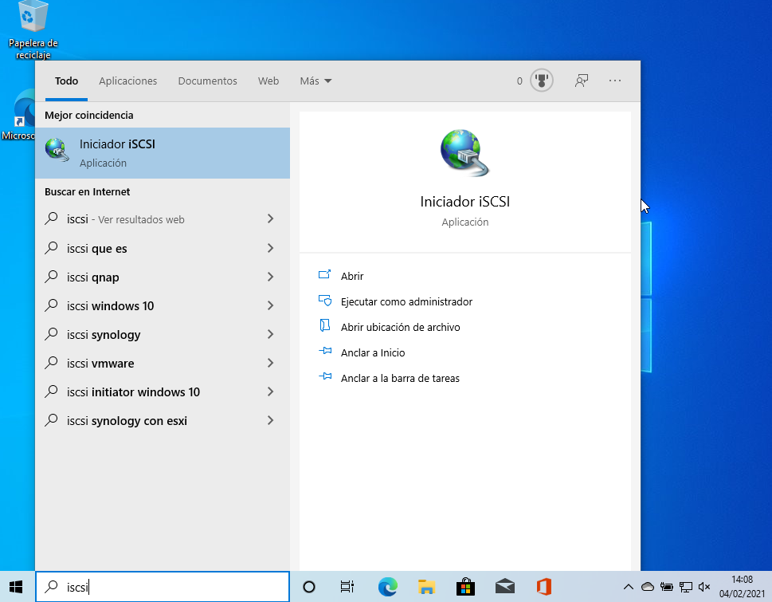


Teniendo las herramientas con las que vamos a trabajar, procedemos en primer
lugar a preparar los discos para su uso como iSCSI LUN.

```
root@postgrescliente:~# lsblk
NAME   MAJ:MIN RM  SIZE RO TYPE MOUNTPOINT
sda      8:0    0    8G  0 disk 
├─sda1   8:1    0  2,6G  0 part /
├─sda2   8:2    0    1K  0 part 
├─sda5   8:5    0    2G  0 part [SWAP]
└─sda6   8:6    0  3,4G  0 part /home
sdb      8:16   0    1G  0 disk 
sdc      8:32   0    1G  0 disk 
sdd      8:48   0    1G  0 disk 
sde      8:64   0    1G  0 disk 
sr0     11:0    1 1024M  0 rom  
```

Usaremos lvm2:

```
root@postgrescliente:~# pvcreate /dev/sd{b,c}
  Physical volume "/dev/sdb" successfully created.
  Physical volume "/dev/sdc" successfully created.
```

A continuación, creamos un grupo de volúmenes y verificamos que se han creado:

```
root@postgrescliente:~# vgcreate practica_iscsi /dev/sd{b,c}
  Volume group "practica_iscsi" successfully created
root@postgrescliente:~# vgs
  VG             #PV #LV #SN Attr   VSize VFree
  practica_iscsi   2   0   0 wz--n- 1,99g 1,99g
```

Ahora, crearemos el volumen lógico que actuará como disco para los clientes
iSCSI. 

```
root@postgrescliente:~# lvcreate -l 100%FREE -n iscsi_lun1 practica_iscsi
  Logical volume "iscsi_lun1" created.
root@postgrescliente:~# lvs
  LV         VG             Attr       LSize Pool Origin Data%  Meta%  Move Log Cpy%Sync Convert
  iscsi_lun1 practica_iscsi -wi-a----- 1,99g                                                    
```

Ya creado el volumen lógico, vamos a crear el LUN (nº de unidad lógica). Este
será el dispositivo con que el iniciador se conectará. Para ello, primero
vamos a modificar el archivo de configuración en el directorio 
_/etc/tgt/targets.conf_:

```
root@postgrescliente:~# nano /etc/tgt/targets.conf 

<target iqn.2020-21.com:lun1>
     backing-store /dev/mapper/practica_iscsi-iscsi_lun1
</target>
```

Y reiniciamos el servicio tgt:

```
root@postgrescliente:~# systemctl restart tgt
root@postgrescliente:~# systemctl status tgt
● tgt.service - (i)SCSI target daemon
   Loaded: loaded (/lib/systemd/system/tgt.service; enabled; vendor preset: enab
   Active: active (running) since Thu 2021-02-04 14:45:30 CET; 12s ago
     Docs: man:tgtd(8)
  Process: 813 ExecStartPost=/usr/sbin/tgtadm --op update --mode sys --name Stat
  Process: 814 ExecStartPost=/usr/sbin/tgt-admin -e -c /etc/tgt/targets.conf (co
  Process: 842 ExecStartPost=/usr/sbin/tgtadm --op update --mode sys --name Stat
 Main PID: 812 (tgtd)
   Status: "Starting event loop..."
    Tasks: 17
   Memory: 2.3M
   CGroup: /system.slice/tgt.service
           └─812 /usr/sbin/tgtd -f

feb 04 14:45:30 postgrescliente systemd[1]: Starting (i)SCSI target daemon...
feb 04 14:45:30 postgrescliente tgtd[812]: tgtd: iser_ib_init(3431) Failed to in
feb 04 14:45:30 postgrescliente tgtd[812]: tgtd: work_timer_start(146) use timer
feb 04 14:45:30 postgrescliente tgtd[812]: tgtd: bs_init(387) use signalfd notif
feb 04 14:45:30 postgrescliente tgtd[812]: tgtd: device_mgmt(246) sz:43 params:p
feb 04 14:45:30 postgrescliente tgtd[812]: tgtd: bs_thread_open(409) 16
feb 04 14:45:30 postgrescliente systemd[1]: Started (i)SCSI target daemon.
```

Verificamos que el target iSCSI esté disponible. Lo comprobamos de la 
siguiente manera:

```
root@postgrescliente:~# tgtadm --mode target --op show
Target 1: iqn.2020-21.com:lun1
    System information:
        Driver: iscsi
        State: ready
    I_T nexus information:
    LUN information:
        LUN: 0
            Type: controller
            SCSI ID: IET     00010000
            SCSI SN: beaf10
            Size: 0 MB, Block size: 1
            Online: Yes
            Removable media: No
            Prevent removal: No
            Readonly: No
            SWP: No
            Thin-provisioning: No
            Backing store type: null
            Backing store path: None
            Backing store flags: 
        LUN: 1
            Type: disk
            SCSI ID: IET     00010001
            SCSI SN: beaf11
            Size: 2139 MB, Block size: 512
            Online: Yes
            Removable media: No
            Prevent removal: No
            Readonly: No
            SWP: No
            Thin-provisioning: No
            Backing store type: rdwr
            Backing store path: /dev/mapper/practica_iscsi-iscsi_lun1
            Backing store flags: 
    Account information:
    ACL information:
        ALL
```

Y como podemos comprobar, el tamaño y la ruta del dispositivo son correctos.

Y aquí, acabaría la configuración del servidor iSCSI. Procederemos a
continuación, a la configuración de los clientes. Primero vamos a configurar
el cliente Debian. En primer lugar, comunicaremos con el target:

```
root@debian:~# iscsiadm -m discovery -t st -p 192.168.0.21
192.168.0.21:3260,1 iqn.2020-21.com:lun1
```

Realizar este comando, generará dos archivos para la información recibida
del LUN.

```
root@debian:~# ls -l /etc/iscsi/nodes/iqn.2020-21.com\:lun1/
total 4
drw------- 2 root root 4096 feb  4 17:20 192.168.0.21,3260,1
root@debian:~# ls -l /etc/iscsi/send_targets/192.168.0.21,3260/
total 4
lrwxrwxrwx 1 root root  57 feb  4 17:20 iqn.2020-21.com:lun1,192.168.0.21,3260,1,default -> /etc/iscsi/nodes/iqn.2020-21.com:lun1/192.168.0.21,3260,1
-rw------- 1 root root 546 feb  4 17:20 st_config
```

También vamos a configurar el archivo _/etc/iscsi/iscsid.conf_:

```
iscsid.startup = automatic

node.startup = automatic
```

Esto permitirá que el objetivo iSCSI esté conectado cuando se inicie el
sistema. Cambiado esos parámetros, debemos reiniciar el servicio:

```
root@debian:~# systemctl restart open-iscsi.service 
root@debian:~# systemctl status open-iscsi.service 
● open-iscsi.service - Login to default iSCSI targets
   Loaded: loaded (/lib/systemd/system/open-iscsi.service; enabled; vendor prese
   Active: active (exited) since Thu 2021-02-04 17:38:09 CET; 7s ago
     Docs: man:iscsiadm(8)
           man:iscsid(8)
  Process: 8023 ExecStartPre=/bin/systemctl --quiet is-active iscsid.service (co
  Process: 8024 ExecStart=/sbin/iscsiadm -m node --loginall=automatic (code=exit
  Process: 8025 ExecStart=/lib/open-iscsi/activate-storage.sh (code=exited, stat
 Main PID: 8025 (code=exited, status=0/SUCCESS)

feb 04 17:38:09 debian systemd[1]: Starting Login to default iSCSI targets...
feb 04 17:38:09 debian iscsiadm[8024]: iscsiadm: No records found
feb 04 17:38:09 debian systemd[1]: Started Login to default iSCSI targets.
```

Ahora lo único que quedaría es conectarnos al servidor:

```
root@debian:~# iscsiadm -m node -T iqn.2020-21.com:lun1 --portal "192.168.0.21" --login
Logging in to [iface: default, target: iqn.2020-21.com:lun1, portal: 192.168.0.21,3260] (multiple)
Login to [iface: default, target: iqn.2020-21.com:lun1, portal: 192.168.0.21,3260] successful.
```

Y comprobamos que efectivamente, disponemos del dispositivo iSCSI y se puede 
utilizar de forma similar a cualquier disco normalmente conectado. 

Así que, procedemos a formatearlo:

```
root@debian:~# fdisk /dev/sdb 

Bienvenido a fdisk (util-linux 2.33.1).
Los cambios solo permanecerán en la memoria, hasta que decida escribirlos.
Tenga cuidado antes de utilizar la orden de escritura.

El dispositivo no contiene una tabla de particiones reconocida.
Se ha creado una nueva etiqueta de disco DOS con el identificador de disco 0x7861da72.

Orden (m para obtener ayuda): n
Tipo de partición
   p   primaria (0 primaria(s), 0 extendida(s), 4 libre(s))
   e   extendida (contenedor para particiones lógicas)
Seleccionar (valor predeterminado p): p
Número de partición (1-4, valor predeterminado 1): 
Primer sector (2048-4177919, valor predeterminado 2048): 
Último sector, +/-sectores o +/-tamaño{K,M,G,T,P} (2048-4177919, valor predeterminado 4177919):  

Crea una nueva partición 1 de tipo 'Linux' y de tamaño 2 GiB.

Orden (m para obtener ayuda): w
Se ha modificado la tabla de particiones.
Llamando a ioctl() para volver a leer la tabla de particiones.
Se están sincronizando los discos.

root@debian:~# mkfs.ext4 /dev/sdb1 
mke2fs 1.44.5 (15-Dec-2018)
Creating filesystem with 521984 4k blocks and 130560 inodes
Filesystem UUID: 100a5d00-6cb8-411d-aa70-3300818fcc12
Superblock backups stored on blocks: 
	32768, 98304, 163840, 229376, 294912

Allocating group tables: done                            
Writing inode tables: done                            
Creating journal (8192 blocks): done
Writing superblocks and filesystem accounting information: done 
```

Y ahora la montamos:

```
root@debian:~# mount /dev/sdb1 /mnt/
root@debian:~# lsblk -l
NAME MAJ:MIN RM  SIZE RO TYPE MOUNTPOINT
sda    8:0    0   12G  0 disk 
sda1   8:1    0    8G  0 part /
sda2   8:2    0    1K  0 part 
sda5   8:5    0    4G  0 part [SWAP]
sdb    8:16   0    2G  0 disk 
sdb1   8:17   0    2G  0 part /mnt
sr0   11:0    1 73,8M  0 rom  /media/cdrom0
root@debian:~# lsblk -f
NAME FSTYPE LABEL UUID                                 FSAVAIL FSUSE% MOUNTPOINT
sda                                                                   
├─sda1
│    ext4         174e2a18-a2da-43bb-a071-17b541c6b3a7  888,1M    84% /
├─sda2
│                                                                     
└─sda5
     swap         d67cc0c9-6d4e-4c8b-bb01-eece1f95bf81                [SWAP]
sdb                                                                   
└─sdb1
     ext4         100a5d00-6cb8-411d-aa70-3300818fcc12    1,8G     0% /mnt
sr0  iso966 VBox_GAs_6.0.24
                  2020-07-09-18-40-18-64                     0   100% /media/cdr
```


Para que se monte automáticamente el target al arrancar el cliente Linux, 
usaremos _systemd mount_. Nos adelantamos antes a eso, y modificamos
el parámetro _node.startup_ y lo pusimos en _automatic_.

Ahora creamos una unidad de systemd:

```
root@debian:~# nano /etc/systemd/system/montajeiscsi.mount

[Unit]
Description=Montaje del disco iSCSI

[Mount]
What=/dev/sdb1
Where=/montajeiscsi
Type=ext4
Options=_netdev

[Install]
WantedBy=multi-user.target
```

Y recargamos el demonio de systemd e iniciamos el servicio recién creado:

```
root@debian:~# systemctl daemon-reload
root@debian:~# systemctl start montajeiscsi.mount
root@debian:~# systemctl status montajeiscsi.mount 
● montajeiscsi.mount - Montaje del disco iSCSI
   Loaded: loaded (/etc/systemd/system/montajeiscsi.mount; disabled; vendor pres
   Active: active (mounted) since Thu 2021-02-04 18:06:56 CET; 2min 30s ago
    Where: /montajeiscsi
     What: /dev/sdb1
    Tasks: 0 (limit: 4689)
   Memory: 64.0K
   CGroup: /system.slice/montajeiscsi.mount

feb 04 18:06:56 debian systemd[1]: Mounting Montaje del disco iSCSI...
feb 04 18:06:56 debian systemd[1]: Mounted Montaje del disco iSCSI.

root@debian:~# systemctl enable montajeiscsi.mount
Created symlink /etc/systemd/system/multi-user.target.wants/montajeiscsi.mount → /etc/systemd/system/montajeiscsi.mount.
```

A continuación, pasamos al último punto y es la configuración de un target con
dos LUN y cliente Windows con autenticación por CHAP.

Con los otros dos discos que nos sobran en nuestro servidor iSCSI, vamos a
crear los volúmenes lógicos como hemos creado al principio:

```
root@postgrescliente:~# pvcreate /dev/sdd /dev/sde 
  Physical volume "/dev/sdd" successfully created.
  Physical volume "/dev/sde" successfully created.
root@postgrescliente:~# vgcreate practica2-iscsi /dev/sdd /dev/sde
  Volume group "practica2-iscsi" successfully created
root@postgrescliente:~# lvcreate -L 800M -n iscsi-lun2 practica2-iscsi 
  Logical volume "iscsi-lun2" created.
root@postgrescliente:~# lvcreate -L 800M -n iscsi-lun3 practica2-iscsi 
  Logical volume "iscsi-lun3" created.
```

A continuación, vamos a crear el target nuevo:

```
<target iqn.2020-02.com:lun2>
     backing-store /dev/mapper/practica2--iscsi-iscsi--lun2
     backing-store /dev/mapper/practica2--iscsi-iscsi--lun3
     incominguser usuario manuellora96      
</target>
```

Reiniciamos el servicio y comprobamos la salida del comando:

```
root@postgrescliente:~# systemctl restart tgt.service 
root@postgrescliente:~# systemctl status tgt.service 
● tgt.service - (i)SCSI target daemon
   Loaded: loaded (/lib/systemd/system/tgt.service; enabled; vendor preset: enab
   Active: active (running) since Thu 2021-02-04 18:53:14 CET; 7s ago
     Docs: man:tgtd(8)
  Process: 1437 ExecStartPost=/usr/sbin/tgtadm --op update --mode sys --name Sta
  Process: 1438 ExecStartPost=/usr/sbin/tgt-admin -e -c /etc/tgt/targets.conf (c
  Process: 1512 ExecStartPost=/usr/sbin/tgtadm --op update --mode sys --name Sta
 Main PID: 1436 (tgtd)
   Status: "Starting event loop..."
    Tasks: 49
   Memory: 6.5M
   CGroup: /system.slice/tgt.service
           └─1436 /usr/sbin/tgtd -f

feb 04 18:53:14 postgrescliente tgtd[1436]: tgtd: iser_ib_init(3431) Failed to i
feb 04 18:53:14 postgrescliente tgtd[1436]: tgtd: work_timer_start(146) use time
feb 04 18:53:14 postgrescliente tgtd[1436]: tgtd: bs_init(387) use signalfd noti
feb 04 18:53:14 postgrescliente tgtd[1436]: tgtd: device_mgmt(246) sz:46 params:
feb 04 18:53:14 postgrescliente tgtd[1436]: tgtd: bs_thread_open(409) 16
feb 04 18:53:14 postgrescliente tgtd[1436]: tgtd: device_mgmt(246) sz:46 params:
feb 04 18:53:14 postgrescliente tgtd[1436]: tgtd: bs_thread_open(409) 16
feb 04 18:53:14 postgrescliente tgtd[1436]: tgtd: device_mgmt(246) sz:43 params:
feb 04 18:53:14 postgrescliente tgtd[1436]: tgtd: bs_thread_open(409) 16
root@postgrescliente:~# tgtadm --lld iscsi --op show --mode target
Target 1: iqn.2020-02.com:lun2
    System information:
        Driver: iscsi
        State: ready
    I_T nexus information:
    LUN information:
        LUN: 0
            Type: controller
            SCSI ID: IET     00010000
            SCSI SN: beaf10
            Size: 0 MB, Block size: 1
            Online: Yes
            Removable media: No
            Prevent removal: No
            Readonly: No
            SWP: No
            Thin-provisioning: No
            Backing store type: null
            Backing store path: None
            Backing store flags: 
        LUN: 1
            Type: disk
            SCSI ID: IET     00010001
            SCSI SN: beaf11
            Size: 839 MB, Block size: 512
            Online: Yes
            Removable media: No
            Prevent removal: No
            Readonly: No
            SWP: No
            Thin-provisioning: No
            Backing store type: rdwr
            Backing store path: /dev/mapper/practica2--iscsi-iscsi--lun2
            Backing store flags: 
        LUN: 2
            Type: disk
            SCSI ID: IET     00010002
            SCSI SN: beaf12
            Size: 839 MB, Block size: 512
            Online: Yes
            Removable media: No
            Prevent removal: No
            Readonly: No
            SWP: No
            Thin-provisioning: No
            Backing store type: rdwr
            Backing store path: /dev/mapper/practica2--iscsi-iscsi--lun3
            Backing store flags: 
    Account information:
        usuario
    ACL information:
        ALL
Target 2: iqn.2020-21.com:lun1
    System information:
        Driver: iscsi
        State: ready
    I_T nexus information:
    LUN information:
        LUN: 0
            Type: controller
            SCSI ID: IET     00020000
            SCSI SN: beaf20
            Size: 0 MB, Block size: 1
            Online: Yes
            Removable media: No
            Prevent removal: No
            Readonly: No
            SWP: No
            Thin-provisioning: No
            Backing store type: null
            Backing store path: None
            Backing store flags: 
        LUN: 1
            Type: disk
            SCSI ID: IET     00020001
            SCSI SN: beaf21
            Size: 2139 MB, Block size: 512
            Online: Yes
            Removable media: No
            Prevent removal: No
            Readonly: No
            SWP: No
            Thin-provisioning: No
            Backing store type: rdwr
            Backing store path: /dev/mapper/practica_iscsi-iscsi_lun1
            Backing store flags: 
    Account information:
    ACL information:
        ALL
```

Como ya está configurado el target nuevo, ahora vamos a configurar el 
cliente Windows. Vamos a la herramienta _Iniciador ISCSI > Detección > Detectar portal..._ :

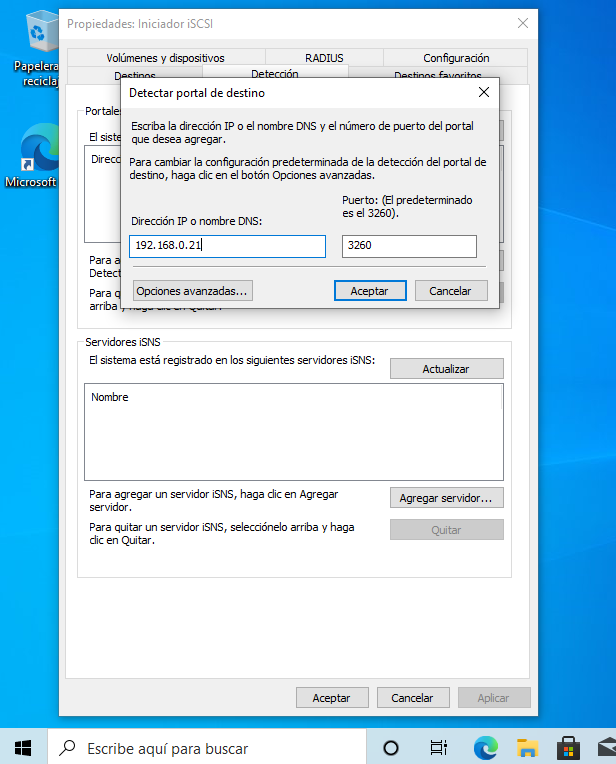

Y una vez aceptado, le damos a _Actualizar_.

Y si nos vamos a _Destinos_, podemos ver los targets disponibles:

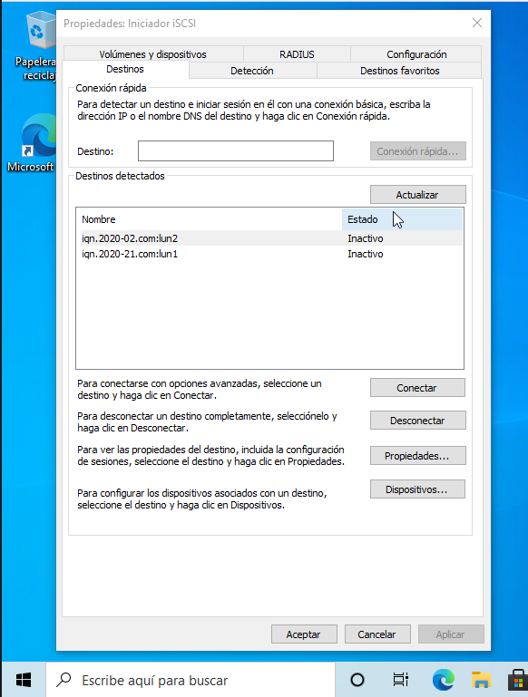

Como están inactivos, vamos a darle al _lun2_ y a _Conectar_ y vamos a darle a 
_Opciones avanzadas_ para configurar el CHAP:

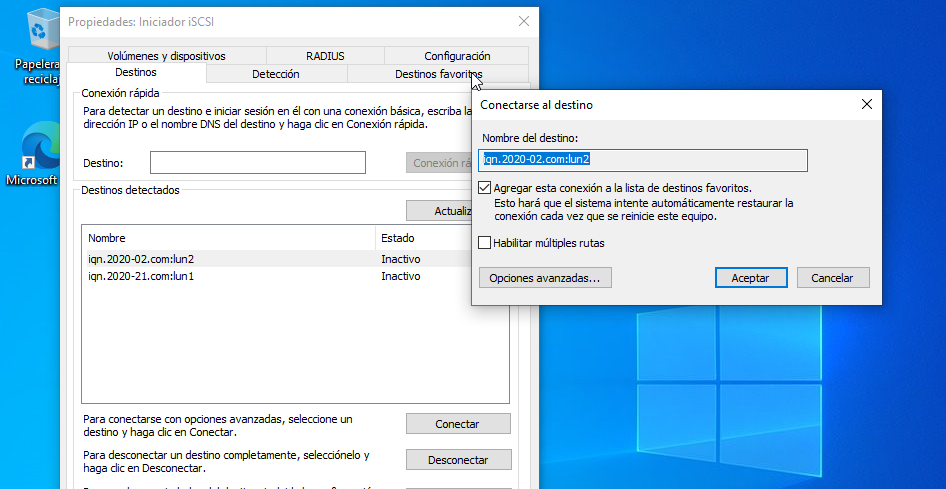


Y habilitamos el inicio de sesión CHAP con las opciones que hemos puesto
en la configuración del servidor:

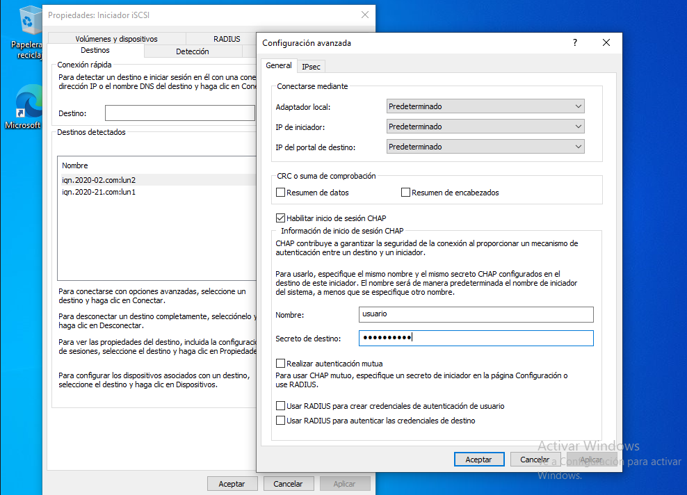

Y aparecerá como conectado:

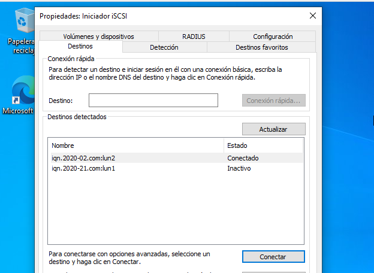

Al meternos en el Administrador de discos, nos aparecerá una ventana
emergente para iniciar la unidad virtual añadida. Seleccionamos la opción
MBR y Ok.

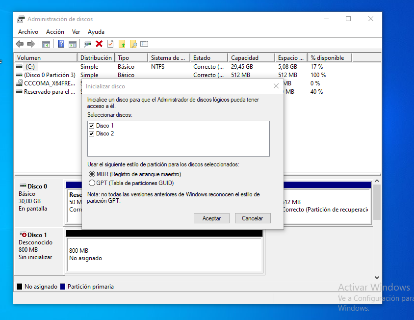

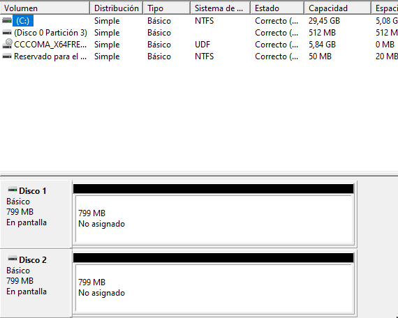

Ahora vamos a formatear cada disco:

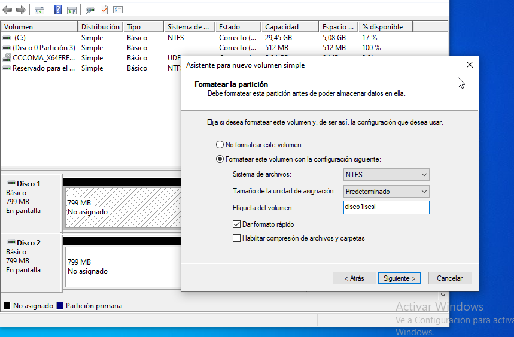

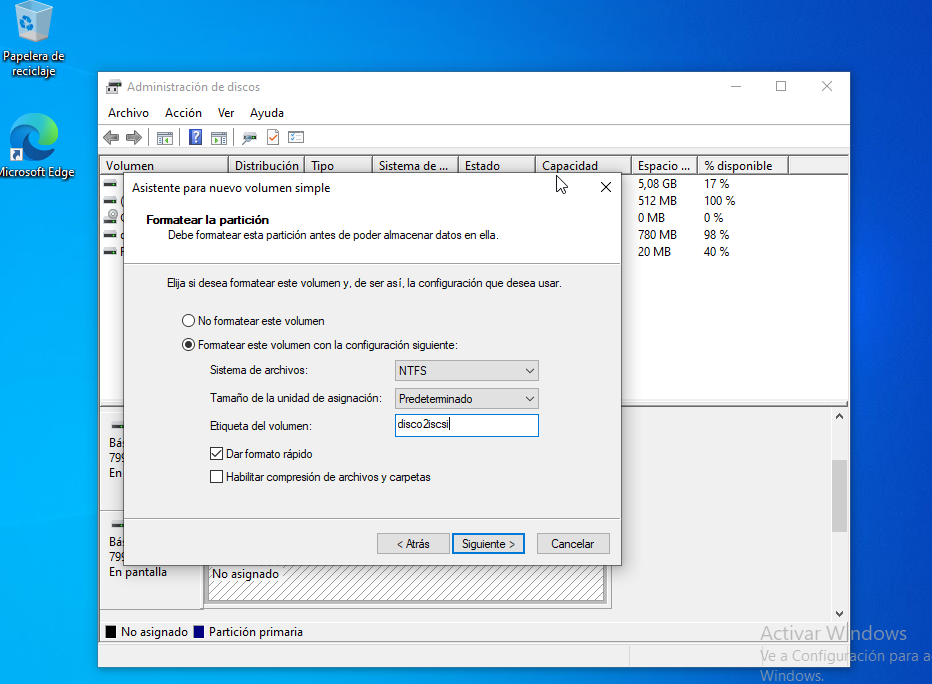

Y comprobamos su funcionamiento:

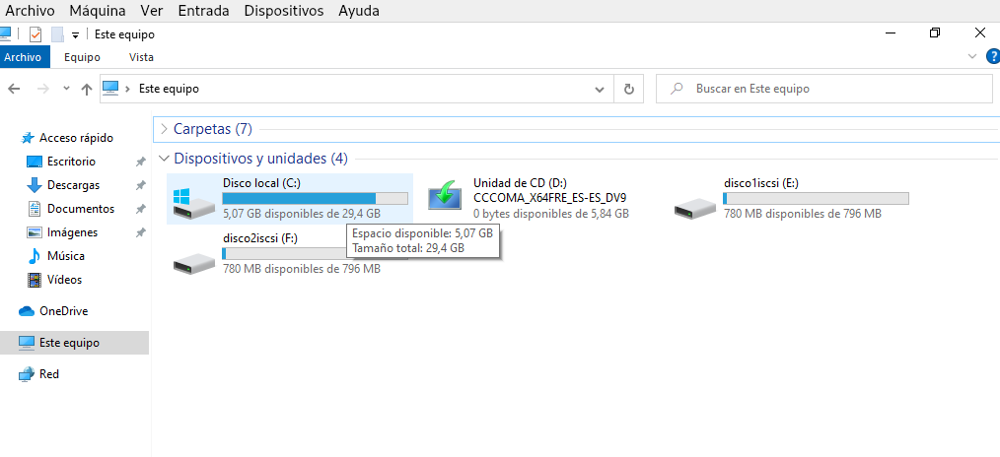


