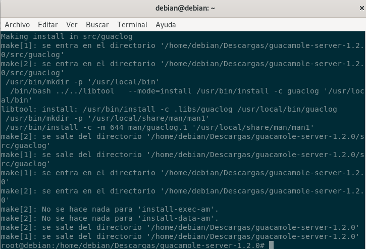
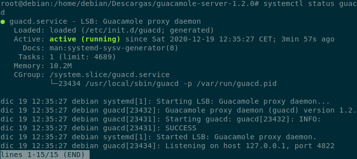
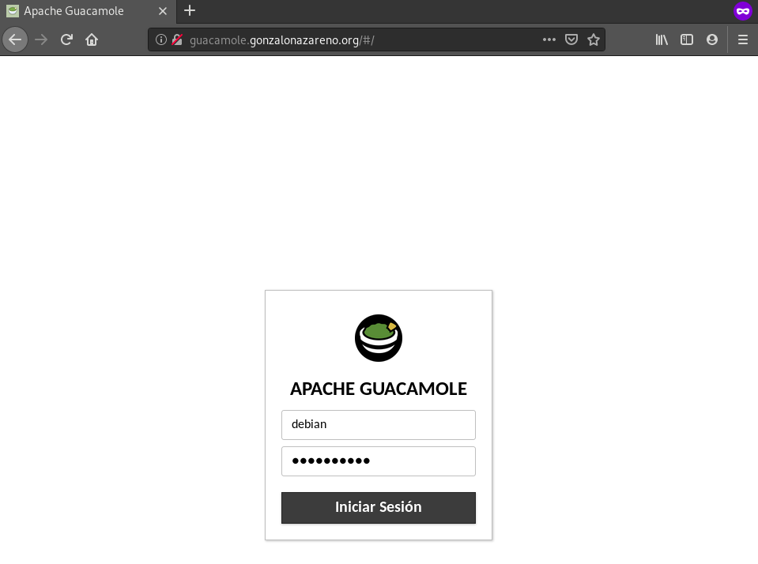
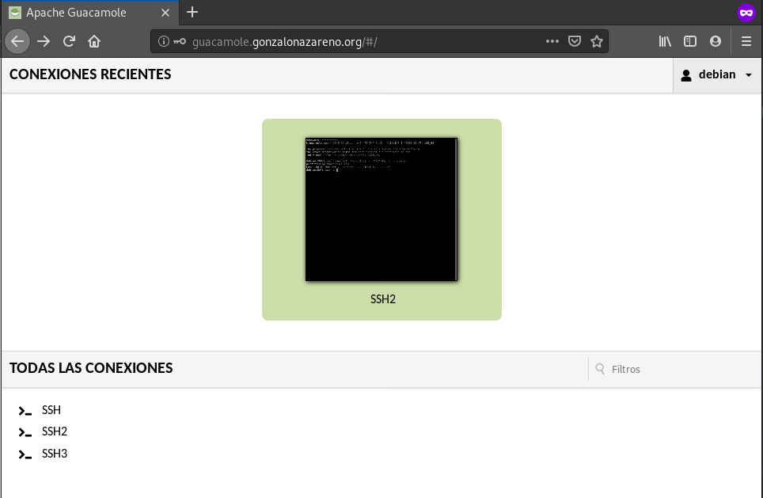
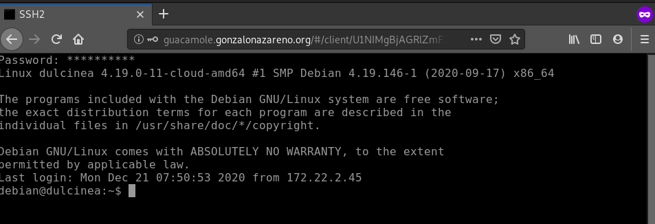

# Despliegue de CMS Java

En esta práctica vamos a desplegar un CMS escrito en java. Puedes escoger la 
aplicación que vas a desplegar de CMS escritos en Java o de Aplicaciones Java 
en Bitnami.

Se evaluará la complejidad de la instalación (por ejemplo, necesidad de tener 
que instalar un conector de base de datos, …), ejemplo de puntuación 
(de un máximo de 10 puntos).

* Indica la aplicación escogida y su funcionalidad.

En nuestro caso elegiremos el CMS llamado Apache Guacamole, que es una 
herramienta de código abierto soportada por la Fundación Apache que se basa en
ofrecernos un acceso remoto centralizado bajo unas únicas credenciales para
acceder a nuestros equipos.
   
* Escribe una guía de los pasas fundamentales para realizar la instalación.
   
En primer lugar, necesitamos instalar TOMCAT:

```
root@debian:~$ sudo apt-get install tomcat9
Reading package lists... Done
Building dependency tree       
Reading state information... Done
The following additional packages will be installed:
  ca-certificates-java default-jre-headless fontconfig-config
  fonts-dejavu-core java-common libasound2 libasound2-data libavahi-client3
  libavahi-common-data libavahi-common3 libcups2 libeclipse-jdt-core-java
  libfontconfig1 libjpeg62-turbo liblcms2-2 libnspr4 libnss3 libpcsclite1
  libtcnative-1 libtomcat9-java libx11-6 libx11-data libxau6 libxcb1 libxdmcp6
  libxext6 libxi6 libxrender1 libxtst6 openjdk-11-jre-headless tomcat9-common
  x11-common
Suggested packages:
  default-jre libasound2-plugins alsa-utils cups-common liblcms2-utils pcscd
  libnss-mdns fonts-dejavu-extra fonts-ipafont-gothic fonts-ipafont-mincho
  fonts-wqy-microhei | fonts-wqy-zenhei fonts-indic tomcat9-admin tomcat9-docs
  tomcat9-examples tomcat9-user
The following NEW packages will be installed:
  ca-certificates-java default-jre-headless fontconfig-config
  fonts-dejavu-core java-common libasound2 libasound2-data libavahi-client3
  libavahi-common-data libavahi-common3 libcups2 libeclipse-jdt-core-java
  libfontconfig1 libjpeg62-turbo liblcms2-2 libnspr4 libnss3 libpcsclite1
  libtcnative-1 libtomcat9-java libx11-6 libx11-data libxau6 libxcb1 libxdmcp6
.
.
.
Creating config file /etc/default/tomcat9 with new version
Created symlink /etc/systemd/system/multi-user.target.wants/tomcat9.service → /lib/systemd/system/tomcat9.service.
Processing triggers for libc-bin (2.28-10) ...
Processing triggers for rsyslog (8.1901.0-1) ...
Processing triggers for systemd (241-7~deb10u4) ...
Processing triggers for ca-certificates (20200601~deb10u1) ...
Updating certificates in /etc/ssl/certs...
0 added, 0 removed; done.
Running hooks in /etc/ca-certificates/update.d...

done.
done.
```

Una vez descargado el paquete _tomcat9_, debemos, si no se ha hecho 
automáticamente, descargar las dependencias necesarias:

```
root@debian:~$ sudo apt install libcairo2-dev libjpeg62-turbo-dev libpng-dev libossp-uuid-dev libtool
Reading package lists... Done
Building dependency tree       
Reading state information... Done
The following additional packages will be installed:
  autoconf automake autotools-dev binutils binutils-common
  binutils-x86-64-linux-gnu cpp cpp-8 gcc gcc-8 libasan5 libatomic1
  libbinutils libblkid-dev libc-dev-bin libc6-dev libcairo-gobject2
  libcairo-script-interpreter2 libcairo2 libcc1-0 libdpkg-perl libexpat1-dev
  libffi-dev libfile-fcntllock-perl libfontconfig1-dev libfreetype6
  libfreetype6-dev libgcc-8-dev libglib2.0-bin libglib2.0-data libglib2.0-dev
  libglib2.0-dev-bin libgomp1 libice-dev libice6 libisl19 libitm1
  libjpeg62-turbo liblsan0 libltdl-dev libltdl7 liblzo2-2 libmount-dev libmpc3
  libmpx2 libossp-uuid16 libpcre16-3 libpcre3-dev libpcre32-3 libpcrecpp0v5
  libpixman-1-0 libpixman-1-dev libpng-tools libpthread-stubs0-dev
  libquadmath0 libselinux1-dev libsepol1-dev libsm-dev libsm6 libtsan0
  libubsan1 libx11-dev libxau-dev libxcb-render0 libxcb-render0-dev
  libxcb-shm0 libxcb-shm0-dev libxcb1-dev libxdmcp-dev libxext-dev
  libxrender-dev linux-libc-dev m4 manpages manpages-dev pkg-config
  python3-distutils python3-lib2to3 uuid-dev x11proto-core-dev x11proto-dev
  x11proto-xext-dev xorg-sgml-doctools xtrans-dev xz-utils zlib1g-dev
Suggested packages:
  autoconf-archive gnu-standards autoconf-doc gettext binutils-doc cpp-doc
  gcc-8-locales gcc-multilib make flex bison gdb gcc-doc gcc-8-multilib
  gcc-8-doc libgcc1-dbg libgomp1-dbg libitm1-dbg libatomic1-dbg libasan5-dbg
  liblsan0-dbg libtsan0-dbg libubsan1-dbg libmpx2-dbg libquadmath0-dbg
  glibc-doc libcairo2-doc debian-keyring gnupg | gnupg2 patch git bzr
  freetype2-doc libglib2.0-doc libgdk-pixbuf2.0-bin | libgdk-pixbuf2.0-dev
  libxml2-utils libice-doc libtool-doc uuid libsm-doc gfortran
  | fortran95-compiler gcj-jdk libx11-doc libxcb-doc libxext-doc m4-doc
  man-browser dpkg-dev
The following NEW packages will be installed:
  autoconf automake autotools-dev binutils binutils-common
  binutils-x86-64-linux-gnu cpp cpp-8 gcc gcc-8 libasan5 libatomic1
  libbinutils libblkid-dev libc-dev-bin libc6-dev libcairo-gobject2
  libcairo-script-interpreter2 libcairo2 libcairo2-dev libcc1-0 libdpkg-perl
  libexpat1-dev libffi-dev libfile-fcntllock-perl libfontconfig1-dev
  libfreetype6-dev libgcc-8-dev libglib2.0-bin libglib2.0-data libglib2.0-dev
  libglib2.0-dev-bin libgomp1 libice-dev libice6 libisl19 libitm1
  libjpeg62-turbo-dev liblsan0 libltdl-dev libltdl7 liblzo2-2 libmount-dev
  libmpc3 libmpx2 libossp-uuid-dev libossp-uuid16 libpcre16-3 libpcre3-dev
  libpcre32-3 libpcrecpp0v5 libpixman-1-0 libpixman-1-dev libpng-dev
  libpng-tools libpthread-stubs0-dev libquadmath0 libselinux1-dev
  libsepol1-dev libsm-dev libsm6 libtool libtsan0 libubsan1 libx11-dev
  libxau-dev libxcb-render0 libxcb-render0-dev libxcb-shm0 libxcb-shm0-dev
  libxcb1-dev libxdmcp-dev libxext-dev libxrender-dev linux-libc-dev m4
  manpages manpages-dev pkg-config python3-distutils python3-lib2to3 uuid-dev
  x11proto-core-dev x11proto-dev x11proto-xext-dev xorg-sgml-doctools
  xtrans-dev xz-utils zlib1g-dev
The following packages will be upgraded:
  libfreetype6 libjpeg62-turbo
2 upgraded, 89 newly installed, 0 to remove and 30 not upgraded.
Need to get 2,681 kB/52.9 MB of archives.
After this operation, 196 MB of additional disk space will be used.
Do you want to continue? [Y/n] Y
.
.
.
Processing triggers for libglib2.0-0:amd64 (2.58.3-2+deb10u2) ...
No schema files found: doing nothing.
Processing triggers for libc-bin (2.28-10) ...
Setting up libcairo2-dev:amd64 (1.16.0-4) ...
```

Estas dependencias son las obligatorias para que tomcat9 funcione, pero hay
otras tantas que son opcionales. En caso de querer descargarlas, serían:

> libavcodec-dev libavutil-dev libswscale-dev libpango1.0-dev libssh2-1-dev libtelnet-dev libvncserver-dev libpulse-dev libssl-dev libvorbis-dev libwebp-dev libfreerdp-dev

Ahora vamos a proceder con la instalación de Guacamole Server, y para ello,
vamos a descargar tanto el server como el cliente de la siguiente [página](https://guacamole.apache.org/releases/1.2.0/).
Nos descargamos el cliente (.war) y lo pasaremos mediante scp hacia nuestra 
máquina en el cloud.

```
root@debian:/home/debian/Descargas# ls
guacamole-server-1.2.0.tar.gz  guacamole-1.2.0.war
```

Extraemos el archivo del servidor:

```
root@debian:/home/debian/Descargas# tar -xvf guacamole-server-1.2.0.tar.gz
```

Una vez extraido el contenido del archivo, nos dirigimos hacia el directorio
que nos ha extraído y configuramos el entorno de construcción:

```
root@debian:/home/debian/Descargas/guacamole-server-1.2.0# ./configure --with-init-dir=/etc/init.d
```


Hecho esto, compilamos guacamole-server:

```
root@debian:/home/debian/Descargas/guacamole-server-1.2.0# make
```


Y lo instalamos:

```
root@debian:/home/debian/Descargas/guacamole-server-1.2.0# make install
```



Y actualizamos la caché del sistema con las librerías instaladas:

```
root@debian:/home/debian/Descargas/guacamole-server-1.2.0# ldconfig
```

También, actualizaremos el servicio de systemd para poder encontrarnos el 
servicio de guacamole instalado en el directorio _/etc/init.d_:

```
root@debian:/home/debian/Descargas/guacamole-server-1.2.0# systemctl daemon-reload
```

E iniciamos el servicio de guacd (lo pondremos para que se inicie el equipo):

```
root@debian:/home/debian/Descargas/guacamole-server-1.2.0# systemctl start guacd
root@debian:/home/debian/Descargas/guacamole-server-1.2.0# systemctl enable guacd
```

Y comprobamos el estado:

```
root@debian:/home/debian/Descargas/guacamole-server-1.2.0# systemctl status guacd
```



El servicio de guacd escucha por el puerto 4822.

Ahora, pasando a la instalación de la aplicación web de Guacamole, como es un
servicio escrito en Java, necesitaremos tomcat9 (instalado anteriormente).

Tomcat9 escucha en el puerto 8080.

En primer lugar, moveremos el archivo .war descargado antes al siguiente
directorio:

```
root@debian:/home/debian/Descargas# mv guacamole-1.2.0.war /var/lib/tomcat9/webapps/guacamole.war
```

Después, reiniciamos el servicio de Tomcat9 y de guacamole:

```
root@debian:/home/debian/Descargas# systemctl restart tomcat9 guacd
```

Ahora pasaremos a la configuración de guacamole. En primer lugar, vamos a 
crear un directorio para guacamole y creamos dentro un fichero llamado
guacamole.properties:

```
root@debian:/home/debian# mkdir /etc/guacamole
root@debian:/home/debian# nano  /etc/guacamole/guacamole.properties
```

Dentro de dicho fichero, tendremos las siguientes lineas:

```
# Hostname and port of guacamole proxy
guacd-hostname: localhost
guacd-port:     4822

# Auth provider class (authenticates user/pass combination, needed if using the provided login screen)
auth-provider: net.sourceforge.guacamole.net.basic.BasicFileAuthenticationProvider
basic-user-mapping: /etc/guacamole/user-mapping.xml
```

Esta es la configuración predeterminada, pero bien puede servirnos si queremos
modificar algún parámetro en un futuro. El módulo de autenticación en
Guacamole, lee los nombres de usuario y las contraseñas de un fichero XML que
es el _user-mapping.xml_ Antes de crear dicho fichero, vamos a generar un hash
MD5 de nuestra contraseña. Lo apuntaremos y seguimos adelante.

Ahora pasaremos a la creación del fichero user-mapping.xml:

```
<user-mapping>

    <!-- Per-user authentication and config information -->
    <authorize
         username="debian"
         password="97db1846570837fce6ff62a408f1c26a"
         encoding="md5">
      
       <connection name="SSH">
         <protocol>vnc</protocol>
         <param name="hostname">192.168.100.17</param>
         <param name="port">22</param>
         <param name="username">manuel</param>
       </connection>
    </authorize>

</user-mapping>
```

Y reiniciamos el servicio de tomcat9 y guacamole:

```
root@debian:/home/debian# systemctl restart tomcat9 guacd
```

Ahora crearemos el proxy inverso en apache. Para ello, debemos instalarnos
principalmente apache2 y activamos los módulos necesarios para el proxy:

```
root@debian:/home/debian# a2enmod proxy proxy_http headers proxy_wstunnel
Enabling module proxy.
Considering dependency proxy for proxy_http:
Module proxy already enabled
Enabling module proxy_http.
Enabling module headers.
Considering dependency proxy for proxy_wstunnel:
Module proxy already enabled
Enabling module proxy_wstunnel.
To activate the new configuration, you need to run:
  systemctl restart apache2
```

Acto seguido creamos un virtualHost para Guacamole:

```
root@debian:/home/debian#/ nano /etc/apache2/sites-available/guacamole.conf
```

Que contendrá las siguientes líneas:

```
<VirtualHost *:80>
      ServerName guacamole.example.com

      ErrorLog ${APACHE_LOG_DIR}/guacamole_error.log
      CustomLog ${APACHE_LOG_DIR}/guacamole_access.log combined

      <Location />
          Require all granted
          ProxyPass http://localhost:8080/guacamole/ flushpackets=on
          ProxyPassReverse http://localhost:8080/guacamole/
      </Location>

     <Location /websocket-tunnel>
         Require all granted
         ProxyPass ws://localhost:8080/guacamole/websocket-tunnel
         ProxyPassReverse ws://localhost:8080/guacamole/websocket-tunnel
     </Location>

     Header always unset X-Frame-Options
</VirtualHost>
```
Activamos el VirtualHost y reiniciamos el servicio de apache2.

Y comprobamos la conexión con la máquina virtual:

	






