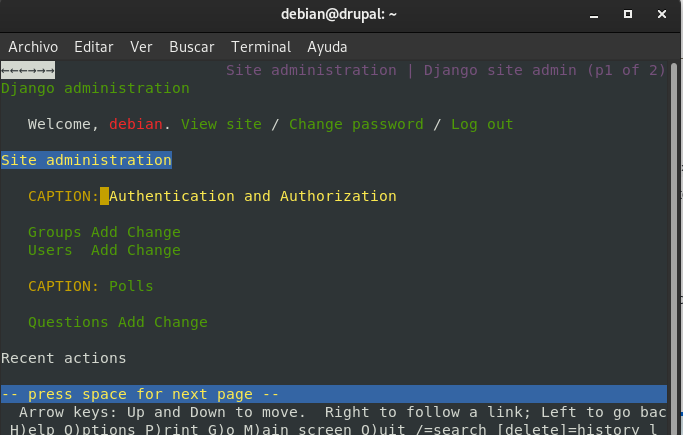
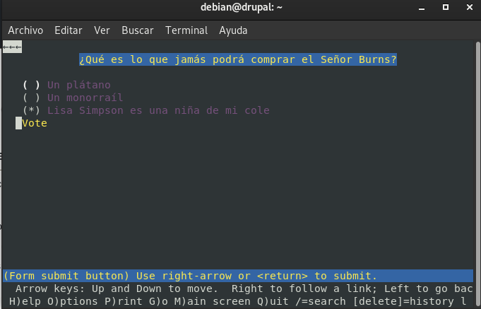
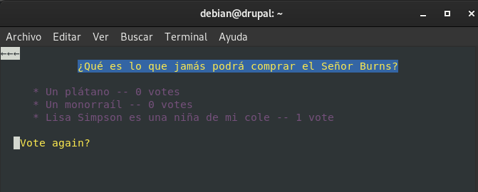
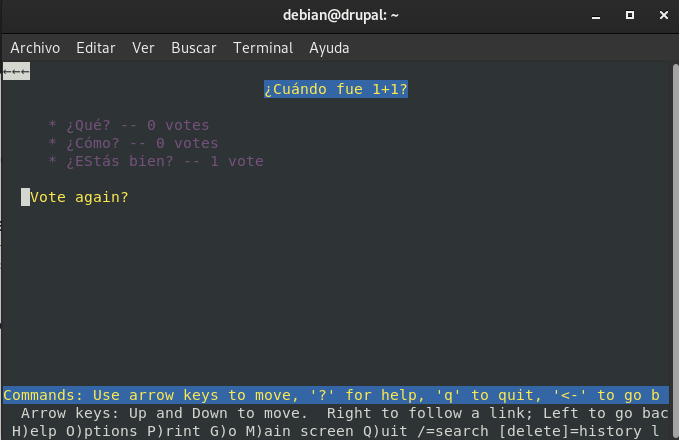
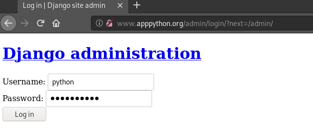
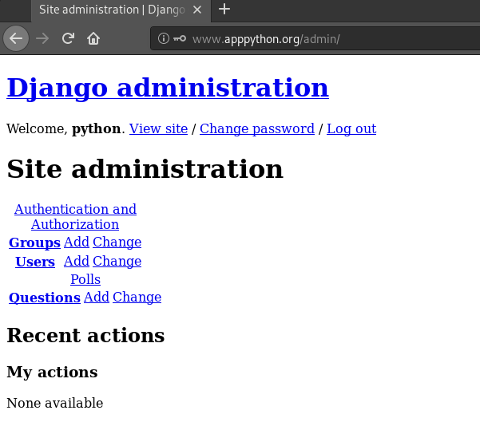

# Despliegue de aplicaciones python

## Tarea 1: Entorno de desarrollo

En primer lugar, debemos de asegurarnos que tenemos instalados tanto pyhton3
como Django. 

Para instalar Django, crearemos un entorno virtual de la siguiente manera:

```
debian@drupal:~$ virtualenv django -p python3
Already using interpreter /usr/bin/python3
Using base prefix '/usr'
New python executable in /home/debian/django/bin/python3
Also creating executable in /home/debian/django/bin/python
Installing setuptools, pkg_resources, pip, wheel...done.
debian@drupal:~$ ls
django
```

Para instalar Django haremos esto otro:

```
debian@drupal:~$ source ~/django/bin/activate
(django) debian@drupal:~$ python -m pip install Django
Collecting Django
  Downloading Django-3.1.3-py3-none-any.whl (7.8 MB)
     |████████████████████████████████| 7.8 MB 5.1 MB/s 
Collecting sqlparse>=0.2.2
  Downloading sqlparse-0.4.1-py3-none-any.whl (42 kB)
     |████████████████████████████████| 42 kB 300 kB/s 
Collecting pytz
  Downloading pytz-2020.4-py2.py3-none-any.whl (509 kB)
     |████████████████████████████████| 509 kB 5.5 MB/s 
Collecting asgiref<4,>=3.2.10
  Downloading asgiref-3.3.1-py3-none-any.whl (19 kB)
Installing collected packages: sqlparse, pytz, asgiref, Django
Successfully installed Django-3.1.3 asgiref-3.3.1 pytz-2020.4 sqlparse-0.4.1
(django) debian@drupal:~$ 
```

Vamos a desarrollar la aplicación del tutorial de django 3.1. Vamos a configurar
tu equipo como entorno de desarrollo para trabajar con la aplicación, para ello:

* Realiza un fork del repositorio de GitHub: _https://github.com/josedom24/django_tutorial_.

Una vez ya estamos en el entorno virtual, hariamos un fork del repositorio
de GitHub, y lo clonaremos en nuestra máquina.

```
(django) debian@drupal:~/django_tutorial-master$ ls
django_tutorial  manage.py  polls  README.md  requirements.txt
```

* Crea un entorno virtual de python3 e instala las dependencias necesarias para 
que funcione el proyecto (fichero requirements.txt).

El entorno virtual ya lo hemos creado con anterioridad, así que lo siguiente que
tenemos que hacer es la instalación de las dependencias:

```
(django) debian@drupal:~/django_tutorial-master$ pip install -r requirements.txt 
Requirement already satisfied: pytz==2020.4 in /home/debian/django/lib/python3.7/site-packages (from -r requirements.txt (line 3)) (2020.4)
Requirement already satisfied: sqlparse==0.4.1 in /home/debian/django/lib/python3.7/site-packages (from -r requirements.txt (line 4)) (0.4.1)
Collecting asgiref==3.3.0
  Downloading asgiref-3.3.0-py3-none-any.whl (19 kB)
Collecting Django==3.1.3
  Downloading Django-3.1.3-py3-none-any.whl (7.8 MB)
     |████████████████████████████████| 7.8 MB 5.6 kB/s 
Requirement already satisfied: sqlparse==0.4.1 in /home/debian/django/lib/python3.7/site-packages (from -r requirements.txt (line 4)) (0.4.1)
Requirement already satisfied: pytz==2020.4 in /home/debian/django/lib/python3.7/site-packages (from -r requirements.txt (line 3)) (2020.4)
Installing collected packages: asgiref, Django
  Attempting uninstall: asgiref
    Found existing installation: asgiref 3.3.1
    Uninstalling asgiref-3.3.1:
      Successfully uninstalled asgiref-3.3.1
  Attempting uninstall: Django
    Found existing installation: Django 3.1.4
    Uninstalling Django-3.1.4:
      Successfully uninstalled Django-3.1.4
Successfully installed Django-3.1.3 asgiref-3.3.0
```

* Comprueba que vamos a trabajar con una base de datos sqlite 
(django_tutorial/settings.py). ¿Cómo se llama la base de datos que vamos a 
crear?

Efectivamente, vamos a usar sqlite, y el nombre de la base de datos se llamará:
"db.sqlite3"

```
DATABASES = {
    'default': {
        'ENGINE': 'django.db.backends.sqlite3',
        'NAME': BASE_DIR / 'db.sqlite3',
    }
}
```

* Crea la base de datos: python3 manage.py migrate. A partir del modelo de datos
se crean las tablas de la base de datos.

```
(django) debian@drupal:~/django_tutorial-master$ python3 manage.py migrate
Operations to perform:
  Apply all migrations: admin, auth, contenttypes, polls, sessions
Running migrations:
  Applying contenttypes.0001_initial... OK
  Applying auth.0001_initial... OK
  Applying admin.0001_initial... OK
  Applying admin.0002_logentry_remove_auto_add... OK
  Applying admin.0003_logentry_add_action_flag_choices... OK
  Applying contenttypes.0002_remove_content_type_name... OK
  Applying auth.0002_alter_permission_name_max_length... OK
  Applying auth.0003_alter_user_email_max_length... OK
  Applying auth.0004_alter_user_username_opts... OK
  Applying auth.0005_alter_user_last_login_null... OK
  Applying auth.0006_require_contenttypes_0002... OK
  Applying auth.0007_alter_validators_add_error_messages... OK
  Applying auth.0008_alter_user_username_max_length... OK
  Applying auth.0009_alter_user_last_name_max_length... OK
  Applying auth.0010_alter_group_name_max_length... OK
  Applying auth.0011_update_proxy_permissions... OK
  Applying auth.0012_alter_user_first_name_max_length... OK
  Applying polls.0001_initial... OK
  Applying sessions.0001_initial... OK
```

* Crea un usuario administrador: python3 manage.py createsuperuser.

```
(django) debian@drupal:~/django_tutorial-master$ python3 manage.py createsuperuser
Username (leave blank to use 'debian'): 
Email address: manuelloraroman@gmail.com
Password: 
Password (again): 
This password is too common.
Bypass password validation and create user anyway? [y/N]: y
Superuser created successfully.
```

* Ejecuta el servidor web de desarrollo y entra en la zona de administración 
(\admin) para comprobar que los datos se han añadido correctamente.



* Crea dos preguntas, con posibles respuestas.

* Comprueba en el navegador que la aplicación está funcionando, accede a la 
url \polls.






  


## Tarea 2: Entorno de producción

Vamos a realizar el despliegue de nuestra aplicación en un entorno de 
producción, para ello vamos a utilizar una instancia del cloud, sigue los 
siguientes pasos:

* Instala en el servidor los servicios necesarios (apache2). Instala el módulo 
de apache2 para ejecutar código python.

Instalaremos el paquete _libapache2-mod-wsgi_

```
(django) debian@drupal:~/django_tutorial-master$ sudo apt-get install libapache2-mod-wsgi
Reading package lists... Done
Building dependency tree       
Reading state information... Done
The following additional packages will be installed:
  libpython2.7
The following NEW packages will be installed:
  libapache2-mod-wsgi libpython2.7
0 upgraded, 2 newly installed, 0 to remove and 0 not upgraded.
Need to get 1,131 kB of archives.
After this operation, 3,783 kB of additional disk space will be used.
Do you want to continue? [Y/n] Y
Get:1 http://deb.debian.org/debian buster/main amd64 libpython2.7 amd64 2.7.16-2+deb10u1 [1,036 kB]
Get:2 http://deb.debian.org/debian buster/main amd64 libapache2-mod-wsgi amd64 4.6.5-1 [94.9 kB]
Fetched 1,131 kB in 1s (992 kB/s)         
Selecting previously unselected package libpython2.7:amd64.
(Reading database ... 35050 files and directories currently installed.)
Preparing to unpack .../libpython2.7_2.7.16-2+deb10u1_amd64.deb ...
Unpacking libpython2.7:amd64 (2.7.16-2+deb10u1) ...
Selecting previously unselected package libapache2-mod-wsgi.
Preparing to unpack .../libapache2-mod-wsgi_4.6.5-1_amd64.deb ...
Unpacking libapache2-mod-wsgi (4.6.5-1) ...
Setting up libpython2.7:amd64 (2.7.16-2+deb10u1) ...
Setting up libapache2-mod-wsgi (4.6.5-1) ...
apache2_invoke: Enable module wsgi
Processing triggers for libc-bin (2.28-10) ...
```

* Clona el repositorio en el DocumentRoot de tu virtualhost.

Nuestro directorio del DocumentRoot será _/var/www/app_python_

```
(django) debian@drupal:~$ sudo mkdir /var/www/app_python
(django) debian@drupal:~$ sudo cp -R django_tutorial-master/ /var/www/app_python
```

* Crea un entorno virtual e instala las dependencias de tu aplicación.

Creamos otro entorno virtual llamado produccion y descargamos las 
dependencias del fichero requirements.txt como hicimos anteriormente.

* Instala el módulo que permite que python trabaje con mysql:

>  $ apt-get install python3-mysqldb

```
debian@drupal:~/django_tutorial-master$ sudo apt-get install python3-mysqldb
Reading package lists... Done
Building dependency tree       
Reading state information... Done
Suggested packages:
  python-egenix-mxdatetime python3-mysqldb-dbg
The following NEW packages will be installed:
  python3-mysqldb
0 upgraded, 1 newly installed, 0 to remove and 0 not upgraded.
Need to get 56.1 kB of archives.
After this operation, 191 kB of additional disk space will be used.
Get:1 http://deb.debian.org/debian buster/main amd64 python3-mysqldb amd64 1.3.10-2 [56.1 kB]
Fetched 56.1 kB in 2s (35.1 kB/s)          
Selecting previously unselected package python3-mysqldb.
(Reading database ... 35065 files and directories currently installed.)
Preparing to unpack .../python3-mysqldb_1.3.10-2_amd64.deb ...
Unpacking python3-mysqldb (1.3.10-2) ...
Setting up python3-mysqldb (1.3.10-2) ...
```

Y en el entorno virtual:

>  (env)$ pip install mysql-connector-python

```
(django) debian@drupal:/etc/apache2/sites-available$ pip install mysql-connector-python
Collecting mysql-connector-python
  Downloading mysql_connector_python-8.0.22-cp37-cp37m-manylinux1_x86_64.whl (18.0 MB)
     |████████████████████████████████| 18.0 MB 4.2 kB/s 
Collecting protobuf>=3.0.0
  Downloading protobuf-3.14.0-cp37-cp37m-manylinux1_x86_64.whl (1.0 MB)
     |████████████████████████████████| 1.0 MB 5.3 MB/s 
Collecting six>=1.9
  Downloading six-1.15.0-py2.py3-none-any.whl (10 kB)
Installing collected packages: six, protobuf, mysql-connector-python
Successfully installed mysql-connector-python-8.0.22 protobuf-3.14.0 six-1.15.0
```

* Crea una base de datos y un usuario en mysql.

```
(django) debian@drupal:/etc/apache2/sites-available$ sudo mysql -u root -p
Enter password: 
Welcome to the MariaDB monitor.  Commands end with ; or \g.
Your MariaDB connection id is 276
Server version: 10.3.23-MariaDB-0+deb10u1 Debian 10

Copyright (c) 2000, 2018, Oracle, MariaDB Corporation Ab and others.

Type 'help;' or '\h' for help. Type '\c' to clear the current input statement.

MariaDB [(none)]> create database python;
Query OK, 1 row affected (0.014 sec)

MariaDB [(none)]> create user python@localhost identified by '1q2w3e4r5t';
Query OK, 0 rows affected (0.043 sec)

MariaDB [(none)]> grant all privileges on python.* to python@localhost;
Query OK, 0 rows affected (0.015 sec)
```

* Configura la aplicación para trabajar con mysql, para ello modifica la 
configuración de la base de datos en el archivo settings.py:

```
# Database
# https://docs.djangoproject.com/en/3.1/ref/settings/#databases

DATABASES = {
    'default': {
        'ENGINE': 'mysql.connector.django',
        'NAME': 'python',
        'USER': 'python',
        'PASSWORD': '1q2w3e4r5t',
        'HOST': 'localhost',
        'PORT': '',
    }
}
```

* Como en la tarea 1, realiza la migración de la base de datos que creará la 
estructura de datos necesarias. comprueba en mariadb que la base de datos y 
las tablas se han creado.

Como hemos hecho anteriormente, vamos a ejecutar el comando,
_python3 manage.py migrate_:

```
(django) debian@drupal:/var/www/app_python/django_tutorial-master$ python3 manage.py migrate
Operations to perform:
  Apply all migrations: admin, auth, contenttypes, polls, sessions
Running migrations:
  Applying contenttypes.0001_initial... OK
  Applying auth.0001_initial... OK
  Applying admin.0001_initial... OK
  Applying admin.0002_logentry_remove_auto_add... OK
  Applying admin.0003_logentry_add_action_flag_choices... OK
  Applying contenttypes.0002_remove_content_type_name... OK
  Applying auth.0002_alter_permission_name_max_length... OK
  Applying auth.0003_alter_user_email_max_length... OK
  Applying auth.0004_alter_user_username_opts... OK
  Applying auth.0005_alter_user_last_login_null... OK
  Applying auth.0006_require_contenttypes_0002... OK
  Applying auth.0007_alter_validators_add_error_messages... OK
  Applying auth.0008_alter_user_username_max_length... OK
  Applying auth.0009_alter_user_last_name_max_length... OK
  Applying auth.0010_alter_group_name_max_length... OK
  Applying auth.0011_update_proxy_permissions... OK
  Applying auth.0012_alter_user_first_name_max_length... OK
  Applying polls.0001_initial... OK
  Applying sessions.0001_initial... OK
```

Ahora comprobamos que efectivamente se ha añadido contenido a la base de datos
de MariaDB:

```
MariaDB [python]> show tables;
+----------------------------+
| Tables_in_python           |
+----------------------------+
| auth_group                 |
| auth_group_permissions     |
| auth_permission            |
| auth_user                  |
| auth_user_groups           |
| auth_user_user_permissions |
| django_admin_log           |
| django_content_type        |
| django_migrations          |
| django_session             |
| polls_choice               |
| polls_question             |
+----------------------------+
12 rows in set (0.001 sec)
```

* Crea un usuario administrador: python3 manage.py createsuperuser.

```
(django) debian@drupal:/var/www/app_python/django_tutorial-master$ python3 manage.py createsuperuser
Username (leave blank to use 'debian'): python
Email address: manuelloraroman@gmail.com
Password: 
Password (again): 
This password is too common.
Bypass password validation and create user anyway? [y/N]: y
Superuser created successfully.
```

* Configura un virtualhost en apache2 con la configuración adecuada para que 
funcione la aplicación. El punto de entrada de nuestro servidor será 
django_tutorial/django_tutorial/wsgi.py. Puedes guiarte por el Ejercicio: 
Desplegando aplicaciones flask, por la documentación de django: How to use 
Django with Apache and mod_wsgi,…

Configuración de nuestro VirtualHost:

```
<VirtualHost *:80>
        ServerName www.apppython.org

        ServerAdmin webmaster@localhost
        DocumentRoot /var/www/app_python

        WSGIDaemonProcess app_python user=www-data group=www-data processes=1 threads=5 python-path=/var$
        WSGIScriptAlias / /var/www/app_python/django_tutorial-master/django_tutorial/wsgi.py

        <Directory /var/www/app_python/django_tutorial-master/django_tutorial>
                WSGIProcessGroup app_python
                WSGIApplicationGroup %{GLOBAL}
                Require all granted
        </Directory>

        ErrorLog ${APACHE_LOG_DIR}/error.log
        CustomLog ${APACHE_LOG_DIR}/access.log combined

</VirtualHost>

```

Configuración adicional del fichero settings.py:

```
ALLOWED_HOSTS = ['*']
```

Creación del fichero app.wsgi:

```
from app import app as application
```

Prueba de funcionamiento:





* Debes asegurarte que el contenido estático se está sirviendo: ¿Se muestra la 
imagen de fondo de la aplicación? ¿Se ve de forma adecuada la hoja de estilo 
de la zona de administración?. Para arreglarlo puedes encontrar documentación 
en How to use Django with Apache and mod_wsgi.
