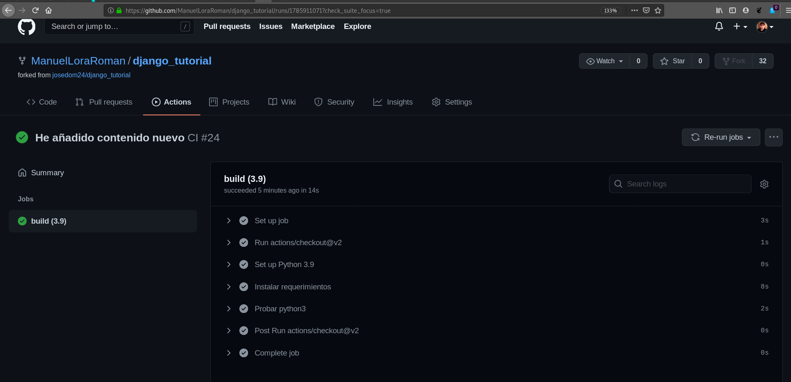
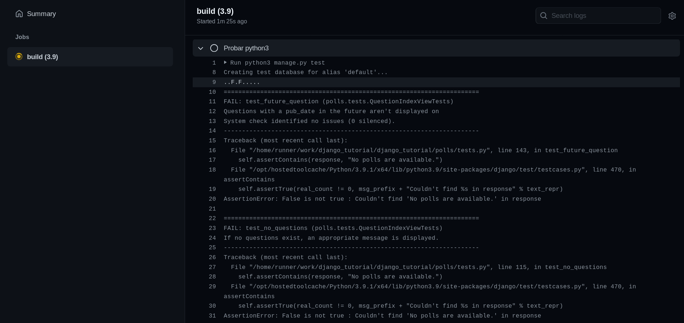
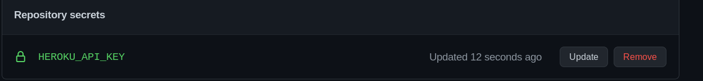
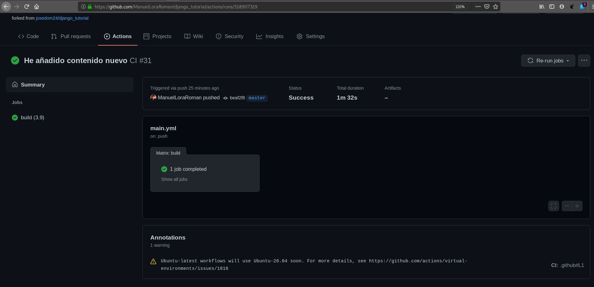
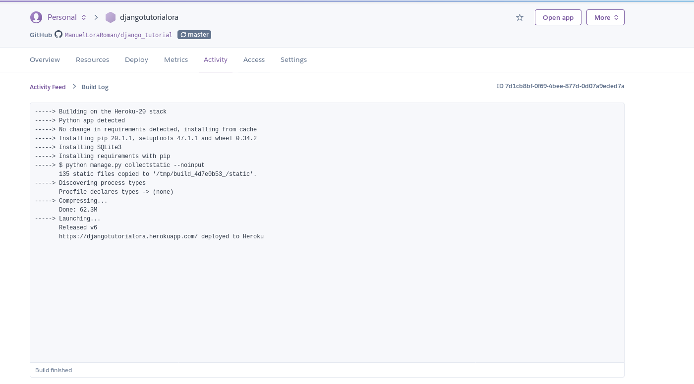

# Práctica: Introducción a la integración continua 

## Tarea: Integración continúa de aplicación django (Test + Deploy)


Vamos a trabajar con el repositorio de la aplicación django_tutorial. Esta 
aplicación tiene definidas una serie de test, que podemos estudiar en el 
fichero tests.py del directorio polls.

Para ejecutar las pruebas unitarias, ejecutamos la instrucción 
python3 manage.py test.

* Estudia las distintas pruebas que se han realizado, y modifica el código de 
la aplicación (debes modificar el fichero views.py o los templates, no debes 
cambiar el fichero tests.py para que al menos una de ella no se ejecute de 
manera exitosa.

A continuación vamos a configurar la integración continúa para que cada vez 
que hagamos un commit se haga la ejecución de test en la herramienta de CI/CD 
que haya elegido.

* Crea el pipeline en el sistema de CI/CD para que pase automáticamente los 
tests. Muestra el fichero de configuración y una captura de pantalla con un 
resultado exitoso de la IC y otro con un error.

A continuación vamos a realziar el despliegue continuo en un servicio de 
hosting, por ejemplo heroku.

* Entrega un breve descripción de los pasos más importantes para realizar el 
despliegue desde el sistema de CI/CS y entrega una prueba de funcionamiento 
donde se compruebe cómo se hace el despliegue automático.


En primer lugar, vamos a realizar un fork nuevo del repositorio de 
_django_tutorial_. Hecho esto, clonamos el repositorio y empezamos la práctica.

```
manuel@debian:/media/manuel/Datos$ sudo git clone git@github.com:ManuelLoraRoman/django_tutorial.git
[sudo] password for manuel: 
Clonando en 'django_tutorial'...
remote: Enumerating objects: 41, done.
remote: Counting objects: 100% (41/41), done.
remote: Compressing objects: 100% (34/34), done.
remote: Total 133 (delta 7), reused 28 (delta 5), pack-reused 92
Recibiendo objetos: 100% (133/133), 4.25 MiB | 4.99 MiB/s, listo.
Resolviendo deltas: 100% (31/31), listo.
manuel@debian:/media/manuel/Datos$
```

A continuación, vamos a crear un entorno virtual:

```
manuel@debian:~/virtualenvs$ python3 -m venv django
manuel@debian:~/virtualenvs$ source django/bin/activate
(django) manuel@debian:~/virtualenvs$ 
```

Instalamos los requerimientos de la aplicación:

```
(django) manuel@debian:/media/manuel/Datos/django_tutorial$ pip install -r requirements.txt 
Collecting asgiref==3.3.0 (from -r requirements.txt (line 1))
  Downloading https://files.pythonhosted.org/packages/c0/e8/578887011652048c2d273bf98839a11020891917f3aa638a0bc9ac04d653/asgiref-3.3.0-py3-none-any.whl
Collecting Django==3.1.3 (from -r requirements.txt (line 2))
  Downloading https://files.pythonhosted.org/packages/7f/17/16267e782a30ea2ce08a9a452c1db285afb0ff226cfe3753f484d3d65662/Django-3.1.3-py3-none-any.whl (7.8MB)
    100% |████████████████████████████████| 7.8MB 245kB/s 
Collecting pytz==2020.4 (from -r requirements.txt (line 3))
  Using cached https://files.pythonhosted.org/packages/12/f8/ff09af6ff61a3efaad5f61ba5facdf17e7722c4393f7d8a66674d2dbd29f/pytz-2020.4-py2.py3-none-any.whl
Collecting sqlparse==0.4.1 (from -r requirements.txt (line 4))
  Downloading https://files.pythonhosted.org/packages/14/05/6e8eb62ca685b10e34051a80d7ea94b7137369d8c0be5c3b9d9b6e3f5dae/sqlparse-0.4.1-py3-none-any.whl (42kB)
    100% |████████████████████████████████| 51kB 5.9MB/s 
Installing collected packages: asgiref, sqlparse, pytz, Django
Successfully installed Django-3.1.3 asgiref-3.3.0 pytz-2020.4 sqlparse-0.4.1
(django) manuel@debian:/media/manuel/Datos/django_tutorial$ 
```

Y ahora vamos a comprobar los test:

```
(django) manuel@debian:/media/manuel/Datos/django_tutorial$ python3 manage.py test
Creating test database for alias 'default'...
System check identified no issues (0 silenced).
..........
----------------------------------------------------------------------
Ran 10 tests in 0.025s

OK
Destroying test database for alias 'default'...
```

El resultado de la comprobación de los test ha sido correcta. Ahora es el turno
de modificar la aplicación para que los test nos den ERROR:

Hemos modificado lo siguiente:

* En el fichero _index.html_:

```


<link rel="stylesheet" type="text/css" href="">


    <ul>
    
    <li><a href="">{{ question.question_tex$
    
    </ul>

    <p>No polls are available.</p>

```

A esto:

```


<link rel="stylesheet" type="text/css" href="">


    <ul>
    
    <li><a href="">{{ question.question_tex$
    
    </ul>

    <p>hhjsjsjhjdhsjhsjhsdjhdjhsdjhsjhdjh</p>

```

Y el resultado el siguiente:

```
(django) manuel@debian:/media/manuel/Datos/django_tutorial$ python3 manage.py test
Creating test database for alias 'default'...
System check identified no issues (0 silenced).
..F.F.....
======================================================================
FAIL: test_future_question (polls.tests.QuestionIndexViewTests)
----------------------------------------------------------------------
Traceback (most recent call last):
  File "/media/manuel/Datos/django_tutorial/polls/tests.py", line 143, in test_future_question
    self.assertContains(response, "No polls are available.")
  File "/home/manuel/virtualenvs/django/lib/python3.7/site-packages/django/test/testcases.py", line 470, in assertContains
    self.assertTrue(real_count != 0, msg_prefix + "Couldn't find %s in response" % text_repr)
AssertionError: False is not true : Couldn't find 'No polls are available.' in response

======================================================================
FAIL: test_no_questions (polls.tests.QuestionIndexViewTests)
----------------------------------------------------------------------
Traceback (most recent call last):
  File "/media/manuel/Datos/django_tutorial/polls/tests.py", line 115, in test_no_questions
    self.assertContains(response, "No polls are available.")
  File "/home/manuel/virtualenvs/django/lib/python3.7/site-packages/django/test/testcases.py", line 470, in assertContains
    self.assertTrue(real_count != 0, msg_prefix + "Couldn't find %s in response" % text_repr)
AssertionError: False is not true : Couldn't find 'No polls are available.' in response

----------------------------------------------------------------------
Ran 10 tests in 0.026s

FAILED (failures=2)
Destroying test database for alias 'default'...
```

Con este error, nos indica que la respuesta debería ser 
```No polls are available.``` pero dicha respuesta ha cambiado.

Hecho esto, ahora tenemos que escoger un sistema CI/CD, y en nuestro caso, 
lo haremos con Github Actions.

Para empezar con Github Actions, debemos dirigirnos a nuestro repositorio en
Github, y acceder a la pestaña Actions. Una vez ahí, seleccionamos
la opción de _set up a workflow yourself_. Esto nos permitirá escoger un flujo
de trabajo predefinido o establecer el nuestro.

Ahora nos permitirá editar un fichero _main.yml_ que es el equivalente al 
_.yml_ de travis. Procederemos a editar dicho fichero con la siguiente 
información:

```
# This is a basic workflow to help you get started with Actions

name: CI

# Controls when the action will run. 
on:
  # Triggers the workflow on push or pull request events but only for the master branch
  push:
    branches: [ master ]
  pull_request:
    branches: [ master ]

jobs:
  build:

    runs-on: ubuntu-latest
    strategy:
      matrix:
        python-version: [3.9]

    steps:
    - uses: actions/checkout@v2
    - name: Set up Python ${{ matrix.python-version }}
      uses: actions/setup-python@v2
      with:
        python-version: ${{ matrix.python-version }}
    - name: Instalar requerimientos
      run: |
        pip install --upgrade pip
        pip install -r requirements.txt
      
    - name: Probar python3
      run: python3 manage.py test
```

Y por último, le damos al botón de _Start commit_ para que agregue dicho 
archivo al repositorio.

Ahora, lo único que nos quedaría es comprobar algunos test correctos y otros que
dan error.

* Comprobación correcta



* Comprobación cambiando los ficheros como al principio:



A continuación, para desplegar en heroku, necesitamos lo siguiente:

* A la hora de desplegar en heroku, necesitamos un método de proveer
un token de autenticación. Para ello, vamos a irnos a nuestro perfil de
Heroku y vamos a mirar nuestra API_KEY. Copiamos dicha Key y la ponemos en
la pestaña _Settings/Secrets_ de nuestro repositorio:



Vamos a crear un nuevo proyecto en heroku y conectarlo con Github (algo
relativamente trivial).

Una vez hemos hecho esto, vamos a cambiar el fichero main.yml creado
anteriormente para implementarlo con heroku:

```
# This is a basic workflow to help you get started with Actions

name: CI

# Controls when the action will run. 
on:
  # Triggers the workflow on push or pull request events but only for the master branch
  push:
    branches: [ master ]
  pull_request:
    branches: [ master ]

jobs:
  build:

    runs-on: ubuntu-latest
    strategy:
      matrix:
        python-version: [3.9]

    steps:
    - uses: actions/checkout@v2
    - uses: akhileshns/heroku-deploy@v3.8.9 # This is the action
      with:
          heroku_api_key: ${{secrets.HEROKU_API_KEY}}
          heroku_app_name: "djangotutorialora" #Must be unique in Heroku
          heroku_email: "manuelloraroman@gmail.com"
          procfile: "web: npm start"    

    - name: Set up Python ${{ matrix.python-version }}
      uses: actions/setup-python@v2
      with:
        python-version: ${{ matrix.python-version }}
    - name: Instalar requerimientos
      run: |
        pip install --upgrade pip
        pip install -r requirements.txt
      
    - name: Probar python3
      run: python3 manage.py test
```

Y por último, vamos a editar el fichero _settings.py_ y vamos a añadirle al
principio del documento la siguiente línea:

```
import os
```

Y al final del mismo lo siguiente:

```
STATIC_ROOT = os.path.join(BASE_DIR, 'static')
```

Y hacemos un git push hacia el repositorio.




