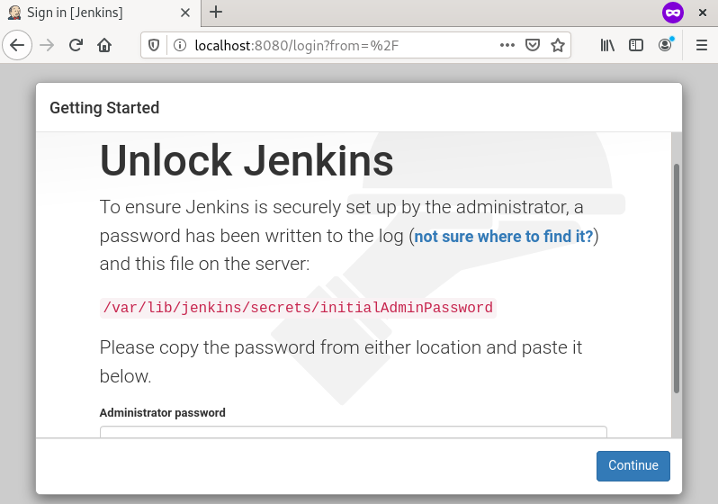
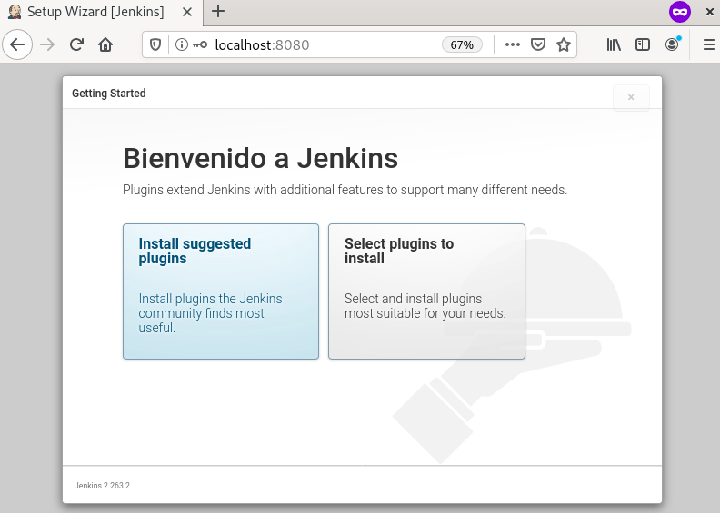
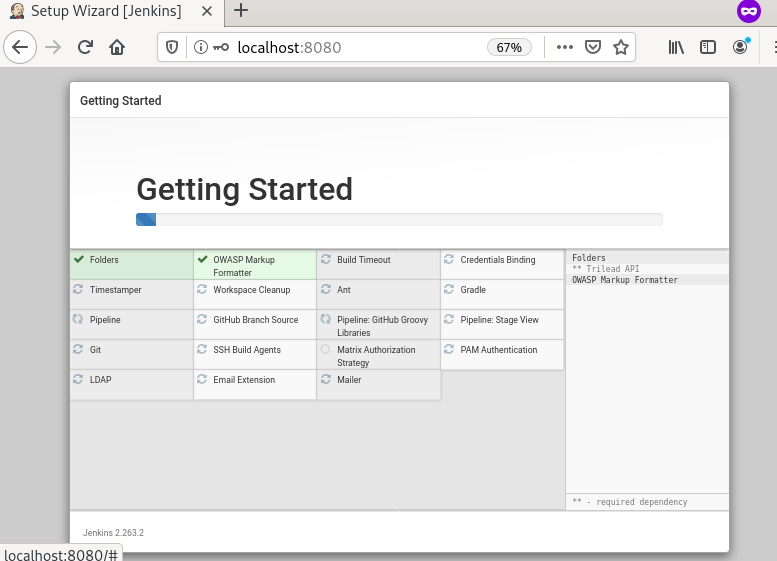
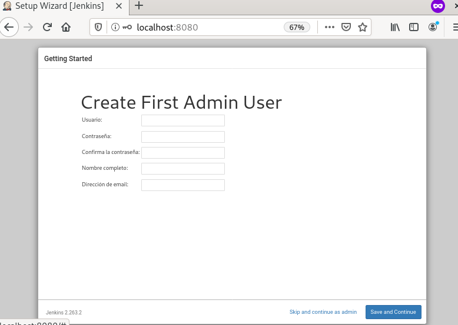
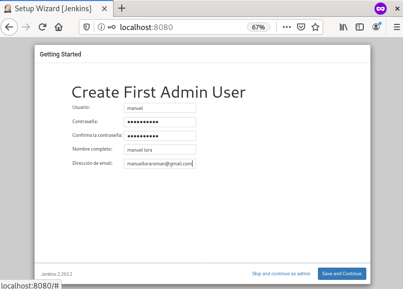
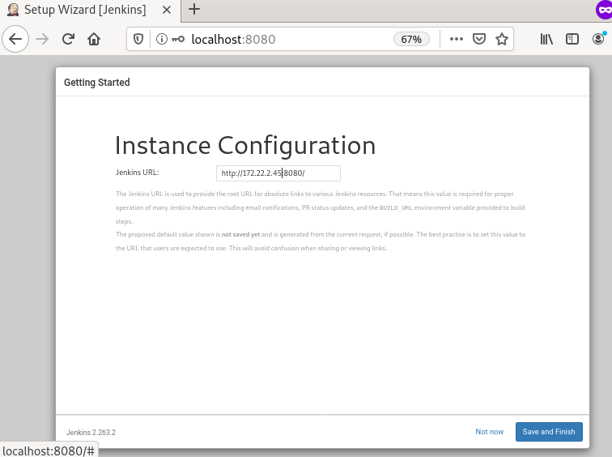
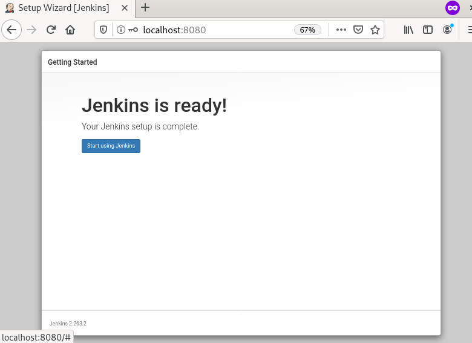

# Práctica: Introducción a la integración continua 

Debes realizar una de las siguientes tareas, utilizando una herramienta de 
CI/CD: GitHub Actions, GiLab CI/CD, CircleCI, Jenkins, … (No uses Travis CI).

En nuestro caso, vamos a elegir Jenkins y usaremos surge.

## Tarea: Despliegue de una página web estática (build, deploy)

En esta práctica investiga como generar una página web estática con la 
herramienta que elegiste en la práctica 1 de la asignatura y desplegarla en el 
servicio que utilizaste en esa práctica.

* En el repositorio GitHub/GitLab sólo tienen que estar los ficheros markdown.
   
* La página se debe generar en el sistema de integración continúa, por lo tanto 
debemos instalar las herramientas necesarias.
   
Para la instalación de Jenkins, vamos a tener que seguir los siguientes pasos:

1. En primer lugar actualizaremos el sistema e instalaremos OpenJDK 11 ya que
Jenkins está escrito en Java.

```
root@debian:~$ apt-get update && apt-get upgrade

root@debian:~$ apt-get install default-jdk
```

2. Nos descargamos e importamos las claves GPG del repositorio de Jenkins:

```
root@debian:~$ wget -q -O - https://pkg.jenkins.io/debian/jenkins.io.key | apt-key add -
OK
```

Si la salida del comando es OK, entonces seguimos adelante.
A continuación, debemos añadir el repositorio de Jenkins en nuestro sistema:

```
root@debian:~$ sh -c 'echo deb http://pkg.jenkins.io/debian-stable binary/ > /etc/apt/sources.list.d/jenkins.list'
```

3. Volvemos a actualizar el sistema e instalamos la última versión de Jenkins:

```
root@debian:~$ apt-get update

root@debian:~$ apt-get install jenkins
```

Y por último, activamos el servicio de Jenkins:

```
root@debian:~$ systemctl enable --now jenkins
jenkins.service is not a native service, redirecting to systemd-sysv-install.
Executing: /lib/systemd/systemd-sysv-install enable jenkins
```

Ahora vamos a proceder a configurar jenkins.

Primero de todo debemos introducirnos en nuestro navegador web e introducir 
nuestra IP seguido del puerto 8080 (localhost:8080):



Nos aparecerá lo siguiente, y debemos introducir la contraseña de Administrador.
Dicha contraseña se encuentra en la siguiente ubicación:

```
root@debian:~$ cat /var/lib/jenkins/secrets/initialAdminPassword
2b735a84d4504773903c079adbbeb90d
```

La introducimos y le damos a continuar.



A continuación, nos pedirá elegir una de las dos opciones: instalar los
plugins sugeridos o manualmente. Elegimos la opción de sugeridos y continuará
a la instalación:



Cuando haya terminado nos aparecerá lo siguiente:



Completamos con los datos que nos parezcan oportunos y le damos a guardar y
continuar.



En el siguiente paso nos preguntará para una URL para la instancia de Jenkins.
Dejamos la que viene de manera predeterminada y continuamos:



Y ya tendríamos listo jenkins para su funcionamiento:



Ahora vamos a comprobar que podemos acceder a la configuración del mismo:


* Investiga si podemos desplegar de forma automática en el servicio elegido 
(si es necesario cambia el servicio de hosting para el despliegue).


