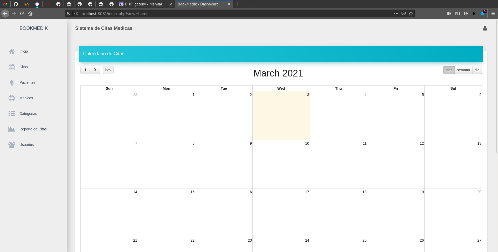
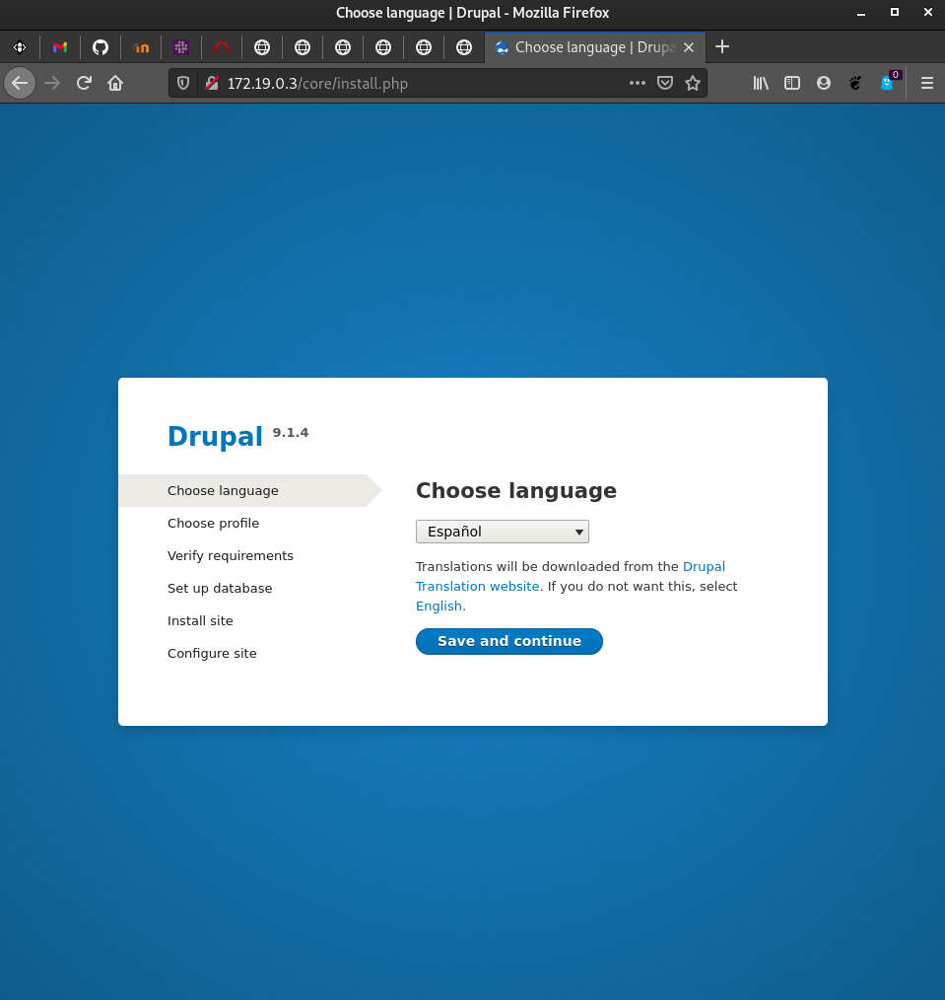
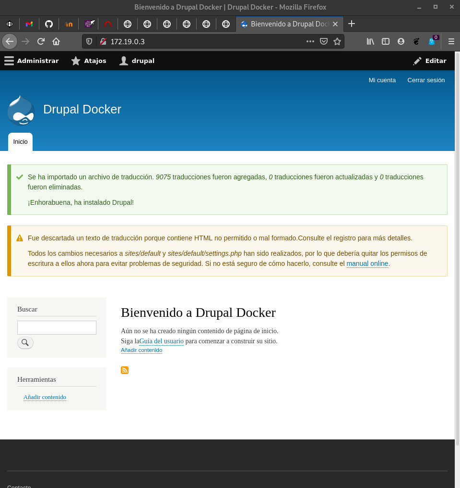
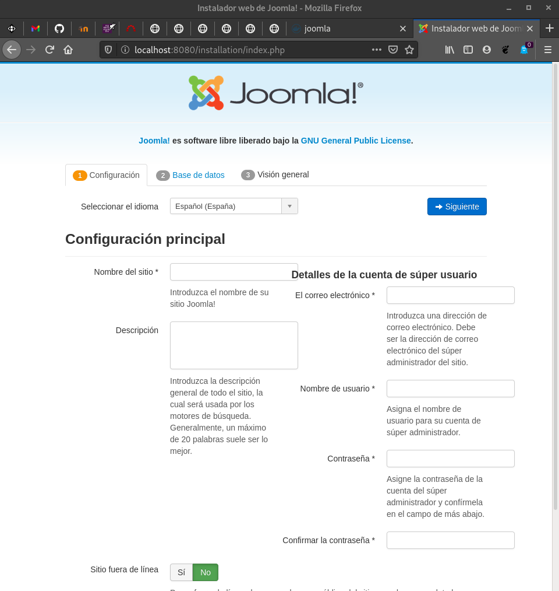
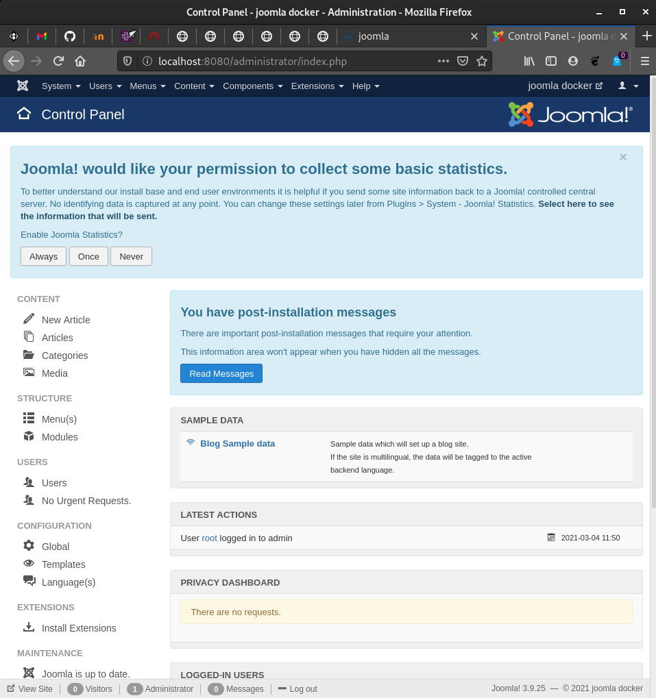

# Implantación de aplicaciones web PHP en Docker

## Tarea 1: Ejecución de una aplicación web PHP en Docker

* Queremos ejecutar en un contenedor docker la aplicación web escrita en PHP: 
bookMedik (https://github.com/evilnapsis/bookmedik).
   
* Es necesario tener un contenedor con mariadb donde vamos a crear la base de 
datos y los datos de la aplicación. El script para generar la base de datos y 
los registros lo encuentras en el repositorio y se llama schema.sql. Debes 
crear un usuario con su contraseña en la base de datos. La base de datos se 
llama bookmedik y se crea al ejecutar el script.
   
* Ejecuta el contenedor mariadb y carga los datos del script schema.sql. Para 
más información.
   
* El contenedor mariadb debe tener un volumen para guardar la base de datos.
    
* El contenedor que creas debe tener un volumen para guardar los logs de 
apache2.
   
* Crea una imagen docker con la aplicación desde una imagen base de debian o 
ubuntu. Ten en cuenta que el fichero de configuración de la base de datos 
(core\controller\Database.php) lo tienes que configurar utilizando las 
variables de entorno del contenedor mariadb. (Nota: Para obtener las variables 
de entorno en PHP usar la función getenv. Para más infomación).
   
* La imagen la tienes que crear en tu máquina con el comando docker build.
    
* Crea un script con docker compose que levante el escenario con los dos contenedores.(Usuario: admin, contraseña: admin).

* Entrega la url del repositorio GitHub donde tengas la construcción 
(directorio build y el despliegue (directorio deploy))
   
* Entrega una captura de pantalla donde se vea funcionando la aplicación, una 
vez que te has logueado.


En primer lugar, vamos a crear un directorio llamado _bookmedik_ que contendrá
los siguientes directorios:

* build --> directorio donde irá los ficheros _Dockerfile_ y _script.sh_. A su
vez, contiene una copia del repositorio de [bookmedik](https://github.com/evilnapsis/bookmedik).

* deploy --> aquí irá el fichero _docker-compose.yml_.

* volmaria --> volumen usado por el Servidor MySQL.

* volapache --> volumen usado por el Servidor Apache.

Una vez tengamos estos directorios creados, vamos a proceder a la creación
del fichero Dockerfile. Dicho fichero tendrá las siguientes líneas:

```
FROM debian
MAINTAINER Manuel Lora Román "manuelloraroman@gmail.com"
RUN apt-get update && apt-get install -y apache2 php php-mysql && apt-get clean && rm -rf /var/lib/apt/lists/*
WORKDIR /var/www/html
RUN rm index.html
COPY bookmedik/ /var/www/html
EXPOSE 80
ADD script.sh /usr/local/bin


ENV USER=bookmedik 
ENV PASSWORD=bookmedik 
ENV HOST=db 
ENV DB=bookmedik

CMD ["script.sh"]
```

Esto actualizará el contenedor y se descargará los paquetes necesarios.
Después borrará el fichero _index.html_ y copiará el contenido del
repositorio a la ubicación especificada. Añade el script e incorpora
las variables de entorno.

El contenido del script es el siguiente:

```
#!/bin/bash

sed -i "s/$this->user=\"root\";/$this->user=\"$USER\";/g" /var/www/html/core/controller/Database.php
sed -i "s/$this->pass=\"\";/$this->pass=\"$PASSWORD\";/g" /var/www/html/core/controller/Database.php
sed -i "s/$this->host=\"localhost\";/$this->host=\"$HOST\";/g" /var/www/html/core/controller/Database.php
sed -i "s/$this->ddbb=\"bookmedik\";/$this->ddbb=\"$DB\";/g" /var/www/html/core/controller/Database.php

apache2ctl -D FOREGROUND
```

Y ejecutamos la siguiente instrucción para crear la imagen:

```
manuel@debian:/media/manuel/Datos/Docker/bookmedik/build$ docker build -t manuellora/bookmedik:v1 .
Sending build context to Docker daemon  5.774MB
Step 1/13 : FROM debian
 ---> e7d08cddf791
Step 2/13 : MAINTAINER Manuel Lora Román "manuelloraroman@gmail.com"
 ---> Using cache
 ---> 275c91b8eb33
Step 3/13 : RUN apt-get update && apt-get install -y apache2 php php-mysql && apt-get clean && rm -rf /var/lib/apt/lists/*
 ---> Using cache
 ---> 372c27e9cc20
Step 4/13 : WORKDIR /var/www/html
 ---> Using cache
 ---> 3c835275d2a4
Step 5/13 : RUN rm index.html
 ---> Using cache
 ---> a83bf9f4a8ee
Step 6/13 : COPY bookmedik/ /var/www/html
 ---> 78f4bf55049b
Step 7/13 : EXPOSE 80
 ---> Running in cb2642caffee
Removing intermediate container cb2642caffee
 ---> 9af9b0e5bb99
Step 8/13 : ADD script.sh /usr/local/bin
 ---> 76aa8e87f59a
Step 9/13 : ENV USER=bookmedik
 ---> Running in a7ee59e1c2ea
Removing intermediate container a7ee59e1c2ea
 ---> a115e73979fd
Step 10/13 : ENV PASSWORD=bookmedik
 ---> Running in a4c9e79b6a0e
Removing intermediate container a4c9e79b6a0e
 ---> df1c9162f867
Step 11/13 : ENV HOST=db
 ---> Running in 9c5ff8d00c78
Removing intermediate container 9c5ff8d00c78
 ---> e7054488de3b
Step 12/13 : ENV DB=bookmedik
 ---> Running in a67ca835bd6e
Removing intermediate container a67ca835bd6e
 ---> cdd78efc8f26
Step 13/13 : CMD ["script.sh"]
 ---> Running in 35c76d8b4e18
Removing intermediate container 35c76d8b4e18
 ---> 86c75ec08ec2
Successfully built 86c75ec08ec2
Successfully tagged manuellora/bookmedik:v1
```

Creada la imagen, vamos a dirigirnos al directorio _deploy_ y crearemos
el fichero docker-compose.yml:

```
version: '3.1'

services:

  db:
    container_name: servidor_mysql
    image: mariadb
    restart: always
    environment:
      MYSQL_DATABASE: bookmedik
      MYSQL_USER: bookmedik
      MYSQL_PASSWORD: bookmedik
      MYSQL_ROOT_PASSWORD: bookmedik
    volumes:
      - /media/manuel/Datos/Docker/bookmedik/volmaria:/var/lib/mysql


  bookmedik:
    container_name: servidor_bookmedik
    image: manuellora/bookmedik:v1
    restart: always
    environment:
      USER: bookmedik
      PASSWORD: bookmedik
      HOST: db
      DB: bookmedik
    ports:
      - 80:8080
    volumes:
      - /media/manuel/Datos/Docker/bookmedik/volapache:/var/log/apache2
```

Creado el fichero, debemos ejecutarlo con la siguiente instrucción:

```
manuel@debian:/media/manuel/Datos/Docker/bookmedik/deploy$ docker-compose up -d
Creating network "deploy_default" with the default driver
Creating servidor_bookmedik ... done
Creating servidor_mysql     ... done
```

A continuación, realizamos lo siguiente para que el contenido de la
base de datos sean las tablas y el contenido del fichero _schema.sql_:

```
cat build/bookmedik/schema.sql | docker exec -i servidor_mysql /usr/bin/mysql -u root --password=bookmedik bookmedik
```

Ahora, debemos comprobar el buen funcionamiento:


El repositorio con todo el contenido se encuentra [aquí](https://github.com/ManuelLoraRoman/Docker-Bookmedik/tree/master).


## Tarea 2: Ejecución de una aplicación web PHP en docker

* Realiza la imagen docker de la aplicación a partir de la imagen oficial PHP 
que encuentras en docker hub. Lee la documentación de la imagen para 
configurar una imagen con apache2 y php, además seguramente tengas que 
instalar alguna extensión de php.
   
* Crea esta imagen en docker hub.
   
* Crea un script con docker compose que levante el escenario con los dos 
contenedores.

* Entrega la url del repositorio GitHub donde tengas la construcción 
(directorio build y el despliegue (directorio deploy))
   
* Entrega una captura de pantalla donde se vea funcionando la aplicación, una 
vez que te has logueado.

Nos descargamos la imagen de php:

```
manuel@debian:/media/manuel/Datos1/Docker/bookmedik/build$ sudo docker pull php
[sudo] password for manuel: 
Using default tag: latest
latest: Pulling from library/php
45b42c59be33: Already exists 
a48991d6909c: Pull complete 
935e2abd2c2c: Pull complete 
61ccf45ccdb9: Pull complete 
5804e3449053: Pull complete 
d702e619cf5e: Pull complete 
617bddff94d0: Pull complete 
d2aa39e842fc: Pull complete 
3788dfe34b03: Pull complete 
Digest: sha256:936a37592ef1a9486ffe60430947b7e6ad0494254fc59c8465053af2ff230841
Status: Downloaded newer image for php:latest
```

A continuación, vamos a modificar el _Dockerfile_ para usar esta imagen:

```
FROM php:7.4.3-apache
MAINTAINER Manuel Lora Román "manuelloraroman@gmail.com"
RUN docker-php-ext-install pdo pdo_mysql mysqli
RUN a2enmod rewrite
COPY bookmedik_origin/ /var/www/html
EXPOSE 80

ENV USER=bookmedik 
ENV PASSWORD=bookmedik 
ENV HOST=db 
ENV DB=bookmedik
```

A su vez, vamos a modificar el directorio de _bookmedik_ y modificaremos el
contenido de _Database.php_:

```
<?php
class Database {
	public static $db;
	public static $con;
	function Database(){
		$this->user=getenv("USER");$this->pass=getenv("PASSWORD");$this->host=getenv("HOST");$this->ddbb=getenv("DB");
	}

	function connect(){
		$con = new mysqli($this->host,$this->user,$this->pass,$this->ddbb);
		$con->query("set sql_mode=''");
		return $con;
	}

	public static function getCon(){
		if(self::$con==null && self::$db==null){
			self::$db = new Database();
			self::$con = self::$db->connect();
		}
		return self::$con;
	}
	
}
?>
```

Y creamos la imagen:

```
manuel@debian:/media/manuel/Datos/Docker/bookmedik/build$ docker build -t manuellora/bookmedik:v1 .
Sending build context to Docker daemon  11.55MB
Step 1/10 : FROM php:7.4.3-apache
 ---> d753d5b380a1
Step 2/10 : MAINTAINER Manuel Lora Román "manuelloraroman@gmail.com"
 ---> Running in d9561cb48c9e
Removing intermediate container d9561cb48c9e
 ---> 83d3235aca00
Step 3/10 : RUN docker-php-ext-install pdo pdo_mysql mysqli
.
.
.
Step 4/10 : RUN a2enmod rewrite
 ---> Running in f4ecd0a61d10
Enabling module rewrite.
To activate the new configuration, you need to run:
  service apache2 restart
Removing intermediate container f4ecd0a61d10
 ---> 0a8b2f38dd66
Step 5/10 : COPY bookmedik_origin/ /var/www/html
 ---> e8f812e2c917
Step 6/10 : EXPOSE 80
 ---> Running in 5714b9171b96
Removing intermediate container 5714b9171b96
 ---> 21fd0eab30f2
Step 7/10 : ENV USER=bookmedik
 ---> Running in 7cc7f734980a
Removing intermediate container 7cc7f734980a
 ---> 363c78ef5014
Step 8/10 : ENV PASSWORD=bookmedik
 ---> Running in a8bc154eaf06
Removing intermediate container a8bc154eaf06
 ---> ce0c24197b76
Step 9/10 : ENV HOST=db
 ---> Running in eb5fbca54457
Removing intermediate container eb5fbca54457
 ---> 8ef89a01154e
Step 10/10 : ENV DB=bookmedik
 ---> Running in 61816d5e2817
Removing intermediate container 61816d5e2817
 ---> 320320b5426c
Successfully built 320320b5426c
Successfully tagged manuellora/bookmedik:v1
```

A su vez, modificaremos el contenido del fichero _docker-compose.yml_:

```
version: '3.1'

services:

  db:
    container_name: servidor_mysql
    image: mariadb
    restart: always
    environment:
      MYSQL_DATABASE: bookmedik
      MYSQL_USER: bookmedik
      MYSQL_PASSWORD: bookmedik
      MYSQL_ROOT_PASSWORD: bookmedik
    volumes:
      - /media/manuel/Datos/Docker/bookmedik/volmaria:/var/lib/mysql


  bookmedik:
    container_name: servidor_bookmedik
    image: manuellora/bookmedik:v1
    restart: always
    environment:
      USER: bookmedik
      PASSWORD: bookmedik
      HOST: db
      DB: bookmedik
    ports:
      - 8081:80
    volumes:
      - /media/manuel/Datos1/Docker/bookmedik/volapache:/var/log/apache2
```

Y levantamos el escenario:

```
manuel@debian:/media/manuel/Datos/Docker/bookmedik/deploy$ docker-compose up -d
Creating network "deploy_default" with the default driver
Creating servidor_mysql     ... done
Creating servidor_bookmedik ... done
manuel@debian:/media/manuel/Datos/Docker/bookmedik/deploy$ docker-compose ps
       Name                    Command              State          Ports        
--------------------------------------------------------------------------------
servidor_bookmedik   docker-php-entrypoint apac     Up      0.0.0.0:8081->80/tcp
                     ...                                                        
servidor_mysql       docker-entrypoint.sh mysqld    Up      3306/tcp            
```

Y comprobamos que funciona:




## Tarea 3: Ejecución de una aplicación PHP en docker

* En este caso queremos usar un contenedor que utilice nginx para servir la 
aplicación PHP. Puedes crear la imagen desde una imagen base debian o ubuntu 
o desde la imagen oficial de nginx.
    
* Vamos a crear otro contenedor que sirva php-fpm.
   
* Y finalmente nuestro contenedor con la aplicación.
   
* Crea un script con docker compose que levante el escenario con los tres 
contenedores.

A lo mejor te puede ayudar el siguiente enlace: Dockerise your PHP application 
with Nginx and PHP7-FPM

* Entrega la url del repositorio GitHub donde tengas la construcción 
(directorio build y el despliegue (directorio deploy))
   
* Entrega una captura de pantalla donde se vea funcionando la aplicación, una 
vez que te has logueado.

Utilizaremos la imagen oficial tanto de nginx y mariadb, sin embargo, a 
la imagen de php-fpm le haremos algún cambio. 

Para ello, vamos a crear un Dockerfile para php-fpm:

```
FROM php:7.4.3-apache
MAINTAINER Manuel Lora Román "manuelloraroman@gmail.com"
RUN docker-php-ext-install pdo_mysql mysqli
```

Acto seguido, modificaremos el fichero _docker-compose.yml_ con las siguientes 
lineas:

```
version: '3.1'

services:

  bookmedik:
    image: nginx:latest
    container_name: servidor_bookmedik
    restart: always
    ports:
      - 80:80
    volumes:
      - ../build3/bookmedik_origin:/var/www/html
      - ./default.conf:/etc/nginx/conf.d/default.conf
  
  php:
    image: manuellora/bookmedik:v1
    container_name: php:7-fpm
    restart: always
    environment:
      USER: bookmedik
      PASSWORD: bookmedik
      HOST: db
    volumes:
      - ../build3//bookmedik_origin:/var/www/html
  
  db:
    image: mariadb
    container_name: servidor_mysql
    restart: always
    environment:
      MYSQL_DATABASE: bookmedik
      MYSQL_USER: bookmedik
      MYSQL_PASSWORD: bookmedik
      MYSQL_ROOT_PASSWORD: bookmedik
    volumes:
      - /media/manuel/Datos1/Docker/bookmedik/volmaria:/var/lib/mysql
```

Y desplegamos el escenario:

```

```

## Tarea 4: Ejecución de un CMS en Docker

* A partir de una imagen base (que no sea una imagen con el CMS), genera una 
imagen que despliegue un CMS PHP (que no sea wordpress).
   
* Crea los volúmenes necesarios para que la información que se guarda sea 
persistente.

* Elige un CMS PHP y crea la imagen que despliega la aplicación. Crea los 
contenedores necesarios para servir el CMS. Entrega una prueba de 
funcionamiento.
   
* Elimina los contenedores, vuelve a crearlos y demuestra que la información 
no se ha perdido.

Nos descargamos drupal en el directorio build y descomprimimos el archivo:

```
manuel@debian:/media/manuel/Datos/Docker/bookmedik/build4$ wget https://www.drupal.org/download-latest/zip
--2021-03-04 11:12:49--  https://www.drupal.org/download-latest/zip
Resolviendo www.drupal.org (www.drupal.org)... 151.101.134.217
Conectando con www.drupal.org (www.drupal.org)[151.101.134.217]:443... conectado.
Petición HTTP enviada, esperando respuesta... 302 Moved Temporarily
Localización: https://ftp.drupal.org/files/projects/drupal-9.1.4.zip [siguiendo]
--2021-03-04 11:12:50--  https://ftp.drupal.org/files/projects/drupal-9.1.4.zip
Resolviendo ftp.drupal.org (ftp.drupal.org)... 151.101.134.217
Conectando con ftp.drupal.org (ftp.drupal.org)[151.101.134.217]:443... conectado.
Petición HTTP enviada, esperando respuesta... 200 OK
Longitud: 30367235 (29M) [application/zip]
Grabando a: “zip”

zip                 100%[===================>]  28,96M  11,5MB/s    en 2,5s    

2021-03-04 11:12:53 (11,5 MB/s) - “zip” guardado [30367235/30367235]
manuel@debian:/media/manuel/Datos/Docker/bookmedik/build4$ unzip zip
```

Antes de nada, vamos a crear el script que nos permita ejecutar apache:

```
#!/bin/bash

sed -i 's/AllowOverride None/AllowOverride All/g' /etc/apache2/apache2.conf
apache2ctl -D FOREGROUND
```

Creamos en ese mismo directorio un fichero _Dockerfile_ para crear la imagen
del CMS con la base de Debian:

```
FROM debian
RUN apt-get update && apt-get install -y apache2 libapache2-mod-php php php-mysql php-dom php-xml php-gd php-mbstring && apt-get clean && rm -rf /var/lib/apt/lists/*
RUN rm /var/www/html/index.html
EXPOSE 80
COPY ./drupal-9.1.4 /var/www/html
ADD script.sh /usr/local/bin/script.sh
RUN chmod +x /usr/local/bin/script.sh
RUN chmod a+w /var/www/html/sites/default/
RUN cp /var/www/html/sites/default/default.settings.php /var/www/html/sites/default/settings.php
RUN chmod a+w /var/www/html/sites/default/settings.php
RUN a2enmod rewrite 
CMD ["/usr/local/bin/script.sh"]
```

Y creamos dicha imagen:

```
manuel@debian:/media/manuel/Datos/Docker/bookmedik/build4$ docker build -t manuellora/drupal:v1 .
Sending build context to Docker daemon  91.79MB
Step 1/12 : FROM debian
 ---> e7d08cddf791
Step 2/12 : RUN apt-get update && apt-get install -y apache2 libapache2-mod-php php php-mysql php-dom php-xml php-gd php-mbstring && apt-get clean && rm -rf /var/lib/apt/lists/*
 ---> Using cache
 ---> ffdfecdc8a1e
Step 3/12 : RUN rm /var/www/html/index.html
 ---> Using cache
 ---> 4a5917bf0872
Step 4/12 : EXPOSE 80
 ---> Using cache
 ---> 2d07931027bb
Step 5/12 : COPY ./drupal-9.1.4 /var/www/html
 ---> Using cache
 ---> bcf7e33953d3
Step 6/12 : ADD script.sh /usr/local/bin/script.sh
 ---> Using cache
 ---> 552e15078b5a
Step 7/12 : RUN chmod +x /usr/local/bin/script.sh
 ---> Using cache
 ---> e63a71514017
Step 8/12 : RUN chmod a+w /var/www/html/sites/default/
 ---> Running in 0afb8bc2b9d2
Removing intermediate container 0afb8bc2b9d2
 ---> 942cbe04d051
Step 9/12 : RUN cp /var/www/html/sites/default/default.settings.php /var/www/html/sites/default/settings.php
 ---> Running in 50dc0a2f5cc4
Removing intermediate container 50dc0a2f5cc4
 ---> bf9c976758b7
Step 10/12 : RUN chmod a+w /var/www/html/sites/default/settings.php
 ---> Running in a5e298dd0cbf
Removing intermediate container a5e298dd0cbf
 ---> 8858b43b82a5
Step 11/12 : RUN a2enmod rewrite
 ---> Running in 34c0134b8c07
Enabling module rewrite.
To activate the new configuration, you need to run:
  service apache2 restart
Removing intermediate container 34c0134b8c07
 ---> 6207bf2a2b33
Step 12/12 : CMD ["/usr/local/bin/script.sh"]
 ---> Running in 4290e2f8bb56
Removing intermediate container 4290e2f8bb56
 ---> 7f7931172cbe
Successfully built 7f7931172cbe
Successfully tagged manuellora/drupal:v1
```

Nos dirigiremos hacia el directorio de deploy, y crearemos el fichero
_docker-compose.yml_ para el despliegue del escenario:

```
version: '3.1'

services:

  drupal:
    image: manuellora/drupal:v1
    container_name: drupal
    restart: always
    ports:
      - 80:80
    environment:
      USER: drupal
      PASSWORD: drupal
      HOST: db
      DB: drupal
    volumes:
      - /media/manuel/Datos/Docker/bookmedik/voldrupal:/var/log/apache2
  
  db:
    image: mariadb
    container_name: servidor_mysql
    restart: always
    environment:
      MYSQL_DATABASE: drupal
      MYSQL_USER: drupal
      MYSQL_PASSWORD: drupal
      MYSQL_ROOT_PASSWORD: drupal
    volumes:
      - /media/manuel/Datos/Docker/bookmedik/volmaria4:/var/lib/mysql

```

Y desplegamos el escenario para su comprobación:

```
manuel@debian:/media/manuel/Datos/Docker/bookmedik/deploy4$ docker-compose up -d
Creating network "deploy4_default" with the default driver
Creating servidor_mysql ... done
Creating drupal         ... done
```

Y cuando accedemos a la página:



Instalaremos de manera normal y comprobamos que funciona correctamente:



## Tarea 5: Ejecución de un CMS en Docker

* Busca una imagen oficial de un CMS PHP en docker hub (distinto al que has 
instalado en la tarea anterior, ni wordpress), y crea los contenedores 
necesarios para servir el CMS, siguiendo la documentación de docker hub.

* Explica el proceso que has seguido para realizar la tarea, pon alguna prueba 
de funcionamiento. ¿Se ha creado algún volumen para que la información sea 
persistente?

Vamos a crear el directorio _deploy5_ y dentro del mismo, vamos a crear un
fichero _docker-compose.yml_ el cual tendrá la siguiente información:

```
version: '3.1'

services:
  joomla:
    image: joomla
    restart: always
    links:
      - joomladb:mysql
    ports:
      - 8080:80
    environment:
      JOOMLA_DB_HOST: joomladb
      JOOMLA_DB_PASSWORD: example

  joomladb:
    image: mysql:5.6
    restart: always
    environment:
      MYSQL_ROOT_PASSWORD: example
```

Creado el fichero, lo desplegamos:

```
manuel@debian:/media/manuel/Datos/Docker/bookmedik/deploy5$ docker-compose up -d
Creating network "deploy5_default" with the default driver
Pulling joomladb (mysql:5.6)...
5.6: Pulling from library/mysql
cae7303ade7f: Pull complete
1054a79d5f43: Pull complete
416bf57c9026: Pull complete
48c88503fb7a: Pull complete
1a5098f97b18: Pull complete
ed666c916387: Pull complete
86ed6d755e75: Pull complete
d02f354a199c: Pull complete
7c73c04a085d: Pull complete
0321b62dc9a8: Pull complete
520080f8d317: Pull complete
Digest: sha256:6cacab35e5b6485621c20f54a27e3024965e5bebbd465edb5de8c5c556347392
Status: Downloaded newer image for mysql:5.6
Pulling joomla (joomla:)...
latest: Pulling from library/joomla
45b42c59be33: Already exists
a48991d6909c: Already exists
935e2abd2c2c: Already exists
61ccf45ccdb9: Already exists
27b5ac70765b: Pull complete
5638b69045ba: Pull complete
0fdaed064166: Pull complete
a2f3a7f56761: Pull complete
dabb00fe464c: Pull complete
a17a0d01f8a1: Pull complete
d8e68bd34917: Pull complete
6d16e76f57fd: Pull complete
5c2f9b1b0c42: Pull complete
284b3b977732: Pull complete
b985553d1b34: Pull complete
e5de1d46ecc3: Pull complete
b47eb2980a8d: Pull complete
ff4043ae5630: Pull complete
a5eb91e3763e: Pull complete
Digest: sha256:e79be167e872faaad79d5726f5a76f257d148fc2636bbc50784479c2212835d0
Status: Downloaded newer image for joomla:latest
Creating deploy5_joomladb_1 ... done
Creating deploy5_joomla_1   ... done
```

Y comprobamos su funcionamiento:

```
manuel@debian:/media/manuel/Datos/Docker/bookmedik/deploy5$ docker ps
CONTAINER ID        IMAGE               COMMAND                  CREATED             STATUS              PORTS                  NAMES
5f7459b7e95b        joomla              "/entrypoint.sh apac…"   49 seconds ago      Up 48 seconds       0.0.0.0:8080->80/tcp   deploy5_joomla_1
0e49b0d414f9        mysql:5.6           "docker-entrypoint.s…"   49 seconds ago      Up 48 seconds       3306/tcp               deploy5_joomladb_1
```



Y comprobamos que la instalación ha ido correctamente:


