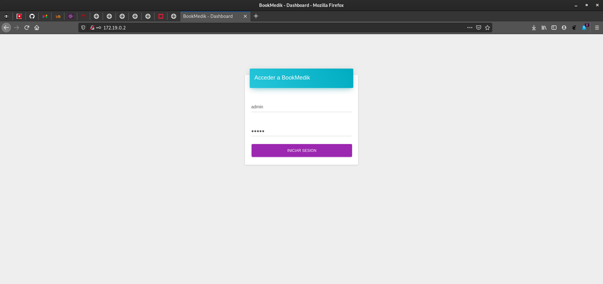
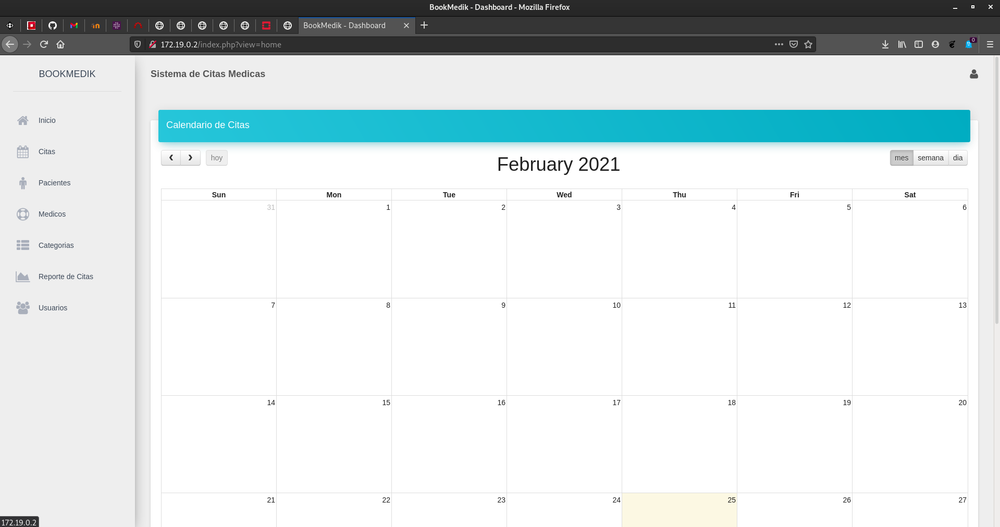

# Implantación de aplicaciones web PHP en Docker

## Tarea 1: Ejecución de una aplicación web PHP en Docker

* Queremos ejecutar en un contenedor docker la aplicación web escrita en PHP: 
bookMedik (https://github.com/evilnapsis/bookmedik).
   
* Es necesario tener un contenedor con mariadb donde vamos a crear la base de 
datos y los datos de la aplicación. El script para generar la base de datos y 
los registros lo encuentras en el repositorio y se llama schema.sql. Debes 
crear un usuario con su contraseña en la base de datos. La base de datos se 
llama bookmedik y se crea al ejecutar el script.
   
* Ejecuta el contenedor mariadb y carga los datos del script schema.sql. Para 
más información.
   
* El contenedor mariadb debe tener un volumen para guardar la base de datos.
    
* El contenedor que creas debe tener un volumen para guardar los logs de 
apache2.
   
* Crea una imagen docker con la aplicación desde una imagen base de debian o 
ubuntu. Ten en cuenta que el fichero de configuración de la base de datos 
(core\controller\Database.php) lo tienes que configurar utilizando las 
variables de entorno del contenedor mariadb. (Nota: Para obtener las variables 
de entorno en PHP usar la función getenv. Para más infomación).
   
* La imagen la tienes que crear en tu máquina con el comando docker build.
    
* Crea un script con docker compose que levante el escenario con los dos contenedores.(Usuario: admin, contraseña: admin).

* Entrega la url del repositorio GitHub donde tengas la construcción 
(directorio build y el despliegue (directorio deploy))
   
* Entrega una captura de pantalla donde se vea funcionando la aplicación, una 
vez que te has logueado.


En primer lugar, vamos a crear un directorio llamado _bookmedik_ que contendrá
los siguientes directorios:

* build --> directorio donde irá los ficheros _Dockerfile_ y _script.sh_. A su
vez, contiene una copia del repositorio de [bookmedik](https://github.com/evilnapsis/bookmedik).

* deploy --> aquí irá el fichero _docker-compose.yml_.

* volmaria --> volumen usado por el Servidor MySQL.

* volapache --> volumen usado por el Servidor Apache.

Una vez tengamos estos directorios creados, vamos a proceder a la creación
del fichero Dockerfile. Dicho fichero tendrá las siguientes líneas:

```
FROM debian
MAINTAINER Manuel Lora Román "manuelloraroman@gmail.com"
RUN apt-get update && apt-get install -y apache2 php php-mysql && apt-get clean && rm -rf /var/lib/apt/lists/*
WORKDIR /var/www/html
RUN rm index.html
COPY bookmedik/ /var/www/html
EXPOSE 80
ADD script.sh /usr/local/bin


ENV USER=bookmedik 
ENV PASSWORD=bookmedik 
ENV HOST=db 
ENV DB=bookmedik

CMD ["script.sh"]
```

Esto actualizará el contenedor y se descargará los paquetes necesarios.
Después borrará el fichero _index.html_ y copiará el contenido del
repositorio a la ubicación especificada. Añade el script e incorpora
las variables de entorno.

El contenido del script es el siguiente:

```
#!/bin/bash

sed -i "s/$this->user=\"root\";/$this->user=\"$USER\";/g" /var/www/html/core/controller/Database.php
sed -i "s/$this->pass=\"\";/$this->pass=\"$PASSWORD\";/g" /var/www/html/core/controller/Database.php
sed -i "s/$this->host=\"localhost\";/$this->host=\"$HOST\";/g" /var/www/html/core/controller/Database.php
sed -i "s/$this->ddbb=\"bookmedik\";/$this->ddbb=\"$DB\";/g" /var/www/html/core/controller/Database.php

apache2ctl -D FOREGROUND
```

Y ejecutamos la siguiente instrucción para crear la imagen:

```
manuel@debian:/media/manuel/Datos/Docker/bookmedik/build$ docker build -t manuellora/bookmedik:v1 .
Sending build context to Docker daemon  5.774MB
Step 1/13 : FROM debian
 ---> e7d08cddf791
Step 2/13 : MAINTAINER Manuel Lora Román "manuelloraroman@gmail.com"
 ---> Using cache
 ---> 275c91b8eb33
Step 3/13 : RUN apt-get update && apt-get install -y apache2 php php-mysql && apt-get clean && rm -rf /var/lib/apt/lists/*
 ---> Using cache
 ---> 372c27e9cc20
Step 4/13 : WORKDIR /var/www/html
 ---> Using cache
 ---> 3c835275d2a4
Step 5/13 : RUN rm index.html
 ---> Using cache
 ---> a83bf9f4a8ee
Step 6/13 : COPY bookmedik/ /var/www/html
 ---> 78f4bf55049b
Step 7/13 : EXPOSE 80
 ---> Running in cb2642caffee
Removing intermediate container cb2642caffee
 ---> 9af9b0e5bb99
Step 8/13 : ADD script.sh /usr/local/bin
 ---> 76aa8e87f59a
Step 9/13 : ENV USER=bookmedik
 ---> Running in a7ee59e1c2ea
Removing intermediate container a7ee59e1c2ea
 ---> a115e73979fd
Step 10/13 : ENV PASSWORD=bookmedik
 ---> Running in a4c9e79b6a0e
Removing intermediate container a4c9e79b6a0e
 ---> df1c9162f867
Step 11/13 : ENV HOST=db
 ---> Running in 9c5ff8d00c78
Removing intermediate container 9c5ff8d00c78
 ---> e7054488de3b
Step 12/13 : ENV DB=bookmedik
 ---> Running in a67ca835bd6e
Removing intermediate container a67ca835bd6e
 ---> cdd78efc8f26
Step 13/13 : CMD ["script.sh"]
 ---> Running in 35c76d8b4e18
Removing intermediate container 35c76d8b4e18
 ---> 86c75ec08ec2
Successfully built 86c75ec08ec2
Successfully tagged manuellora/bookmedik:v1
```

Creada la imagen, vamos a dirigirnos al directorio _deploy_ y crearemos
el fichero docker-compose.yml:

```
version: '3.1'

services:

  db:
    container_name: servidor_mysql
    image: mariadb
    restart: always
    environment:
      MYSQL_DATABASE: bookmedik
      MYSQL_USER: bookmedik
      MYSQL_PASSWORD: bookmedik
      MYSQL_ROOT_PASSWORD: bookmedik
    volumes:
      - /media/manuel/Datos/Docker/bookmedik/volmaria:/var/lib/mysql


  bookmedik:
    container_name: servidor_bookmedik
    image: manuellora/bookmedik:v1
    restart: always
    environment:
      USER: bookmedik
      PASSWORD: bookmedik
      HOST: db
      DB: bookmedik
    ports:
      - 80:8080
    volumes:
      - /media/manuel/Datos/Docker/bookmedik/volapache:/var/log/apache2
```

Creado el fichero, debemos ejecutarlo con la siguiente instrucción:

```
manuel@debian:/media/manuel/Datos/Docker/bookmedik/deploy$ docker-compose up -d
Creating network "deploy_default" with the default driver
Creating servidor_bookmedik ... done
Creating servidor_mysql     ... done
```

A continuación, realizamos lo siguiente para que el contenido de la
base de datos sean las tablas y el contenido del fichero _schema.sql_:

```
cat build/bookmedik/schema.sql | docker exec -i servidor_mysql /usr/bin/mysql -u root --password=bookmedik bookmedik
```

Ahora, debemos comprobar el buen funcionamiento:





El repositorio con todo el contenido se encuentra [aquí](https://github.com/ManuelLoraRoman/Docker-Bookmedik/tree/master).


## Tarea 2: Ejecución de una aplicación web PHP en docker

* Realiza la imagen docker de la aplicación a partir de la imagen oficial PHP 
que encuentras en docker hub. Lee la documentación de la imagen para 
configurar una imagen con apache2 y php, además seguramente tengas que 
instalar alguna extensión de php.
   
* Crea esta imagen en docker hub.
   
* Crea un script con docker compose que levante el escenario con los dos 
contenedores.

* Entrega la url del repositorio GitHub donde tengas la construcción 
(directorio build y el despliegue (directorio deploy))
   
* Entrega una captura de pantalla donde se vea funcionando la aplicación, una 
vez que te has logueado.

Nos descargamos la imagen de php:

```
manuel@debian:/media/manuel/Datos1/Docker/bookmedik/build$ sudo docker pull php
[sudo] password for manuel: 
Using default tag: latest
latest: Pulling from library/php
45b42c59be33: Already exists 
a48991d6909c: Pull complete 
935e2abd2c2c: Pull complete 
61ccf45ccdb9: Pull complete 
5804e3449053: Pull complete 
d702e619cf5e: Pull complete 
617bddff94d0: Pull complete 
d2aa39e842fc: Pull complete 
3788dfe34b03: Pull complete 
Digest: sha256:936a37592ef1a9486ffe60430947b7e6ad0494254fc59c8465053af2ff230841
Status: Downloaded newer image for php:latest
```

A continuación, vamos a modificar el _Dockerfile_ para usar esta imagen:

```

```


## Tarea 3: Ejecución de una aplicación PHP en docker


* En este caso queremos usar un contenedor que utilice nginx para servir la 
aplicación PHP. Puedes crear la imagen desde una imagen base debian o ubuntu 
o desde la imagen oficial de nginx.
    
* Vamos a crear otro contenedor que sirva php-fpm.
   
* Y finalmente nuestro contenedor con la aplicación.
   
* Crea un script con docker compose que levante el escenario con los tres 
contenedores.

A lo mejor te puede ayudar el siguiente enlace: Dockerise your PHP application 
with Nginx and PHP7-FPM

* Entrega la url del repositorio GitHub donde tengas la construcción 
(directorio build y el despliegue (directorio deploy))
   
* Entrega una captura de pantalla donde se vea funcionando la aplicación, una 
vez que te has logueado.


