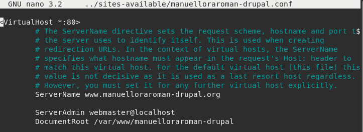
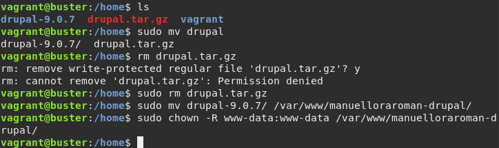
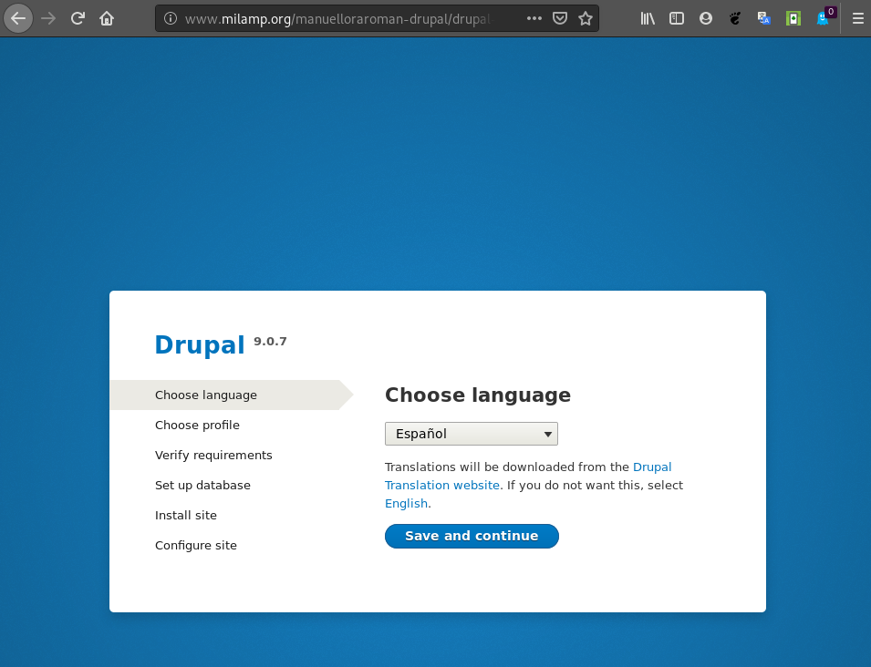

# Práctica: Instalación local de un CMS PHP


## Tarea 1: Instalación de un servidor LAMP

* Crea una instancia de vagrant basado en un box debian o ubuntu.

* Instala en esa máquina virtual toda la pila LAMP.

Entrega una documentación resumida donde expliques los pasos fundamentales para
realizar esta tarea.

Dicha documentación la podemos encontrar en el siguiente [enlace](./LAMP.md)


## Tarea 2: Instalación de drupal en mi servidor local


* Configura el servidor web con virtual hosting para que el CMS sea accesible 
desde la dirección: www.nombrealumno-drupal.org.

Seguiremos las mismas intrucciones que en el ejercicio de [VirtualHosting](https://github.com/ManuelLoraRoman/ApuntesASIR/blob/master/Servicios%20de%20Red%20e%20Internet/VirtualHosting.md),
salvo que modificaremos el ServerName por _www.manuelloraroman-drupal.org_.



* Crea un usuario en la base de datos para trabajar con la base de datos 
donde se van a guardar los datos del CMS.

Esta información la hemos incorporado en el enlace de LAMP.

* Descarga la versión que te parezca más oportuna de Drupal y realiza la 
instalación.

Como drupal no se puede descargar mediante paquete debemos hacer la siguiente
descarga e instalación:

```
sudo wget https://www.drupal.org/download-latest/tar.gz -O drupal.tar.gz
sudo tar xvf drupal.tar.gz
sudo mv drupal-9.0.7 /var/www/nombrealumno-drupal
sudo chown -R www-data:www-data /var/www/nombrealumno-drupal
```



Una vez accedemos a la página, nos aparecerá lo siguiente:



Y procederemos a la instalación:


* Realiza una configuración mínima de la aplicación (Cambia la plantilla, 
crea algún contenido,…)

* Instala un módulo para añadir alguna funcionalidad a drupal.

En este momento, muestra al profesor la aplicación funcionando en local. 
Entrega un documentación resumida donde expliques los pasos fundamentales 
para realizar esta tarea.

