# Práctica: Instalación local de un CMS PHP


## Tarea 1: Instalación de un servidor LAMP

* Crea una instancia de vagrant basado en un box debian o ubuntu.

* Instala en esa máquina virtual toda la pila LAMP.

Entrega una documentación resumida donde expliques los pasos fundamentales para
realizar esta tarea.

Dicha documentación la podemos encontrar en el siguiente [enlace](./LAMP.md)


## Tarea 2: Instalación de drupal en mi servidor local


* Configura el servidor web con virtual hosting para que el CMS sea accesible 
desde la dirección: www.nombrealumno-drupal.org.

Seguiremos las mismas intrucciones que en el ejercicio de [VirtualHosting](https://github.com/ManuelLoraRoman/ApuntesASIR/blob/master/Servicios%20de%20Red%20e%20Internet/VirtualHosting.md),
salvo que modificaremos el ServerName por _www.manuelloraroman-drupal.org_.


* Crea un usuario en la base de datos para trabajar con la base de datos 
donde se van a guardar los datos del CMS.

Esta información la hemos incorporado en el enlace de LAMP.

* Descarga la versión que te parezca más oportuna de Drupal y realiza la 
instalación.

Como drupal no se puede descargar mediante paquete debemos hacer la siguiente
descarga e instalación:

```
sudo wget https://www.drupal.org/download-latest/tar.gz -O drupal.tar.gz
sudo tar xvf drupal.tar.gz
sudo mv drupal-9.0.7 /var/www/nombrealumno-drupal
sudo chown -R www-data:www-data /var/www/nombrealumno-drupal
```


Una vez accedemos a la página, nos aparecerá lo siguiente:


Y procederemos a la instalación:


Nos pedirá qué tipo de BBDD queremos utilizar, alguna que tengamos creada y un
usuario de dicha base de datos.

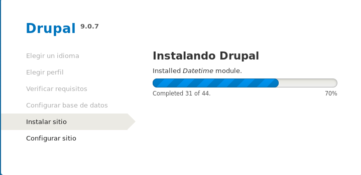

Nos pedirá ahora rellenar diferentes campos con información:

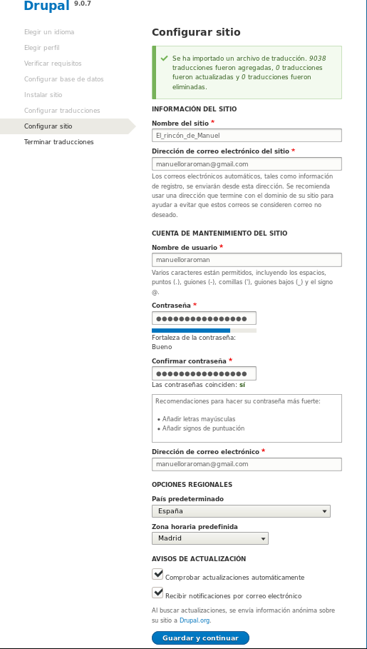

Y así, ya tendriamos instalado Drupal.

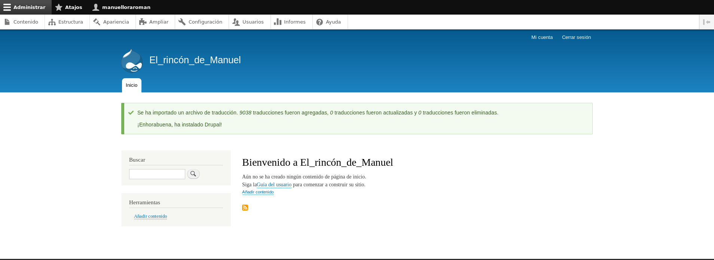

* Realiza una configuración mínima de la aplicación (Cambia la plantilla, 
crea algún contenido,…)

Para quitar el !!!Warning que tenemos sobre las URLs limpias, debemos hacer:

```
sudo a2enmod rewrite
```

Y modificamos el fichero _.conf_ de nuestro VirtualHosting con las siguientes
lineas:

```
<Directory /var/www/html>
	AllowOverride All
</Directory>
```

Y ya podriamos modificar nuestro sitio web con drupal.

Primero, crearemos un articulo:

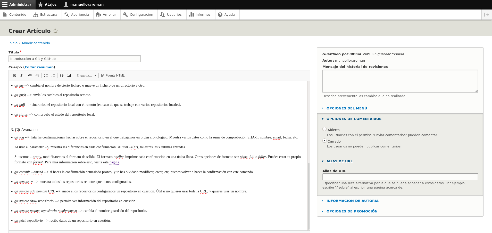

Ahora instalaremos un nuevo tema:

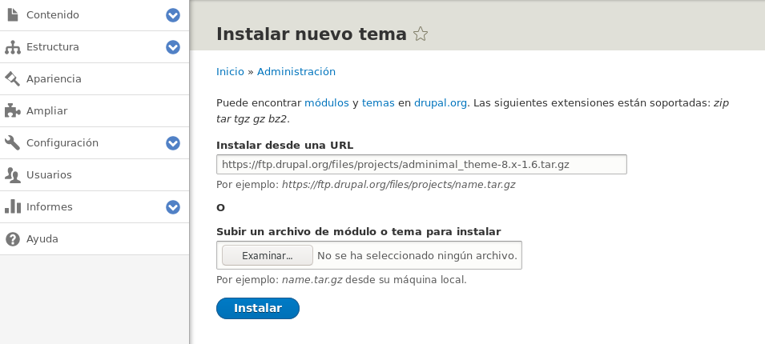

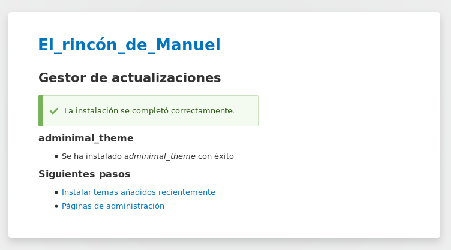

En la Pestaña _Apariencia --> Temas Desinstalados --> Adminimal ..._ le damos a
instalar y después le damos a _Configurar como predeterminado_.

* Instala un módulo para añadir alguna funcionalidad a drupal.

Ahora instalaremos algún módulo:

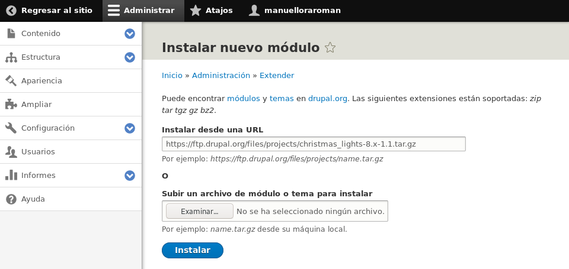

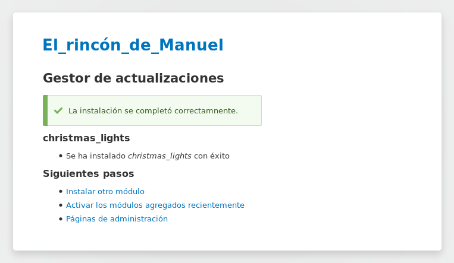

Y nos iriamos a la Pestaña _Ampliar --> Listado --> Otros (en nuestro caso)_ y
lo seleccionamos y le damos a _Instalar_. Y ya tendríamos el módulo activado.

## Tarea 3: Configuración multinodo

* Realiza un copia de seguridad de la base de datos.

Ya una vez tenemos Drupal funcionando, vamos a proceder a hacer una copia de
seguridad de la BBDD. 

```
sudo mysqldump [nombre_BD] > [nombre_BD].sql
```

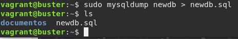

* Crea otra máquina con vagrant, conectada con una red interna a la anterior 
y configura un servidor de base de datos. Crea un usuario en la base de datos 
para trabajar con la nueva base de datos.

Ahora crearemos otro máquina Vagrant. 

```
Vagrant.configure("2") do |config|

  config.vm.box = "debian/buster64"
  config.vm.network :public_network, :bridge =>"wlp2s0"
  config.vm.network :private_network, ip:"192.168.100.5",
	virtualbox__intnet: "redinterna3"
end
```
E instalaremos MariaDB:

```
apt-get install mariadb-client mariadb-server
```

Y transferiremos mediante scp el backup de la BBD a la nueva máquina.

* Restaura la copia de seguridad en el nuevo servidor de base datos.

Una vez 
tengamos eso hecho, haremos lo siguiente en la terminal de MySQL:

```
create database newdb;
grant usage on newdb.* to manuel@localhost identified by 1q2w3e4r5t;
grant all privileges on newdb.* to manuel@localhost;
flush privileges;
```
Y una vez hecho esto, haremos _mysql newdb > newdb.sql_.

* Desinstala el servidor de base de datos en el servidor principal.

Para eliminar la base de datos del servidor principal, únicamente debemos hacer:

```
DROP DATABASE newdb;
```

* Realiza los cambios de configuración necesario en drupal para que 
la página funcione.

Para que nuestra BBDD funcione, debemos escribir el siguiente fichero:

```
sudo nano /etc/mysql/mariadb.conf.d/50-server.cn

Y modificar lo siguiente:

bind-address = 0.0.0.0
```

Esto le indicará que puede recibir conexiones de cualquier dirección IP.

A continuación en drupal, debemos dirigirnos hacia la ruta donde tengamos
drupal. En nuestro caso, _/var/www/html/manuelloraroman-drupal/drupal-9.0.7/sites/default/_
y modificar el fichero _settings.php_.

Debemos encontrarnos con algo parecido a esto (cambiar con nuestros datos):

```
$databases['default']['default'] = array (
 'database' => 'newdb',
 'username' => 'manuel',
 'password' => '1q2w3e4r5t',
 'prefix' => '',
 'host' => '192.168.100.6',
 'port' => '3306',
 'namespace' => 'Drupal\\Core\\Database\\Driver\\mysql',
 'driver' => 'mysql',
);
```

Y reiniciamos el servicio de MariaDB y Apache. Cuando accedamos, lo tendremos
operativo y sin ningún cambio.

## Tarea 4: Instalación de otro CMS PHP

* Elige otro CMS realizado en PHP y realiza la instalación en tu 
infraestructura.

* Configura otro virtualhost y elige otro nombre en el mismo dominio.

En primer lugar, hemos elegido el CMS de Joomla.

Primero, para instalarlo, debemos descargarlo desde su página web:

```
wget -q https://downloads.joomla.org/cms/joomla3/3-9-20/Joomla_3-9-20-Stable-Full_Package.tar.bz2
```

A continuación, nos dirigiremos hacia el directorio _/var/www/html_ y crearemos
un directorio llamado _joomla_ donde descomprimiremos el paquete descargado.

```
sudo tar xf Joomla_3-9-20-Stable-Full_Package.tar.bz2 -C /var/www/html/joomla/
```

El directorio joomla contiene un fichero llamado htaccess.txt cuyo nombre
deberemos cambiar por:

```
sudo mv /var/www/html/joomla/htaccess.txt /var/www/html/joomla/.htaccess
```

Y como joomla necesitará editar su propio directorio, le otorgaremos propiedad
de dicho directorio:

```
sudo chown -R www-data: /var/www/html/joomla/
```

Ahora, crearemos un nueva configuración de apache2 e introduciremos este 
contenido dentro:

```
<Directory /var/www/html/joomla>
    AllowOverride All
    php_value output_buffering "0"
</Directory>
```

Activamos dicha configuración y el módulo _rewrite_, reiniciamos el servicio.

Joomla requiere la presencia de algunas extensiones de php:

```
sudo apt install -y php-xml php-zip php-mysql
```

Una vez instalados, reiniciamos el servicio.

Y ahora procederemos a la instalación de joomla.

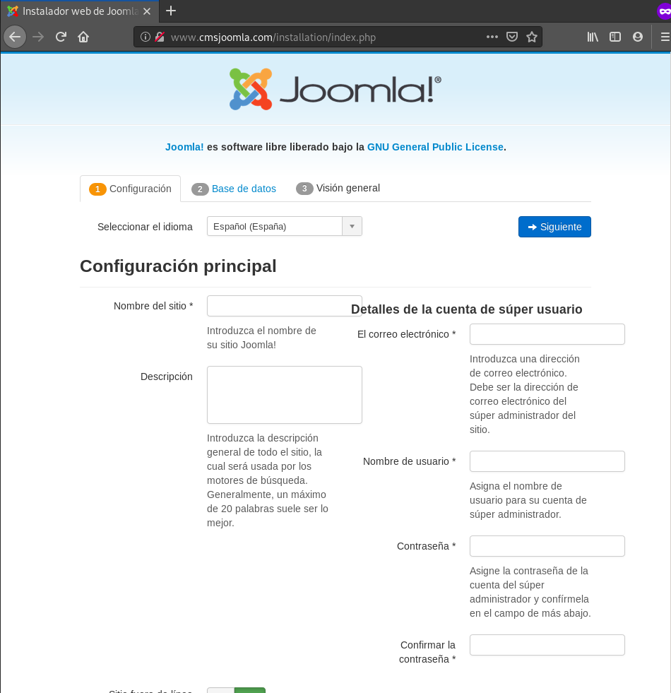

La primera pantalla nos pedirá completar información trivial sobre el sitio web.

Ahora nos pedirá completar información sobre la base de datos, la cual iremos
completando con el nombre de la BBDD, usuario y contraseña creados 
anteriormente en el LAMP:

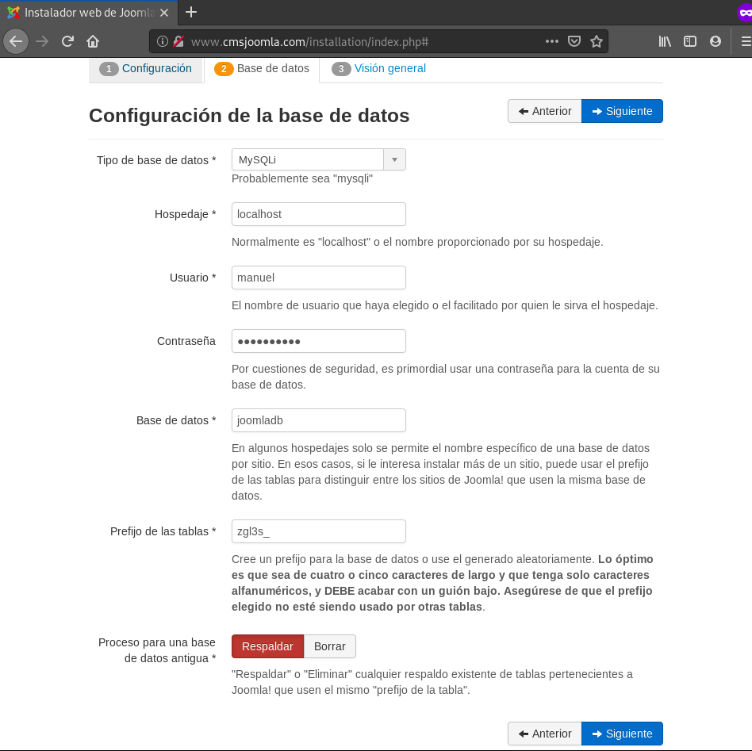

Y el siguiente paso, se ultima los aspectos finales de la instalación que
rellenaremos según el gusto:

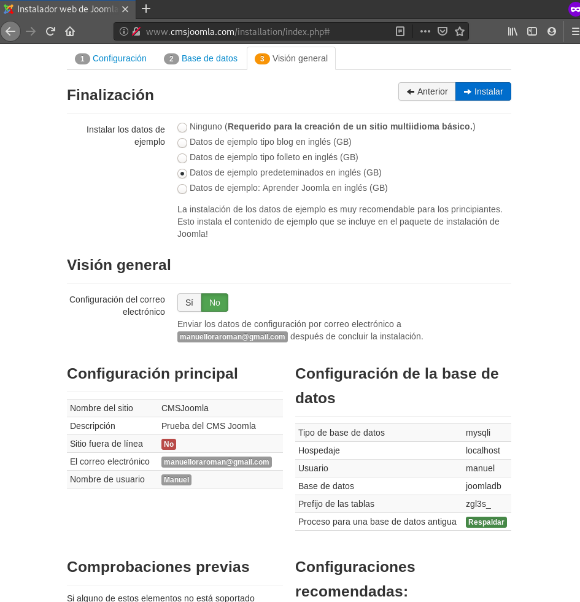

En nuestro caso, hemos instalado los datos de ejemplo, no queremos que nos
envien correos una vez terminado la instalación y al final aparece un resumen
de la instalación.

Una vez instalado, nos aparecerá lo siguiente:

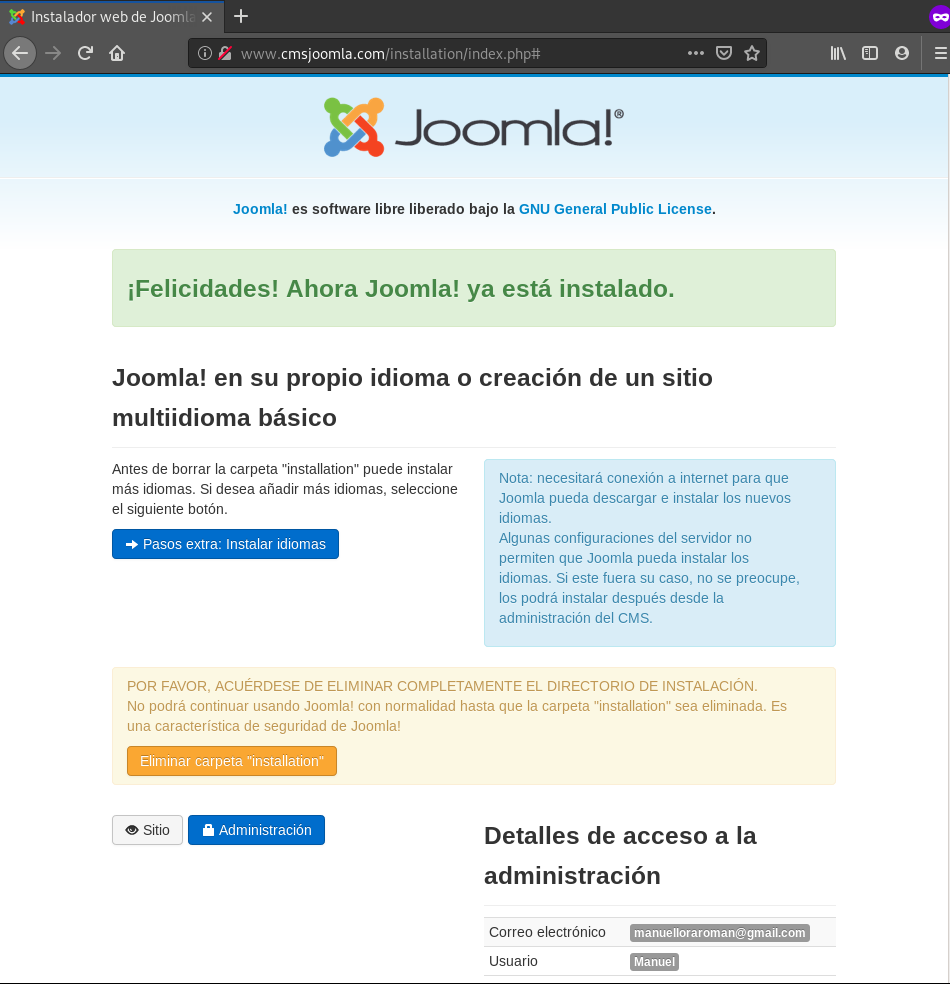

Para continuar con Joomla, es necesario eliminar el directorio _installation._

Y ya estaría finalizado la instalación de Joomla.

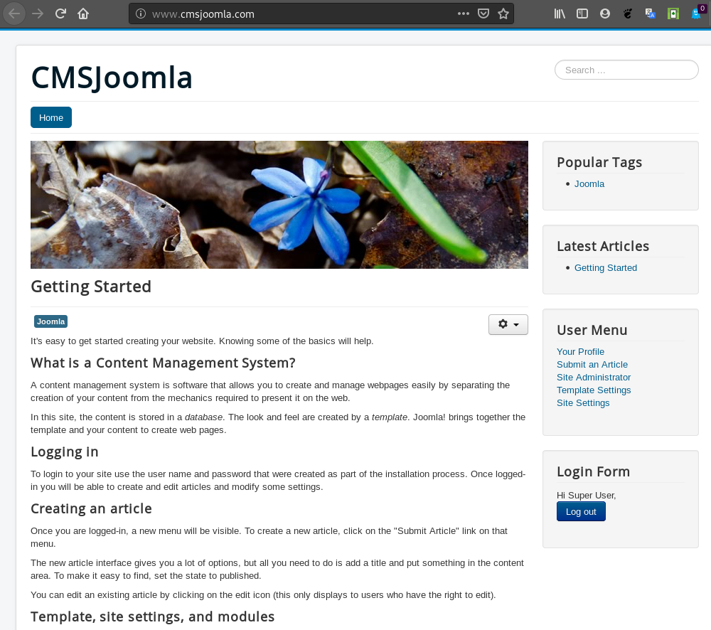

## Tarea 5: Necesidad de otros servicios

* La mayoría de los CMS tienen la posibilidad de mandar correos electrónicos 
(por ejemplo para notificar una nueva versión, notificar un comentario,…)

* Instala un servidor de correo electrónico en tu servidor. debes configurar 
un servidor relay de correo, para ello en el fichero /etc/postfix/main.cf, 
debes poner la siguiente línea:

``` relayhost = babuino-smtp.gonzalonazareno.org```

* Configura alguno de los CMS para utilizar tu servidor de correo y realiza 
una prueba de funcionamiento.

En primer lugar, vamos a instalarnos el paquete postfix.

En la instalación de _Postfix_, nos pedirá que elijamos una de 4 opciones. 
En nuestro caso, vamos a decirle local y después, nos pedirá un nombre de
dominio. 

Una vez hecho esto, modificaremos el fichero _/etc/postfix/main.cf_ para
introducir el _relayhost y las interfaces_:

```
smtpd_relay_restrictions = permit_mynetworks permit_sasl_authenticated defer_unauth_destination
myhostname = cmsjoomla.com
alias_maps = hash:/etc/aliases
alias_database = hash:/etc/aliases
mydestination = $myhostname, www.comsjoomla.com, localhost.localdomain, localhost
relayhost = babuino-smtp.gonzalonazareno.org
mynetworks = 127.0.0.0/8 [::ffff:127.0.0.0]/104 [::1]/128
mailbox_command = procmail -a "$EXTENSION"
mailbox_size_limit = 0
recipient_delimiter = +
inet_interfaces = all to inet_iterfaces = loopback-only
default_transport = error
relay_transport = error
inet_protocols = all
```

Y reiniciamos el servicio.

Ahora, nos iremos a la configuración de Joomla, y en el apartado de 
_Configuración global --> Servidor --> Configuración de email_ ponemos la
siguiente configuración personalizada:

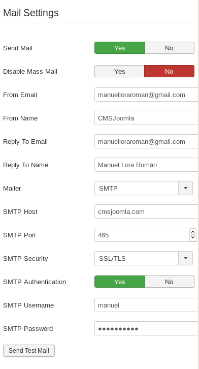

Y le damos al botón de _Send Test Mail_ y comprobamos que funciona 
correctamente:

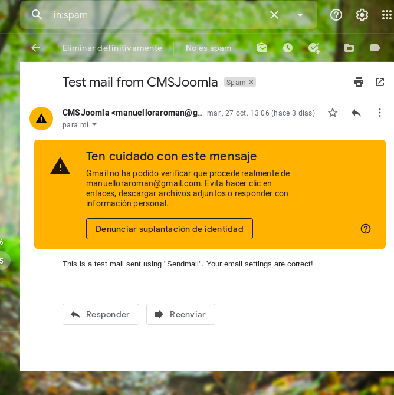

