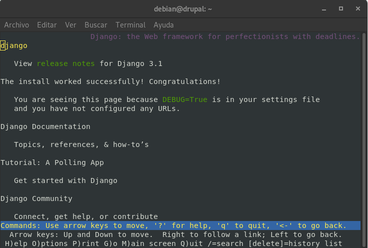

# Despliegue de aplicaciones python

En primer lugar, debemos de asegurarnos que tenemos instalados tanto pyhton3
como Django. 

Para instalar Django, crearemos un entorno virtual de la siguiente manera:

```
debian@drupal:~$ virtualenv django -p python3
Already using interpreter /usr/bin/python3
Using base prefix '/usr'
New python executable in /home/debian/django/bin/python3
Also creating executable in /home/debian/django/bin/python
Installing setuptools, pkg_resources, pip, wheel...done.
debian@drupal:~$ ls
django 
```

Para instalar Django haremos esto otro:

```
debian@drupal:~$ source ~/django/bin/activate
(django) debian@drupal:~$ python -m pip install Django
Collecting Django
  Downloading Django-3.1.3-py3-none-any.whl (7.8 MB)
     |████████████████████████████████| 7.8 MB 5.1 MB/s 
Collecting sqlparse>=0.2.2
  Downloading sqlparse-0.4.1-py3-none-any.whl (42 kB)
     |████████████████████████████████| 42 kB 300 kB/s 
Collecting pytz
  Downloading pytz-2020.4-py2.py3-none-any.whl (509 kB)
     |████████████████████████████████| 509 kB 5.5 MB/s 
Collecting asgiref<4,>=3.2.10
  Downloading asgiref-3.3.1-py3-none-any.whl (19 kB)
Installing collected packages: sqlparse, pytz, asgiref, Django
Successfully installed Django-3.1.3 asgiref-3.3.1 pytz-2020.4 sqlparse-0.4.1
(django) debian@drupal:~$ 
```

Hecho esto, ya podremos empezar el tutorial de Django. Primero vamos a crear un
proyecto llamado misitio:

```
(django) debian@drupal:~$ django-admin startproject misitio
(django) debian@drupal:~$ ls
django  misitio
```

Y haremos un _runserver_ para comprobar que funciona:

```
(django) debian@drupal:~/misitio$ python manage.py migrate
Operations to perform:
  Apply all migrations: admin, auth, contenttypes, sessions
Running migrations:
  Applying contenttypes.0001_initial... OK
  Applying auth.0001_initial... OK
  Applying admin.0001_initial... OK
  Applying admin.0002_logentry_remove_auto_add... OK
  Applying admin.0003_logentry_add_action_flag_choices... OK
  Applying contenttypes.0002_remove_content_type_name... OK
  Applying auth.0002_alter_permission_name_max_length... OK
  Applying auth.0003_alter_user_email_max_length... OK
  Applying auth.0004_alter_user_username_opts... OK
  Applying auth.0005_alter_user_last_login_null... OK
  Applying auth.0006_require_contenttypes_0002... OK
  Applying auth.0007_alter_validators_add_error_messages... OK
  Applying auth.0008_alter_user_username_max_length... OK
  Applying auth.0009_alter_user_last_name_max_length... OK
  Applying auth.0010_alter_group_name_max_length... OK
  Applying auth.0011_update_proxy_permissions... OK
  Applying auth.0012_alter_user_first_name_max_length... OK
  Applying sessions.0001_initial... OK
(django) debian@drupal:~/misitio$ python manage.py runserver
Watching for file changes with StatReloader
Performing system checks...

System check identified no issues (0 silenced).
November 10, 2020 - 16:36:04
Django version 3.1.3, using settings 'misitio.settings'
Starting development server at http://127.0.0.1:8000/
Quit the server with CONTROL-C.
```

Para crear la aplicación de encuestas, ejecutaremos el siguiente comando:

```
(django) debian@drupal:~/misitio$ python manage.py startapp polls
```

Con esto, nos creará los directorios pertinentes para la aplicación. Ahora,
editaremos el fichero _polls/views.py_ con las siguientes lineas:

```
from django.http import HttpResponse


def index(request):
    return HttpResponse("Hello, world. You're at the polls index.")
```

Para llamar a la vista, necesitamos mapearla hacia una URL y para ello
necesitamos configurarla con un fichero llamado _/polls/urls.py_:

```
from django.urls import path

from . import views

urlpatterns = [
    path('', views.index, name='index'),
]
```

Con esto hecho, pasaremos a la creación del mismo fichero pero en el directorio
de nuestro sitio y lo editaremos con esto:

```
from django.contrib import admin
from django.urls import include, path

urlpatterns = [
    path('polls/', include('polls.urls')),
    path('admin/', admin.site.urls),
]
```

Y ahora ejecutaremos ```python manage.py runserver``` y veremos que podemos
acceder localmente a nuestra página:



Ahora realizaremos un fork del repositorio: _https://github.com/josedom24/django_tutorial_.

