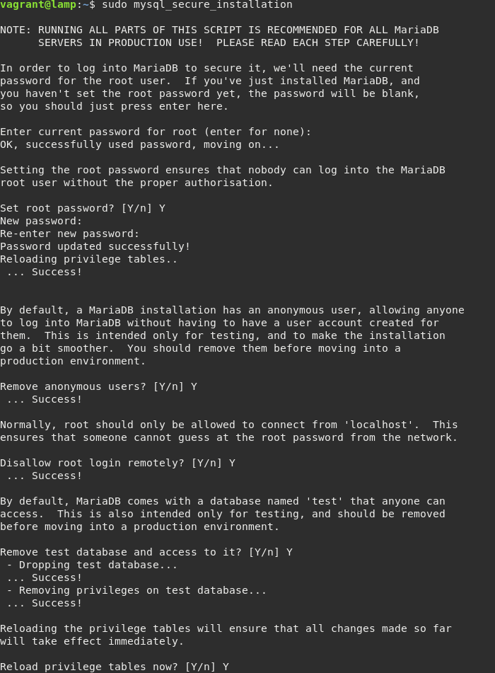
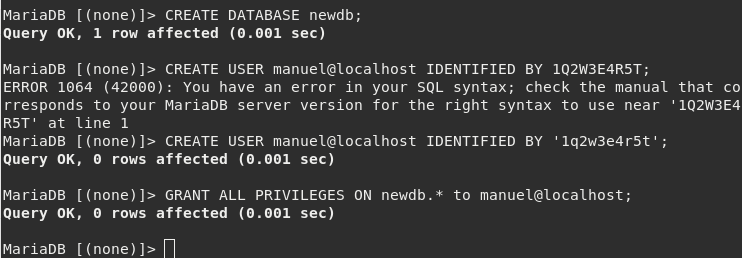
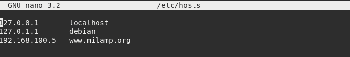
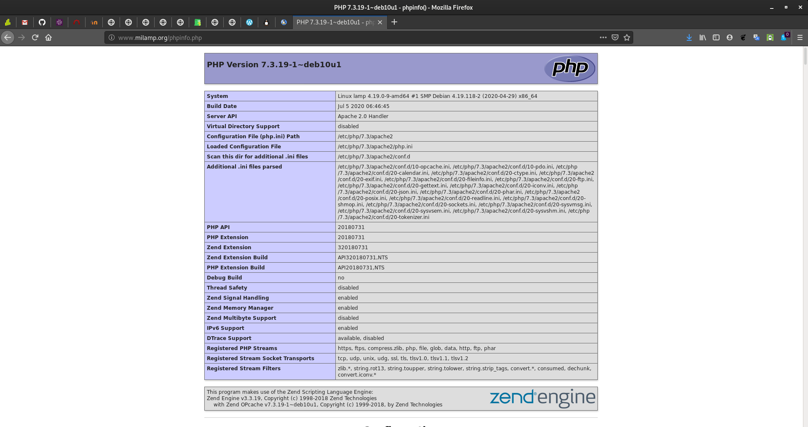

# Instalación LAMP en Debian 10

## Instalación MariaDB (MySQL)

En primer lugar debemos instalar MariaDB:

```apt install mariadb-client mariadb-server```

Después de la instalación, ejecutaremos el siguiente comando:

```sudo mysql_secure_installation```

  

Una vez instalada, puedes logearte como _root_ y crear un usuario normal y una 
base de datos.

```sudo mysql -u root -p```

Crearemos una nueva base de datos:

```CREATE DATABASE newdb;```

Y a continuación, creamos un nuevo usuario:

```CREATE USER "Usuario"@localhost IDENTIFIED BY 'Contraseña';``` 

Y le damos privilegios a dicho usuario:

```GRANT ALL PRIVILEGES ON newdb.* to "Usuario"@localhost;```




## APACHE

Instalamos el servidor Apache de la siguiente manera:

```apt install apache2 libapache2-mod-php```

Modificaremos el fichero _/etc/hosts_ en nuestra máquina física para poder
acceder a la página desde ahí. La modificación sería añadir la siguiente linea:

```[Dirección IP]	www.[nuestra página].org```

En nuestro caso, la modificación:




## Instalación PHP 

A continuación, nos descargaremos PHP:

```apt install php```

Se te instalará automáticamente el paquete para su versión de Debian.

Hecho esto, ahora ejecutarás este comando:

```echo "<?php phpinfo(); ?>" | sudo tee /var/www/html/phpinfo.php```

Y una vez hecho, veremos dicha página por nuestro navegador:




## Instalación de WordPress en LAMP

WordPress es una aplicación escrito en PHP, que permite la creación de blogs.

Para conectar con WordPress, es necesario crear un usuario en la base de datos.

Comandos a utilizar en la base de datos:

```
create database wordpress;
use wordpress;
create user 'user'@'localhost';
grant all privileges on wordpress.* to 'user'@'localhost' identified by 'password';
flush privileges;
```
Iremos a _/var/www/html_ y nos descargamos wordpress mediante **wget**.
Al descomprimir el fichero, nos aparecerá un directorio llamado _wordpress_.

En _/var/www_ debemos ejecutar el siguiente comando:

```chown -R www-data:www-data /html```

Una vez ya tenemos eso hecho, debemos dirigirnos al servidor Apache, y ahi ya
podríamos configurar Wordpress.
