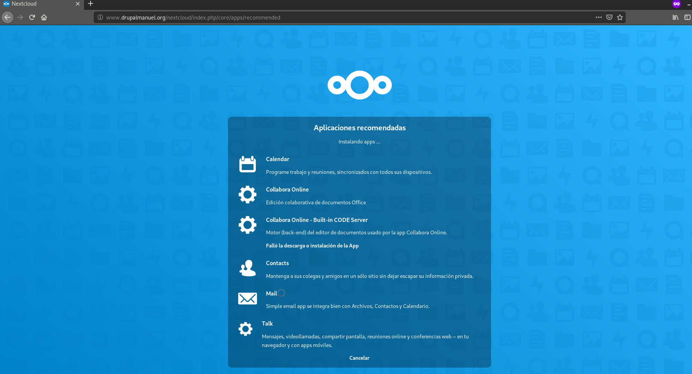
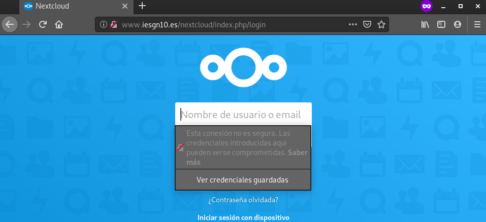
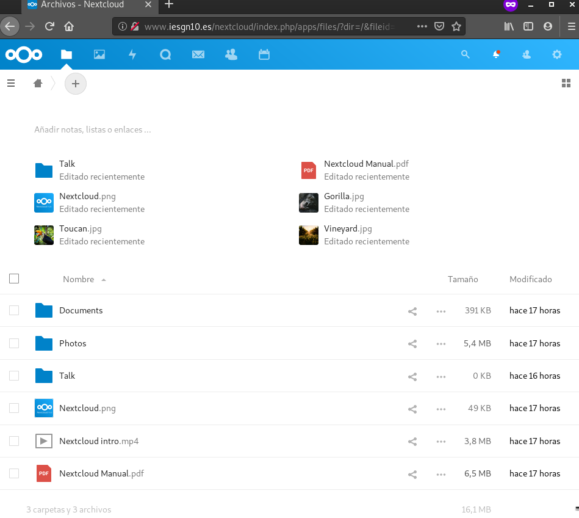
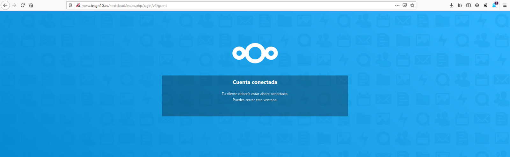
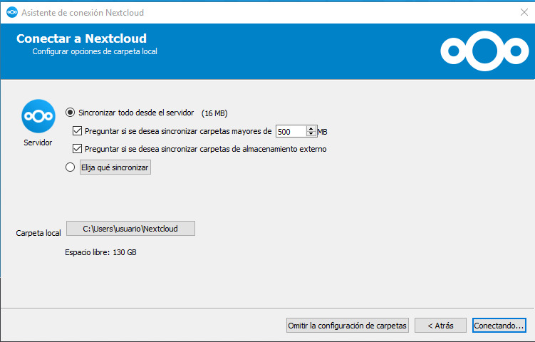
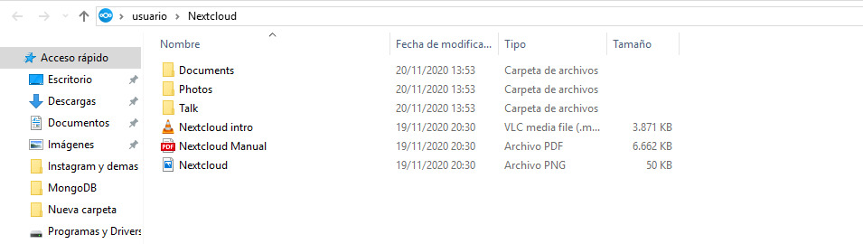

# Instalación /migración de aplicaciones web PHP

Realizar la migración de la aplicación drupal que tienes instalada en el 
entorno de desarrollo a nuestro entorno de producción, para ello ten en 
cuenta lo siguiente:

1. La aplicación se tendrá que migrar a un nuevo virtualhost al que se 
accederá con el nombre portal.iesgnXX.es.

Crearemos un nuevo virtualhost con las siguiente características:

```
server {
        listen 80;
        listen [::]:80;
        
	root /var/www/portal;
        
	index index.php index.html;
        
	server_name portal.iesgn10.es;
        
	location / {
                try_files $uri $uri/ =404;
        }

	location ~ \.php$ {
                include snippets/fastcgi-php.conf;
                fastcgi_pass unix:/var/run/php/php7.3-fpm.sock;
        }
}
```

2. Vamos a nombrar el servicio de base de datos que tenemos en producción. 
Como es un servicio interno no la vamos a nombrar en la zona DNS, la vamos 
a nombrar usando resolución estática. El nombre del servicio de base de 
datos se debe llamar: bd.iesgnXX.es.

Para nombrar el servicio de base de datos de manera estática, vamos a modificar el
fichero _/etc/hosts_ de la máquina OVH:

```
  bd.iesgn10.es
```


3. Por lo tanto los recursos que deberás crear en la base de datos serán 
(respeta los nombres):

   * Dirección de la base de datos: bd.iesgnXX.es
   * Base de datos: bd_drupal
   * Usuario: user_drupal
   * Password: pass_drupal

De la siguiente lista, nos faltaría crear tanto la base de datos, el usuario y la
contraseña. Nos iremos a nuestro gestor de base de datos de OVH, y lo crearemos:

```
debian@pandora:/etc/nginx/sites-available$ sudo mysql -u root -p 
Enter password: 
Welcome to the MariaDB monitor.  Commands end with ; or \g.
Your MariaDB connection id is 69
Server version: 10.3.23-MariaDB-0+deb10u1 Debian 10

Copyright (c) 2000, 2018, Oracle, MariaDB Corporation Ab and others.

Type 'help;' or '\h' for help. Type '\c' to clear the current input statement.

MariaDB [(none)]> CREATE DATABASE bd_drupal;
Query OK, 1 row affected (0.000 sec)

MariaDB [(none)]> CREATE USER user_drupal@localhost IDENTIFIED BY 'pass_drupal';
Query OK, 0 rows affected (0.001 sec)

MariaDB [(none)]> GRANT ALL PRIVILEGES ON bd_drupal.* to user_drupal@localhost;
Query OK, 0 rows affected (0.001 sec)

MariaDB [(none)]> quit
Bye
```

Pasamos la base de datos de desarrollo mediante _scp_ a la máquina de OVH:

```
debian@drupal:~$ sudo mysqldump newdb > drupal.sql
debian@drupal:~$ ls
drupal-9.0.7  drupal.sql
debian@drupal:~$ scp -i .ssh/manuelovh drupal.sql debian@146.59.196.92:/home/debian
drupal.sql                                    100% 7355KB  71.8KB/s   01:42    
debian@drupal:~$ 
```

Y modificamos el fichero /etc/mysql/mariadb.conf.d/50-server.cn y cambiamos
el parámetro _bind-address_:

```
bind-address = 127.0.1.1
```

Y por último, modificamos el fichero /var/www/html/drupal-9.0.7/sites/default/settings.php_:

```
$databases['default']['default'] = array (
  'database' => 'db_drupal',
  'username' => 'user_drupal',
  'password' => 'pass_drupal',
  'prefix' => '',
  'host' => '127.0.1.1',
  'port' => '3306',
  'namespace' => 'Drupal\\Core\\Database\\Driver\\mysql',
  'driver' => 'mysql',
);
```

Y cargamos la anterior base de datos:

```
debian@pandora:~$ mysql -u user_drupal -p bd_drupal < drupal.sql 
Enter password: 
debian@pandora:~$
```

4. Realiza la migración de la aplicación.

Para migrar nuestro drupal desde el entorno de desarrollo a producción, 
ejecutaremos un _scp_ para pasar el directorio del mismo hacia nuestra máquina 
OVH.

```
debian@drupal:~$ scp -ri .ssh/manuelovh drupal-9.0.7/ debian@146.59.196.92:/home/debian
README.md                                     100% 3337    26.7KB/s   00:00
composer.json                                 100% 1270    14.4KB/s   00:00
Cors.php                                      100% 1827    21.2KB/s   00:00
CorsService.php                               100% 6598    45.5KB/s   00:00
LICENSE                                       100% 1080     8.8KB/s   00:00
README.md                                     100%  278     3.7KB/s   00:00
composer.json                                 100%  654     9.2KB/s   00:00
ContainerInterface.php                        100% 1098    14.4KB/s   00:00
ContainerExceptionInterface.php               100%  248     3.7KB/s   00:00
NotFoundExceptionInterface.php                100%  256     3.5KB/s   00:00
.gitignore                                    100%   37     0.5KB/s   00:00
LICENSE                                       100% 1145    13.5KB/s   00:00
LoggerAwareInterface.php                      100%  297     4.2KB/s   00:00
NullLogger.php                                100%  707     9.5KB/s   00:00
LoggerInterfaceTest.php                       100% 4649    39.0KB/s   00:00
DummyTest.php                                 100%  251     3.6KB/s   00:00
TestLogger.php                                100% 4527    37.2KB/s   00:00
InvalidArgumentException.php                  100%   96     1.4KB/s   00:00
LoggerInterface.php                           100% 3114    30.1KB/s   00:00
LogLevel.php                                  100%  336     5.0KB/s   00:00
LoggerAwareTrait.php                          100%  397     4.2KB/s   00:00
AbstractLogger.php                            100% 3088    30.4KB/s   00:00
LoggerTrait.php                               100% 3415    30.2KB/s   00:00
README.md                                     100% 1346    16.7KB/s   00:00
composer.json                                 100%  561     1.5KB/s   00:00
LICENSE                                       100% 1085    14.2KB/s   00:00
README.md                                     100%  429     5.8KB/s   00:00
.pullapprove.yml                              100%  136     0.9KB/s   00:00
composer.json                                 100%  700     9.2KB/s   00:00
UriFactoryInterface.php                       100%  325     4.9KB/s   00:00
UploadedFileFactoryInterface.php              100% 1110    14.5KB/s   00:00
.
.
.

```

Una vez hecho esto, moveremos el directorio drupal a _/var/www_ y los llamaremos portal. 

Y por último, modificamos el fichero /var/www/html/drupal-9.0.7/sites/default/settings.php_:

```
$databases['default']['default'] = array (
  'database' => 'db_drupal',
  'username' => 'user_drupal',
  'password' => 'pass_drupal',
  'prefix' => '',
  'host' => '127.0.1.1',
  'port' => '3306',
  'namespace' => 'Drupal\\Core\\Database\\Driver\\mysql',
  'driver' => 'mysql',
);
```

Y cuando accedamos a la página portal.iesgn10.es deberiamos ver lo siguiente:


5. Asegurate que las URL limpias de drupal siguen funcionando en nginx.

Para asegurarnos de que las URLs limpias funcionen, debemos escribir las siguiente lineas en el fichero de configuración de portal:

```
	location / {
                try_files $uri @rewrite;
        }

	location @rewrite {
                rewrite ^/(.*)$ /index.php?q=$1;
        }

```

6. La aplicación debe estar disponible en la URL: portal.iesgnXX.es (Sin 
ningún directorio).

Podemos acceder desde el siguiente enlace: [portal.iesgn10.es](http://portal.iesgn10.es/)

# Instalación / migración de la aplicación Nextcloud

1. Instala la aplicación web Nextcloud en tu entorno de desarrollo.

Para ello, en primer lugar necesitamos una pila LAMP.

Nos descargaremos el paquete de Nextcloud:

```
debian@drupal:~$ wget https://download.nextcloud.com/server/releases/nextcloud-19.0.3.tar.bz2
```

Lo descomprimimos y lo movemos hacia el directorio raiz de nuestra aplicación.
También, le cambiaremos el propietario a dicho directorio:

```
debian@drupal:~$ sudo chown -R www-data: /var/www/html/nextcloud/
```

Una vez hecho esto, ahora descargaremos los paquetes necesarios para que nextcloud funcione:

```
debian@drupal~$ sudo apt-get install -y php-bcmath php-curl php-gd php-gmp php-imagick php-intl php-mbstring php-xml php-zip php-mysql php-pgsql
```

Descargados los paquetes, activaremos el módulo rewrite y reiniciamos el servicio de apache2.

COnfiguraremos el virtualhost con las siguiente lineas:

```
<Directory /var/www/html/nextcloud>
        AllowOverride all
        php_value memory_limit "512M"
</Directory>
```

Y reiniciamos otra vez el servicio. Pasando ahora a la base de datos, crearemos una nueva llamada 
nextcloud y un usuario con privilegios para la misma:

```
debian@drupal:~$ sudo mysql -u root -p
Enter password:
Welcome to the MariaDB monitor.  Commands end with ; or \g.
Your MariaDB connection id is 185
Server version: 10.3.23-MariaDB-0+deb10u1 Debian 10
Copyright (c) 2000, 2018, Oracle, MariaDB Corporation Ab and others.
Type 'help;' or '\h' for help. Type '\c' to clear the current input statement.
MariaDB [(none)]> CREATE DATABASE nextcloud charset utf8mb4 collate utf8mb4_unicode_ci;
Query OK, 1 row affected (0.055 sec)
MariaDB [(none)]> GRANT ALL PRIVILEGES ON nextcloud.* to manuel@localhost;
Query OK, 0 rows affected (0.063 sec)
MariaDB [(none)]> exit
Bye
```

Ahora nos meteremos en la dirección, y comprobamos que funciona correctamente.



2. Realiza la migración al servidor en producción, para que la aplicación sea 
accesible en la URL: www.iesgnXX.es/cloud

Realizamos el mismo procedimiento hecho con drupal.

1º. Comprimimos el directorio nextcloud y lo pasamos mediante scp.

2º. Hacemos un backup de nuestra base de datos y la pasamos mediante scp.

3º. Cambiamos propietarios en caso necesario.

4º. Creamos una base de datos nueva en el entorno de producción y volcamos los datos de desarrollo.

Ahora editaremos el virtualhost de _www.iesgn10.es_ con las siguiente líneas:

```
server {
        listen 80;
        listen [::]:80;

        root /var/www/html/iesgn10;

        index index.html index.htm index.nginx-debian.html;

        server_name www.iesgn10.es;

        location / {
                return 301 /principal/index.html;
                try_files $uri $uri/ =404;
                location /principal {
                        autoindex on;
                }
        }
	location /nextcloud {
                error_page 403 = /nextloud/core/templates/403.php;
                error_page 404 = /nextcloud/core/templates/404.php;

                rewrite ^/nextcloud/caldav(.*)$ /remote.php/caldav$1 redirect;
                rewrite ^/nextcloud/carddav(.*)$ /remote.php/carddav$1 redirect;
                rewrite ^/nextcloud/webdav(.*)$ /remote.php/webdav$1 redirect;

                rewrite ^(/nextcloud/core/doc[^\/]+/)$ $1/index.html;

                try_files $uri $uri/ index.php;


        }
	location ~ \.php(?:$|/) {
                fastcgi_split_path_info ^(.+\.php)(/.+)$;
                include fastcgi_params;
                fastcgi_param SCRIPT_FILENAME $document_root$fastcgi_script_nam$
                fastcgi_param PATH_INFO $fastcgi_path_info;
                fastcgi_pass unix:/var/run/php/php7.3-fpm.sock;
                include snippets/fastcgi-php.conf;

        }
}
```

Después, nos iremos al fichero _/var/www/html/iesgn10/nextcloud/config/config.php_ y lo editaremos con
la información referente a nuestra base de datos:

```
<?php
$CONFIG = array (
  'instanceid' => 'octn9fwo7oqb',
  'passwordsalt' => 'bYMRQQOSCwJEvzaDj0LH4RsMJTaXqy',
  'secret' => 'Lx5vA2Q3f+cg2Eywaxh4FwzHH0if5u9m3+bLgstW+F0soz/P',
  'trusted_domains' => 
  array (
    0 => 'www.iesgn10.es',
  ),
  'datadirectory' => '/var/www/html/iesgn10/nextcloud/data',
  'dbtype' => 'mysql',
  'version' => '19.0.3.1',
  'overwrite.cli.url' => 'http://www.iesgn10.es/nextcloud',
  'dbname' => 'nextcloud',
  'dbhost' => '127.0.1.1',
  'dbport' => '',
  'dbtableprefix' => 'oc_',
  'mysql.utf8mb4' => true,
  'dbuser' => 'nextcloud',
  'dbpassword' => '1q2w3e4r5t',
  'installed' => true,
);

```

Procederemos también a instalar los paquetes que nos hemos instalado en desarrollo y probaremos el
funcionamiento:





Se puede acceder mediante el enlace: [www.iesgn10.es/nextcloud]()

3. Instala en un ordenador el cliente de nextcloud y realiza la configuración 
adecuada para acceder a "tu nube".

Nos descargaremos la aplicación de Escritorio para Windows de la página principal de [Nextcloud](https://nextcloud.com/install/#install-clients)

Una vez hecho eso, lo instalamos y cuando lo ejecutemos, nos pedirá que seleccionemos una dirección 
donde está el servidor de nextcloud. Ponemos la dirección: _http://www.iesgn10.es/nextcloud_. Acto 
seguido nos pedirá que iniciemos sesión con un usuario registrado en el servidor nuestro. Cuando lo
hayamos hecho, ya tendríamos acceso a dicho servidor:







Documenta de la forma más precisa posible cada uno de los pasos que has dado, 
y entrega pruebas de funcionamiento para comprobar el proceso que has realizado.
