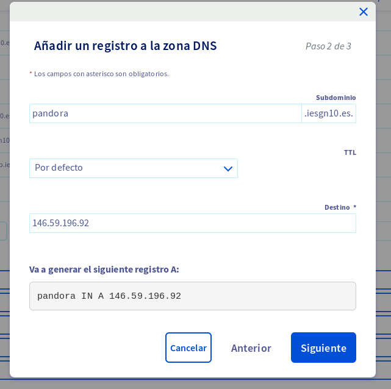

# Servidor OVH

Configuración inicial del servidor OVH

* Comprueba en el panel de control de OVH que tienes los 4 recursos a tu 
disposición: VPS, Dominio, zona DNS y buzón DNS. Si no es así ponte en 
contacto con José Domingo para solucionar el problema.
   

* Ponte en contacto con José Domingo para pedirle la contraseña para acceder 
a la máquina.

Jose Domingo ya nos proporcionó la contraseña.
   
* Accede a la máquina (usuario debian) y configura tu ip pública (y la de los 
profesores que encontrarás en la wiki de redmine). Desde ese momento 
accederemos siempre con nuestra clave privada.

Accedemos mediante ssh al usuario debian con la contraseña proporcionada y la
Dirección IP que encontramos en la sección:

```https://www.ovh.com/manager/dedicated/#/iaas/vps/vps-e6eff978.vps.ovh.net/dashboard```
   
Una vez hayamos accedido a la máquina, mediante scp, enviaremos tanto nuestra
clave pública, como la de los demás profesores:

```scp .ssh/*.pub debian@[IP]:/home/debian/claves/```

Y las enviamos todas a la vez.

Ahora las añadiremos a _.ssh/authorized_keys_ de la siguiente manera:

```
debian@vps-e6eff978:~$ echo `cat claves/id_rsa.pub` >> .ssh/authorized_keys 
debian@vps-e6eff978:~$ echo `cat claves/rafa.pub` >> .ssh/authorized_keys 
debian@vps-e6eff978:~$ echo `cat claves/manuelovh.pub` >> .ssh/authorized_keys 
debian@vps-e6eff978:~$ echo `cat claves/clave-openstack.pub` >> .ssh/authorized_keys 
```
Eliminamos las claves públicas que nos pasamos por scp y nos conectamos con
nuestra clave privada:

```
manuel@debian:~$ ssh -i .ssh/manuelovh debian@146.59.196.92
Linux vps-e6eff978 4.19.0-11-cloud-amd64 #1 SMP Debian 4.19.146-1 (2020-09-17) x86_64

The programs included with the Debian GNU/Linux system are free software;
the exact distribution terms for each program are described in the
individual files in /usr/share/doc/*/copyright.

Debian GNU/Linux comes with ABSOLUTELY NO WARRANTY, to the extent
permitted by applicable law.
Last login: Tue Nov  3 13:21:38 2020 from 80.59.1.152
debian@vps-e6eff978:~$ 
```

* Nombra la máquina de forma correcta. Tu máquina tendrá un nombre de host 
totalmente cualificado (nombre.iesgnXX.es). Modifica los ficheros 
correspondientes para que al ejecutar hostname -f obtenga el FQHN.

Editaremos el archivo _/etc/hostname y cambiar la 
línea que corresponde al hostname:

```
pandora.iesgn10.es
```

Y ahora modificaremos el fichero de _/etc/hosts_ con la siguiente linea:

```
127.0.1.1	pandora.iesgn10.es
```

Reiniciamos la máquina, y cuando volvamos a acceder nos encontraremos lo
siguiente:

```
manuel@debian:~$ ssh -i .ssh/manuelovh debian@146.59.196.92
Linux pandora.iesgn11.es 4.19.0-11-cloud-amd64 #1 SMP Debian 4.19.146-1 (2020-09-17) x86_64

The programs included with the Debian GNU/Linux system are free software;
the exact distribution terms for each program are described in the
individual files in /usr/share/doc/*/copyright.

Debian GNU/Linux comes with ABSOLUTELY NO WARRANTY, to the extent
permitted by applicable law.
Last login: Tue Nov  3 17:38:57 2020 from 217.217.170.105
debian@pandora:~$ hostname -f
pandora.iesgn10.es 
```

* Desde el panel de control de OVH crea un registro de tipo A en la zona DNS 
de tu dominio, para asignar el nombre elegido a tu dirección IP publica. 
Desde este momento el acceso a la máquina por ssh será utilizando ese nombre.
   


```
manuel@debian:~$ ssh -i .ssh/manuelovh debian@pandora.iesgn10.es
Linux pandora.iesgn10.es 4.19.0-11-cloud-amd64 #1 SMP Debian 4.19.146-1 (2020-09-17) x86_64

The programs included with the Debian GNU/Linux system are free software;
the exact distribution terms for each program are described in the
individual files in /usr/share/doc/*/copyright.

Debian GNU/Linux comes with ABSOLUTELY NO WARRANTY, to the extent
permitted by applicable law.
Last login: Tue Nov  3 18:10:50 2020 from 217.217.170.105
debian@pandora:~$ 
```

* Responde este mensaje y pon el nombre elegido. Los profesores probaremos el 
acceso a la máquina.


