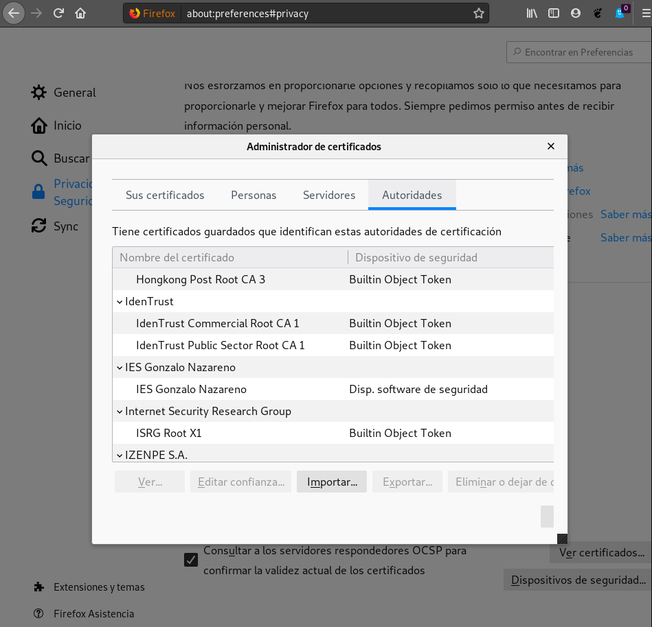
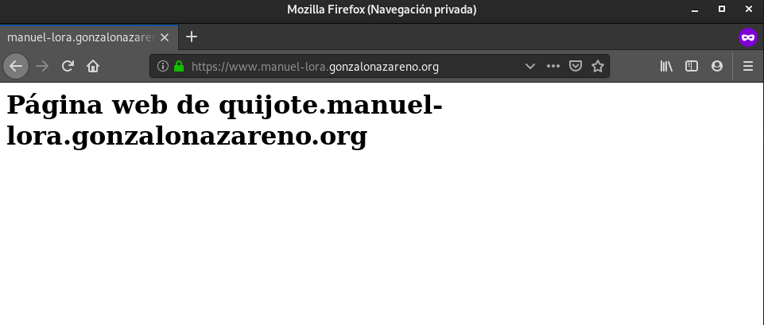

# Configuración HTTPS

El siguiente paso de nuestro proyecto es configurar de forma adecuada el 
protocolo HTTPS en nuestro servidor web para nuestra aplicaciones web. Para ello
vamos a emitir un certificado wildcard en la AC Gonzalo Nazareno utilizando 
para la petición la utilidad "gestiona".

* Explica los pasos fundamentales para la creación del certificado. 
Especificando los campos que has rellenado en el fichero CSR.

El procedimiento habitual para la generación del fichero .csr es el siguiente:

1. Generamos la clave privada.

```
manuel@debian:~/Descargas/claves$ openssl genrsa -out mikey.key 4096
Generating RSA private key, 4096 bit long modulus (2 primes)
..................++++
.....................................................++++
e is 65537 (0x010001)
```

2. Extraemos la clave pública de dicha clave privada:

```
manuel@debian:~/Descargas/claves$ openssl rsa -in mikey.key -pubout -out mikey.pubkey
writing RSA key
```

Ahora pasaremos las claves a nuestra máquina CentOS que es la que va a usar
el servidor web:

```
manuel@debian:~/.ssh$ scp ../Descargas/claves/mikey.* debian@dulcinea:/home/debian
mikey.key                                     100% 3243    12.0KB/s   00:00    
mikey.pubkey                                  100%  800     6.6KB/s   00:00    

debian@dulcinea:~$ scp mikey.* centos@quijote:/home/centos
mikey.key                                     100% 3243     1.3MB/s   00:00    
mikey.pubkey                                  100%  800   436.6KB/s   00:00    
debian@dulcinea:~$ ssh centos@quijote
Last login: Thu Dec 17 09:48:51 2020 from 10.0.2.11
[centos@quijote ~]$ ls
ifcfg-eth0  mikey.key  mikey.pubkey
```

Por último, vamos a utilizar la clave privada para la generación del .csr:

```
manuel@debian:~/Descargas/claves$ openssl req -new -key mikey.key -out centos.csr
You are about to be asked to enter information that will be incorporated
into your certificate request.
What you are about to enter is what is called a Distinguished Name or a DN.
There are quite a few fields but you can leave some blank
For some fields there will be a default value,
If you enter '.', the field will be left blank.
-----
Country Name (2 letter code) [AU]:ES
State or Province Name (full name) [Some-State]:Sevilla
Locality Name (eg, city) []:Dos Hermanas
Organization Name (eg, company) [Internet Widgits Pty Ltd]:IES Gonzalo Nazareno
Organizational Unit Name (eg, section) []:Informática
Common Name (e.g. server FQDN or YOUR name) []:*.manuel-lora.gonzalonazareno.org
Email Address []:manuelloraroman@gmail.com

Please enter the following 'extra' attributes
to be sent with your certificate request
A challenge password []:
An optional company name []:
```

En el parámetro llamado Common Name, debemos incorporar el simbolo * para un wildcard.

Y esperamos a que nos firmen dicha solicitud de certificado wildcard.
   
Una vez firmado, nos lo descargamos y lo pasamos a la máquina CentOS mediante
scp:

```
manuel@debian:~/.ssh$ scp ../Descargas/claves/centos.crt debian@dulcinea:/home/debian
centos.crt                                    100%   10KB  30.0KB/s   00:00    
manuel@debian:~/.ssh$ ssh -A debian@dulcinea
Linux dulcinea 4.19.0-11-cloud-amd64 #1 SMP Debian 4.19.146-1 (2020-09-17) x86_64

The programs included with the Debian GNU/Linux system are free software;
the exact distribution terms for each program are described in the
individual files in /usr/share/doc/*/copyright.

Debian GNU/Linux comes with ABSOLUTELY NO WARRANTY, to the extent
permitted by applicable law.
Last login: Thu Dec 17 11:27:29 2020 from 172.23.0.6
debian@dulcinea:~$ scp centos.crt centos@quijote:/home/centos
centos.crt                                    100%   10KB   3.4MB/s   00:00    
debian@dulcinea:~$ ssh centos@quijote
Last login: Thu Dec 17 11:18:16 2020 from 10.0.2.11
[centos@quijote ~]$ ls -l
total 24
-rwxr-xr-x. 1 centos centos 10131 Dec 17 11:27 centos.crt
-rw-r--r--. 1 root   root     215 Dec 16 11:22 ifcfg-eth0
-rw-------. 1 centos centos  3243 Dec 17 11:18 mikey.key
-rw-r--r--. 1 centos centos   800 Dec 17 11:18 mikey.pubkey
```

* Debes hacer una redirección para forzar el protocolo https.
   
En primer lugar, para hacer la redirección, es necesario instalarse el módulo
mod_ssl:

```
[centos@quijote ~]$ sudo dnf -y install mod_ssl
```

Una vez instalado, activamos dicho módulo. Para ello, reiniciamos el servicio de
httpd. Si queremos comprobar que efectivamente, lo tenemos activado haremos:

```
[centos@quijote ~]$ sudo apachectl -M | grep ssl
 ssl_module (shared)
```

Si el comando no tiene ningún tipo de salida, significa que no está activado.

Además de abrir el puerto 443 en openstack, debemos abrir el puerto 443 de la
máquina CentOS debido a que esta posee un cortafuegos propio (en nuestro caso
ya lo tenemos activado):

```
[centos@quijote ~]$ sudo firewall-cmd --zone=public --permanent --add-service=https
Warning: ALREADY_ENABLED: https
success
[centos@quijote ~]$ sudo firewall-cmd --reload
success
```

Moveremos el certificado hacia el directorio _/etc/pki/tls/certs_ y la clave
hacia el directorio _/etc/pki/tls/private_.

Una vez movido dichos ficheros, modificaremos el fichero _/etc/httpd/conf.d/ssl.conf_
y editaremos las siguientes líneas:

```
SSLEngine on

SSLCertificateFile /etc/pki/tls/certs/centos.crt   

SSLCertificateKeyFile /etc/pki/tls/private/mikey.key
```

Y reiniciamos el servicio httpd.

```
[centos@quijote ~]$ sudo systemctl reload httpd
```

A continuación, para que funcione el contenido añadido en los directorios de
_/etc/pki_ debemos ejecutar el siguiente comando:

```
[root@quijote centos]# restorecon -RvF /etc/pki
```

Esto permitirá la restauración de los contextos de SELinux predeterminados para
dichos ficheros.

A continuación, vamos a crear dos ficheros de configuración en el directorio
_/etc/httpd/sites-available/_:

* www.conf

```
<VirtualHost *:80>
        ServerName www.manuel-lora.gonzalonazareno.org
        DocumentRoot /var/www/manuel-lora

	Redirect permanent / https://www.manuel-lora.gonzalonazareno.org

        ErrorLog /var/www/manuel-lora/log/error.log
        CustomLog /var/www/manuel-lora/log/requests.log combined
</VirtualHost>
```

* wwws.conf

```
<VirtualHost *:443>
    ServerName www.manuel-lora.gonzalonazareno.org
    DocumentRoot /var/www/manuel-lora
    ErrorLog /var/www/manuel-lora/log/error.log
    CustomLog /var/www/manuel-lora/log/requests.log combined

    SSLEngine on
    SSLCertificateFile /etc/pki/tls/certs/centos.crt
    SSLCertificateKeyFile /etc/pki/tls/private/mikey.key

</VirtualHost>
```

De esta manera, conseguimos hacer la redirección de http a https.

Por último, antes de comprobar que funciona, vamos a crear ambos enlaces
simbólicos:

```
[root@quijote sites-available]# ln -s /etc/httpd/sites-available/www.conf /etc/httpd/sites-enabled/
[root@quijote sites-available]# ln -s /etc/httpd/sites-available/wwws.conf /etc/httpd/sites-enabled/
```

Y volvemos a reiniciar el servicio.

* Investiga la regla DNAT en el cortafuego para abrir el puerto 443.

Para que funcione desde el exterior, debemos abrir tanto el puerto 80
como el puerto 443. Para ello, vamos a añadir las siguientes reglas:

```
root@dulcinea:~# iptables -t nat -A PREROUTING -i eth1 -p tcp --dport 80 -j DNAT --to 10.0.2.10
root@dulcinea:~# iptables -t nat -A PREROUTING -i eth1 -p tcp --dport 443 -j DNAT --to 10.0.2.10
```
   
* Instala el certificado del AC Gonzalo Nazareno en tu navegador para que se 
pueda verificar tu certificado.

Para instalar el certificado, debemos irnos a la página del instituto y 
descargarnos el fichero:

> https://dit.gonzalonazareno.org/gestiona/info/documentacion/ca

Automáticamente nos lo instalará en el navegador web que estemos utilizando
(en nuestro caso Mozilla FireFox).

Comprobamos que lo tenemos instalado:



Y ahora vamos a comprobar la conexión desde el exterior:



