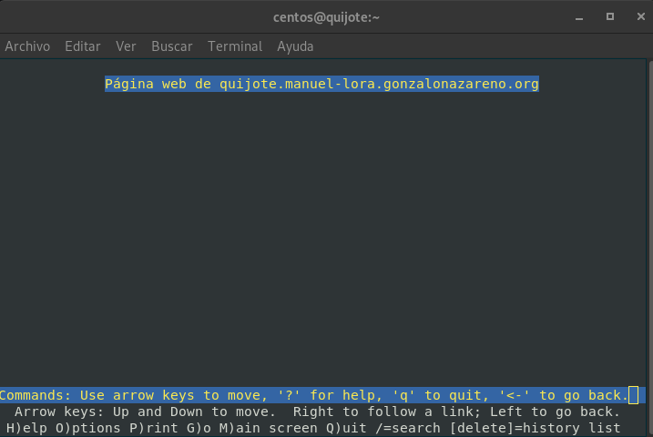
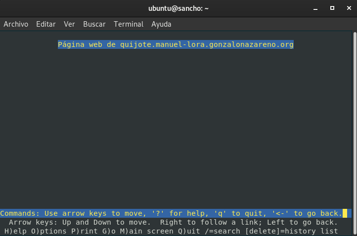

# Cortafuegos

Vamos a construir un cortafuegos en dulcinea que nos permita controlar el 
tráfico de nuestra red. El cortafuegos que vamos a construir debe funcionar 
tras un reinicio.

## Política por defecto

La política por defecto que vamos a configurar en nuestro cortafuegos será de 
tipo DROP.

```
iptables -P INPUT DROP
iptables -P OUTPUT DROP
iptables -P FORWARD DROP
```

## NAT 

* Configura de manera adecuada las reglas NAT para que todas las máquinas de 
nuestra red tenga acceso al exterior.

```
iptables -t nat -A POSTROUTING -s 10.0.1.0/24 -o eth1 -j MASQUERADE
iptables -t nat -A POSTROUTING -s 10.0.2.0/24 -o eth1 -j MASQUERADE
```
   
* Configura de manera adecuada todas las reglas NAT necesarias para que los 
servicios expuestos al exterior sean accesibles.

```
iptables -t nat -A PREROUTING -p udp --dport 53 -i eth1 -j DNAT --to 10.0.1.10
iptables -t nat -A PREROUTING -p tcp --dport 53 -i eth1 -j DNAT --to 10.0.1.10
iptables -t nat -A PREROUTING -i eth1 -p tcp --dport 80 -j DNAT --to 10.0.2.10
iptables -t nat -A PREROUTING -i eth1 -p tcp --dport 443 -j DNAT --to 10.0.2.10
iptables -t nat -A PREROUTING -i eth1 -p tcp --dport 25 -j DNAT --to 10.0.1.10
```

## Reglas

Para cada configuración, hay que mostrar las reglas que se han configurado y 
una prueba de funcionamiento de la misma:


## Ping

1. Todas las máquinas de las dos redes pueden hacer ping entre ellas.

```
Permitir ping Dulcinea con la red interna y la DMZ

iptables -A OUTPUT -o eth0 -p icmp -m icmp --icmp-type echo-request -j ACCEPT
iptables -A INPUT -i eth0 -p icmp -m icmp --icmp-type echo-reply -j ACCEPT

iptables -A OUTPUT -o eth2 -p icmp -m icmp --icmp-type echo-request -j ACCEPT
iptables -A INPUT -i eth2 -p icmp -m icmp --icmp-type echo-reply -j ACCEPT

Permitir ping DMZ con la red interna

iptables -A FORWARD -i eth2 -o eth0 -p icmp -m icmp --icmp-type echo-request -j ACCEPT
iptables -A FORWARD -i eth0 -o eth2 -p icmp -m icmp --icmp-type echo-reply -j ACCEPT

Permitir ping red interna con la DMZ

iptables -A FORWARD -i eth0 -o eth2 -p icmp -m icmp --icmp-type echo-request -j ACCEPT
iptables -A FORWARD -i eth2 -o eth0 -p icmp -m icmp --icmp-type echo-reply -j ACCEPT
```

### Prueba ping Dulcinea con la red interna y la DMZ

```
debian@dulcinea:~$ ping sancho
PING sancho (10.0.1.11) 56(84) bytes of data.
64 bytes from sancho (10.0.1.11): icmp_seq=1 ttl=64 time=2.21 ms
64 bytes from sancho (10.0.1.11): icmp_seq=2 ttl=64 time=1.05 ms
64 bytes from sancho (10.0.1.11): icmp_seq=3 ttl=64 time=1.18 ms
^C
--- sancho ping statistics ---
3 packets transmitted, 3 received, 0% packet loss, time 5ms
rtt min/avg/max/mdev = 1.049/1.480/2.213/0.521 ms
debian@dulcinea:~$ ping quijote
PING quijote (10.0.2.10) 56(84) bytes of data.
64 bytes from quijote (10.0.2.10): icmp_seq=1 ttl=64 time=0.959 ms
64 bytes from quijote (10.0.2.10): icmp_seq=2 ttl=64 time=0.626 ms
^C
--- quijote ping statistics ---
2 packets transmitted, 2 received, 0% packet loss, time 2ms
rtt min/avg/max/mdev = 0.626/0.792/0.959/0.168 ms
debian@dulcinea:~$ 
```

### Prueba ping DMZ con la red interna

```
[centos@quijote ~]$ ping freston
PING freston (10.0.1.10) 56(84) bytes of data.
64 bytes from freston (10.0.1.10): icmp_seq=1 ttl=63 time=2.45 ms
64 bytes from freston (10.0.1.10): icmp_seq=2 ttl=63 time=1.49 ms
^C
--- freston ping statistics ---
2 packets transmitted, 2 received, 0% packet loss, time 3ms
rtt min/avg/max/mdev = 1.492/1.972/2.453/0.482 ms
[centos@quijote ~]$ 
```

### Prueba ping red interna con la DMZ

```
ubuntu@sancho:~$ ping quijote
PING quijote (10.0.2.10) 56(84) bytes of data.
64 bytes from quijote (10.0.2.10): icmp_seq=1 ttl=63 time=1.73 ms
64 bytes from quijote (10.0.2.10): icmp_seq=2 ttl=63 time=1.63 ms
^C
--- quijote ping statistics ---
2 packets transmitted, 2 received, 0% packet loss, time 1001ms
rtt min/avg/max/mdev = 1.625/1.675/1.726/0.050 ms
ubuntu@sancho:~$ 
```

2. Todas las máquinas pueden hacer ping a una máquina del exterior.
   
```
Permitir ping red interna al exterior

iptables -A FORWARD -i eth0 -o eth1 -p icmp -m icmp --icmp-type echo-request -j ACCEPT
iptables -A FORWARD -i eth1 -o eth0 -p icmp -m icmp --icmp-type echo-reply -j ACCEPT

Permitir ping DMZ al exterior

iptables -A FORWARD -i eth2 -o eth1 -p icmp -m icmp --icmp-type echo-request -j ACCEPT
iptables -A FORWARD -i eth1 -o eth2 -p icmp -m icmp --icmp-type echo-reply -j ACCEPT
```

### Prueba ping al exterior

```
ubuntu@sancho:~$ ping 172.23.0.6
PING 172.23.0.6 (172.23.0.6) 56(84) bytes of data.
64 bytes from 172.23.0.6: icmp_seq=1 ttl=60 time=214 ms
64 bytes from 172.23.0.6: icmp_seq=2 ttl=60 time=110 ms
^X^C
--- 172.23.0.6 ping statistics ---
3 packets transmitted, 2 received, 33.3333% packet loss, time 2002ms
rtt min/avg/max/mdev = 109.602/161.709/213.816/52.107 ms
```

```
[centos@quijote ~]$ ping 172.23.0.6
PING 172.23.0.6 (172.23.0.6) 56(84) bytes of data.
64 bytes from 172.23.0.6: icmp_seq=1 ttl=60 time=203 ms
64 bytes from 172.23.0.6: icmp_seq=2 ttl=60 time=136 ms
^C
--- 172.23.0.6 ping statistics ---
3 packets transmitted, 2 received, 33.3333% packet loss, time 5ms
rtt min/avg/max/mdev = 135.597/169.451/203.306/33.857 ms
```

3. Desde el exterior se puede hacer ping a dulcinea.
   
```
iptables -A INPUT -i eth1 -p icmp -m icmp --icmp-type echo-request -j ACCEPT
iptables -A OUTPUT -o eth1 -p icmp -m icmp --icmp-type echo-reply -j ACCEPT
```

### Prueba ping a Dulcinea

```
manuel@debian:~/.ssh$ ping dulcinea
PING manuel-lora.gonzalonazareno.org (172.22.200.146) 56(84) bytes of data.
64 bytes from manuel-lora.gonzalonazareno.org (172.22.200.146): icmp_seq=1 ttl=61 time=114 ms
64 bytes from manuel-lora.gonzalonazareno.org (172.22.200.146): icmp_seq=2 ttl=61 time=102 ms
64 bytes from manuel-lora.gonzalonazareno.org (172.22.200.146): icmp_seq=3 ttl=61 time=106 ms
^C
--- manuel-lora.gonzalonazareno.org ping statistics ---
3 packets transmitted, 3 received, 0% packet loss, time 4ms
rtt min/avg/max/mdev = 102.345/107.482/113.924/4.823 ms
```


4. A dulcinea se le puede hacer ping desde la DMZ, pero desde la LAN se le debe 
rechazar la conexión (REJECT).

```
Permitir ping de DMZ hacia Dulcinea

iptables -A INPUT -i eth2 -p icmp -m icmp --icmp-type echo-request -j ACCEPT
iptables -A OUTPUT -o eth2 -p icmp -m icmp --icmp-type echo-reply -j ACCEPT

Rechazar ping de red interna hacia Dulcinea

iptables -A INPUT -i eth0 -p icmp -m icmp --icmp-type echo-request -j REJECT --reject-with icmp-port-unreachable
iptables -A OUTPUT -o eth0 -p icmp -j ACCEPT
(realmente con indicar el tipo de conexión icmp en el OUTPUT ya valdría, es decir, la regla quedaría
así:

iptables -A OUTPUT -o eth0 -p icmp -m icmp --icmp-type icmp-port-unreachable -j ACCEPT
```

### Prueba ping DMZ hacia Dulcinea

```
[centos@quijote ~]$ ping dulcinea
PING dulcinea (10.0.2.11) 56(84) bytes of data.
64 bytes from dulcinea (10.0.2.11): icmp_seq=1 ttl=64 time=0.748 ms
64 bytes from dulcinea (10.0.2.11): icmp_seq=2 ttl=64 time=0.770 ms
64 bytes from dulcinea (10.0.2.11): icmp_seq=3 ttl=64 time=0.785 ms
^C
--- dulcinea ping statistics ---
3 packets transmitted, 3 received, 0% packet loss, time 84ms
rtt min/avg/max/mdev = 0.748/0.767/0.785/0.035 ms
```

### Prueba rechazo ping

```
ubuntu@sancho:~$ ping dulcinea
PING dulcinea (10.0.1.4) 56(84) bytes of data.
From dulcinea (10.0.1.4) icmp_seq=208 Destination Port Unreachable
From dulcinea (10.0.1.4) icmp_seq=209 Destination Port Unreachable
From dulcinea (10.0.1.4) icmp_seq=210 Destination Port Unreachable
From dulcinea (10.0.1.4) icmp_seq=211 Destination Port Unreachable
^C
--- dulcinea ping statistics ---
211 packets transmitted, 0 received, +4 errors, 100% packet loss, time 214960ms

ubuntu@sancho:~$
```


## ssh

1. Podemos acceder por ssh a todas las máquinas.
   
```
Permitir ssh de DMZ hacia la red interna

iptables -A FORWARD -i eth2 -o eth0 -p tcp --dport 22 -m state --state NEW,ESTABLISHED -j ACCEPT
iptables -A FORWARD -i eth0 -o eth2 -p tcp --sport 22 -m state --state ESTABLISHED -j ACCEPT

Permitir ssh de red interna hacia la DMZ

iptables -A FORWARD -i eth0 -o eth2 -p tcp --dport 22 -m state --state NEW,ESTABLISHED -j ACCEPT
iptables -A FORWARD -i eth2 -o eth0 -p tcp --sport 22 -m state --state ESTABLISHED -j ACCEPT

Permitir ssh de Dulcinea a ambas redes

iptables -A OUTPUT -o eth2 -p tcp -m tcp --dport 22 -m state --state NEW,ESTABLISHED -j ACCEPT
iptables -A INPUT -i eth2 -p tcp -m tcp --sport 22 -m state --state ESTABLISHED -j ACCEPT

iptables -A OUTPUT -o eth0 -p tcp -m tcp --dport 22 -m state --state NEW,ESTABLISHED -j ACCEPT
iptables -A INPUT -i eth0 -p tcp -m tcp --sport 22 -m state --state ESTABLISHED -j ACCEPT

```

### Prueba

```
ubuntu@sancho:~$ ssh -i .ssh/clave_openstack.pem centos@quijote
Last login: Thu Jan 28 11:22:16 2021 from 10.0.2.11
[centos@quijote ~]$ ssh ubuntu@sancho
ubuntu@sancho's password: 
Welcome to Ubuntu 20.04.1 LTS (GNU/Linux 5.4.0-48-generic x86_64)

 * Documentation:  https://help.ubuntu.com
 * Management:     https://landscape.canonical.com
 * Support:        https://ubuntu.com/advantage

  System information as of Thu Jan 28 11:58:11 UTC 2021

  System load:  0.14              Processes:             117
  Usage of /:   53.9% of 5.64GB   Users logged in:       1
  Memory usage: 64%               IPv4 address for ens3: 10.0.1.11
  Swap usage:   0%

 * Introducing self-healing high availability clusters in MicroK8s.
   Simple, hardened, Kubernetes for production, from RaspberryPi to DC.

     https://microk8s.io/high-availability

64 updates can be installed immediately.
1 of these updates is a security update.
To see these additional updates run: apt list --upgradable


*** System restart required ***
Last login: Thu Jan 28 11:57:20 2021 from 10.0.1.4
ubuntu@sancho:~$ 
```

```
debian@dulcinea:~$ ssh freston
Linux freston 4.19.0-11-cloud-amd64 #1 SMP Debian 4.19.146-1 (2020-09-17) x86_64

The programs included with the Debian GNU/Linux system are free software;
the exact distribution terms for each program are described in the
individual files in /usr/share/doc/*/copyright.

Debian GNU/Linux comes with ABSOLUTELY NO WARRANTY, to the extent
permitted by applicable law.
You have mail.
Last login: Wed Jan 27 11:03:57 2021 from 10.0.1.4
debian@freston:~$ exit
logout
Connection to freston closed.
debian@dulcinea:~$ ssh centos@quijote
Last login: Thu Jan 28 11:57:53 2021 from 10.0.1.11
[centos@quijote ~]$ 
```

2. Todas las máquinas pueden hacer ssh a máquinas del exterior.
   
```
Permitir ssh desde la red interna hacia el exterior

iptables -A FORWARD -i eth0 -o eth1 -p tcp --dport 22 -m state --state NEW,ESTABLISHED -j ACCEPT
iptables -A FORWARD -i eth1 -o eth0 -p tcp --sport 22 -m state --state ESTABLISHED -j ACCEPT

Permitir ssh desde la DMZ hacia el exterior

iptables -A FORWARD -i eth2 -o eth1 -p tcp --dport 22 -m state --state NEW,ESTABLISHED -j ACCEPT
iptables -A FORWARD -i eth1 -o eth2 -p tcp --sport 22 -m state --state ESTABLISHED -j ACCEPT
```

### Prueba

```
[centos@quijote ~]$ ssh manuel@172.23.0.6
manuel@172.23.0.6's password: 
Linux debian 4.19.0-11-amd64 #1 SMP Debian 4.19.146-1 (2020-09-17) x86_64

The programs included with the Debian GNU/Linux system are free software;
the exact distribution terms for each program are described in the
individual files in /usr/share/doc/*/copyright.

Debian GNU/Linux comes with ABSOLUTELY NO WARRANTY, to the extent
permitted by applicable law.
You have new mail.
Last login: Wed Jan 27 11:06:22 2021 from 192.168.0.159
manuel@debian:~$ 
```

```
debian@freston:~$ ssh manuel@172.23.0.6
manuel@172.23.0.6's password: 
Linux debian 4.19.0-11-amd64 #1 SMP Debian 4.19.146-1 (2020-09-17) x86_64

The programs included with the Debian GNU/Linux system are free software;
the exact distribution terms for each program are described in the
individual files in /usr/share/doc/*/copyright.

Debian GNU/Linux comes with ABSOLUTELY NO WARRANTY, to the extent
permitted by applicable law.
You have new mail.
Last login: Thu Jan 28 13:00:28 2021 from 172.22.200.146
manuel@debian:~$
```

3. La máquina dulcinea tiene un servidor ssh escuchando por el puerto 22, pero 
al acceder desde el exterior habrá que conectar al puerto 2222.

```
iptables -A INPUT -s 0.0.0.0/0 -p tcp -m tcp --dport 22 -m state --state NEW,ESTABLISHED -j ACCEPT
iptables -A OUTPUT -d 0.0.0.0/0 -p tcp -m tcp --sport 22 -m state --state ESTABLISHED -j ACCEPT
```

### Prueba

```
manuel@debian:~/.ssh$ ssh -A debian@dulcinea
Linux dulcinea 4.19.0-11-cloud-amd64 #1 SMP Debian 4.19.146-1 (2020-09-17) x86_64

The programs included with the Debian GNU/Linux system are free software;
the exact distribution terms for each program are described in the
individual files in /usr/share/doc/*/copyright.

Debian GNU/Linux comes with ABSOLUTELY NO WARRANTY, to the extent
permitted by applicable law.
Last login: Thu Jan 28 11:49:26 2021 from 172.23.0.6
debian@dulcinea:~$ 
```

## DNS

1. El único dns que pueden usar los equipos de las dos redes es freston, no 
pueden utilizar un DNS externo.
   
```
Permitir hacer consultas desde Freston hacia el exterior

iptables -A FORWARD -s 10.0.1.10 -d 0.0.0.0/24 -p udp --dport 53 -m state --state NEW,ESTABLISHED -j ACCEPT
iptables -A FORWARD -s 0.0.0.0/24 -d 10.0.1.10 -p udp --sport 53 -m state --state ESTABLISHED -j ACCEPT

Permitir hacer consultas desde la DMZ hacia Freston

iptables -A FORWARD -s 10.0.2.0/24 -d 10.0.1.10 -p udp --dport 53 -m state --state NEW,ESTABLISHED -j ACCEPT
iptables -A FORWARD -s 10.0.1.10 -d 10.0.2.0/24 -p udp --sport 53 -m state --state ESTABLISHED -j ACCEPT
```

Sancho no requiere de configuración por iptables ya que se encuentra en la misma red que Freston.

### Prueba

```
centos@quijote ~]$ dig dulcinea.manuel-lora.gonzalonazareno.org

; <<>> DiG 9.11.20-RedHat-9.11.20-5.el8 <<>> dulcinea.manuel-lora.gonzalonazareno.org
;; global options: +cmd
;; Got answer:
;; ->>HEADER<<- opcode: QUERY, status: NOERROR, id: 64264
;; flags: qr aa rd ra; QUERY: 1, ANSWER: 1, AUTHORITY: 1, ADDITIONAL: 2

;; OPT PSEUDOSECTION:
; EDNS: version: 0, flags:; udp: 4096
; COOKIE: a34bc298e2d3ad75495c12556012a87f9adec229e57833fa (good)
;; QUESTION SECTION:
;dulcinea.manuel-lora.gonzalonazareno.org. IN A

;; ANSWER SECTION:
dulcinea.manuel-lora.gonzalonazareno.org. 86400	IN A 10.0.2.11

;; AUTHORITY SECTION:
manuel-lora.gonzalonazareno.org. 86400 IN NS	freston.manuel-lora.gonzalonazareno.org.

;; ADDITIONAL SECTION:
freston.manuel-lora.gonzalonazareno.org. 86400 IN A 10.0.1.10

;; Query time: 3 msec
;; SERVER: 10.0.1.10#53(10.0.1.10)
;; WHEN: Thu Jan 28 12:05:19 UTC 2021
;; MSG SIZE  rcvd: 151

[centos@quijote ~]$ dig www.josedomingo.org

; <<>> DiG 9.11.20-RedHat-9.11.20-5.el8 <<>> www.josedomingo.org
;; global options: +cmd
;; Got answer:
;; ->>HEADER<<- opcode: QUERY, status: NOERROR, id: 23347
;; flags: qr rd ra; QUERY: 1, ANSWER: 2, AUTHORITY: 5, ADDITIONAL: 2

;; OPT PSEUDOSECTION:
; EDNS: version: 0, flags:; udp: 4096
; COOKIE: 99615458501c5fe16f818d826012a939bde78b64f2d9fe9f (good)
;; QUESTION SECTION:
;www.josedomingo.org.		IN	A

;; ANSWER SECTION:
www.josedomingo.org.	900	IN	CNAME	endor.josedomingo.org.
endor.josedomingo.org.	900	IN	A	37.187.119.60

;; AUTHORITY SECTION:
josedomingo.org.	86400	IN	NS	ns4.cdmondns-01.org.
josedomingo.org.	86400	IN	NS	ns2.cdmon.net.
josedomingo.org.	86400	IN	NS	ns3.cdmon.net.
josedomingo.org.	86400	IN	NS	ns5.cdmondns-01.com.
josedomingo.org.	86400	IN	NS	ns1.cdmon.net.

;; ADDITIONAL SECTION:
ns4.cdmondns-01.org.	86400	IN	A	52.58.66.183

;; Query time: 1321 msec
;; SERVER: 10.0.1.10#53(10.0.1.10)
;; WHEN: Thu Jan 28 12:08:25 UTC 2021
;; MSG SIZE  rcvd: 254

[centos@quijote ~]$ 
```

2. Dulcinea puede usar cualquier servidor DNS.

```
Permitir hacer consultas desde Dulcinea a Freston

iptables -A OUTPUT -d 10.0.1.10 -p udp --dport 53 -m state --state NEW,ESTABLISHED -j ACCEPT
iptables -A INPUT -s 10.0.1.10 -d 10.0.1.4 -p udp --sport 53 -m state --state ESTABLISHED -j ACCEPT

Permitir hacer consultas desde Dulcinea hacia cualquier otro servidor DNS

iptables -A OUTPUT -o eth1 -p udp --dport 53 -m state --state NEW,ESTABLISHED -j ACCEPT
iptables -A INPUT -i eth1 -p udp --sport 53 -m state --state ESTABLISHED -j ACCEPT
```

### Prueba

```
debian@dulcinea:~$ dig @8.8.8.8 www.josedomingo.org

; <<>> DiG 9.11.5-P4-5.1+deb10u2-Debian <<>> @8.8.8.8 www.josedomingo.org
; (1 server found)
;; global options: +cmd
;; Got answer:
;; ->>HEADER<<- opcode: QUERY, status: NOERROR, id: 63496
;; flags: qr rd ra; QUERY: 1, ANSWER: 2, AUTHORITY: 0, ADDITIONAL: 1

;; OPT PSEUDOSECTION:
; EDNS: version: 0, flags:; udp: 512
;; QUESTION SECTION:
;www.josedomingo.org.		IN	A

;; ANSWER SECTION:
www.josedomingo.org.	899	IN	CNAME	endor.josedomingo.org.
endor.josedomingo.org.	899	IN	A	37.187.119.60

;; Query time: 70 msec
;; SERVER: 8.8.8.8#53(8.8.8.8)
;; WHEN: Thu Jan 28 12:09:29 UTC 2021
;; MSG SIZE  rcvd: 84

debian@dulcinea:~$ dig freston.manuel-lora.gonzalonazareno.org

; <<>> DiG 9.11.5-P4-5.1+deb10u2-Debian <<>> freston.manuel-lora.gonzalonazareno.org
;; global options: +cmd
;; Got answer:
;; ->>HEADER<<- opcode: QUERY, status: NOERROR, id: 27362
;; flags: qr aa rd ra; QUERY: 1, ANSWER: 1, AUTHORITY: 1, ADDITIONAL: 1

;; OPT PSEUDOSECTION:
; EDNS: version: 0, flags:; udp: 4096
; COOKIE: 012d94686d23adb7191b301b6012a99aff548f8a82138960 (good)
;; QUESTION SECTION:
;freston.manuel-lora.gonzalonazareno.org. IN A

;; ANSWER SECTION:
freston.manuel-lora.gonzalonazareno.org. 86400 IN A 10.0.1.10

;; AUTHORITY SECTION:
manuel-lora.gonzalonazareno.org. 86400 IN NS	freston.manuel-lora.gonzalonazareno.org.

;; Query time: 1 msec
;; SERVER: 10.0.1.10#53(10.0.1.10)
;; WHEN: Thu Jan 28 12:10:02 UTC 2021
;; MSG SIZE  rcvd: 126

debian@dulcinea:~$ 
```

3. Tenemos que permitir consultas dns desde el exterior a freston, para que, 
por ejemplo, papion-dns pueda preguntar.

```
iptables -A FORWARD -i eth1 -o eth0 -s 0.0.0.0/0 -d 10.0.1.10 -p udp --dport 53 -m state --state NEW,ESTABLISHED -j ACCEPT
iptables -A FORWARD -i eth0 -o eth1 -s 10.0.1.10 -p udp --sport 53 -m state --state ESTABLISHED -j ACCEPT
```

### Prueba

```
manuel@debian:~/.ssh$ dig dulcinea.manuel-lora.gonzalonazareno.org

; <<>> DiG 9.11.5-P4-5.1+deb10u2-Debian <<>> dulcinea.manuel-lora.gonzalonazareno.org
;; global options: +cmd
;; Got answer:
;; ->>HEADER<<- opcode: QUERY, status: NOERROR, id: 15417
;; flags: qr rd ra; QUERY: 1, ANSWER: 1, AUTHORITY: 1, ADDITIONAL: 1

;; OPT PSEUDOSECTION:
; EDNS: version: 0, flags:; udp: 4096
; COOKIE: 8ff475f85da63eb9714ddade6012aa1658072252620c633f (good)
;; QUESTION SECTION:
;dulcinea.manuel-lora.gonzalonazareno.org. IN A

;; ANSWER SECTION:
dulcinea.manuel-lora.gonzalonazareno.org. 86400	IN A 172.22.200.146

;; AUTHORITY SECTION:
manuel-lora.gonzalonazareno.org. 86400 IN NS	dulcinea.manuel-lora.gonzalonazareno.org.

;; Query time: 4 msec
;; SERVER: 192.168.202.2#53(192.168.202.2)
;; WHEN: jue ene 28 13:12:06 CET 2021
;; MSG SIZE  rcvd: 127

manuel@debian:~/.ssh$ 
```

## Base de datos

1. A la base de datos de sancho sólo pueden acceder las máquinas de la DMZ.

```
Permitir a la DMZ conexión a la base de datos

iptables -A FORWARD -i eth2 -o eth0 -p tcp --dport 3306 -m state --state NEW,ESTABLISHED -j ACCEPT
iptables -A FORWARD -i eth0 -o eth2 -p tcp --sport 3306 -m state --state ESTABLISHED -j ACCEPT
```

### Prueba

```
[centos@quijote ~]$ sudo mysql -u cliente_serv -p sanchodb -h bd.manuel-lora.gonzalonazareno.org
Enter password: 
Welcome to the MariaDB monitor.  Commands end with ; or \g.
Your MariaDB connection id is 231
Server version: 10.3.25-MariaDB-0ubuntu0.20.04.1 Ubuntu 20.04

Copyright (c) 2000, 2018, Oracle, MariaDB Corporation Ab and others.

Type 'help;' or '\h' for help. Type '\c' to clear the current input statement.

MariaDB [sanchodb]> 
```

## Web

1. Las páginas web de quijote (80, 443) pueden ser accedidas desde todas las 
máquinas de nuestra red y desde el exterior.

```
iptables -t nat -A PREROUTING -i eth1 -p tcp -m multiport --dports 80,443 -j DNAT --to 10.0.2.10

Permitir acceso a la web desde ambas redes al exterior

iptables -A FORWARD -i eth2 -o eth1 -p tcp -m multiport --dports 80,443 -m state --state NEW,ESTABLISHED -j ACCEPT
iptables -A FORWARD -i eth1 -o eth2 -p tcp -m multiport --sports 80,443 -m state --state ESTABLISHED -j ACCEPT

iptables -A FORWARD -i eth0 -o eth1 -p tcp -m multiport --dports 80,443 -m state --state NEW,ESTABLISHED -j ACCEPT
iptables -A FORWARD -i eth1 -o eth0 -p tcp -m multiport --sports 80,443 -m state --state ESTABLISHED -j ACCEPT

iptables -A OUTPUT -o eth1 -p tcp -m multiport --dports 80,443 -m state --state NEW,ESTABLISHED -j ACCEPT
iptables -A INPUT -i eth1 -p tcp -m multiport --sports 80,443 -m state --state ESTABLISHED -j ACCEPT

Permitir acceso desde la red interna hacia nuestra página web

iptables -A FORWARD -i eth0 -o eth2 -p tcp -m multiport --dports 80,443 -m state --state NEW,ESTABLISHED -j ACCEPT
iptables -A FORWARD -i eth2 -o eth0 -p tcp -m multiport --sports 80,443 -m state --state ESTABLISHED -j ACCEPT

Permitir acceso a la página web desde el exterior

iptables -A FORWARD -i eth1 -o eth2 -p tcp -m multiport --dports 80,443 -m state --state NEW,ESTABLISHED -j ACCEPT
iptables -A FORWARD -i eth2 -o eth1 -p tcp -m multiport --sports 80,443 -m state --state ESTABLISHED -j ACCEPT

Permitir acceso a la página web desde Dulcinea

iptables -A OUTPUT -o eth2 -p tcp -m multiport --dports 80,443 -m state --state NEW,ESTABLISHED -j ACCEPT
iptables -A INPUT -i eth2 -p tcp -m multiport --sports 80,443 -m state --state ESTABLISHED -j ACCEPT
```

### Prueba







## Más servicios

1. Configura de manera adecuada el cortafuegos, para otros servicios que tengas 
instalado en tu red (ldap, correo, ...)

## Bacula

```
Permitir conexión a Bacula hacia la DMZ

iptables -A FORWARD -i eth2 -o eth0 -p tcp --dport 9101:9103 -m state --state NEW,ESTABLISHED -j ACCEPT
iptables -A FORWARD -i eth0 -o eth2 -p tcp --sport 9101:9103 -m state --state ESTABLISHED -j ACCEPT

iptables -A FORWARD -i eth0 -o eth2 -p tcp --dport 9101:9103 -m state --state NEW,ESTABLISHED -j ACCEPT
iptables -A FORWARD -i eth2 -o eth0 -p tcp --sport 9101:9103 -m state --state ESTABLISHED -j ACCEPT

Permitir conexión a Bacula hacia Dulcinea

iptables -A INPUT -s 10.0.1.11 -p tcp -m multiport --sports 9101,9102,9103 -j ACCEPT
iptables -A OUTPUT -d 10.0.1.11 -p tcp -m multiport --dports 9101,9102,9103 -j ACCEPT

iptables -A INPUT -s 10.0.1.11 -p tcp -m multiport --dports 9101,9102,9103 -j ACCEPT
iptables -A OUTPUT -d 10.0.1.11 -p tcp -m multiport --sports 9101,9102,9103 -j ACCEPT
```

### Prueba

```
*status 
Status available for:
     1: Director
     2: Storage
     3: Client
     4: Scheduled
     5: Network
     6: All
Select daemon type for status (1-6): 5
The defined Client resources are:
     1: sancho-fd
     2: quijote-fd
     3: freston-fd
     4: dulcinea-fd
Select Client (File daemon) resource (1-4): 1
Automatically selected Storage: Vol-Copias
Connecting to Storage Vol-Copias at 10.0.1.11:9103
Connecting to Client sancho-fd at 10.0.1.11:9102
Running network test between Client=sancho-fd and Storage=Vol-Copias with 52.42 MB ...
2000 OK bytes=52428800 duration=130ms write_speed=403.5 MB/s
2000 OK bytes=52428800 duration=39ms read_speed=1.375 GB/s
*status
Status available for:
     1: Director
     2: Storage
     3: Client
     4: Scheduled
     5: Network
     6: All
Select daemon type for status (1-6): 5
The defined Client resources are:
     1: sancho-fd
     2: quijote-fd
     3: freston-fd
     4: dulcinea-fd
Select Client (File daemon) resource (1-4): 2
Automatically selected Storage: Vol-Copias
Connecting to Storage Vol-Copias at 10.0.1.11:9103
Connecting to Client quijote-fd at 10.0.2.10:9102
Running network test between Client=quijote-fd and Storage=Vol-Copias with 52.42 MB ...
2000 OK bytes=52428800 duration=2160ms write_speed=24.27 MB/s
2000 OK bytes=52428800 duration=1092ms read_speed=48.02 MB/s
*status Network
The defined Client resources are:
     1: sancho-fd
     2: quijote-fd
     3: freston-fd
     4: dulcinea-fd
Select Client (File daemon) resource (1-4): 3
Automatically selected Storage: Vol-Copias
Connecting to Storage Vol-Copias at 10.0.1.11:9103
Connecting to Client freston-fd at 10.0.1.10:9102
Running network test between Client=freston-fd and Storage=Vol-Copias with 52.42 MB ...
2000 OK bytes=52428800 duration=151ms write_speed=347.2 MB/s
2000 OK bytes=52428800 duration=119ms read_speed=437.3 MB/s
*status
Status available for:
     1: Director
     2: Storage
     3: Client
     4: Scheduled
     5: Network
     6: All
Select daemon type for status (1-6): 5
The defined Client resources are:
     1: sancho-fd
     2: quijote-fd
     3: freston-fd
     4: dulcinea-fd
Select Client (File daemon) resource (1-4): 4
Automatically selected Storage: Vol-Copias
Connecting to Storage Vol-Copias at 10.0.1.11:9103
Connecting to Client dulcinea-fd at 10.0.1.4:9102
Running network test between Client=dulcinea-fd and Storage=Vol-Copias with 52.42 MB ...
2000 OK bytes=52428800 duration=990ms write_speed=52.96 MB/s
2000 OK bytes=52428800 duration=739ms read_speed=70.97 MB/s
*
```

## Correo

```
Permitir correo desde la DMZ

iptables -A FORWARD -i eth2 -o eth0 -p tcp --dport 25 -m state --state NEW,ESTABLISHED -j ACCEPT
iptables -A FORWARD -i eth0 -o eth2 -p tcp --sport 25 -m state --state ESTABLISHED -j ACCEPT

Permitir correo desde Dulcinea

iptables -A INPUT -i eth0 -p tcp --sport 25 -m state --state ESTABLISHED -j ACCEPT
iptables -A OUTPUT -o eth0 -p tcp --dport 25 -m state --state NEW,ESTABLISHED -j ACCEPT

Permitir envio de correo desde Freston

iptables -A FORWARD -i eth0 -o eth1 -p tcp --sport 25 -m state --state ESTABLISHED -j ACCEPT
iptables -A FORWARD -i eth1 -o eth0 -p tcp --dport 25 -m state --state NEW,ESTABLISHED -j ACCEPT
```


```
debian@dulcinea:~$ telnet 10.0.1.10 25
Trying 10.0.1.10...
Connected to 10.0.1.10.
Escape character is '^]'.
220 freston.manuel-lora.gonzalonazareno.org ESMTP Postfix (Debian/GNU)
^C
^] 
telnet> quit
Connection closed.
```

```
[centos@quijote ~]$ telnet 10.0.1.10 25
Trying 10.0.1.10...
Connected to 10.0.1.10.
Escape character is '^]'.
220 freston.manuel-lora.gonzalonazareno.org ESMTP Postfix (Debian/GNU)
^]
telnet> quit
Connection closed.
```

## LDAP/LDAPS

```
Permitir conexión LDAP/LDAPS desde la DMZ

iptables -A FORWARD -i eth2 -o eth0 -p tcp -m multiport --dports 389,636 -m state --state NEW,ESTABLISHED -j ACCEPT
iptables -A FORWARD -i eth0 -o eth2 -p tcp -m multiport --sports 389,636 -m state --state ESTABLISHED -j ACCEPT

Permitir conexión LDAP/LDAPS desde Dulcinea

iptables -A INPUT -i eth0 -p tcp -m multiport --sports 389,636 -m state --state ESTABLISHED -j ACCEPT
iptables -A OUTPUT -o eth0 -p tcp -m multiport --dports 389,636 -m state --state NEW,ESTABLISHED -j ACCEPT
```

### Prueba 

```
[centos@quijote ~]$ telnet 10.0.1.10 389
Trying 10.0.1.10...
Connected to 10.0.1.10.
Escape character is '^]'.
^]
telnet> quit
```

```
debian@dulcinea:~$ telnet 10.0.1.10 389
Trying 10.0.1.10...
Connected to 10.0.1.10.
Escape character is '^]'.
^]
telnet> quit
Connection closed.
```
