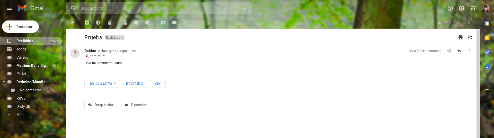

# Práctica: Servidor de correos

Instala y configura de manera adecuada el servidor de correos en tu máquina de 
OVH, para tu dominio iesgnXX.es. El nombre del servidor de correo será 
mail.iesgnXX.es (Este es el nombre que deberá aparecer en el registro MX).

En primer lugar vamos a instalar el servidor de correos postfix en nuestra 
máquina OVH:

```
debian@pandora:~$ sudo apt-get install postfix
Reading package lists... Done
Building dependency tree       
Reading state information... Done
The following additional packages will be installed:
  ssl-cert
Suggested packages:
  procmail postfix-mysql postfix-pgsql postfix-ldap postfix-pcre postfix-lmdb
  postfix-sqlite sasl2-bin | dovecot-common postfix-cdb mail-reader ufw
  postfix-doc openssl-blacklist
The following NEW packages will be installed:
  postfix ssl-cert
0 upgraded, 2 newly installed, 0 to remove and 0 not upgraded.
Need to get 1,540 kB of archives.
After this operation, 4,505 kB of additional disk space will be used.
Do you want to continue? [Y/n] Y

 ┌─────────────────────────┤ Postfix Configuration ├─────────────────────────┐
 │ The "mail name" is the domain name used to "qualify" _ALL_ mail           │ 
 │ addresses without a domain name. This includes mail to and from <root>:   │ 
 │ please do not make your machine send out mail from root@example.org       │ 
 │ unless root@example.org has told you to.                                  │ 
 │                                                                           │ 
 │ This name will also be used by other programs. It should be the single,   │ 
 │ fully qualified domain name (FQDN).                                       │ 
 │                                                                           │ 
 │ Thus, if a mail address on the local host is foo@example.org, the         │ 
 │ correct value for this option would be example.org.                       │ 
 │                                                                           │ 
 │ System mail name:                                                         │ 
 │                                                                           │ 
 │ mail.iesgn10.es__________________________________________________________ │ 
 │                                                                           │ 
 │                    <Ok>                        <Cancel>                   │ 
 │                                                                           │ 
 └───────────────────────────────────────────────────────────────────────────┘ 
                                                                               
Get:1 http://deb.debian.org/debian buster/main amd64 ssl-cert all 1.0.39 [20.8 kB]
Get:2 http://deb.debian.org/debian buster/main amd64 postfix amd64 3.4.14-0+deb10u1 [1,519 kB]
Fetched 1,540 kB in 0s (15.9 MB/s)
Preconfiguring packages ...
Selecting previously unselected package ssl-cert.
(Reading database ... 35386 files and directories currently installed.)
Preparing to unpack .../ssl-cert_1.0.39_all.deb ...
Unpacking ssl-cert (1.0.39) ...
Selecting previously unselected package postfix.
Preparing to unpack .../postfix_3.4.14-0+deb10u1_amd64.deb ...
Unpacking postfix (3.4.14-0+deb10u1) ...
Setting up ssl-cert (1.0.39) ...
Setting up postfix (3.4.14-0+deb10u1) ...
Adding group `postfix' (GID 116) ...
Done.
Adding system user `postfix' (UID 109) ...
Adding new user `postfix' (UID 109) with group `postfix' ...
Not creating home directory `/var/spool/postfix'.
Creating /etc/postfix/dynamicmaps.cf
Adding group `postdrop' (GID 117) ...
Done.
setting myhostname: pandora.iesgn10.es
setting alias maps
setting alias database
changing /etc/mailname to mail.iesgn10.es
setting myorigin
setting destinations: $myhostname, mail.iesgn10.es, pandora.iesgn10.es, localhost.iesgn10.es, localhost
setting relayhost: 
setting mynetworks: 127.0.0.0/8 [::ffff:127.0.0.0]/104 [::1]/128
setting mailbox_size_limit: 0
setting recipient_delimiter: +
setting inet_interfaces: all
setting inet_protocols: all
/etc/aliases does not exist, creating it.
WARNING: /etc/aliases exists, but does not have a root alias.

Postfix (main.cf) is now set up with a default configuration.  If you need to 
make changes, edit /etc/postfix/main.cf (and others) as needed.  To view 
Postfix configuration values, see postconf(1).

After modifying main.cf, be sure to run 'service postfix reload'.

Running newaliases
Created symlink /etc/systemd/system/multi-user.target.wants/postfix.service → /lib/systemd/system/postfix.service.
Processing triggers for systemd (241-7~deb10u4) ...
Processing triggers for man-db (2.8.5-2) ...
Processing triggers for rsyslog (8.1901.0-1) ...
```

Cuando estemos instalando postfix, debemos seleccionar la opción de 
_Internet Site_.

A continuación, vamos a instalarnos el paquete _bsd-mailx_:

```
debian@pandora:/etc/postfix$ sudo apt-get install bsd-mailx
Reading package lists... Done
Building dependency tree       
Reading state information... Done
The following additional packages will be installed:
  liblockfile-bin liblockfile1
The following NEW packages will be installed:
  bsd-mailx liblockfile-bin liblockfile1
0 upgraded, 3 newly installed, 0 to remove and 0 not upgraded.
Need to get 125 kB of archives.
After this operation, 265 kB of additional disk space will be used.
Do you want to continue? [Y/n] Y
Get:1 http://deb.debian.org/debian buster/main amd64 liblockfile-bin amd64 1.14-1.1 [19.7 kB]
Get:2 http://deb.debian.org/debian buster/main amd64 liblockfile1 amd64 1.14-1.1 [16.2 kB]
Get:3 http://deb.debian.org/debian buster/main amd64 bsd-mailx amd64 8.1.2-0.20180807cvs-1 [89.2 kB]
Fetched 125 kB in 0s (1,923 kB/s)
Selecting previously unselected package liblockfile-bin.
(Reading database ... 35587 files and directories currently installed.)
Preparing to unpack .../liblockfile-bin_1.14-1.1_amd64.deb ...
Unpacking liblockfile-bin (1.14-1.1) ...
Selecting previously unselected package liblockfile1:amd64.
Preparing to unpack .../liblockfile1_1.14-1.1_amd64.deb ...
Unpacking liblockfile1:amd64 (1.14-1.1) ...
Selecting previously unselected package bsd-mailx.
Preparing to unpack .../bsd-mailx_8.1.2-0.20180807cvs-1_amd64.deb ...
Unpacking bsd-mailx (8.1.2-0.20180807cvs-1) ...
Setting up liblockfile-bin (1.14-1.1) ...
Setting up liblockfile1:amd64 (1.14-1.1) ...
Setting up bsd-mailx (8.1.2-0.20180807cvs-1) ...
update-alternatives: using /usr/bin/bsd-mailx to provide /usr/bin/mailx (mailx) in auto mode
Processing triggers for man-db (2.8.5-2) ...
Processing triggers for libc-bin (2.28-10) ...
```

Añadimos ahora el registro MX a nuestra zona DNS en la máquina OVH:


## Gestión de correos desde el servidor

* Tarea 1: Documenta una prueba de funcionamiento, donde envíes desde tu 
servidor local al exterior. Muestra el log donde se vea el envío. Muestra el 
correo que has recibido. Muestra el registro SPF.

A continuación, vamos a instalarnos el paquete _bsd-mailx_:

```
debian@pandora:/etc/postfix$ sudo apt-get install bsd-mailx
Reading package lists... Done
Building dependency tree
Reading state information... Done
The following additional packages will be installed:
  liblockfile-bin liblockfile1
The following NEW packages will be installed:
  bsd-mailx liblockfile-bin liblockfile1
0 upgraded, 3 newly installed, 0 to remove and 0 not upgraded.
Need to get 125 kB of archives.
After this operation, 265 kB of additional disk space will be used.
Do you want to continue? [Y/n] Y
Get:1 http://deb.debian.org/debian buster/main amd64 liblockfile-bin amd64 1.14-1.1 [19.7 kB]
Get:2 http://deb.debian.org/debian buster/main amd64 liblockfile1 amd64 1.14-1.1 [16.2 kB]
Get:3 http://deb.debian.org/debian buster/main amd64 bsd-mailx amd64 8.1.2-0.20180807cvs-1 [89.2 kB]
Fetched 125 kB in 0s (1,923 kB/s)
Selecting previously unselected package liblockfile-bin.
(Reading database ... 35587 files and directories currently installed.)
Preparing to unpack .../liblockfile-bin_1.14-1.1_amd64.deb ...
Unpacking liblockfile-bin (1.14-1.1) ...
Selecting previously unselected package liblockfile1:amd64.
Preparing to unpack .../liblockfile1_1.14-1.1_amd64.deb ...
Unpacking liblockfile1:amd64 (1.14-1.1) ...
Selecting previously unselected package bsd-mailx.
Preparing to unpack .../bsd-mailx_8.1.2-0.20180807cvs-1_amd64.deb ...
Unpacking bsd-mailx (8.1.2-0.20180807cvs-1) ...
Setting up liblockfile-bin (1.14-1.1) ...
Setting up liblockfile1:amd64 (1.14-1.1) ...
Setting up bsd-mailx (8.1.2-0.20180807cvs-1) ...
update-alternatives: using /usr/bin/bsd-mailx to provide /usr/bin/mailx (mailx) in auto mode
Processing triggers for man-db (2.8.5-2) ...
Processing triggers for libc-bin (2.28-10) ...
```

Envíamos un correo de prueba a nuestra dirección email:

```
debian@pandora:/etc/postfix$ mail manuelloraroman@gmail.com
Subject: Prueba
Hola mi nombre es Lorita
Cc:
debian@pandora:/etc/postfix$
```

Y comprobamos que el mail nos ha llegado correctamente a nuestra bandeja de
entrada:



Comprobamos el log encontrado en el directorio _/var/log/syslog_:

```
Jan 28 08:28:06 pandora postfix/pickup[19246]: C20158182C: uid=1000 from=<debian>
Jan 28 08:28:06 pandora postfix/cleanup[19918]: C20158182C: message-id=<20210128082806.C20158182C@pandor$
Jan 28 08:28:06 pandora postfix/qmgr[19247]: C20158182C: from=<debian@mail.iesgn10.es>, size=431, nrcpt=$
Jan 28 08:28:07 pandora postfix/smtp[19920]: connect to gmail-smtp-in.l.google.com[2a00:1450:400c:c09::1$
Jan 28 08:28:07 pandora postfix/smtp[19920]: C20158182C: to=<manuelloraroman@gmail.com>, relay=gmail-smt$
Jan 28 08:28:07 pandora postfix/qmgr[19247]: C20158182C: removed
Jan 28 08:37:59 pandora postfix/smtpd[20040]: warning: hostname zg-1218a-27.stretchoid.com does not reso$
Jan 28 08:37:59 pandora postfix/smtpd[20040]: connect from unknown[192.241.196.70]
Jan 28 08:37:59 pandora postfix/smtpd[20040]: disconnect from unknown[192.241.196.70] ehlo=1 quit=1 comm$
```

Y el registro SPF:


* Tarea 2: Documenta una prueba de funcionamiento, donde envíes un correo 
desde el exterior (gmail, hotmail,…) a tu servidor local. Muestra el log 
donde se vea el envío. Muestra cómo has leído el correo. Muestra el registro 
MX de tu dominio.

Enviamos un correo desde nuestro email en el exterior:


Y comprobamos que nos ha llegado en nuestro correo de OVH:

```
debian@pandora:~$ mail
Mail version 8.1.2 01/15/2001.  Type ? for help.
"/var/mail/debian": 1 message 1 new
>N  1 manuelloraroman@g  Thu Jan 28 08:49  114/5605  Re: Prueba
& 1
```

```
Message 1:
From manuelloraroman@gmail.com  Thu Jan 28 08:49:30 2021
X-Original-To: debian@mail.iesgn10.es
DKIM-Signature: v=1; a=rsa-sha256; c=relaxed/relaxed;
        d=gmail.com; s=20161025;
        h=mime-version:references:in-reply-to:from:date:message-id:subject:to;
        bh=rlO3gIlttE5VQ8cvYz9snpy5ATLMnIoN322k+SNY8lk=;
        b=grgnUr5FE9DBjKfR2yoogEf0BEFXoVx2Ap/fWrjcnRb1urKva1SoYmOdm2LlLY78+/
         adThWRoqxvfh1T2nFjsWox3b7kjUZU38ICU0eUmRwCG+ShxTQz295PI2Nvb3J/Tl2UWI
         KAIlaX3p30eWdu1QCVuo7rCYKXqghoY37uzCP1FzrzfUQHsP2rrs6NVXabhJaxpwJ7sl
         X9B1wpOIHlrcTGrzuOlbIdZRTGwhX/vw3q38ByPxc69epFswf4Z8xNEVHZ20hXbKgQst
         DnSCUiTP/mbHMPfnH9z8LkEk0ZxNHg3OgSqPR4eTAS/FuRYYKkjmwhnUaTFpmSkSv66z
         29oA==
X-Google-DKIM-Signature: v=1; a=rsa-sha256; c=relaxed/relaxed;
        d=1e100.net; s=20161025;
        h=x-gm-message-state:mime-version:references:in-reply-to:from:date
         :message-id:subject:to;
        bh=rlO3gIlttE5VQ8cvYz9snpy5ATLMnIoN322k+SNY8lk=;
        b=nn2DJsA1m44m/3zbH44grYSuyYt0R7us7Ukl7F1UKa1OIX2mWwygRKKvwm05Cp5gOG
         mbZvT8T2uG7Yd9dckZoS//jRW2Yaf5cPZp31cuHiUObQtcui8aHxAdxEyNkU+hmRwrJr
         xKxVYF/x+DRGLNA2gtI1OiJxxAkcu+zQmpoV7okhAya6yT+uDkd/ClWLa+0X7lhANSfT
         HWuC5TqQURd8thT33JyLxMOK7FREWNPwcwaXIuP9SzFftfl2BtsnwT4vzhFrnlwyC9kE
         DL6gjaGAfeLPMKnnB2CAApxNEDRj4+VnR22sARBRE235KEmSQvpfoZjGgQ5+yrq41Pm/
         5Nqg==
X-Gm-Message-State: AOAM530nijOFmQ99tRn79tt57LAd5xhsFhbTjP+VGvxfbmLRCMYF4bFo
        w9R6H1v4p2vz191LfMcOcHAb8Y76a0Uz9CfJ0LfoS00QcIA=
X-Google-Smtp-Source: ABdhPJwRqyZ+vl00zF5Rh8KkhCKEmTqO9cdyp4w23wtQpQ7r68HMgvTPKBVmZJRUPaN8Idy+/rl1pVGEiwveUAICStc=
X-Received: by 2002:a7b:cd97:: with SMTP id y23mr7826548wmj.0.1611823769897;
 Thu, 28 Jan 2021 00:49:29 -0800 (PST)
MIME-Version: 1.0
References: <20210128082806.C20158182C@pandora.iesgn10.es>
In-Reply-To: <20210128082806.C20158182C@pandora.iesgn10.es>
From: =?UTF-8?Q?Manuel_Lora_Rom=C3=A1n?= <manuelloraroman@gmail.com>
Date: Thu, 28 Jan 2021 09:49:18 +0100
Subject: Re: Prueba
To: Debian <debian@mail.iesgn10.es>
Content-Type: multipart/alternative; boundary="0000000000003ecfa105b9f1f743"

--0000000000003ecfa105b9f1f743
Content-Type: text/plain; charset="UTF-8"
Content-Transfer-Encoding: quoted-printable

RECIBIDO!
<https://about.me/manuelloraroman?promo=3Demail_sig&utm_source=3Dproduct&ut=
m_medium=3Demail_sig&utm_campaign=3Dgmail_api&utm_content=3Dthumb>
Manuel Lora Rom=C3=A1n
about.me/manuelloraroman
<https://about.me/manuelloraroman?promo=3Demail_sig&utm_source=3Dproduct&ut=
m_medium=3Demail_sig&utm_campaign=3Dgmail_api&utm_content=3Dthumb>


El jue, 28 ene 2021 a las 9:28, Debian (<debian@mail.iesgn10.es>) escribi=
:
```

Efectivamente, nos ha llegado sin problemas.

El registro MX se encuentra en la primera parte de esta práctica.

## Uso de Alias y redirecciones

* Tarea 3 (No obligatoria): Uso de alias y redirecciones.

Vamos a comprobar como los procesos del servidor pueden mandar correos para 
informar sobre su estado. Por ejemplo cada vez que se ejecuta una tarea cron 
podemos enviar un correo informando del resultado. Normalmente estos correos 
se mandan al usuario root del servidor, para ello:

```
$ crontab -e
```

E indico donde se envía el correo:

```
MAILTO = root
```

Puedes poner alguna tarea en el cron para ver como se mandan correo.

Posteriormente usando alias y redirecciones podemos hacer llegar esos correos 
a nuestro correo personal.

Configura el cron para enviar correo al usuario root. Comprueba que están 
llegando esos correos al root. Crea un nuevo alias para que se manden a un 
usuario sin privilegios. Comprueban que llegan a ese usuario. Por último crea 
una redirección para enviar esos correo a tu correo personal (gmail,hotmail,…).

## Para asegurar el envío

* Tarea 4 (No obligatoria): Configura de manera adecuada DKIM es tu sistema de 
correos. Comprueba el registro DKIM en la página https://mxtoolbox.com/dkim.aspx. 
Configura postfix para que firme los correos que envía. Manda un correo y 
comprueba la verificación de las firmas en ellos.

## Para luchar contra el SPAM

* Tarea 5 (No obligatorio): Configura de manera adecuada Postfix para que 
tenga en cuenta el registro SPF de los correos que recibe. Muestra el log del 
correo para comprobar que se está haciendo el testeo del registro SPF.

* Tarea 6 (No obligatoria): Configura un sistema antispam. Realiza 
comprobaciones para comprobarlo.

* Tarea 7 (No obligatoria): Configura un sistema antivirus. Realiza 
comprobaciones para comprobarlo.

## Gestión de correos desde un cliente

* Tarea 8: Configura el buzón de los usuarios de tipo Maildir. Envía un correo 
a tu usuario y comprueba que el correo se ha guardado en el buzón Maildir del 
usuario del sistema correspondiente. Recuerda que ese tipo de buzón no se 
puede leer con la utilidad mail.

Para tener IMAP, debemos instalarnos los siguientes paquetes:

```
debian@pandora:~$ sudo apt-get install dovecot-imapd dovecot-core
Reading package lists... Done
Building dependency tree       
Reading state information... Done
The following additional packages will be installed:
  libexttextcat-2.0-0 libexttextcat-data liblua5.3-0 libstemmer0d
Suggested packages:
  dovecot-gssapi dovecot-ldap dovecot-lmtpd dovecot-lucene
  dovecot-managesieved dovecot-mysql dovecot-pgsql dovecot-pop3d dovecot-sieve
  dovecot-solr dovecot-sqlite dovecot-submissiond ufw
The following NEW packages will be installed:
  dovecot-core dovecot-imapd libexttextcat-2.0-0 libexttextcat-data
  liblua5.3-0 libstemmer0d
0 upgraded, 6 newly installed, 0 to remove and 0 not upgraded.
Need to get 5,457 kB of archives.
After this operation, 13.7 MB of additional disk space will be used.
Do you want to continue? [Y/n] Y
Get:1 http://deb.debian.org/debian buster/main amd64 libexttextcat-data all 3.4.5-1 [164 kB]
Get:2 http://deb.debian.org/debian buster/main amd64 libexttextcat-2.0-0 amd64 3.4.5-1 [15.9 kB]
Get:3 http://deb.debian.org/debian buster/main amd64 liblua5.3-0 amd64 5.3.3-1.1 [120 kB]
Get:4 http://deb.debian.org/debian buster/main amd64 libstemmer0d amd64 0+svn585-1+b2 [63.3 kB]
Get:5 http://deb.debian.org/debian buster/main amd64 dovecot-core amd64 1:2.3.4.1-5+deb10u4 [3,916 kB]
Get:6 http://deb.debian.org/debian buster/main amd64 dovecot-imapd amd64 1:2.3.4.1-5+deb10u4 [1,178 kB]
Fetched 5,457 kB in 0s (24.5 MB/s)   
Selecting previously unselected package libexttextcat-data.
(Reading database ... 35612 files and directories currently installed.)
Preparing to unpack .../0-libexttextcat-data_3.4.5-1_all.deb ...
Unpacking libexttextcat-data (3.4.5-1) ...
Selecting previously unselected package libexttextcat-2.0-0:amd64.
Preparing to unpack .../1-libexttextcat-2.0-0_3.4.5-1_amd64.deb ...
Unpacking libexttextcat-2.0-0:amd64 (3.4.5-1) ...
Selecting previously unselected package liblua5.3-0:amd64.
Preparing to unpack .../2-liblua5.3-0_5.3.3-1.1_amd64.deb ...
Unpacking liblua5.3-0:amd64 (5.3.3-1.1) ...
Selecting previously unselected package libstemmer0d:amd64.
Preparing to unpack .../3-libstemmer0d_0+svn585-1+b2_amd64.deb ...
Unpacking libstemmer0d:amd64 (0+svn585-1+b2) ...
Selecting previously unselected package dovecot-core.
Preparing to unpack .../4-dovecot-core_1%3a2.3.4.1-5+deb10u4_amd64.deb ...
Unpacking dovecot-core (1:2.3.4.1-5+deb10u4) ...
Selecting previously unselected package dovecot-imapd.
Preparing to unpack .../5-dovecot-imapd_1%3a2.3.4.1-5+deb10u4_amd64.deb ...
Unpacking dovecot-imapd (1:2.3.4.1-5+deb10u4) ...
Setting up libexttextcat-data (3.4.5-1) ...
Setting up liblua5.3-0:amd64 (5.3.3-1.1) ...
Setting up libstemmer0d:amd64 (0+svn585-1+b2) ...
Setting up libexttextcat-2.0-0:amd64 (3.4.5-1) ...
Setting up dovecot-core (1:2.3.4.1-5+deb10u4) ...

Creating config file /etc/dovecot/dovecot.conf with new version

Creating config file /etc/dovecot/dovecot-dict-auth.conf.ext with new version

Creating config file /etc/dovecot/dovecot-dict-sql.conf.ext with new version

Creating config file /etc/dovecot/dovecot-sql.conf.ext with new version

Creating config file /etc/dovecot/conf.d/10-auth.conf with new version

Creating config file /etc/dovecot/conf.d/10-director.conf with new version

Creating config file /etc/dovecot/conf.d/10-logging.conf with new version

Creating config file /etc/dovecot/conf.d/10-mail.conf with new version

Creating config file /etc/dovecot/conf.d/10-master.conf with new version

Creating config file /etc/dovecot/conf.d/10-ssl.conf with new version

Creating config file /etc/dovecot/conf.d/10-tcpwrapper.conf with new version

Creating config file /etc/dovecot/conf.d/15-lda.conf with new version

Creating config file /etc/dovecot/conf.d/15-mailboxes.conf with new version

Creating config file /etc/dovecot/conf.d/90-acl.conf with new version

Creating config file /etc/dovecot/conf.d/90-plugin.conf with new version

Creating config file /etc/dovecot/conf.d/90-quota.conf with new version

Creating config file /etc/dovecot/conf.d/auth-checkpassword.conf.ext with new version

Creating config file /etc/dovecot/conf.d/auth-deny.conf.ext with new version

Creating config file /etc/dovecot/conf.d/auth-dict.conf.ext with new version

Creating config file /etc/dovecot/conf.d/auth-master.conf.ext with new version

Creating config file /etc/dovecot/conf.d/auth-passwdfile.conf.ext with new version

Creating config file /etc/dovecot/conf.d/auth-sql.conf.ext with new version

Creating config file /etc/dovecot/conf.d/auth-static.conf.ext with new version

Creating config file /etc/dovecot/conf.d/auth-system.conf.ext with new version

Creating config file /etc/dovecot/conf.d/auth-vpopmail.conf.ext with new version
Created symlink /etc/systemd/system/multi-user.target.wants/dovecot.service → /lib/systemd/system/dovecot.service.
Setting up dovecot-imapd (1:2.3.4.1-5+deb10u4) ...

Creating config file /etc/dovecot/conf.d/20-imap.conf with new version
Processing triggers for systemd (241-7~deb10u4) ...
Processing triggers for man-db (2.8.5-2) ...
Processing triggers for libc-bin (2.28-10) ...
Processing triggers for dovecot-core (1:2.3.4.1-5+deb10u4) ...
```

Ahora, nos dirigimos hacia el directorio _/etc
* Tarea 9: Instala configura dovecot para ofrecer el protocolo IMAP. Configura 
dovecot de manera adecuada para ofrecer autentificación y cifrado.

Para realizar el cifrado de la comunicación crea un certificado en LetsEncrypt 
para el dominio mail.iesgnXX.es. Recuerda que para el ofrecer el cifrado 
tiene varias soluciones:
       - IMAP con STARTTLS: STARTTLS transforma una conexión insegura en una 
	segura mediante el uso de SSL/TLS. Por lo tanto usando el mismo puerto 
	143/tcp tenemos cifrada la comunicación.
       - IMAPS: Versión segura del protocolo IMAP que usa el puerto 993/tcp.
       - Ofrecer las dos posibilidades.

Elige una de las opciones anterior para realizar el cifrado. Y muestra la 
configuración de un cliente de correo (evolution, thunderbird, …) y muestra 
como puedes leer los correos enviado a tu usuario.

* Tarea 10 (No obligatoria): Instala un webmail (roundcube, horde, rainloop) 
para gestionar el correo del equipo mediante una interfaz web. Muestra la 
configuración necesaria y cómo eres capaz de leer los correos que recibe tu 
usuario.

* Tarea 11: Configura de manera adecuada postfix para que podamos mandar un 
correo desde un cliente remoto. La conexión entre cliente y servidor debe 
estar autentificada con SASL usando dovecor y además debe estar cifrada. Para 
cifrar esta comunicación puedes usar dos opciones:
       - ESMTP + STARTTLS: Usando el puerto 567/tcp enviamos de forma segura 
	el correo al servidor.
       - SMTPS: Utiliza un puerto no estándar (465) para SMTPS (Simple Mail 
	Transfer Protocol Secure). No es una extensión de smtp. Es muy parecido 
	a HTTPS.

Elige una de las opciones anterior para realizar el cifrado. Y muestra la 
configuración de un cliente de correo (evolution, thunderbird, …) y muestra 
como puedes enviar los correos.

* Tarea 12 (No obligatoria): Configura el cliente webmail para el envío de 
correo. Realiza una prueba de envío con el webmail.

## Comprobación final

* Tarea 13 (No obligatoria): Prueba de envío de correo. En esta página tenemos 
una herramienta completa y fácil de usar a la que podemos enviar un correo 
para que verifique y puntúe el correo que enviamos. Captura la pantalla y 
muestra la puntuación que has sacado.
