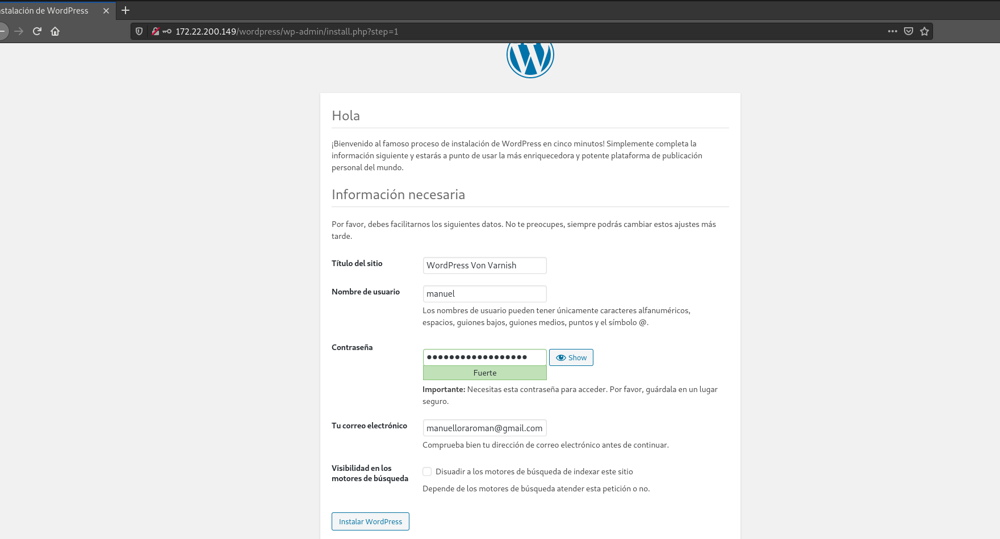
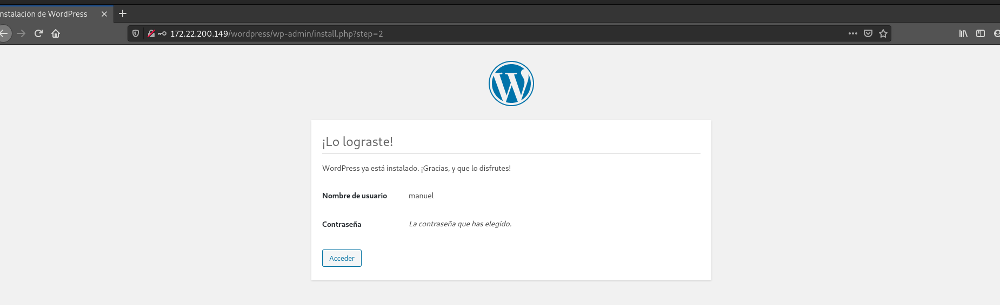
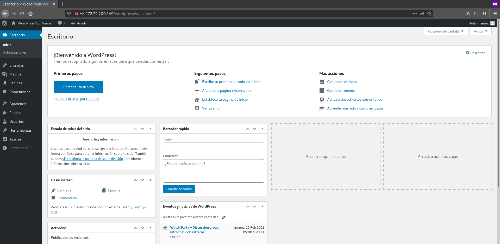
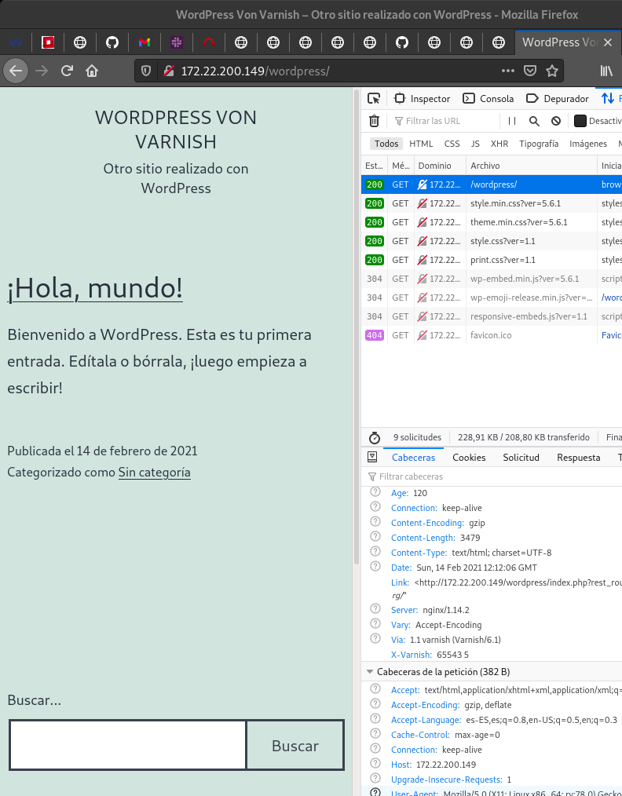

# Práctica: Ejecución de scripts PHP y Python. Rendimiento

## Aumento de rendimiento en la ejecución de scripts PHP


Tarea 1: Vamos a configurar una máquina con la configuración ganadora: 
nginx + fpm_php (socket unix). Para ello ejecuta la receta ansible que 
encontraras en este repositorio. Accede al wordpress y termina 
la configuración del sitio.

Vamos a hacer un fork del repositorio y a clonarlo en nuestra máquina fisica.
Una vez hecho esto, vamos a iniciar nuestro entorno virtual, y vamos al 
directorio clonado. Vamos a configurar el fichero _hosts_ y modificamos el
parámetro _ansible_ssh_host_:

```
[servidores_web]
nodo1 ansible_ssh_host=172.22.200.149 ansible_python_interpreter=/usr/bin/python3
```

Y después modificamos el fichero _ansible.cfg_:

```
[defaults]
inventory = hosts
remote_user = debian
host_key_checking = False
private_key_file = /home/manuel/.ssh/clave_openstack.pem
```

Y ejecutamos el siguiente comando:

```
(ansible) manuel@debian:/media/manuel/Datos/ansible/ansible_nginx_fpm_php$ 
sudo ansible-playbook site.yaml 
```

Y comprobamos que funciona una vez instalado:









Tarea 2: Vamos a hacer las pruebas de rendimiento desde la misma máquina, es 
decir vamos a ejecutar instrucciones similares a esta:

```     
ab -t 10 -c 200 -k http://127.0.0.1/wordpress/index.php
```
Realiza algunas prueba de rendimiento con varios valores distintos para el 
nivel de concurrencia (50,100,250,500) y apunta el resultado de 
peticiones/segundo (parámetro Requests per second de ab). Puedes hacer varias 
pruebas y quedarte con la media. Reinicia el servidor nginx y el 
fpm-php entre cada prueba para que los resultados sean los más reales posibles.
    
### Prueba 50

```
(ansible) manuel@debian:/media/manuel/Datos/ansible/ansible_nginx_fpm_php$ ab -t 10 -c 50 -k http://172.22.200.149/wordpress/index.php
This is ApacheBench, Version 2.3 <$Revision: 1843412 $>
Copyright 1996 Adam Twiss, Zeus Technology Ltd, http://www.zeustech.net/
Licensed to The Apache Software Foundation, http://www.apache.org/

Benchmarking 172.22.200.149 (be patient)
Finished 273 requests


Server Software:        nginx/1.14.2
Server Hostname:        172.22.200.149
Server Port:            80

Document Path:          /wordpress/index.php
Document Length:        0 bytes

Concurrency Level:      50
Time taken for tests:   10.000 seconds
Complete requests:      273
Failed requests:        0
Non-2xx responses:      273
Keep-Alive requests:    0
Total transferred:      60606 bytes
HTML transferred:       0 bytes
Requests per second:    27.30 [#/sec] (mean)
Time per request:       1831.581 [ms] (mean)
Time per request:       36.632 [ms] (mean, across all concurrent requests)
Transfer rate:          5.92 [Kbytes/sec] received

Connection Times (ms)
              min  mean[+/-sd] median   max
Connect:       88  208  54.9    206     360
Processing:   251 1346 273.7   1404    1814
Waiting:      251 1345 274.4   1404    1814
Total:        373 1554 294.9   1625    1987

Percentage of the requests served within a certain time (ms)
  50%   1624
  66%   1653
  75%   1662
  80%   1678
  90%   1755
  95%   1811
  98%   1898
  99%   1950
 100%   1987 (longest request)
```

De las 5 pruebas que he hecho, la media es de unos 27,35 peticiones/segundos.

### Prueba 100

```
(ansible) manuel@debian:~$ sudo ab -t 10 -c 100 -k http://172.22.200.149/wordpress/index.php
[sudo] password for manuel: 
This is ApacheBench, Version 2.3 <$Revision: 1843412 $>
Copyright 1996 Adam Twiss, Zeus Technology Ltd, http://www.zeustech.net/
Licensed to The Apache Software Foundation, http://www.apache.org/

Benchmarking 172.22.200.149 (be patient)
Finished 300 requests


Server Software:        nginx/1.14.2
Server Hostname:        172.22.200.149
Server Port:            80

Document Path:          /wordpress/index.php
Document Length:        0 bytes

Concurrency Level:      100
Time taken for tests:   10.020 seconds
Complete requests:      300
Failed requests:        0
Non-2xx responses:      301
Keep-Alive requests:    0
Total transferred:      66822 bytes
HTML transferred:       0 bytes
Requests per second:    29.94 [#/sec] (mean)
Time per request:       3339.927 [ms] (mean)
Time per request:       33.399 [ms] (mean, across all concurrent requests)
Transfer rate:          6.51 [Kbytes/sec] received

Connection Times (ms)
              min  mean[+/-sd] median   max
Connect:       89  166  42.2    168     278
Processing:   200 2538 788.3   2934    3230
Waiting:      200 2537 789.1   2932    3230
Total:        289 2704 819.7   3113    3397

Percentage of the requests served within a certain time (ms)
  50%   3113
  66%   3138
  75%   3160
  80%   3172
  90%   3206
  95%   3240
  98%   3280
  99%   3349
 100%   3397 (longest request)
```

La media de los 5 resultados es de 27,63 peticiones/segundos.

### Prueba 250

```
(ansible) manuel@debian:~$ sudo ab -t 10 -c 250 -k http://172.22.200.149/wordpress/index.php
This is ApacheBench, Version 2.3 <$Revision: 1843412 $>
Copyright 1996 Adam Twiss, Zeus Technology Ltd, http://www.zeustech.net/
Licensed to The Apache Software Foundation, http://www.apache.org/

Benchmarking 172.22.200.149 (be patient)
Completed 5000 requests
Finished 7831 requests


Server Software:        nginx/1.14.2
Server Hostname:        172.22.200.149
Server Port:            80

Document Path:          /wordpress/index.php
Document Length:        0 bytes

Concurrency Level:      250
Time taken for tests:   10.150 seconds
Complete requests:      7831
Failed requests:        7577
   (Connect: 0, Receive: 0, Length: 7577, Exceptions: 0)
Non-2xx responses:      7831
Keep-Alive requests:    7577
Total transferred:      2556798 bytes
HTML transferred:       1310821 bytes
Requests per second:    771.54 [#/sec] (mean)
Time per request:       324.028 [ms] (mean)
Time per request:       1.296 [ms] (mean, across all concurrent requests)
Transfer rate:          246.00 [Kbytes/sec] received

Connection Times (ms)
              min  mean[+/-sd] median   max
Connect:        0    9  45.3      0    1308
Processing:    83  242 695.7    101    5488
Waiting:       83  242 695.7    101    5488
Total:         83  251 704.6    101    5656

Percentage of the requests served within a certain time (ms)
  50%    101
  66%    114
  75%    135
  80%    181
  90%    224
  95%    413
  98%   3799
  99%   4918
 100%   5656 (longest request)
```

La media de los resultados sería de 828 peticiones/segundos.

### Prueba 500

```
(ansible) manuel@debian:~$ sudo ab -t 10 -c 500 -k http://172.22.200.149/wordpress/index.php
This is ApacheBench, Version 2.3 <$Revision: 1843412 $>
Copyright 1996 Adam Twiss, Zeus Technology Ltd, http://www.zeustech.net/
Licensed to The Apache Software Foundation, http://www.apache.org/

Benchmarking 172.22.200.149 (be patient)
Completed 5000 requests
Completed 10000 requests
Completed 15000 requests
Finished 17351 requests


Server Software:        nginx/1.14.2
Server Hostname:        172.22.200.149
Server Port:            80

Document Path:          /wordpress/index.php
Document Length:        0 bytes

Concurrency Level:      500
Time taken for tests:   10.017 seconds
Complete requests:      17351
Failed requests:        17103
   (Connect: 0, Receive: 0, Length: 17103, Exceptions: 0)
Non-2xx responses:      17351
Keep-Alive requests:    17103
Total transferred:      5699046 bytes
HTML transferred:       2958819 bytes
Requests per second:    1732.17 [#/sec] (mean)
Time per request:       288.656 [ms] (mean)
Time per request:       0.577 [ms] (mean, across all concurrent requests)
Transfer rate:          555.61 [Kbytes/sec] received

Connection Times (ms)
              min  mean[+/-sd] median   max
Connect:        0   23 222.5      0    3340
Processing:    86  221 476.3    123    6079
Waiting:       86  221 476.2    123    6079
Total:         86  244 535.9    124    6079

Percentage of the requests served within a certain time (ms)
  50%    124
  66%    148
  75%    180
  80%    209
  90%    366
  95%    589
  98%   1275
  99%   3592
 100%   6079 (longest request)
```

La media sería de unos 1953,16 peticiones/segundos.

Tarea 3: Configura un proxy inverso - caché Varnish escuchando en el puerto 80 
y que se comunica con el servidor web por el puerto 8080. Entrega y muestra 
una comprobación de que varnish está funcionando con la nueva configuración. 
Realiza pruebas de rendimiento (quedate con el resultado del parámetro Requests 
per second) y comprueba si hemos aumentado el rendimiento. Si hacemos varias 
peticiones a la misma URL, ¿cuantas peticiones llegan al servidor web? 
(comprueba el fichero access.log para averiguarlo).

Para configurar el proxy inverso - caché Varnish, debemos seguir los siguientes
pasos:


1. Instalamos el módulo de varnish:

```
root@vonvarnish:/home/debian# apt-get install varnish
Reading package lists... Done
Building dependency tree       
Reading state information... Done
The following additional packages will be installed:
  binutils binutils-common binutils-x86-64-linux-gnu cpp cpp-8 gcc gcc-8
  libasan5 libatomic1 libbinutils libc-dev-bin libc6-dev libcc1-0 libgcc-8-dev
  libgomp1 libisl19 libitm1 libjemalloc2 liblsan0 libmpc3 libmpx2 libquadmath0
  libtsan0 libubsan1 libvarnishapi2 linux-libc-dev manpages manpages-dev
Suggested packages:
  binutils-doc cpp-doc gcc-8-locales gcc-multilib make autoconf automake
  libtool flex bison gdb gcc-doc gcc-8-multilib gcc-8-doc libgcc1-dbg
  libgomp1-dbg libitm1-dbg libatomic1-dbg libasan5-dbg liblsan0-dbg
  libtsan0-dbg libubsan1-dbg libmpx2-dbg libquadmath0-dbg glibc-doc
  man-browser varnish-doc
The following NEW packages will be installed:
  binutils binutils-common binutils-x86-64-linux-gnu cpp cpp-8 gcc gcc-8
  libasan5 libatomic1 libbinutils libc-dev-bin libc6-dev libcc1-0 libgcc-8-dev
  libgomp1 libisl19 libitm1 libjemalloc2 liblsan0 libmpc3 libmpx2 libquadmath0
  libtsan0 libubsan1 libvarnishapi2 linux-libc-dev manpages manpages-dev
  varnish
0 upgraded, 29 newly installed, 0 to remove and 39 not upgraded.
Need to get 8,914 kB/36.1 MB of archives.
After this operation, 138 MB of additional disk space will be used.
Do you want to continue? [Y/n] Y
Get:1 http://deb.debian.org/debian buster/main amd64 cpp-8 amd64 8.3.0-6 [8,914 kB]
Fetched 5,301 kB in 1s (7,724 kB/s)
Selecting previously unselected package manpages.
(Reading database ... 31028 files and directories currently installed.)
Preparing to unpack .../00-manpages_4.16-2_all.deb ...
Unpacking manpages (4.16-2) ...
Selecting previously unselected package binutils-common:amd64.
Preparing to unpack .../01-binutils-common_2.31.1-16_amd64.deb ...
Unpacking binutils-common:amd64 (2.31.1-16) ...
Selecting previously unselected package libbinutils:amd64.
Preparing to unpack .../02-libbinutils_2.31.1-16_amd64.deb ...
Unpacking libbinutils:amd64 (2.31.1-16) ...
Selecting previously unselected package binutils-x86-64-linux-gnu.
Preparing to unpack .../03-binutils-x86-64-linux-gnu_2.31.1-16_amd64.deb ...
Unpacking binutils-x86-64-linux-gnu (2.31.1-16) ...
Selecting previously unselected package binutils.
Preparing to unpack .../04-binutils_2.31.1-16_amd64.deb ...
Unpacking binutils (2.31.1-16) ...
Selecting previously unselected package libisl19:amd64.
Preparing to unpack .../05-libisl19_0.20-2_amd64.deb ...
Unpacking libisl19:amd64 (0.20-2) ...
Selecting previously unselected package libmpc3:amd64.
Preparing to unpack .../06-libmpc3_1.1.0-1_amd64.deb ...
Unpacking libmpc3:amd64 (1.1.0-1) ...
Selecting previously unselected package cpp-8.
Preparing to unpack .../07-cpp-8_8.3.0-6_amd64.deb ...
Unpacking cpp-8 (8.3.0-6) ...
Selecting previously unselected package cpp.
Preparing to unpack .../08-cpp_4%3a8.3.0-1_amd64.deb ...
Unpacking cpp (4:8.3.0-1) ...
Selecting previously unselected package libcc1-0:amd64.
Preparing to unpack .../09-libcc1-0_8.3.0-6_amd64.deb ...
Unpacking libcc1-0:amd64 (8.3.0-6) ...
Selecting previously unselected package libgomp1:amd64.
Preparing to unpack .../10-libgomp1_8.3.0-6_amd64.deb ...
Unpacking libgomp1:amd64 (8.3.0-6) ...
Selecting previously unselected package libitm1:amd64.
Preparing to unpack .../11-libitm1_8.3.0-6_amd64.deb ...
Unpacking libitm1:amd64 (8.3.0-6) ...
Selecting previously unselected package libatomic1:amd64.
Preparing to unpack .../12-libatomic1_8.3.0-6_amd64.deb ...
Unpacking libatomic1:amd64 (8.3.0-6) ...
Selecting previously unselected package libasan5:amd64.
Preparing to unpack .../13-libasan5_8.3.0-6_amd64.deb ...
Unpacking libasan5:amd64 (8.3.0-6) ...
Selecting previously unselected package liblsan0:amd64.
Preparing to unpack .../14-liblsan0_8.3.0-6_amd64.deb ...
Unpacking liblsan0:amd64 (8.3.0-6) ...
Selecting previously unselected package libtsan0:amd64.
Preparing to unpack .../15-libtsan0_8.3.0-6_amd64.deb ...
Unpacking libtsan0:amd64 (8.3.0-6) ...
Selecting previously unselected package libubsan1:amd64.
Preparing to unpack .../16-libubsan1_8.3.0-6_amd64.deb ...
Unpacking libubsan1:amd64 (8.3.0-6) ...
Selecting previously unselected package libmpx2:amd64.
Preparing to unpack .../17-libmpx2_8.3.0-6_amd64.deb ...
Unpacking libmpx2:amd64 (8.3.0-6) ...
Selecting previously unselected package libquadmath0:amd64.
Preparing to unpack .../18-libquadmath0_8.3.0-6_amd64.deb ...
Unpacking libquadmath0:amd64 (8.3.0-6) ...
Selecting previously unselected package libgcc-8-dev:amd64.
Preparing to unpack .../19-libgcc-8-dev_8.3.0-6_amd64.deb ...
Unpacking libgcc-8-dev:amd64 (8.3.0-6) ...
Selecting previously unselected package gcc-8.
Preparing to unpack .../20-gcc-8_8.3.0-6_amd64.deb ...
Unpacking gcc-8 (8.3.0-6) ...
Selecting previously unselected package gcc.
Preparing to unpack .../21-gcc_4%3a8.3.0-1_amd64.deb ...
Unpacking gcc (4:8.3.0-1) ...
Selecting previously unselected package libc-dev-bin.
Preparing to unpack .../22-libc-dev-bin_2.28-10_amd64.deb ...
Unpacking libc-dev-bin (2.28-10) ...
Selecting previously unselected package linux-libc-dev:amd64.
Preparing to unpack .../23-linux-libc-dev_4.19.171-2_amd64.deb ...
Unpacking linux-libc-dev:amd64 (4.19.171-2) ...
Selecting previously unselected package libc6-dev:amd64.
Preparing to unpack .../24-libc6-dev_2.28-10_amd64.deb ...
Unpacking libc6-dev:amd64 (2.28-10) ...
Selecting previously unselected package libjemalloc2:amd64.
Preparing to unpack .../25-libjemalloc2_5.1.0-3_amd64.deb ...
Unpacking libjemalloc2:amd64 (5.1.0-3) ...
Selecting previously unselected package libvarnishapi2:amd64.
Preparing to unpack .../26-libvarnishapi2_6.1.1-1+deb10u1_amd64.deb ...
Unpacking libvarnishapi2:amd64 (6.1.1-1+deb10u1) ...
Selecting previously unselected package manpages-dev.
Preparing to unpack .../27-manpages-dev_4.16-2_all.deb ...
Unpacking manpages-dev (4.16-2) ...
Selecting previously unselected package varnish.
Preparing to unpack .../28-varnish_6.1.1-1+deb10u1_amd64.deb ...
Unpacking varnish (6.1.1-1+deb10u1) ...
Setting up manpages (4.16-2) ...
Setting up binutils-common:amd64 (2.31.1-16) ...
Setting up linux-libc-dev:amd64 (4.19.171-2) ...
Setting up libvarnishapi2:amd64 (6.1.1-1+deb10u1) ...
Setting up libjemalloc2:amd64 (5.1.0-3) ...
Setting up libgomp1:amd64 (8.3.0-6) ...
Setting up libasan5:amd64 (8.3.0-6) ...
Setting up libquadmath0:amd64 (8.3.0-6) ...
Setting up libmpc3:amd64 (1.1.0-1) ...
Setting up libatomic1:amd64 (8.3.0-6) ...
Setting up libmpx2:amd64 (8.3.0-6) ...
Setting up libubsan1:amd64 (8.3.0-6) ...
Setting up libisl19:amd64 (0.20-2) ...
Setting up libbinutils:amd64 (2.31.1-16) ...
Setting up cpp-8 (8.3.0-6) ...
Setting up libc-dev-bin (2.28-10) ...
Setting up libcc1-0:amd64 (8.3.0-6) ...
Setting up liblsan0:amd64 (8.3.0-6) ...
Setting up libitm1:amd64 (8.3.0-6) ...
Setting up binutils-x86-64-linux-gnu (2.31.1-16) ...
Setting up libtsan0:amd64 (8.3.0-6) ...
Setting up manpages-dev (4.16-2) ...
Setting up binutils (2.31.1-16) ...
Setting up libgcc-8-dev:amd64 (8.3.0-6) ...
Setting up cpp (4:8.3.0-1) ...
Setting up libc6-dev:amd64 (2.28-10) ...
Setting up gcc-8 (8.3.0-6) ...
Setting up gcc (4:8.3.0-1) ...
Setting up varnish (6.1.1-1+deb10u1) ...
Created symlink /etc/systemd/system/multi-user.target.wants/varnish.service → /lib/systemd/system/varnish.service.
Created symlink /etc/systemd/system/multi-user.target.wants/varnishncsa.service → /lib/systemd/system/varnishncsa.service.
Processing triggers for systemd (241-7~deb10u4) ...
Processing triggers for libc-bin (2.28-10) ...
```

2. Modificaremos el fichero de configuración del sitio de nginx para cambiar el
puerto al 8080:

```
server {
        listen 8080 default_server;
        listen [::]:8080 default_server;

        root /var/www/html;

        index index.php index.html index.htm index.nginx-debian.html;

        server_name _;

        location / {
                try_files $uri $uri/ =404;
        }
        location ~ \.php$ {
                include snippets/fastcgi-php.conf;
		fastcgi_pass unix:/run/php/php7.3-fpm.sock;
        }
}
```

3. Modificar la siguiente línea en la configuración del servicio de Varnish:

```
ExecStart=/usr/sbin/varnishd -j unix,user=vcache -F -a :80 -T localhost:6082 -f /etc/varnish/default.vcl -S /etc/varnish/secret -s malloc,256m
```

4. A continuación, vamos a editar el fichero _/etc/varnish/default.vcl_:

```
backend default {
    .host = "127.0.0.1";
    .port = "8080";
}
```

5. Reiniciamos el servicio y el demonio de systemd:

```
root@vonvarnish:/home/debian# systemctl daemon-reload
root@vonvarnish:/home/debian# sudo systemctl restart varnish.service
```

Y comprobamos:




### Prueba 50

```
(ansible) manuel@debian:~$ sudo ab -t 10 -c 50 -k http://172.22.200.149/wordpress/index.php
[sudo] password for manuel: 
This is ApacheBench, Version 2.3 <$Revision: 1843412 $>
Copyright 1996 Adam Twiss, Zeus Technology Ltd, http://www.zeustech.net/
Licensed to The Apache Software Foundation, http://www.apache.org/

Benchmarking 172.22.200.149 (be patient)
Finished 3774 requests


Server Software:        nginx/1.14.2
Server Hostname:        172.22.200.149
Server Port:            80

Document Path:          /wordpress/index.php
Document Length:        0 bytes

Concurrency Level:      50
Time taken for tests:   10.019 seconds
Complete requests:      3774
Failed requests:        0
Non-2xx responses:      3774
Keep-Alive requests:    3774
Total transferred:      1174520 bytes
HTML transferred:       0 bytes
Requests per second:    376.70 [#/sec] (mean)
Time per request:       132.733 [ms] (mean)
Time per request:       2.655 [ms] (mean, across all concurrent requests)
Transfer rate:          114.49 [Kbytes/sec] received

Connection Times (ms)
              min  mean[+/-sd] median   max
Connect:        0    2  15.2      0     175
Processing:    83  119  44.7    111     806
Waiting:       83  119  44.7    111     803
Total:         83  120  47.5    111     891

Percentage of the requests served within a certain time (ms)
  50%    111
  66%    121
  75%    126
  80%    131
  90%    148
  95%    181
  98%    271
  99%    392
 100%    891 (longest request)
```

### Prueba 100

```
(ansible) manuel@debian:~$ sudo ab -t 10 -c 100 -k http://172.22.200.149/wordpress/index.php
This is ApacheBench, Version 2.3 <$Revision: 1843412 $>
Copyright 1996 Adam Twiss, Zeus Technology Ltd, http://www.zeustech.net/
Licensed to The Apache Software Foundation, http://www.apache.org/

Benchmarking 172.22.200.149 (be patient)
Completed 5000 requests
Finished 8406 requests


Server Software:        nginx/1.14.2
Server Hostname:        172.22.200.149
Server Port:            80

Document Path:          /wordpress/index.php
Document Length:        0 bytes

Concurrency Level:      100
Time taken for tests:   10.017 seconds
Complete requests:      8406
Failed requests:        0
Non-2xx responses:      8406
Keep-Alive requests:    8406
Total transferred:      2627904 bytes
HTML transferred:       0 bytes
Requests per second:    839.16 [#/sec] (mean)
Time per request:       119.167 [ms] (mean)
Time per request:       1.192 [ms] (mean, across all concurrent requests)
Transfer rate:          256.19 [Kbytes/sec] received

Connection Times (ms)
              min  mean[+/-sd] median   max
Connect:        0    1  10.9      0     125
Processing:    83  113  50.2     97     461
Waiting:       83  113  50.2     97     461
Total:         83  114  52.1     97     461

Percentage of the requests served within a certain time (ms)
  50%     97
  66%    103
  75%    110
  80%    115
  90%    143
  95%    231
  98%    311
  99%    383
 100%    461 (longest request)
```

### Prueba 250

```
(ansible) manuel@debian:~$ sudo ab -t 10 -c 250 -k http://172.22.200.149/wordpress/index.php
This is ApacheBench, Version 2.3 <$Revision: 1843412 $>
Copyright 1996 Adam Twiss, Zeus Technology Ltd, http://www.zeustech.net/
Licensed to The Apache Software Foundation, http://www.apache.org/

Benchmarking 172.22.200.149 (be patient)
Completed 5000 requests
Completed 10000 requests
Completed 15000 requests
Finished 17279 requests


Server Software:        nginx/1.14.2
Server Hostname:        172.22.200.149
Server Port:            80

Document Path:          /wordpress/index.php
Document Length:        0 bytes

Concurrency Level:      250
Time taken for tests:   10.018 seconds
Complete requests:      17279
Failed requests:        0
Non-2xx responses:      17279
Keep-Alive requests:    17279
Total transferred:      5405079 bytes
HTML transferred:       0 bytes
Requests per second:    1724.85 [#/sec] (mean)
Time per request:       144.940 [ms] (mean)
Time per request:       0.580 [ms] (mean, across all concurrent requests)
Transfer rate:          526.91 [Kbytes/sec] received

Connection Times (ms)
              min  mean[+/-sd] median   max
Connect:        0    4  30.3      0     257
Processing:    83  135 130.5    101    1667
Waiting:       83  135 130.5    101    1667
Total:         83  138 154.1    101    1922

Percentage of the requests served within a certain time (ms)
  50%    101
  66%    108
  75%    120
  80%    127
  90%    201
  95%    273
  98%    458
  99%   1109
 100%   1922 (longest request)
```

### Prueba 500

```
(ansible) manuel@debian:~$ sudo ab -t 10 -c 500 -k http://172.22.200.149/wordpress/index.php
This is ApacheBench, Version 2.3 <$Revision: 1843412 $>
Copyright 1996 Adam Twiss, Zeus Technology Ltd, http://www.zeustech.net/
Licensed to The Apache Software Foundation, http://www.apache.org/

Benchmarking 172.22.200.149 (be patient)
Completed 5000 requests
Completed 10000 requests
Completed 15000 requests
Completed 20000 requests
Completed 25000 requests
Completed 30000 requests
Finished 33302 requests


Server Software:        nginx/1.14.2
Server Hostname:        172.22.200.149
Server Port:            80

Document Path:          /wordpress/index.php
Document Length:        0 bytes

Concurrency Level:      500
Time taken for tests:   10.001 seconds
Complete requests:      33302
Failed requests:        0
Non-2xx responses:      33302
Keep-Alive requests:    33302
Total transferred:      10460156 bytes
HTML transferred:       0 bytes
Requests per second:    3329.90 [#/sec] (mean)
Time per request:       150.154 [ms] (mean)
Time per request:       0.300 [ms] (mean, across all concurrent requests)
Transfer rate:          1021.41 [Kbytes/sec] received

Connection Times (ms)
              min  mean[+/-sd] median   max
Connect:        0    4  40.0      0    1305
Processing:    83  128  95.0    100    1168
Waiting:       83  128  95.0    100    1167
Total:         83  132 112.4    100    1482

Percentage of the requests served within a certain time (ms)
  50%    100
  66%    103
  75%    108
  80%    113
  90%    179
  95%    394
  98%    485
  99%    699
 100%   1482 (longest request)
```

El rendimiento ha aumentado exponencialmente con respecto a las pruebas
anteriores sin Varnish.

Al realizar varias peticiones a la vez, debido a que tenemos una caché, 
solamente hará la primera petición:

```
127.0.0.1 - - [14/Feb/2021:12:18:17 +0000] "GET /wordpress/index.php HTTP/1.1" 301 5 "-" "ApacheBench/2.3"
127.0.0.1 - - [14/Feb/2021:12:20:25 +0000] "GET /wordpress/index.php HTTP/1.1" 301 5 "-" "ApacheBench/2.3"
127.0.0.1 - - [14/Feb/2021:12:22:57 +0000] "GET /wordpress/index.php HTTP/1.1" 301 5 "-" "Mozilla/5.0 (X11; Linux x86_64; rv:78.0) Gecko/20100101 Firefox/78.0"
127.0.0.1 - - [14/Feb/2021:12:22:58 +0000] "GET /wordpress/ HTTP/1.1" 200 3491 "-" "Mozilla/5.0 (X11; Linux x86_64; rv:78.0) Gecko/20100101 Firefox/78.0"
127.0.0.1 - - [14/Feb/2021:12:22:58 +0000] "GET /wordpress/wp-includes/js/wp-emoji-release.min.js?ver=5.6.1 HTTP/1.1" 200 14229 "http://172.22.200.149/wordpress/" "Mozilla/5.0 (X11; Linux x86_64; rv:78.0) Gecko/20100101 Firefox/78.0"
127.0.0.1 - - [14/Feb/2021:12:22:58 +0000] "GET /wordpress/wp-includes/css/dist/block-library/style.min.css?ver=5.6.1 HTTP/1.1" 200 51433 "http://172.22.200.149/wordpress/" "Mozilla/5.0 (X11; Linux x86_64; rv:78.0) Gecko/20100101 Firefox/78.0"
127.0.0.1 - - [14/Feb/2021:12:22:58 +0000] "GET /wordpress/wp-content/themes/twentytwentyone/style.css?ver=1.1 HTTP/1.1" 200 152103 "http://172.22.200.149/wordpress/" "Mozilla/5.0 (X11; Linux x86_64; rv:78.0) Gecko/20100101 Firefox/78.0"
127.0.0.1 - - [14/Feb/2021:12:22:58 +0000] "GET /wordpress/wp-includes/css/dist/block-library/theme.min.css?ver=5.6.1 HTTP/1.1" 200 2297 "http://172.22.200.149/wordpress/" "Mozilla/5.0 (X11; Linux x86_64; rv:78.0) Gecko/20100101 Firefox/78.0"
127.0.0.1 - - [14/Feb/2021:12:22:58 +0000] "GET /wordpress/wp-content/themes/twentytwentyone/assets/js/responsive-embeds.js?ver=1.1 HTTP/1.1" 200 1127 "http://172.22.200.149/wordpress/" "Mozilla/5.0 (X11; Linux x86_64; rv:78.0) Gecko/20100101 Firefox/78.0"
127.0.0.1 - - [14/Feb/2021:12:22:58 +0000] "GET /wordpress/wp-content/themes/twentytwentyone/assets/css/print.css?ver=1.1 HTTP/1.1" 200 2897 "http://172.22.200.149/wordpress/" "Mozilla/5.0 (X11; Linux x86_64; rv:78.0) Gecko/20100101 Firefox/78.0"
127.0.0.1 - - [14/Feb/2021:12:22:58 +0000] "GET /wordpress/wp-includes/js/wp-embed.min.js?ver=5.6.1 HTTP/1.1" 200 1426 "http://172.22.200.149/wordpress/" "Mozilla/5.0 (X11; Linux x86_64; rv:78.0) Gecko/20100101 Firefox/78.0"
127.0.0.1 - - [14/Feb/2021:12:22:59 +0000] "GET /favicon.ico HTTP/1.1" 404 143 "-" "Mozilla/5.0 (X11; Linux x86_64; rv:78.0) Gecko/20100101 Firefox/78.0"
```
