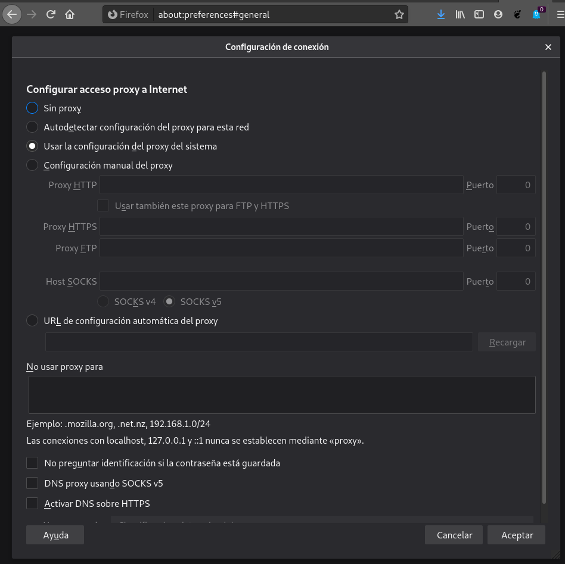
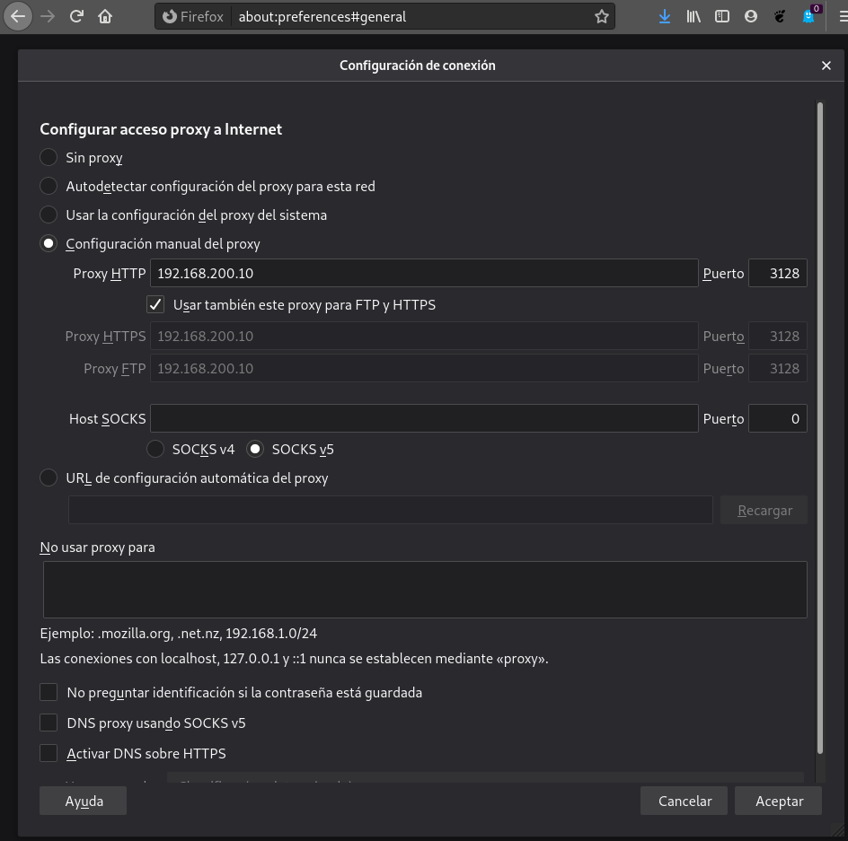
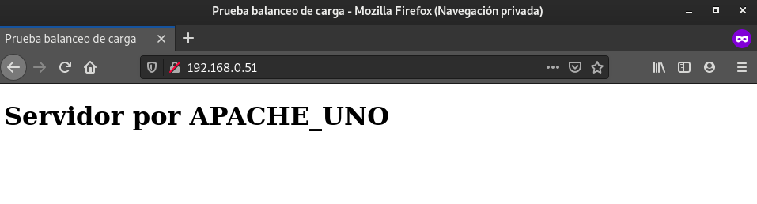
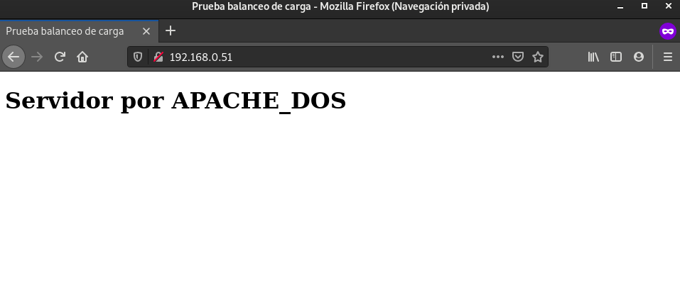
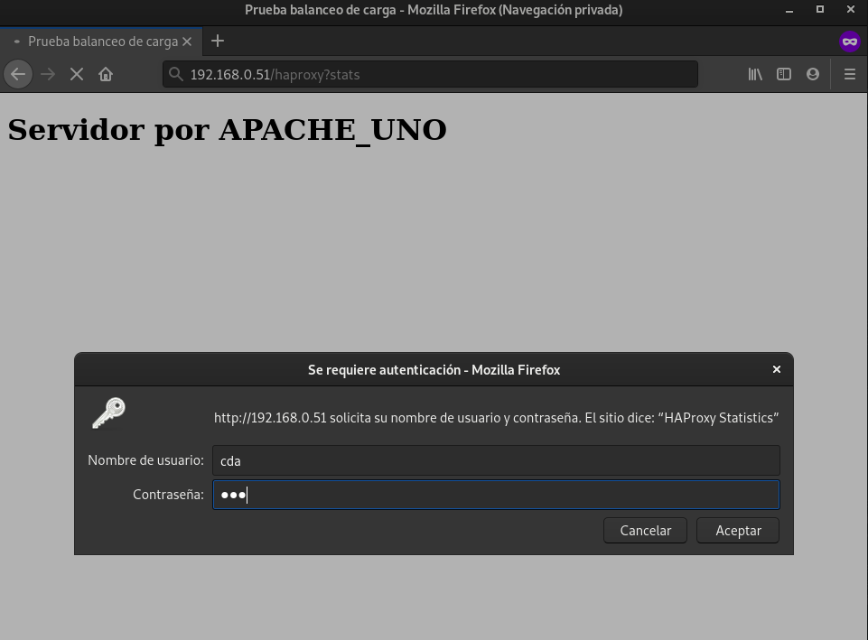
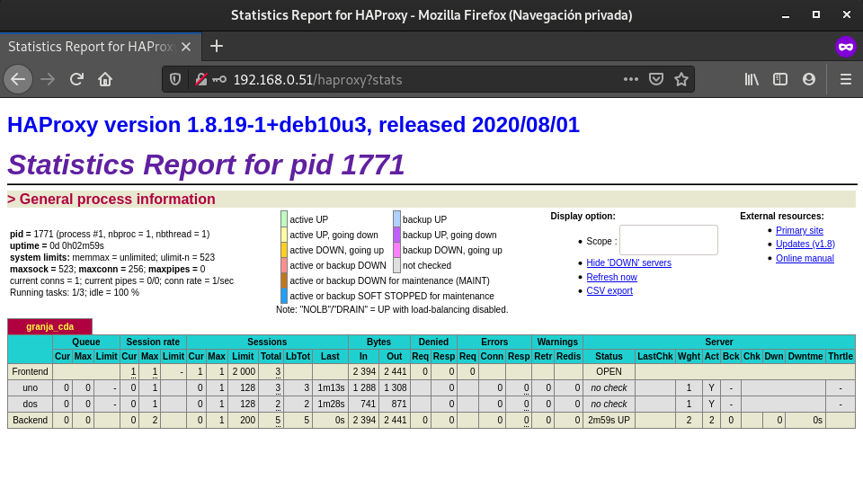
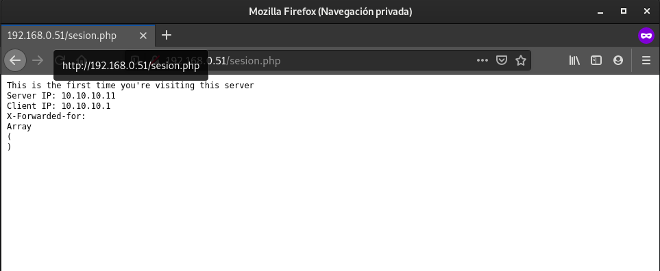
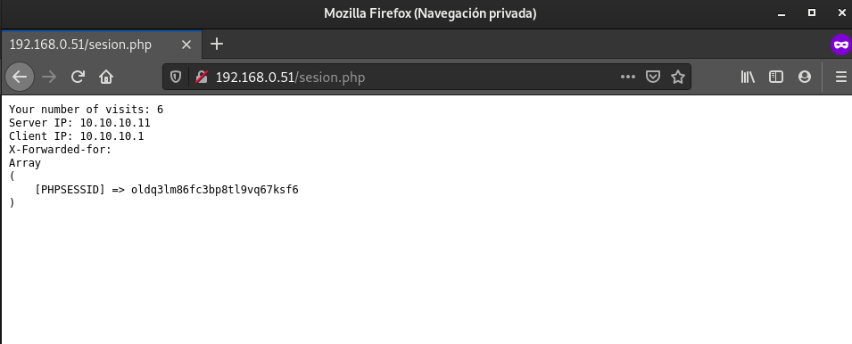
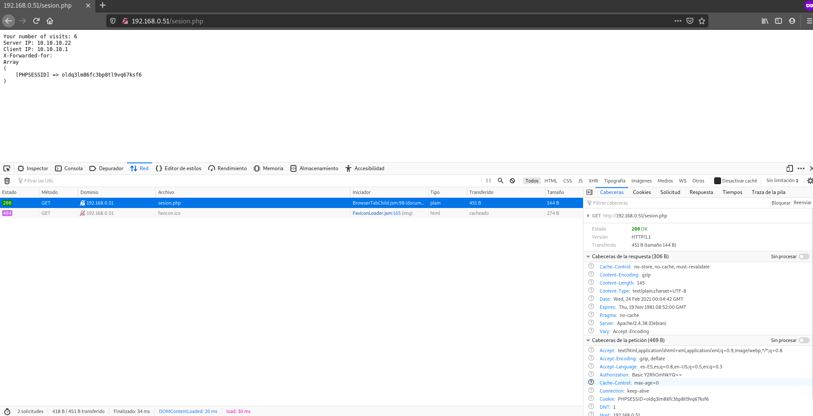

# Práctica: Proxy, proxy inverso y balanceadores de carga

## Proxy

En esta práctica vamos a instalar un proxy squid para configurar nuestro 
cliente para que acceda a internet por medio de este proxy.

Vamos a usar el fichero Vagrantfile para crear el escenario: un ordenador 
llamado proxy donde instalaremos squid y un cliente interno (cliente_int).

```
# -*- mode: ruby -*-
# vi: set ft=ruby :


Vagrant.configure("2") do |config|
config.vm.define :proxy do |proxy|
    proxy.vm.box = "debian/buster64"
    proxy.vm.hostname = "proxy"
    proxy.vm.network :private_network, ip: "10.0.0.10", virtualbox__intnet: "red_privada1"
    proxy.vm.network :private_network, ip: "192.168.200.10"
  end
  config.vm.define :cliente_int do |cliente_int|
    cliente_int.vm.box = "debian/buster64"
    cliente_int.vm.network :private_network, ip: "10.0.0.11",virtualbox__intnet: "red_privada1"
  end
  
end
```

* Tarea 1: Instala squid en la máquina squid y configúralo para que permita 
conexiones desde la red donde este tu ordenador.

```
root@proxy:~# apt-get update && apt-get install squid
Hit:1 http://deb.debian.org/debian buster InRelease
Hit:2 http://security.debian.org/debian-security buster/updates InRelease
Reading package lists... Done
Reading package lists... Done
Building dependency tree       
Reading state information... Done
The following additional packages will be installed:
  libdbi-perl libecap3 libltdl7 libperl5.28 perl perl-base perl-modules-5.28
  squid-common squid-langpack
Suggested packages:
  libclone-perl libmldbm-perl libnet-daemon-perl libsql-statement-perl
  perl-doc libterm-readline-gnu-perl | libterm-readline-perl-perl make
  libb-debug-perl liblocale-codes-perl squidclient squid-cgi squid-purge
  resolvconf smbclient ufw winbind
The following NEW packages will be installed:
  libdbi-perl libecap3 libltdl7 squid squid-common squid-langpack
The following packages will be upgraded:
  libperl5.28 perl perl-base perl-modules-5.28
4 upgraded, 6 newly installed, 0 to remove and 63 not upgraded.
Need to get 12.8 MB of archives.
After this operation, 15.9 MB of additional disk space will be used.
Do you want to continue? [Y/n] Y
.
.
.
Processing triggers for systemd (241-7~deb10u4) ...
Processing triggers for man-db (2.8.5-2) ...
Processing triggers for libc-bin (2.28-10) ...
```

Y ahora nos dirigimos al directorio _/etc/squid_ donde encontramos el fichero
de configuración. En este directorio, vamos a modificar el fichero de 
configuración, y añadimos la siguiente linea:

```
http_access allow all
```

Debemos asegurarnos de que las reglas anteriores deben ir antes de la línea
ya que la directiva http_access funciona de manera similar a las reglas de
iptables:

```
http_access deny all
```

Reiniciamos el servicio:

```
root@proxy:/etc/squid# systemctl restart squid

● squid.service - Squid Web Proxy Server
   Loaded: loaded (/lib/systemd/system/squid.service; enabled; vendor preset: en
   Active: active (running) since Tue 2021-02-23 09:09:54 GMT; 18s ago
     Docs: man:squid(8)
  Process: 2658 ExecStartPre=/usr/sbin/squid --foreground -z (code=exited, statu
  Process: 2661 ExecStart=/usr/sbin/squid -sYC (code=exited, status=0/SUCCESS)
 Main PID: 2662 (squid)
    Tasks: 4 (limit: 544)
   Memory: 16.5M
   CGroup: /system.slice/squid.service
           ├─2662 /usr/sbin/squid -sYC
           ├─2664 (squid-1) --kid squid-1 -sYC
           ├─2665 (logfile-daemon) /var/log/squid/access.log
           └─2666 (pinger)

Feb 23 09:09:54 proxy squid[2664]: Max Swap size: 0 KB
Feb 23 09:09:54 proxy squid[2664]: Using Least Load store dir selection
Feb 23 09:09:54 proxy squid[2664]: Set Current Directory to /var/spool/squid
Feb 23 09:09:54 proxy squid[2664]: Finished loading MIME types and icons.
Feb 23 09:09:54 proxy squid[2664]: HTCP Disabled.
Feb 23 09:09:54 proxy squid[2664]: Pinger socket opened on FD 14
Feb 23 09:09:54 proxy squid[2664]: Squid plugin modules loaded: 0
Feb 23 09:09:54 proxy squid[2664]: Adaptation support is off.
```

Y hasta aquí, la configuración de Calamar.

* Tarea 2: Prueba que tu ordenador está navegando a través del proxy 
(HTTP/HTTPS) configurando el proxy de dos maneras diferentes:
        
	- Directamente indicándolo en el navegador.
        - Configurando el proxy del sistema en el entorno gráfico (tienes que 
	indicar en el navegador que vas a hacer uso del proxy del sistema).

Muestra el contenido del fichero ´/var/log/squid/access.log` para comprobar 
que está funcionando el proxy.

Nos iremos a nuestra máquina física, al navegador Firefox. Nos iremos a la
pestaña de configuración de Firefox > Preferencias > Configuración de Red y 
le damos al botón de Configuración...

Se nos desplegará la siguiente ventana:



Y rellenaremos con la siguiente información:



Y comprobamos el fichero _access.log_:

```
root@proxy:/etc/squid# tail -f /var/log/squid/access.log 
1614081631.220      0 192.168.200.1 TCP_DENIED/403 4024 CONNECT ssl.gstatic.com:443 - HIER_NONE/- text/html
1614081633.424      0 192.168.200.1 TCP_DENIED/403 4024 CONNECT play.google.com:443 - HIER_NONE/- text/html
1614081642.215      0 192.168.200.1 TCP_DENIED/403 4024 CONNECT ssl.gstatic.com:443 - HIER_NONE/- text/html
1614081653.230      0 192.168.200.1 TCP_DENIED/403 4024 CONNECT ssl.gstatic.com:443 - HIER_NONE/- text/html
1614081661.250      1 192.168.200.1 TCP_DENIED/403 4024 CONNECT play.google.com:443 - HIER_NONE/- text/html
1614081664.243      0 192.168.200.1 TCP_DENIED/403 4024 CONNECT ssl.gstatic.com:443 - HIER_NONE/- text/html
1614081675.249      0 192.168.200.1 TCP_DENIED/403 4024 CONNECT ssl.gstatic.com:443 - HIER_NONE/- text/html
1614081686.253      0 192.168.200.1 TCP_DENIED/403 4024 CONNECT ssl.gstatic.com:443 - HIER_NONE/- text/html
1614081697.249      0 192.168.200.1 TCP_DENIED/403 4024 CONNECT ssl.gstatic.com:443 - HIER_NONE/- text/html
1614081708.266      0 192.168.200.1 TCP_DENIED/403 4024 CONNECT ssl.gstatic.com:443 - HIER_NONE/- text/html
1614081781.718     44 192.168.200.1 NONE/503 0 CONNECT ipv6.whatismyip.com:443 - HIER_NONE/- -
1614081782.946    133 192.168.200.1 TCP_TUNNEL/200 9367 CONNECT signaler-pa.clients6.google.com:443 - HIER_DIRECT/172.217.168.170 -
1614081783.180    238 192.168.200.1 TCP_TUNNEL/200 10003 CONNECT signaler-pa.clients6.google.com:443 - HIER_DIRECT/172.217.168.170 -
1614081804.271    148 192.168.200.1 TCP_MISS/200 895 POST http://ocsp.pki.goog/gts1o1core - HIER_DIRECT/216.58.211.227 application/ocsp-response
1614081804.756    272 192.168.200.1 TCP_MISS/200 1150 POST http://ocsp.sca1b.amazontrust.com/ - HIER_DIRECT/13.225.38.213 application/ocsp-response
1614081805.003    148 192.168.200.1 TCP_TUNNEL/200 4811 CONNECT fonts.googleapis.com:443 - HIER_DIRECT/142.250.184.170 -
1614081805.127    118 192.168.200.1 TCP_MISS/200 2247 POST http://ocsp.globalsign.com/gsrsaovsslca2018 - HIER_DIRECT/151.101.134.133 application/ocsp-response
1614081806.231    495 192.168.200.1 TCP_MISS/200 1083 POST http://ocsp.int-x3.letsencrypt.org/ - HIER_DIRECT/2.22.62.145 application/ocsp-response
1614081806.232    459 192.168.200.1 TCP_MISS/200 1083 POST http://ocsp.int-x3.letsencrypt.org/ - HIER_DIRECT/2.22.62.145 application/ocsp-response
1614081808.571    164 192.168.200.1 TCP_MISS/200 1059 POST http://r3.o.lencr.org/ - HIER_DIRECT/2.22.62.146 application/ocsp-response
1614081808.583    163 192.168.200.1 TCP_MISS/200 1059 POST http://r3.o.lencr.org/ - HIER_DIRECT/2.22.62.146 application/ocsp-response
1614081808.653    564 192.168.200.1 TCP_TUNNEL/200 3271 CONNECT prod-ingestion.tracking.v2.yieldlove-ad-serving.net:443 - HIER_DIRECT/54.93.57.76 -
1614081811.413   6565 192.168.200.1 TCP_TUNNEL/200 9147 CONNECT dev.whatismyip.com:443 - HIER_DIRECT/35.227.84.201 -
```

* Tarea 3: Configura squid para que pueda ser utilizado desde el cliente 
interno. En el cliente interno configura el proxy desde la línea de comandos 
(con una variable de entorno). Fíjate que no hemos puesto ninguna regla SNAT y 
podemos navegar (protocolo HTTP), pero no podemos hacer ping o utilizar otro 
servicio.
   
Para la máquina _cliente_int_ debemos crear una variable de entorno en la máquina.
Dicha variable la crearemos de la siguiente manera:

```
vagrant@buster:~$ export http_proxy=http://192.168.200.10:3128/
vagrant@buster:~$ echo $http_proxy
http://192.168.200.10:3128/
```

Y comprobamos que el proxy recoge información:

```
root@proxy:/etc/squid# tail -f /var/log/squid/access.log
1614082471.692    735 192.168.200.1 TCP_TUNNEL/200 4704 CONNECT webextensions.settings.services.mozilla.com:443 - HIER_DIRECT/34.95.71.207 -
1614082529.983  60802 192.168.200.1 TCP_TUNNEL/200 4246 CONNECT profile.accounts.firefox.com:443 - HIER_DIRECT/34.213.247.147 -
1614082559.465 310889 192.168.200.1 TCP_TUNNEL/200 232396 CONNECT www.google.com:443 - HIER_DIRECT/216.58.215.132 -
1614082562.465 170834 192.168.200.1 TCP_TUNNEL/200 500 CONNECT collector-hpn.ghostery.net:443 - HIER_DIRECT/35.170.188.186 -
1614082587.227    121 192.168.200.1 TCP_MISS/200 14824 GET http://www.google.com/ - HIER_DIRECT/216.58.215.132 text/html
1614082601.466 173153 192.168.200.1 TCP_TUNNEL/200 1874 CONNECT edgeapi.slack.com:443 - HIER_DIRECT/18.200.77.145 -
1614082606.906    103 192.168.200.1 TCP_MISS/200 14860 GET http://www.google.com/ - HIER_DIRECT/216.58.215.132 text/html
```

* Tarea 4: Con squid podemos filtrar el acceso por url o dominios, realiza las 
configuraciones necesarias para implementar un filtro que funcione como lista 
negra (todo el acceso es permitido menos las url o dominios que indiquemos en 
un fichero.)

Para bloquear algunos sitios web es necesario modificar de nuevo el
fichero de configuración de Calamar, agregando ciertas reglas por encima
de la que permite todo. El fichero quedaría así:

```
acl blacklist1 dstdomain "/etc/squid/sitios-restringidos.squid"

http_access deny blacklist1
```

Creamos dicho fichero y añadimos los sitios web que no queremos permitir:

```
.facebook.com
.yahoo.com
.youtube.com
.twitter.com
```

Y reiniciamos el servicio:

```
vagrant@proxy:/etc/squid$ sudo systemctl restart squid
```

Y comprobamos:

```
root@proxy:/etc/squid# tail -f /var/log/squid/access.log 
1614084959.202  68660 192.168.200.1 TCP_TUNNEL_ABORTED/200 101347 CONNECT s.yimg.com:443 - HIER_DIRECT/188.125.95.250 -
1614084959.202  70501 192.168.200.1 TCP_TUNNEL_ABORTED/200 5586 CONNECT es.yahoo.com:443 - HIER_DIRECT/87.248.100.216 -
1614084959.202  70009 192.168.200.1 TCP_TUNNEL_ABORTED/200 5780 CONNECT guce.yahoo.com:443 - HIER_DIRECT/52.210.238.227 -
1614084967.724      0 192.168.200.1 TCP_DENIED/403 4006 CONNECT yahoo.com:443 - HIER_NONE/- text/html
1614084980.014   5317 192.168.200.1 TCP_TUNNEL/200 7782 CONNECT fp.josedomingo.org:443 - HIER_DIRECT/37.187.119.60 -
1614084980.096   5603 192.168.200.1 TCP_TUNNEL/200 13861 CONNECT www.josedomingo.org:443 - HIER_DIRECT/37.187.119.60 -
1614084997.021      0 192.168.200.1 TCP_DENIED/403 4027 CONNECT www.facebook.com:443 - HIER_NONE/- text/html
1614085031.903      0 192.168.200.1 TCP_DENIED/403 4027 CONNECT www.facebook.com:443 - HIER_NONE/- text/html
```


   
* Tarea 5: Realiza las configuraciones necesarias para implementar un filtro 
que funcione como lista blanca (todo el acceso es denegado menos las url o 
dominios que indiquemos en un fichero.)

Creamos un fichero _sitios-permitidos.squid_:

```
.github.com
.josedomingo.org
```

Y a continuación, vamos a modificar el fichero de configuración de calamar y
añadiremos las siguientes lineas (borrando la configuración realizada
en los anteriores apartados):

```
acl whitelist1 dstdomain "/etc/squid/sitios-permitidos.squid"

http_access allow red_local whitelist1
```

Y comprobamos que funciona:

```
root@proxy:/etc/squid# tail -f /var/log/squid/access.log 
1614085650.553      0 192.168.200.1 TCP_DENIED/403 4057 CONNECT collector-hpn.ghostery.net:443 - HIER_NONE/- text/html
1614085651.272      0 192.168.200.1 TCP_DENIED/403 4057 CONNECT collector-hpn.ghostery.net:443 - HIER_NONE/- text/html
1614085652.601      0 192.168.200.1 TCP_DENIED/403 4024 CONNECT ssl.gstatic.com:443 - HIER_NONE/- text/html
1614085653.294      0 192.168.200.1 TCP_DENIED/403 4057 CONNECT collector-hpn.ghostery.net:443 - HIER_NONE/- text/html
1614085655.299      0 192.168.200.1 TCP_DENIED/403 4057 CONNECT collector-hpn.ghostery.net:443 - HIER_NONE/- text/html
1614085655.984      0 192.168.200.1 TCP_DENIED/403 4057 CONNECT collector-hpn.ghostery.net:443 - HIER_NONE/- text/html
1614085656.875      0 192.168.200.1 TCP_DENIED/403 4057 CONNECT collector-hpn.ghostery.net:443 - HIER_NONE/- text/html
1614085663.604      0 192.168.200.1 TCP_DENIED/403 4024 CONNECT ssl.gstatic.com:443 - HIER_NONE/- text/html
1614085674.649      0 192.168.200.1 TCP_DENIED/403 4024 CONNECT ssl.gstatic.com:443 - HIER_NONE/- text/html
1614085674.917      0 192.168.200.1 TCP_DENIED/403 4057 CONNECT collector-hpn.ghostery.net:443 - HIER_NONE/- text/html
1614085682.100      0 192.168.200.1 TCP_DENIED/403 4027 CONNECT cdn.jsdelivr.net:443 - HIER_NONE/- text/html
1614085682.598      0 192.168.200.1 TCP_DENIED/403 4057 CONNECT collector-hpn.ghostery.net:443 - HIER_NONE/- text/html
1614085682.640      0 192.168.200.1 TCP_DENIED/403 4039 CONNECT platform.twitter.com:443 - HIER_NONE/- text/html
1614085684.997      0 192.168.200.1 TCP_DENIED/403 4057 CONNECT collector-hpn.ghostery.net:443 - HIER_NONE/- text/html
1614085685.632      0 192.168.200.1 TCP_DENIED/403 4024 CONNECT ssl.gstatic.com:443 - HIER_NONE/- text/html
1614085686.996      0 192.168.200.1 TCP_DENIED/403 4057 CONNECT collector-hpn.ghostery.net:443 - HIER_NONE/- text/html
1614085687.265   5164 192.168.200.1 TCP_TUNNEL/200 28526 CONNECT www.josedomingo.org:443 - HIER_DIRECT/37.187.119.60 -
1614085687.271   5170 192.168.200.1 TCP_TUNNEL/200 43197 CONNECT www.josedomingo.org:443 - HIER_DIRECT/37.187.119.60 -
1614085687.297   5128 192.168.200.1 TCP_TUNNEL/200 826 CONNECT www.josedomingo.org:443 - HIER_DIRECT/37.187.119.60 -
1614085687.301   5421 192.168.200.1 TCP_TUNNEL/200 21029 CONNECT www.josedomingo.org:443 - HIER_DIRECT/37.187.119.60 -
1614085687.321   5153 192.168.200.1 TCP_TUNNEL/200 842 CONNECT plataforma.josedomingo.org:443 - HIER_DIRECT/37.187.119.60 -
1614085687.341   5240 192.168.200.1 TCP_TUNNEL/200 7426 CONNECT www.josedomingo.org:443 - HIER_DIRECT/37.187.119.60 -
1614085687.402   5301 192.168.200.1 TCP_TUNNEL/200 226928 CONNECT www.josedomingo.org:443 - HIER_DIRECT/37.187.119.60 -
1614085689.010      0 192.168.200.1 TCP_DENIED/403 4057 CONNECT collector-hpn.ghostery.net:443 - HIER_NONE/- text/html
1614085689.645      0 192.168.200.1 TCP_DENIED/403 4024 CONNECT play.google.com:443 - HIER_NONE/- text/html
```

Podemos entrar a la página de josedomingo.org:


Pero al intentar acceder a un recurso externo, ya no podría visualizarse:


## Balanceadores de carga

* Tarea 1: Entrega capturas de pantalla que el balanceador está funcionando.

Desplegamos el escenario con el fichero Vagrantfile. Una vez desplegado,
vamos a realizar lo siguiente. Instalaremos el paquete _HAproxy_ y
lo configuramos:

```
vagrant@balanceador:~$ sudo apt-get install haproxy
Reading package lists... Done
Building dependency tree       
Reading state information... Done
The following additional packages will be installed:
  liblua5.3-0
Suggested packages:
  vim-haproxy haproxy-doc
The following NEW packages will be installed:
  haproxy liblua5.3-0
0 upgraded, 2 newly installed, 0 to remove and 0 not upgraded.
Need to get 1,424 kB of archives.
After this operation, 3,061 kB of additional disk space will be used.
Do you want to continue? [Y/n] Y
Get:1 http://deb.debian.org/debian buster/main amd64 liblua5.3-0 amd64 5.3.3-1.1 [120 kB]
Get:2 http://deb.debian.org/debian buster/main amd64 haproxy amd64 1.8.19-1+deb10u3 [1,304 kB]
Fetched 1,424 kB in 0s (3,741 kB/s)
Selecting previously unselected package liblua5.3-0:amd64.
(Reading database ... 60974 files and directories currently installed.)
Preparing to unpack .../liblua5.3-0_5.3.3-1.1_amd64.deb ...
Unpacking liblua5.3-0:amd64 (5.3.3-1.1) ...
Selecting previously unselected package haproxy.
Preparing to unpack .../haproxy_1.8.19-1+deb10u3_amd64.deb ...
Unpacking haproxy (1.8.19-1+deb10u3) ...
Setting up liblua5.3-0:amd64 (5.3.3-1.1) ...
Setting up haproxy (1.8.19-1+deb10u3) ...
Created symlink /etc/systemd/system/multi-user.target.wants/haproxy.service → /lib/systemd/system/haproxy.service.
Processing triggers for man-db (2.8.5-2) ...
Processing triggers for libc-bin (2.28-10) ...
Processing triggers for rsyslog (8.1901.0-1) ...
Processing triggers for systemd (241-7~deb10u6) ...
vagrant@balanceador:~$ cd /etc/haproxy/
vagrant@balanceador:~$ sudo nano /etc/haproxy/haproxy.cfg

global
    daemon
    maxconn 256
    user    haproxy
    group   haproxy
    log     127.0.0.1       local0
    log     127.0.0.1       local1  notice
defaults
    mode    http
    log     global
    timeout connect 5000ms
    timeout client  50000ms
    timeout server  50000ms
listen granja_cda
    bind 192.168.0.51:80 #aquí pon la dirección ip del balanceador
    mode http
    stats enable
    stats auth  cda:cda
    balance roundrobin
    server uno 10.10.10.11:80 maxconn 128
    server dos 10.10.10.22:80 maxconn 128
```

Ahora vamos a habilitar en _/etc/default/haproxy_ el arranque desde los scripts
de inicio, estableciendo la siguiente variable a 1:

```
ENABLED=1
```

E iniciamos el servicio de haproxy:

```
vagrant@balanceador:/etc/haproxy$ sudo systemctl start haproxy
vagrant@balanceador:/etc/haproxy$ sudo systemctl status haproxy
● haproxy.service - HAProxy Load Balancer
   Loaded: loaded (/lib/systemd/system/haproxy.service; enabled; vendor preset: enabled)
   Active: active (running) since Tue 2021-02-23 16:37:17 UTC; 20min ago
     Docs: man:haproxy(1)
           file:/usr/share/doc/haproxy/configuration.txt.gz
 Main PID: 2203 (haproxy)
    Tasks: 2 (limit: 2359)
   Memory: 2.3M
   CGroup: /system.slice/haproxy.service
           ├─2203 /usr/sbin/haproxy -Ws -f /etc/haproxy/haproxy.cfg -p /run/haproxy.pid
           └─2204 /usr/sbin/haproxy -Ws -f /etc/haproxy/haproxy.cfg -p /run/haproxy.pid

Feb 23 16:37:17 balanceador systemd[1]: Starting HAProxy Load Balancer...
Feb 23 16:37:17 balanceador systemd[1]: Started HAProxy Load Balancer.
```

Y accedemos desde el exterior con la dirección IP del balanceador:




   
* Tarea 2: Entrega una captura de pantalla donde se vea la página web de 
estadísticas de haproxy (abrir en un navegador web la URL 
http://172.22.x.x/haproxy?stats, pedirá un usuario y un password, ambos cda).
    




* Tarea 3: Desde uno de los servidores (apache1 ó apache2), verificar los logs 
del servidor Apache. En todos los casos debería figurar como única dirección 
IP cliente la IP interna de la máquina balanceador 10.10.10.1. ¿Por qué?

Nos dirigimos a la máquina _apache1_ y ejecutamos el siguiente comando:

```
root@apache1:/home/vagrant# tail -f /var/log/apache2/access.log 
10.10.10.1 - - [23/Feb/2021:23:51:10 +0000] "GET / HTTP/1.1" 200 436 "-" "Mozilla/5.0 (X11; Linux x86_64; rv:78.0) Gecko/20100101 Firefox/78.0"
10.10.10.1 - - [23/Feb/2021:23:52:25 +0000] "GET / HTTP/1.1" 200 436 "-" "Mozilla/5.0 (X11; Linux x86_64; rv:78.0) Gecko/20100101 Firefox/78.0"
10.10.10.1 - - [23/Feb/2021:23:52:41 +0000] "GET / HTTP/1.1" 200 436 "-" "Mozilla/5.0 (X11; Linux x86_64; rv:78.0) Gecko/20100101 Firefox/78.0"
10.10.10.1 - - [23/Feb/2021:23:55:21 +0000] "GET / HTTP/1.1" 200 436 "-" "Mozilla/5.0 (X11; Linux x86_64; rv:78.0) Gecko/20100101 Firefox/78.0"
10.10.10.1 - - [23/Feb/2021:23:55:24 +0000] "GET / HTTP/1.1" 200 436 "-" "Mozilla/5.0 (X11; Linux x86_64; rv:78.0) Gecko/20100101 Firefox/78.0"
10.10.10.1 - - [23/Feb/2021:23:55:26 +0000] "GET / HTTP/1.1" 200 436 "-" "Mozilla/5.0 (X11; Linux x86_64; rv:78.0) Gecko/20100101 Firefox/78.0"
10.10.10.1 - - [23/Feb/2021:23:55:26 +0000] "GET / HTTP/1.1" 200 436 "-" "Mozilla/5.0 (X11; Linux x86_64; rv:78.0) Gecko/20100101 Firefox/78.0"
```

Esto se debe a que hemos especificado en el fichero de configuración
de _haproxy_ en el balanceador, un balanceo de tipo _roundrobin_ y
este se encarga de hacer las peticiones a los servidores.

Tarea 4:Verificar la estructura y valores de las cookies PHPSESSID 
intercambiadas. En la primera respuesta HTTP (inicio de sesión), se establece 
su valor con un parámetro HTTP SetCookie en la cabecera de la respuesta. Las 
sucesivas peticiones del cliente incluyen el valor de esa cookie 
(parámetro HTTP Cookie en la cabecera de las peticiones)

A continuación, vamos a añadir la siguiente línea en el fichero de
configuración de _haproxy_:

```
global
    daemon
    maxconn 256
    user    haproxy
    group   haproxy
    log     127.0.0.1       local0
    log     127.0.0.1       local1  notice
defaults
    mode    http
    log     global
    timeout connect 5000ms
    timeout client  50000ms
    timeout server  50000ms
listen granja_cda
    bind 192.168.0.51:80 #aquí pon la dirección ip del balanceador
    mode http
    stats enable
    stats auth  cda:cda
    balance roundrobin
    cookie PHPSESSID prefix	<-----------------
    server uno 10.10.10.11:80 maxconn 128
    server dos 10.10.10.22:80 maxconn 128
```

Y reiniciamos el servicio:

```
root@balanceador:/home/vagrant# systemctl restart haproxy
```



Tras unos cuantos _refresh_, esta sería la respuesta:



Y podemos ver el parámetro _HTTP Cookie_ que es la siguiente:


