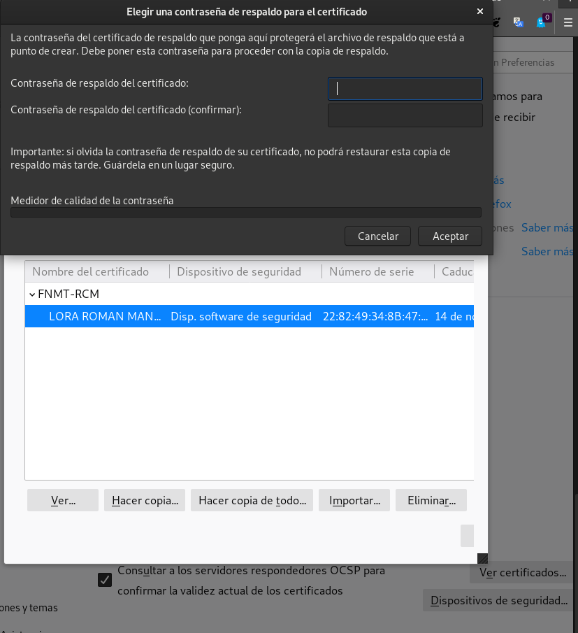
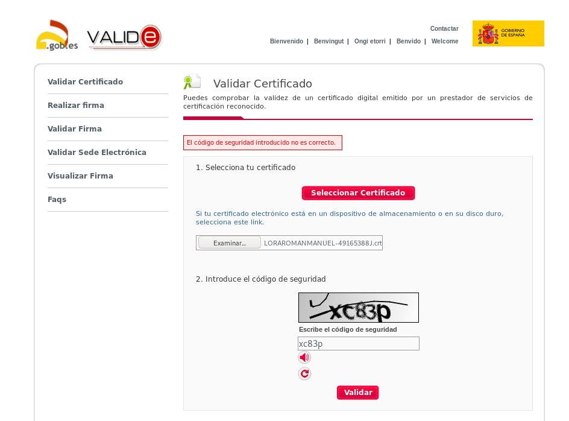
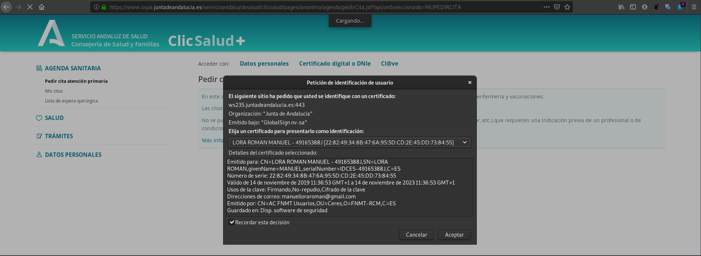
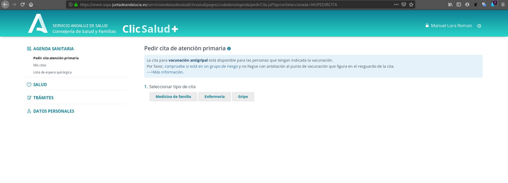

# Práctica: Certificados digitales. HTTPS

## Certificado digital de persona física

**Tarea 1** Instalación del certificado.


1. Una vez que hayas obtenido tu certificado, explica brevemente como se 
instala en tu navegador favorito.

Una vez descargado nuestro certificado, nos iremos a nuestro explorador web. 
En nuestro caso, lo estamos haciendo con Mozilla Firefox. Nos iremos a:

```Abrir Menú --> Preferencias --> Privacidad y Seguridad --> Certificados```

Una vez ahí, le damos a _Ver certificados..._ y en la pestaña de 
_Sus certificados_ le damos a importar y seleccionaremos nuestro certificado.


2. Muestra una captura de pantalla donde se vea las preferencias del navegador 
donde se ve instalado tu certificado.
   
En el anterior apartado se muestra nuestro certificado.

3. ¿Cómo puedes hacer una copia de tu certificado?, ¿Como vas a realizar la 
copia de seguridad de tu certificado?. Razona la respuesta.
   
Nos iremos a la ubicación de nuestro certificado en nuestro explorador web y
seleccionaremos nuestro certificado. Para hacer una copia regular, le damos
a la pestaña de _Hacer copia..._ y nos pedirá una ubicación donde guardarlo en
nuestra máquina. Hecho esto, nos pedirá definir una contraseña para proteger
nuestra copia de respaldo del certificado.



4. Investiga como exportar la clave pública de tu certificado.

En Mozilla Firefox, debemos seleccionar nuestro certificado y le damos a la
pestaña _Ver..._. Se nos abrirá una ventana emergente con dos pestañas, 
_General_ y _Detalles_. Le damos a Detalles y pulsamos el botón de exportar. 
De esta manera, solo se exportará la clave pública de nuestro certificado.


**Tarea 2:** Validación del certificado

1. Instala en tu ordenador el software autofirma y desde la página de VALIDe 
valida tu certificado. Muestra capturas de pantalla donde se comprueba la 
validación.

Nos descargamos el fichero del siguiente link:

```
wget https://estaticos.redsara.es/comunes/autofirma/currentversion/AutoFirma_Linux.zip
unzip AutoFirma_Linux.zip
sudo dpkg -i AutoFirma_1_6_5.deb
```

Con esto, ya tendríamos instalado el software de Autofirma en nuestra máquina.

Ahora nos dirigimos a la página de VALIDe y nos vamos a la zona de 
_Validar Certificado_.

Al pulsar en _Seleccionar Certificado_ nos permitirá elegir el software de 
Autofirma. En nuestro caso particular, no nos funciona el software de autofirma
y usaremos la opción de validar el certificado manualmente.

Introducimos el certificado y pondremos el código de seguridad, y nos dirá si
es válido.




**Tarea 3:** Firma electrónica

1. Utilizando la página VALIDe y el programa autofirma, firma un documento 
con tu certificado y envíalo por correo a un compañero.


   
2. Tu debes recibir otro documento firmado por un compañero y utilizando las 
herramientas anteriores debes visualizar la firma (Visualizar Firma) y 
(Verificar Firma). ¿Puedes verificar la firma aunque no tengas la clave 
pública de tu compañero?, ¿Es necesario estar conectado a internet para hacer 
la validación de la firma?. Razona tus respuestas.
   
3. Entre dos compañeros, firmar los dos un documento, verificar la firma para 
comprobar que está firmado por los dos.


**Tarea 4:** Autentificación

1. Utilizando tu certificado accede a alguna página de la administración 
pública )cita médica, becas, puntos del carnet,…). Entrega capturas de 
pantalla donde se demuestre el acceso a ellas.






