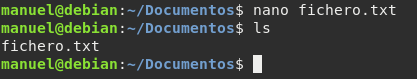
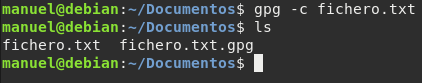
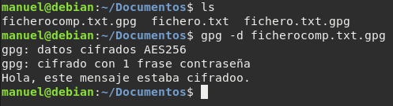
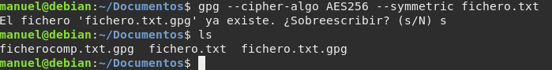
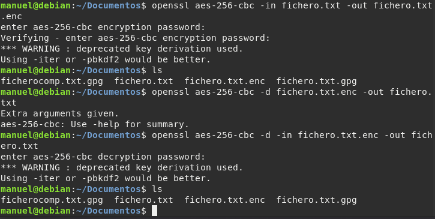

# Cifrado simétrico con gpg

GPG nos permite cifrar cualquier tipo de archivo que podremos mandar libremente
con cierta seguridad de que nadie podrá leer.

El cifrado simétrico es el más sencillo y menos seguro de todos. Para empezar la
prueba, tenemos que tener un archivo de cualquier tipo e introducir en la 
terminal el siguiente comando para cifrar _-c_ y para descifrar _-d_.

```gpg -c [fichero]```

Nos pedirá la clave de encriptación y nos genera un [fichero].gpg. Para 
desencriptarlo, debemos hacer lo siguiente:

```gpg -d [fichero].gpg```

Nos pedirá la clave y nos mostrará el contenido de dicho fichero. Si queremos
recuperar el fichero original:

```gpg -d [fichero].gpg > [ficheronuevo]```


1. Crea un documento de texto con cualquier editor o utiliza uno del que 
   dispongas.

2. Cifra este documento con alguna contraseña acordada con el compañero de al 
   lado.

3. Haz llegar por algún medio al compañero de al lado el documento que acabas 
   de cifrar.

4. Descifra el documento que te ha hecho llegar tu compañero de al lado.

5. ¿Con qué algoritmo se ha cifrado el fichero? Vuelve a cifrar el fichero 
   usando el algoritmo AES256. ¿Puedes hacer permanente esta configuración?

6. Instala gpg en windows (Gpg4win), repite el ejercicio en Windows. 
   Puedes encriptar un mensaje en linux y desencriptarlo en windows y al 
   contrario.

7. _Openssl_ es otra herramienta que nos permite cifrar mensajes de forma 
   simétrica, investiga como se realiza este ejercicio utilizando 
   esta herramienta.


## Tarea 1



## Tarea 2



Hemos acordado con nuestro compañero que la contraseña es: 1q2w3e4r5t.

## Tarea 3

Podríamos enviar dicho fichero por e-mail, mediante ssh, etc, pero en 
nuestro caso, se lo pasaremos por medio de un USB.

## Tarea 4

Nuestro compañero nos ha pasado el fichero _ficherocomp.txt_ cifrado con la
misma contraseña que ciframos nuestro anterior fichero, por lo tanto vamos a
descifrarlo:




## Tarea 5

GPG utiliza algoritmos no patentados como **ElGamal**, **Triple DES(3DES)**, 
AES y Blowfish (IDEA, 3DES, CAST5, BLOWFISH, AES, AES192, AES256, TWOFISH,
         CAMELLIA128, CAMELLIA192, CAMELLIA256)

Para volver a cifrar el fichero pero esta vez con AES, usaremos el
siguiente comando:

```gpg --cipher-algo AES256 --symmetric [fichero]```



No se podría cambiar permanentemente.

# Tarea 6


# Tarea 7

Openssl es un conjunto de herramientas de administración y bibliotecas que
suministran funciones criptográficas a otros paquetes como OpenSSH y
navegadores web como HTTPS. 

Ayuda a implementar el _Secure Sockets Layer (SSL)_ así como protocolos de
seguridadd. Permite crear certificados digitales que pueden aplicarse en un
servidor.

Para cifrar nuestro fichero usaremos el siguiente comando:

```openssl aes-256-cbc -in [fichero] -out [fichero].enc```

Y para decodificar usaremos este otro:

```openssl aes-256-cbc -d [fichero].enc -out [fichero]```


