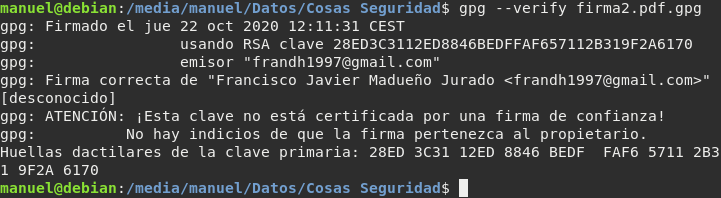
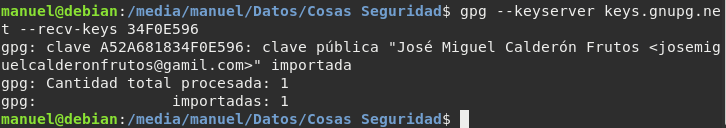
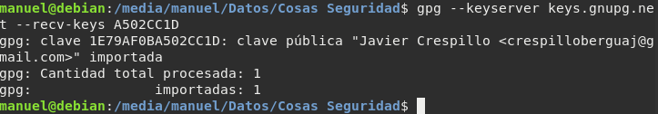
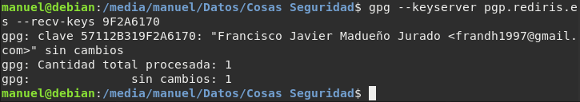
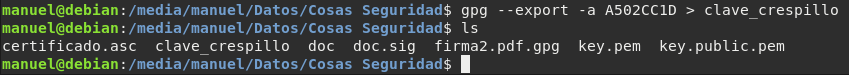
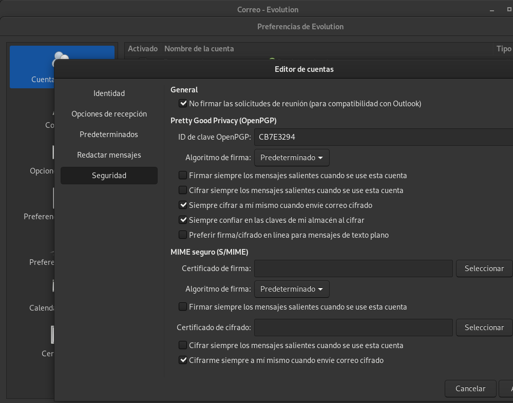
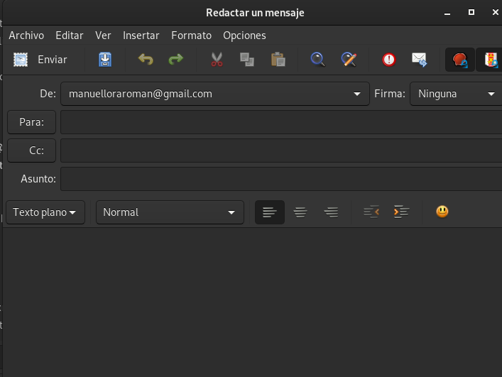
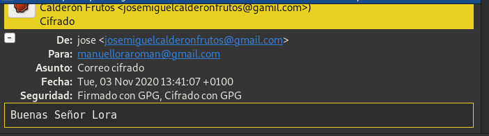
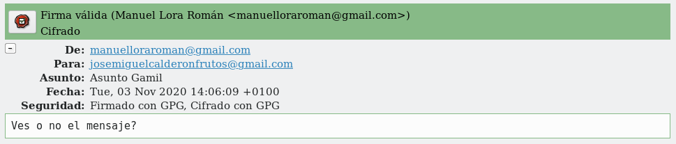

# Práctica: Integridad, firmas y autenticación

## Tarea 1: Firmas electrónicas

En este primer apartado vamos a trabajar con las firmas electrónicas, para 
ello te pueden ayudar los siguientes enlaces:

* [Intercambiar claves](https://www.gnupg.org/gph/es/manual/x75.html)
* [Validar otras claves en nuestro anillo de claves públicas](https://www.gnupg.org/gph/es/manual/x354.html)
* [Firmado de claves (Debian)](https://www.debian.org/events/keysigning.es.html)

**1.** Manda un documento y la firma electrónica del mismo a un compañero. 
Verifica la firma que tu has recibido.

Crearemos un documento llamado _doc_ y a continuación, lo firmaremos de la
siguiente manera:

```
manuel@debian:/media/manuel/Datos/Cosas Seguridad$ gpg --output doc.sig --sign doc
manuel@debian:/media/manuel/Datos/Cosas Seguridad$ ls
certificado.asc  doc  doc.sig  key.pem  key.public.pem
manuel@debian:/media/manuel/Datos/Cosas Seguridad$ 
```

En nuestro caso, nos pide la contraseña para desbloquear la clave privada y
poder firmar el documento. Le enviaremos dicho documento a nuestro compañero.
También, nuestro compañero nos enviará un documento firmado por él.

Para verificar la firma que hemos recibido, debemos realizar lo siguiente:

```
gpg --verify [documento].sig
```

Si por el contrario, queremos verificar la firma y extraer el documento, haremos
esto otro:

```
gpg --output doc --decrypt doc.sig
```



**2.** ¿Qué significa el mensaje que aparece en el momento de verificar la 
firma?

> gpg: Firma correcta de "Pepe D <josedom24@gmail.com>" [desconocido]  
> gpg: ATENCIÓN: ¡Esta clave no está certificada por una firma de confianza!  
> gpg:          No hay indicios de que la firma pertenezca al propietario.  
> Huellas dactilares de la clave primaria: E8DD 5DA9 3B88 F08A DA1D  26BF 5141 3DDB 0C99 55FC  

Significa que el propietario de la firma no está incluida en nuestro anillo de
confianza.

**3.** Vamos a crear un anillo de confianza entre los miembros de nuestra 
clase, para ello.
        
* Tu clave pública debe estar en un servidor de claves

Para exportar nuestra clave pública, seguiremos la [práctica anterior](https://github.com/ManuelLoraRoman/ApuntesASIR/blob/master/Seguridad%20y%20alta%20disponibilidad/Practicacifrado.md)

* Escribe tu fingerprint en un papel y dárselo a tu compañero, para que puede 
  descargarse tu clave pública.

Mi fingerprint es _BCB7E3294_.

* Te debes bajar al menos tres claves públicas de compañeros. Firma estas 
  claves.

Para bajarme las claves públicas de nuestros compañeros, ejecutaremos el 
siguiente comando:

```
gpg --keyserver [servidor de claves] --recv-keys [Fingerprint]  
```







Y firmaremos las claves con:

```
gpg --edit-key [Fingerprint]
```

```
manuel@debian:/media/manuel/Datos/Cosas Seguridad$ gpg --edit-key A502CC1D
gpg (GnuPG) 2.2.12; Copyright (C) 2018 Free Software Foundation, Inc.
This is free software: you are free to change and redistribute it.
There is NO WARRANTY, to the extent permitted by law.


pub  rsa3072/1E79AF0BA502CC1D
     creado: 2020-10-08  caduca: 2022-10-08  uso: SC  
     confianza: desconocido   validez: total
sub  rsa3072/B9C48525053510E1
     creado: 2020-10-08  caduca: 2022-10-08  uso: E   
[   total   ] (1). Javier Crespillo <crespilloberguaj@gmail.com>

gpg> sign
"Javier Crespillo <crespilloberguaj@gmail.com>" ya estaba firmada por la clave 636AE9EBCB7E3294
Nada que firmar con la clave 636AE9EBCB7E3294

gpg> quit
```

Y se la enviamos de vuelta a nuestro compañero:

```
gpg --export -a [Fingerprint] > [clave_compañero]
```



* Tu te debes asegurar que tu clave pública es firmada por al menos tres 
  compañeros de la clase.

Para importar las claves de mis compañeros, debo realizar lo siguiente:

```
gpg --import --import-options merge-only [clave_firmada]
gpg --keyserver [servidor de claves] --send-keys [Mi Fingerprint]
```

```
manuel@debian:/media/manuel/Datos/Cosas Seguridad$ gpg --import firmada.asc 
gpg: clave C3B291882C4EE5DF: clave pública "Alejandro Gutierrez Valencia <tojandro@gmail.com>" importada
gpg: Cantidad total procesada: 1
gpg:               importadas: 1
gpg: marginals needed: 3  completes needed: 1  trust model: pgp
gpg: nivel: 0  validez:   1  firmada:   8  confianza: 0-, 0q, 0n, 0m, 0f, 1u
gpg: nivel: 1  validez:   8  firmada:   1  confianza: 4-, 0q, 0n, 1m, 3f, 0u
gpg: siguiente comprobación de base de datos de confianza el: 2020-11-07
```

```
manuel@debian:/media/manuel/Datos/Cosas Seguridad$ gpg --keyserver pgp.rediris.es --send-keys CB7E3294
gpg: enviando clave 636AE9EBCB7E3294 a hkp://pgp.rediris.es
manuel@debian:/media/manuel/Datos/Cosas Seguridad$ gpg --keyserver pgp.rediris.es --search-keys CB7E3294
gpg: data source: http://130.206.1.8:11371
(1)	Manuel Lora Román <manuelloraroman@gmail.com>
	  3072 bit RSA key 636AE9EBCB7E3294, creado: 2020-10-06, caduca: 2022-10-06
Keys 1-1 of 1 for "CB7E3294".  Introduzca número(s), O)tro, o F)in > 1
gpg: clave 636AE9EBCB7E3294: "Manuel Lora Román <manuelloraroman@gmail.com>" sin cambios
gpg: Cantidad total procesada: 1
gpg:              sin cambios: 1
```

```
pub   rsa3072 2020-10-07 [SC] [caduca: 2020-11-07]
      DCFB091C5495684E59BC061EA52A681834F0E596
uid        [   total   ] José Miguel Calderón Frutos <josemiguelcalderonfrutos@gamil.com>
sig 3        A52A681834F0E596 2020-10-08  José Miguel Calderón Frutos <josemiguelcalderonfrutos@gamil.com>
sig          4F54B5799987B52D 2020-10-22  Juan Antonio Reifs <initategnat9@gmail.com>
sig          636AE9EBCB7E3294 2020-10-28  Manuel Lora Román <manuelloraroman@gmail.com>
sub   rsa3072 2020-10-07 [E] [caduca: 2022-10-07]
sig          A52A681834F0E596 2020-10-07  José Miguel Calderón Frutos <josemiguelcalderonfrutos@gamil.com>
```

* Una vez que firmes una clave se la tendrás que devolver a su dueño, para 
  que otra persona se la firme.

* Cuando tengas las tres firmas sube la clave al servidor de claves y 
  rellena tus datos en la tabla Claves públicas PGP 2020-2021

* Asegurate que te vuelves a bajar las claves públicas de tus compañeros que 
  tengan las tres firmas.
   
```
pub   rsa3072 2020-10-07 [SC] [caduca: 2020-11-07]
      DCFB091C5495684E59BC061EA52A681834F0E596
uid        [   total   ] José Miguel Calderón Frutos <josemiguelcalderonfrutos@gamil.com>
sig 3        A52A681834F0E596 2020-10-08  José Miguel Calderón Frutos <josemiguelcalderonfrutos@gamil.com>
sig          4F54B5799987B52D 2020-10-22  Juan Antonio Reifs <initategnat9@gmail.com>
sig          636AE9EBCB7E3294 2020-10-28  Manuel Lora Román <manuelloraroman@gmail.com>
sub   rsa3072 2020-10-07 [E] [caduca: 2022-10-07]
sig          A52A681834F0E596 2020-10-07  José Miguel Calderón Frutos <josemiguelcalderonfrutos@gamil.com>
```

```
pub   rsa3072 2020-10-22 [SC] [caduca: 2022-10-22]
      AD19812061DA946F8DA70E0C4F54B5799987B52D
uid        [   total   ] Juan Antonio Reifs <initategnat9@gmail.com>
sig 3        4F54B5799987B52D 2020-10-22  Juan Antonio Reifs <initategnat9@gmail.com>
sig          636AE9EBCB7E3294 2020-10-28  Manuel Lora Román <manuelloraroman@gmail.com>
sig          A52A681834F0E596 2020-10-22  José Miguel Calderón Frutos <josemiguelcalderonfrutos@gamil.com>
sig          CFCF1D130D5A52C5 2020-10-28  sergio ibañez <sergio_hd_sony@hotmail.com>
sub   rsa3072 2020-10-22 [E] [caduca: 2022-10-22]
sig          4F54B5799987B52D 2020-10-22  Juan Antonio Reifs <initategnat9@gmail.com>
```

```
pub   rsa3072 2020-10-06 [SC] [caduca: 2022-10-06]
      28ED3C3112ED8846BEDFFAF657112B319F2A6170
uid        [   total   ] Francisco Javier Madueño Jurado <frandh1997@gmail.com>
sig 3        57112B319F2A6170 2020-10-06  Francisco Javier Madueño Jurado <frandh1997@gmail.com>
sig          C3B291882C4EE5DF 2020-10-28  Alejandro Gutierrez Valencia <tojandro@gmail.com>
sig          636AE9EBCB7E3294 2020-11-03  Manuel Lora Román <manuelloraroman@gmail.com>
sig          CFCF1D130D5A52C5 2020-11-03  sergio ibañez <sergio_hd_sony@hotmail.com>
sub   rsa3072 2020-10-06 [E] [caduca: 2022-10-06]
sig          57112B319F2A6170 2020-10-06  Francisco Javier Madueño Jurado <frandh1997@gmail.com>
```

**4.** Muestra las firmas que tiene tu clave pública.

```
manuel@debian:/media/manuel/Datos/Cosas Seguridad$ gpg --list-sigs "Manuel"
pub   rsa3072 2020-10-06 [SC] [caduca: 2022-10-06]
      9233303D1F5495739A6D2CB4636AE9EBCB7E3294
uid        [  absoluta ] Manuel Lora Román <manuelloraroman@gmail.com>
sig 3        636AE9EBCB7E3294 2020-10-06  Manuel Lora Román <manuelloraroman@gmail.com>
sig          A52A681834F0E596 2020-10-22  José Miguel Calderón Frutos <josemiguelcalderonfrutos@gamil.com>
sig          4F54B5799987B52D 2020-10-28  Juan Antonio Reifs <initategnat9@gmail.com>
sig          57112B319F2A6170 2020-10-28  Francisco Javier Madueño Jurado <frandh1997@gmail.com>
sub   rsa3072 2020-10-06 [E] [caduca: 2022-10-06]
sig          636AE9EBCB7E3294 2020-10-06  Manuel Lora Román <manuelloraroman@gmail.com>
```

**5.** Comprueba que ya puedes verificar sin “problemas” una firma recibida 
por una persona en la que confías.

```
manuel@debian:/media/manuel/Datos/Cosas Seguridad$ gpg --verify saludo.txt.asc
gpg: Firmado el mar 03 nov 2020 12:49:02 CET
gpg:                usando RSA clave AD19812061DA946F8DA70E0C4F54B5799987B52D
gpg: Firma correcta de "Juan Antonio Reifs <initategnat9@gmail.com>" [total]
```

**6.** Comprueba que puedes verificar sin “problemas” una firma recibida por 
una tercera problema en la que confía una persona en la que tu confías.

Nos importamos la firma de nuestro compañero Alejandro Gutierrez en el cual, no
confiamos, pero si que lo hace nuestro compañero Fran:

```
manuel@debian:/media/manuel/Datos/Cosas Seguridad$ gpg --verify fichero.sign 
gpg: Firmado el mar 03 nov 2020 12:48:02 CET
gpg:                usando RSA clave 443D661D9AAF3ABAEDCA93E1C3B291882C4EE5DF
gpg: Firma correcta de "Alejandro Gutierrez Valencia <tojandro@gmail.com>" [dudosa]
gpg: ATENCIÓN: ¡Esta clave no está certificada con firmas de suficiente confianza!
gpg:          No es seguro que la firma pertenezca al propietario.
Huellas dactilares de la clave primaria: 443D 661D 9AAF 3ABA EDCA  93E1 C3B2 9188 2C4E E5DF
```

## Tarea 2: Correo seguro con evolution/thunderbird

Ahora vamos a configurar nuestro cliente de correo electrónico para 
poder mandar correos cifrados, para ello:

**1.** Configura el cliente de correo evolution con tu cuenta de correo 
habitual.

Nosotros en principio, en la configuración de Debian, en _Cuentas en línea_ y 
una vez puesto tu email, ya puedes acceder a tu email desde Evolution.

**2.** Añade a la cuenta las opciones de seguridad para poder enviar correos 
firmados con tu clave privada o cifrar los mensajes para otros destinatarios.

En primer lugar, accedemos a _Evolution --> Editar --> Preferencias --> Cuentas de correo_
y una vez ahí, seleccionamos nuestro correo y editamos. Una ya en el edito de 
cuentas, en el apartado de Seguridad intoduciremos nuestra ID y marcaremos las
opciones de _Siempre cifrar a mí mismo cuando envie correo cifrado_ y la de
_Siempre confiar en las claves de mi almacén al cifrar_.



**3.** Envía y recibe varios mensajes con tus compañeros y comprueba el 
funcionamiento adecuado de GPG.

Ahora ya podríamos enviar emails cifrados y/o firmados a través de Evolution. 
Ahora, al redactar un nuevo mensaje, en la pestaña de _Opciones_ debemos
marcar los parámetros de _Firmar con PGP_ y _Cifrar con PGP_. 

Solo quedaría enviar el correo a alguien que tenga mi clave pública.







## Tarea 3: Integridad de ficheros

Vamos a descargarnos la ISO de debian, y posteriormente vamos a comprobar su 
integridad.

Puedes encontrar la ISO en la dirección: 
_https://cdimage.debian.org/debian-cd/current/amd64/iso-cd/_.

**1.** Para validar el contenido de la imagen CD, solo asegúrese de usar la 
herramienta apropiada para sumas de verificación. Para cada versión publicada 
existen archivos de suma de comprobación con algoritmos fuertes 
(SHA256 y SHA512); debería usar las herramientas sha256sum o sha512sum para 
trabajar con ellos.

Nos descargaremos la ISO de la dirección anterior, junto con las sumas de
comprobación 512 y una vez hecho esto, importaremos las claves públicas de 
Debian:

```
manuel@debian:/media/manuel/Datos/Cosas Seguridad$ gpg --keyserver keyring.debian.org --recv-keys 64E6EA7D
gpg: clave 988021A964E6EA7D: clave pública "Debian CD signing key <debian-cd@lists.debian.org>" importada
gpg: Cantidad total procesada: 1
gpg:               importadas: 1
manuel@debian:/media/manuel/Datos/Cosas Seguridad$ gpg --keyserver keyring.debian.org --recv-keys 6294BE9B
gpg: clave DA87E80D6294BE9B: clave pública "Debian CD signing key <debian-cd@lists.debian.org>" importada
gpg: Cantidad total procesada: 1
gpg:               importadas: 1
manuel@debian:/media/manuel/Datos/Cosas Seguridad$ gpg --keyserver keyring.debian.org --recv-keys 09EA8AC3
gpg: clave 42468F4009EA8AC3: clave pública "Debian Testing CDs Automatic Signing Key <debian-cd@lists.debian.org>" importada
gpg: Cantidad total procesada: 1
gpg:               importadas: 1
```

Teniendo en nuestro poder los 3 ficheros:

* Iso de Debian

* Suma de comprobación 512

* Y la suma de comprobación firmada con clave privada

Vamos a verificar la clave privada si es la correcta:

```
manuel@debian:/media/manuel/Datos/Cosas Seguridad/integridad$ gpg --verify SHA512SUMS.sign
gpg: asumiendo que los datos firmados están en 'SHA512SUMS'
gpg: Firmado el dom 27 sep 2020 02:24:23 CEST
gpg:                usando RSA clave DF9B9C49EAA9298432589D76DA87E80D6294BE9B
gpg: Firma correcta de "Debian CD signing key <debian-cd@lists.debian.org>" [total]
```

Y ahora vamos a comprobar que tanto el fichero SHA512SUM.sign y SHA512SUM son
iguales:

```
manuel@debian:/media/manuel/Datos/Cosas Seguridad/integridad$ gpg --verify SHA512SUMS.sign SHA512SUMS
gpg: Firmado el dom 27 sep 2020 02:24:23 CEST
gpg:                usando RSA clave DF9B9C49EAA9298432589D76DA87E80D6294BE9B
gpg: Firma correcta de "Debian CD signing key <debian-cd@lists.debian.org>" [total]
```

Y como ya hemos comprobado la integridad del fichero _SHA512SUM_ podemos confiar
en él y usarlo para comprobar la suma de comprobación del fichero 
_debian-10.6.0-amd64-netinst.iso_.

Esta es su suma de comprobación:

```
manuel@debian:/media/manuel/Datos/Cosas Seguridad/integridad$ sha512sum debian-10.6.0-amd64-netinst.iso 
cb74dcb7f3816da4967c727839bdaa5efb2f912cab224279f4a31f0c9e35f79621b32afe390195d5e142d66cedc03d42f48874eba76eae23d1fac22d618cb669  debian-10.6.0-amd64-netinst.iso
```
Y esta la que viene en el fichero SHA512SUM:

```
manuel@debian:/media/manuel/Datos/Cosas Seguridad/integridad$ cat SHA512SUMS
cb74dcb7f3816da4967c727839bdaa5efb2f912cab224279f4a31f0c9e35f79621b32afe390195d5e142d66cedc03d42f48874eba76eae23d1fac22d618cb669  debian-10.6.0-amd64-netinst.iso
ebd7a29a47bb537f50c432bf4bdb57b4ea4c34f4137187a96171729bf7315944d0a933990f4ab84c9c0721af18f21a34e7925d354829797e6ab3d0c92066a444  debian-10.6.0-amd64-xfce-CD-1.iso
a848055ca9a728e79c19426268fc8dc87b2d3fde5d9421a15c9f9f2fad5e82172676772bfa62a96242549fa501387f9965168439e53b7680a88a9486e99232fc  debian-edu-10.6.0-amd64-netinst.iso
500caf3e49955a5547fef02620a0dd89d87895fbad70f508091c6612f8b74d275201d7094c12b5cb60e5271d8f1b2cd66c211fdbc2cd7ec366ec42a935594fe0  debian-mac-10.6.0-amd64-netinst.iso
manuel@debian:/media/manuel/Datos/Cosas Seguridad/integridad$ 
```

Y podemos comprobar que para el fichero _debian-10.6.0-amd64-netinst.iso_
la suma de comprobación es igual, y asi poder verificar dicho fichero.

**2.** Verifica que el contenido del hash que has utilizado no ha sido 
manipulado, usando la firma digital que encontrarás en el repositorio. 
Puedes encontrar una guía para realizarlo en este artículo: [How to verify 
an authenticity of downloaded Debian ISO images](https://linuxconfig.org/how-to-verify-an-authenticity-of-downloaded-debian-iso-images)

Hecho en el anterior apartado.

## Tarea 4: Integridad y autenticidad (apt secure)

Cuando nos instalamos un paquete en nuestra distribución linux tenemos que 
asegurarnos que ese paquete es legítimo. Para conseguir este objetivo se 
utiliza criptografía asimétrica, y en el caso de Debian a este sistema se 
llama apt secure. Esto lo debemos tener en cuenta al utilizar los 
repositorios oficiales. Cuando añadamos nuevos repositorios tendremos que 
añadir las firmas necesarias para confiar en que los paquetes son legítimos 
y no han sido modificados.

Busca información sobre apt secure y responde las siguientes preguntas:

**1.** ¿Qué software utiliza apt secure para realizar la criptografía 
asimétrica?

GPG es la herramienta utilizada por _secure apt_ para firmar archivos y para
verificar sus firmas.

**2.** ¿Para que sirve el comando apt-key? ¿Qué muestra el comando apt-key list?
    
_apt-key_ es el programa que gestiona la lista de claves usadas por apt. Se
puede usar para añadir o eliminar claves, y para añadir una nueva clave, 
primero debemos descargarla, añadirla con _apt-key_ y ejecutar un
_apt-get update_ para que apt descargue y compruebe los ficheros _InRelease_ o
_Release.gpg_ de los archivos de paquetes configurados.

El comando _apt-key list_ muestra un anillo de claves públicas de las personas 
que firmaron el paquete Release.gpg del paquete que nos queramos descargar.

**3.** ¿En que fichero se guarda el anillo de claves que guarda la herramienta 
apt-key?

Se guarda en el fichero _/etc/apt/trusted.gpg_.
   
**4.** ¿Qué contiene el archivo Release de un repositorio de paquetes?. 
¿Y el archivo Release.gpg?. Puedes ver estos archivos en el repositorio 
_http://ftp.debian.org/debian/dists/Debian10.1/_. Estos archivos se descargan 
cuando hacemos un apt update.
    
El fichero _Release_ contiene varias sumas de comprobación de los ficheros del
archivo y el fichero Release.gpg es el fichero Release firmado por _secure apt_
(técnicamente una armadura ASCII), cuyos contenidos se parecen a estos:

* Release:

```
Origin: Debian
Label: Debian
Suite: stable
Version: 10.6
Codename: buster
Changelogs: http://metadata.ftp-master.debian.org/changelogs/@CHANGEPATH@_changelog
Date: Sat, 26 Sep 2020 09:54:48 UTC
Acquire-By-Hash: yes
Architectures: amd64 arm64 armel armhf i386 mips mips64el mipsel ppc64el s390x
Components: main contrib non-free
Description: Debian 10.6 Released 26 September 2020
MD5Sum:
 6b2220d02a25f3d7f9165a9c35275e46  1358002 contrib/Contents-amd64
 851b04c7e56ebae8093de861f8a1a57a   102812 contrib/Contents-amd64.gz
 9f4f427272e9463e8548de7ca076b2eb  1076577 contrib/Contents-arm64
 cd20457a1f6ee95ba6c0c4baba9df916    84184 contrib/Contents-arm64.gz
 bb4c18d9360f4bf0fbe88e89be389a2f  1073544 contrib/Contents-armel
 086a7e797d1c314647027d6266a4c016    83993 contrib/Contents-armel.gz
 59dea003275cfca9fff1069bac80f50b  1082005 contrib/Contents-armhf
 e428237b80c1716a82de21b17a8860d6    85000 contrib/Contents-armhf.gz
.
.
.
```

* Release.gpg:

```
-----BEGIN PGP SIGNATURE-----

iQIzBAABCAAdFiEEFukLP99l7eOqfzI8BO5yN7fUU+wFAl9vEEsACgkQBO5yN7fU
U+zgjRAAgg7MY5NhQHH8exVEs/7ZVFD/i0MB/EgVAXmPxeD5l8+Qp3LrjwgfDUuQ
gc2UUkMFov01SM7blil6N/zRXLLTJR1NyA8vncd3tqerzDxhxlL6zwK5O1jtPuUl
R5FewxCrc9JsJLnVJMQfdQwokDHubZPelAD181sV56z+pkwGn4k/yRldW0Z+QLUf
GEriwv/ng0TakSJTIR0DA5vjfuvFb8As63haWWBu4LcujJ6xdmRwM4Wog6ofcObG
CJrzEHOr0jSplQKEcOtgrImPskaZk0MsLwdYBrKtnEM6LgpWxB+6dsOy4VCcDNCQ
qkEVboNCV7OinGO98vDSB2O+he+jiuedOOe3COsFN6nwANufCImpc0wMqEueN23j
DtsjETt+i9KOPuRuX+6Z/mwlJLJQtCJBTtQz5oTsYb10EsRkVyxpMOUe5rifut1J
Ypc2+cbq2g6HIHYHb9mtLLYXemoR9GxyWjpC7U8pAeswqNTmn97ANRd8YzQIhrZJ
qlNN/6TQWaat0/A9Wfw7Rv++W1hiwpACnNWvTMID+XzdqDicanGBL1Gw5ykM3t38
ED4MOQu3rq/g1hvM528BdslEmbjUrFrcHG9Gd42JDy77QN7pfoPeyn2fLfgi9GSF
FqGc5evZKMJs+ZPXGzGrtS28AWyYMzYJ10hSFEsbxFJQKyqMejuJAjMEAAEIAB0W
IQQBRtxtSgspFL3tNNtkis/WIvPROAUCX28QTAAKCRBkis/WIvPROGABD/96lE0j
tethxQ+cOFwzR1Whn1/HGDopZFp6EJaJlM+WtZvJpKWsgZnfcIBQ0mW+Moz6xWKL
wPAY4u4AvFX46xIr/Y3y8CdqWf0F4+a8Nq4aIEL2eFoWZEu7nwkXqwqcO4oTA7O0
Ppk4MBMEsrxn4K5qHeXvJU7OH6RRNe7BZaA2dqgcr6ifbYPWHEyYdgCPV4nUYTKX
HF6fdvv3ZkF8DtRM+2MpUEPhK6UQjvWZ2xrUgMkQZRYRdXKfXjsZGpAmzm875kwf
/I8ji4VeRj7ge/ZBmt6Q0EUCGdN8ebtRrOptmM5yKGiMf6NZW1SHzQLV5EmE19Mz
1O8dkhCYaG4gbjvd71OicY22/RZPeEQa+JA/FaBKrfW4zsFMZNSncFKgkZZWopYW
YS5C6FhEIQLl4Ptr+Qb4QRVxDglNU5dnw41bGt12kWObGBbxgE7b4/h2OYU/lXo0
MumvDys3oCd0ZA2g4SQtnW1N306yRlzvKerCEdaXQ5oLdji1sj0/Ehyiqfe7F+TK
mIIphY1NmW8xdXSe68dkeAfuoMXNAPYD1IzFT8aiYoak54Jgu/+nrpWmMSv5e2tn
Ygzq2alRYFHOyCvEfq8hntHtUw4BEtaqylqYAn7SkVthvnPzxioqi5cwhVt6f/nS
Zbn533C9nif3+GDzOfez8EPRxh9kCDFuUhgkKokCMwQAAQgAHRYhBG0zhm7dj/pB
wBQ67dzJ77934RUXBQJfbxGcAAoJENzJ77934RUXjIUQAJAko3kwERLL5znfL3yt
xTmFqO8vna9LoSuEh8zszkExCDo+EYSBpsNOyaktqlgp83kGZYSv82Rrjx8Yus0H
RuO+d0fjyAT6b4VEacNvD0aKYdsQD3IuaCnhw0j8dghU3+YZWYPKTi9kg6ZqAMX9
GV1CywVk8vwS3iwJ/NeBmmBNgyvD4XAfVgtXio3zGeVb8HKgAY6JnV5rWaS6ZDqW
XQSqAgddsN4FhjzoIlzQRnm3VYpjL2pEfro8ypPTadUp8DMCtFkjeS7+In7Z/VYr
C/cIR5gi8zS5UBbO91fXMKZMbx4t0abUJgWBotsPQypFU5tEu25WDPQ1fYRuAUxN
QWJdUukPp7Z0Y4AGGFS/EIiCZAHk8viov/pRX7enofIE13KlIQju+uR/C7c89Vv7
F2h8VNuRTnYlkf/03aHWgRRp+NtOZZOXC0I+VR6hDecZ6bT0gew9M5tGajE5puHd
WewqzyHZPMtjY0Lipcs0zx/tsRUfB0yg49si8AqdZHypEKR4ISVLEXVO0T1932a1
pqIwmyr7WpNrFhQr1zUQsDGS/9VLhkCfiqGrtcMCcRxS0RcvPHVfT3n26LfvurPN
1YtUssPrb7Cumbt4aqrKAXL/wf2ghICmoeDistWIyPq1YVTGurSrsPyAzoVHI4A2
dyMLT654m1rRmw1l8jRij9r/
=DEbG
-----END PGP SIGNATURE-----
```


**5.** Explica el proceso por el cual el sistema nos asegura que los ficheros 
que estamos descargando son legítimos.

Un archivo Debian contiene un fichero Release, que se actualiza cada vez que un
paquete de este cambia. Las sumas de comprobación del fichero Release y las
sumas de comprobación de los paquetes permiten a apt comprobar que se ha 
descargado la copia correcta de dichos paquetes. 
También, si solo ha descargado un paquete, puede comprobar su checksum 
contra el contenido de los paquetes. Si apt falla en algunos de estos pasos, 
abortará la operación.
 

**6.** Añade de forma correcta el repositorio de virtualbox añadiendo la clave 
pública de virtualbox como se indica en la documentación.

Para descargar VirtualBox en primer lugar, añadiremos las claves de Oracle:

```
manuel@debian:~$ wget -q https://www.virtualbox.org/download/oracle_vbox_2016.asc -O- | sudo apt-key add -
OK

manuel@debian:~$ apt-key list
/etc/apt/trusted.gpg
--------------------
pub   rsa4096 2016-04-22 [SC]
      B9F8 D658 297A F3EF C18D  5CDF A2F6 83C5 2980 AECF
uid           [ unknown] Oracle Corporation (VirtualBox archive signing key) <info@virtualbox.org>
sub   rsa4096 2016-04-22 [E]

```

Y ahora modificamos el fichero _/etc/apt/sources.list_ con la siguiente linea:

```
deb https://download.virtualbox.org/virtualbox/debian buster contrib
```

y reniciamos con _sudo apt update_.

Y ahora procederemos a la instalación de VirtualBox:

```
manuel@debian:~/ApuntesASIR/Seguridad y alta disponibilidad$ sudo apt-get install virtualbox-6.1
[sudo] password for manuel: 
Leyendo lista de paquetes... Hecho
Creando árbol de dependencias       
Leyendo la información de estado... Hecho
Paquetes recomendados:
  linux-image
Los siguientes paquetes se ELIMINARÁN:
  virtualbox-6.0
Se instalarán los siguientes paquetes NUEVOS:
  virtualbox-6.1
0 actualizados, 1 nuevos se instalarán, 1 para eliminar y 26 no actualizados.
Se necesita descargar 0 B/88,0 MB de archivos.
Se liberarán 13,8 MB después de esta operación.
¿Desea continuar? [S/n] S
Obteniendo informes de fallo... Finalizado
Analizando información Encontrada/Corregida... Finalizado
Preconfigurando paquetes ...
(Leyendo la base de datos ... 199121 ficheros o directorios instalados actualmente.)
Desinstalando virtualbox-6.0 (6.0.24-139119~Debian~buster) ...
Seleccionando el paquete virtualbox-6.1 previamente no seleccionado.
(Leyendo la base de datos ... 198296 ficheros o directorios instalados actualmente.)
Preparando para desempaquetar .../virtualbox-6.1_6.1.16-140961~Debian~buster_amd64.deb ...
Desempaquetando virtualbox-6.1 (6.1.16-140961~Debian~buster) ...
Configurando virtualbox-6.1 (6.1.16-140961~Debian~buster) ...
addgroup: El grupo `vboxusers' ya existe como grupo del sistema. Saliendo.
Procesando disparadores para mime-support (3.62) ...
Procesando disparadores para hicolor-icon-theme (0.17-2) ...
Procesando disparadores para gnome-menus (3.31.4-3) ...
Procesando disparadores para systemd (241-7~deb10u4) ...
Procesando disparadores para shared-mime-info (1.10-1) ...
Procesando disparadores para desktop-file-utils (0.23-4) ...
```

## Tarea 5: Autentificación: ejemplo SSH

Vamos a estudiar como la criptografía nos ayuda a cifrar las comunicaciones 
que hacemos utilizando el protocolo ssh, y cómo nos puede servir también para 
conseguir que un cliente se autentifique contra el servidor. 
Responde las siguientes cuestiones:

**1.** Explica los pasos que se producen entre el cliente y el servidor para 
que el protocolo cifre la información que se transmite.
¿Para qué se utiliza la criptografía simétrica? ¿Y la asimétrica?
    
```
1. El cliente abre una conexión TCP al puerto 22 del host servidor.
   
2. El cliente y el servidor acuerdan la versión del protocolo a utilizar, 
de acuerdo a su configuración y capacidades.

3. El servidor posee un par de claves pública/privada de RSA . 
El servidor envía al cliente su clave pública.
   
4. El cliente compara la clave pública de host recibida con la que tiene 
almacenada, para verificar su autenticidad. Si no la conociera previamente, 
pide confirmación al usuario para aceptarla como válida8.
   
5. El cliente genera una clave de sesión aleatoria y selecciona un algoritmo 
de cifrado simétrico.
   
6. El cliente envía un mensaje conteniendo la clave de sesión y el algoritmo 
seleccionado, cifrado con la clave pública de host del servidor usando el 
algoritmos RSA.
   
7. En adelante, para el resto de la comunicación se utilizará el algoritmo de 
cifrado simétrico seleccionado y clave compartida de sesión.
  
8. Luego se realiza la autenticación del usuario. Aquí pueden usarse distintos 
mecanismos. Más adelante analizaremos los más importantes.
   
9. Finalmente se inicia la sesión, por lo general, interactiva.

```

**2.** Explica los dos métodos principales de autentificación: por contraseña 
y utilizando un par de claves públicas y privadas.

* Por contraseña --> si se ha configurado una contraseña en la máquina a la
que queremos conectarnos por ssh y la sabemos, podemos, al conectarnos, 
de manera interactiva, poner la contraseña.

* Mediante claves --> crearemos unas claves pública y privada con el comando
_ssh-keygen_. La pública la compartimos con la máquina con la que queramos
conectarnos y la introduciremos tanto en una máquina como en otra en el fichero
_$HOME/.ssh/authorized_keys2. Esto se puede hacer mediante un solo comando:

```sh usuario@servidor.dominio.es \
'cat >> .ssh/authorized_keys2' < .ssh/id_dsa.pub``` 

**3.** En el cliente para que sirve el contenido que se guarda en el 
fichero _~/.ssh/know_hosts_?

Este fichero contiene las claves de hosts DSA de los servidores ssh accedidos
por el usuario. Este fichero es importante ya que se asegura que el cliente ssh
está conectado al servidor ssh correcto.

**4.** ¿Qué significa este mensaje que aparece la primera vez que nos 
conectamos a un servidor?

> $ ssh debian@172.22.200.74  
> The authenticity of host '172.22.200.74 (172.22.200.74)' can't be established.  
> ECDSA key fingerprint is SHA256:7ZoNZPCbQTnDso1meVSNoKszn38ZwUI4i6saebbfL4M.  
> Are you sure you want to continue connecting (yes/no)?   

Este mensaje te indica que no te has conectado a este servidor antes, en ningún
otro momento, es decir, que es la primera vez que te conectas a dicho servidor.


**5.** En ocasiones cuando estamos trabajando en el cloud, y reutilizamos una 
ip flotante nos aparece este mensaje:

> $ ssh debian@172.22.200.74  
> @@@@@@@@@@@@@@@@@@@@@@@@@@@@@@@@@@@@@@@@@@@@@@@@@@@@@@@@@@@  
> @    WARNING: REMOTE HOST IDENTIFICATION HAS CHANGED!     @  
> @@@@@@@@@@@@@@@@@@@@@@@@@@@@@@@@@@@@@@@@@@@@@@@@@@@@@@@@@@@  
> IT IS POSSIBLE THAT SOMEONE IS DOING SOMETHING NASTY!  
> Someone could be eavesdropping on you right now (man-in-the-middle attack)!  
> It is also possible that a host key has just been changed.  
> The fingerprint for the ECDSA key sent by the remote host is  
> SHA256:W05RrybmcnJxD3fbwJOgSNNWATkVftsQl7EzfeKJgNc.  
> Please contact your system administrator.  
> Add correct host key in /home/jose/.ssh/known_hosts to get rid of this message.  
> Offending ECDSA key in /home/jose/.ssh/known_hosts:103  
>   remove with:  
>   ssh-keygen -f "/home/jose/.ssh/known_hosts" -R "172.22.200.74"  
> ECDSA host key for 172.22.200.74 has changed and you have requested strict checking.  

Ejecutaremos el siguiente comando 

```ssh-keygen -f [ubicación del _know___hosts_] -R [IP flotante]```

Y nos volveremos a conectar.

**6.** ¿Qué guardamos y para qué sirve el fichero en el servidor 
_~/.ssh/authorized_keys_?

Este archivo contiene un listado de claves públicas autorizadas. Cuando un 
cliente se conecta al servidor, el servidor valida al cliente comprobando su
clave pública firmada almacenada dentro de este archivo.


