# Práctica: Cifrado asimétrico con gpg y openssl

## Tarea 1: Generación de claves


**1.** Genera un par de claves (pública y privada). ¿En que directorio se 
guarda las claves de un usuario?
    
Para generar una clave pública y privada con gpg, debemos realizar el siguiente 
comando:

```gpg --gen-key```

Este comando se usa para generar un nuevo par de claves primario. Nos pedirá 
nuestro nombre y apellidos, junto con nuestro e-mail. Después, nos pedirá una 
confirmación y que pongamos una contraseña, paso que dará lugar a la creación 
de las claves pública y privada.

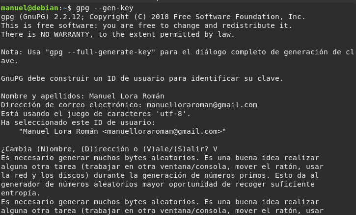
  
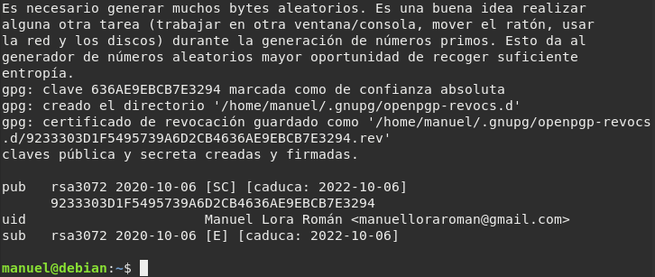

Las claves públicas y privadas se guardan en /home/[usuario]/.gnupg/pubring.kbx

**2.** Lista las claves públicas que tienes en tu almacén de claves. Explica 
los distintos datos que nos muestra. ¿Cómo deberías haber generado las claves 
para indicar, por ejemplo, que tenga un 1 mes de validez?

Para listar las claves públicas, debemos hacer lo siguiente:

```gpg --list-keys```

Dicho comando nos muestra el método de cifrado que se ha usado, cuando se creó 
dicha clave, su fecha de caducidad, nuestro ID/Fingerprint y a quién pertenece 
la clave.

Para generar claves con información respectiva a la caducidad, el tipo de clave 
que queremos y demás, usaremos:

```gpg --full-generate-key```

Y lo pondremos en el siguiente apartado:  

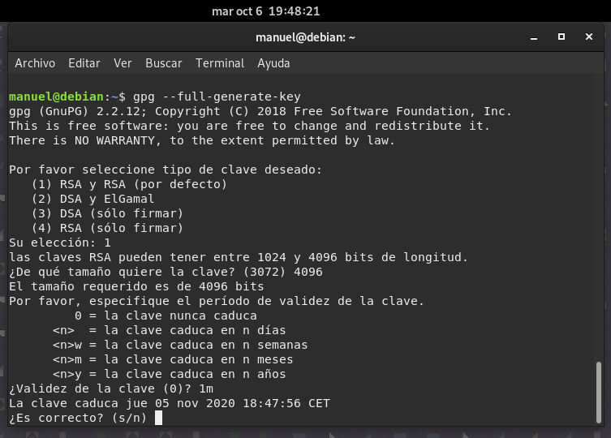 
    
**3.** Lista las claves privadas de tu almacén de claves.

Para listar las claves privadas, usaremos:

```gpg --list-secret-keys```
  
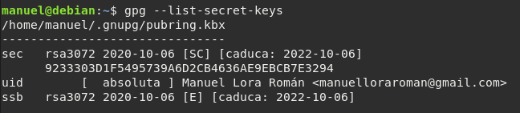


## Tarea 2: Importar/Exportar clave pública

**1.** Exporta tu clave pública en formato ASCII y guardalo en un archivo 
_nombre\_apellido.asc_ y envíalo al compañero con el que vas a hacer 
esta práctica.

Para exportar nuestra clave pública, haremos esto:

```gpg --armor --export -a "Manuel Lora Román" > manuel_lora.asc``` 
    
La opción _--armor_ fuerza que la salida de la orden sea generada en formato 
armadura-ASCII.

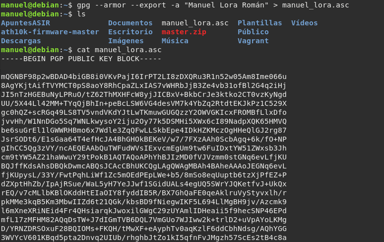

**2.** Importa las claves públicas recibidas de vuestro compañero.

Para importar las claves públicas de nuestros compañeros debemos hacer este
otro comando:

```gpg --import [clave].asc / [clave].key```


    
**3.** Comprueba que las claves se han incluido correctamente en vuestro 
keyring.

Pues volvemos a hacer el comando de listar las claves, y deberíamos ver la 
clave de nuestro compañero.

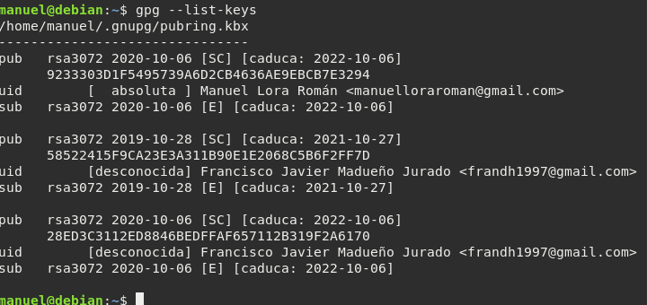

## Tarea 3: Cifrado asimétrico con claves públicas


**1.** Cifraremos un archivo cualquiera y lo remitiremos por email a uno de 
nuestros compañeros que nos proporcionó su clave pública.
    
Para cifrar un archivo cualquiera, haremos lo siguiente:

```gpg -er [clave pública destinatario] [archivo]```

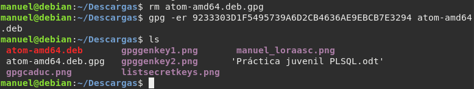

Se generará un fichero _.gpg_ y le enviaremos dicho fichero a nuestro compañero.

**2.** Nuestro compañero, a su vez, nos remitirá un archivo cifrado para que 
nosotros lo descifremos.


**3.** Tanto nosotros como nuestro compañero comprobaremos que hemos podido 
descifrar los mensajes recibidos respectivamente.

Para descifrar un fichero debemos hacer:

```gpg -d [archivo] -o [archivo destino]```

Si no colocamos la opción _-o_ se nos desplegará el contenido del fichero por
pantalla.


**4.** Por último, enviaremos el documento cifrado a alguien que no estaba 
en la lista de destinatarios y comprobaremos que este usuario no podrá 
descifrar este archivo.
    
**5.** Para terminar, indica los comandos necesarios para borrar las 
claves públicas y privadas que posees.

Para borrar una clave pública, debemos hacer lo siguiente:

```gpg --delete-key "Nombre de usuario"```

Y para borrar una clave privada, haremos esto otro:

```gpg --delete-secret-key "Nombre de usuario"```


## Tarea 4: Exportar clave a un servidor público de claves PGP

**1.** Genera la clave de revocación de tu clave pública para utilizarla en 
caso de que haya problemas.

El certificado de revocación se generará en el fichero revoke.asc, y se crea de 
la siguiente manera:

```gpg --output certificado.asc --gen-revoke 9233303D1F5495739A6D2CB4636AE9EBCB7E3294```

Una clave pública revocada puede ser usada para verificar firmas hechas por el 
usuario en el pasado, pero no puede ser usada para cifrar o descifrar datos.

Cuando se ejecuta el comando, nos pedirá confirmación, y razones por la cual 
la clave privada ha sido comprometida. Una vez hecho esto, nos pedirá la 
contraseña con la cual creamos la clave privada y ya tendríamos nuestro 
certificado de revocación. 

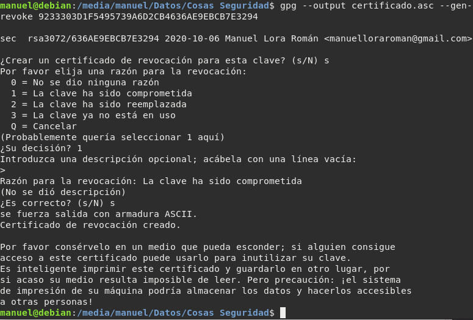

Guardaremos dicho archivo en un lugar seguro.
   
**2.** Exporta tu clave pública al servidor pgp.rediris.es

Para ello, haremos esto:

```gpg --keyserver pgp.rediris.es --send-keys 9233303D1F5495739A6D2CB4636AE9EBCB7E3294```

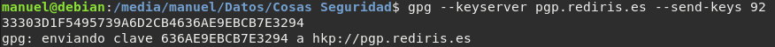
    
**3.** Borra la clave pública de alguno de tus compañeros de clase e 
impórtala ahora del servidor público de rediris.

Para recibir la clave pública de nuestros compañeros desde el servidor de 
claves, usaremos los siguientes comandos:

```gpg --keyserver pgp.rediris.es --search-key [Palabra clave]```

Esto nos permitirá buscar las claves de nuestros compañeros mediante alguna 
palabra como por ejemplo sus apellidos, nombre, etc.

Nos dará la opción de importar dichas claves.

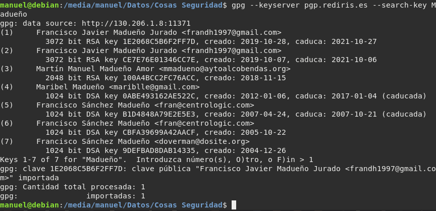


## Tarea 5: Cifrado asimétrico con openssl


**1.** Genera un par de claves (pública y privada).

Para generar las claves públicas y privadas en formato PEM con contraseña, 
haremos lo siguiente:

```sudo openssl genrsa -aes128 -out key.pem 2048```

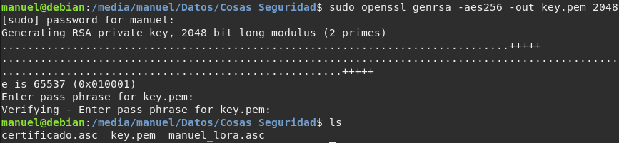

Como vamos a necesitarlo, vamos a separar la clave pública asociada a nuestra 
clave privada:

```openssl rsa -in key.pem -pubout -out key.public.pem```

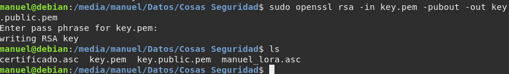

**2.** Envía tu clave pública a un compañero.

Le enviamos dicha clave pública a nuestro compañero.
    
**3.** Utilizando la clave pública cifra un fichero de texto y envíalo 
a tu compañero.

Para cifrar nuestro fichero, vamos a hacer esto:

1. Ciframos el archivo con la clave privada

```sudo openssl enc -aes-256-cbc -pass file:[clave] -in [fichero] -out [fichero].encrypted```

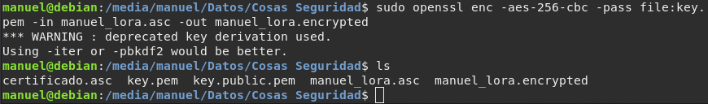
    
**4.** Tu compañero te ha mandado un fichero cifrado, muestra el proceso 
para el descifrado.


Para descifrar, tendremos que usar el siguiente comando:

```openssl rsautl -decrypt -inkey ./key.pem -in [fichero].encrypted -out [fichero]```

