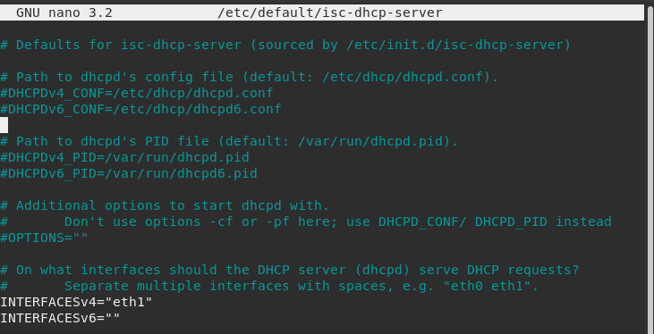
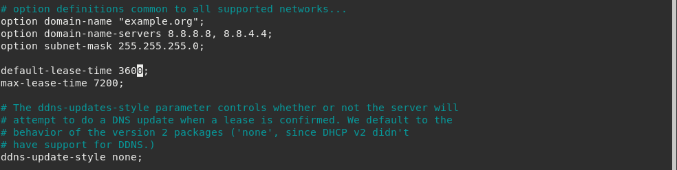
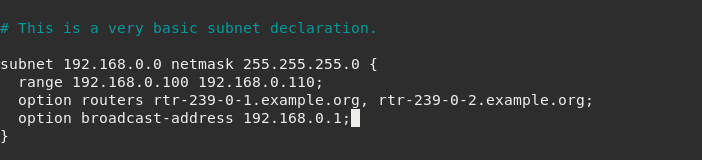
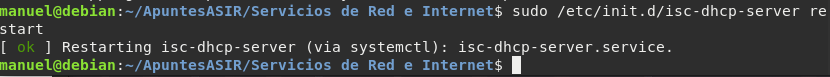

# Ejercicio: Instalación y configuración del servidor DHCP en Linux


## Instalación del servidor isc-dhcp-server

```sudo apt-get install isc-dhcp-server```

Cuando lo instalamos por primera vez, nos producirá un error ya que no está 
configurado. Para ver los errores: _/var/log/syslog_.


## Configuración del servidor isc-dhcp-server

Primero hay que configurar la interfaz de red por la que trabajaremos con el
servidor dhcp. Editamos el siguiente fichero _/etc/default/isc-dhcp-server_.

* **Parámetro interfaces**:

```INTERFACES="eth1"```

El fichero principal de configuración es: _/etc/dhcp/dhcp.conf_. Este está
configurado en dos partes:

* Parte principal --> especifica los parámetros generales que definen la 
concesión y los parámetros adicionales que se proporcionarán al cliente.

* Secciones:  

   * Subnet --> especifican rangos de direcciones IPs que serán cedidas a los  
		clientes que lo soliciten.  

   * Host --> especificaciones concretas de equipos.  

En la parte principal nos encontramos lo siguiente:

* **max-lease-time** --> tiempo de la concesión de la dirección IP.

* **default-lease-time** --> tiempo de renovación de la concesión.

* **option routers** --> indicamos la dirección de red de la puerta de enlace 
para salir a Internet.

* **option domain-name-servers** --> se pone las direcciones IP de los 
servidores DNS que va a utilizar el cliente.

* **option-domain-name** --> nombre del dominio que se manda al cliente.

* **option subnetmask** --> subred enviada a los clientes.

* **option broadcast-address** --> dirección de difusión de la red.

Al indicar una sección subnet, tenemos que indicar la dirección de la red y la
máscara de red y entre llaves podemos poner:

* **range** --> indicamos el rango de direcciones IP que vamos a asignar.

Ejemplo de configuración de la sección subnet:

```
subnet 192.168.0.0 netmask 255.255.255.0 {  
range 192.168.0.60 192.168.0.90;  
option routers 192.168.0.254;  
option domain-name-servers 80.58.0.33, 80.58.32.9;  
}  
```

En Windows para liberar la concesión se utiliza _ipconfig /release_ y _renew_
la renueva.


## Ejercicio DHCP 1

**Tarea 1.** Configura el servidor dhcp con las siguientes características
   
 * Rango de direcciones a repartir: 192.168.0.100 - 192.168.0.110
 * Máscara de red: 255.255.255.0
 * Duración de la concesión: 1 hora
 * Puerta de enlace: 192.168.0.1
 * Servidores DNS: 8.8.8.8, 8.8.4.4

**Tarea 2.** Configura los clientes para obtener direccionamiento dinámico. 
Comprueba las configuraciones de red que han tomado los clientes. 
Visualiza el fichero del servidor donde se guarda las configuraciones asignadas.


### Tarea 1









### Tarea 2

Para configurar el direccionamiento para que sea dinámico, debemos modificar en 
la máquina cliente el archivo _/etc/network/interfaces_. Elegiremos la interfaz
de red que tengamos activa, en nuestro caso, _eth0_.


```
auto eth0
iface eth0 inet dhcp
```

Y después, reiniciar las interfaces con este comando:

```sudo /etc/init.d/networking restart```

!!! Antes de realizar dicho cambio, guarda tu configuración actual en caso de
que te encontrases fallos.


Si por el contrario, deseamos asignar IPs estáticas a los clientes, debemos 
modificar en el fichero _/etc/dhcp/dhcpd.conf_ dichas IPs de la siguiente 
manera:

```
host cliente1 {
   fixed-address XXX.XX.XXX.X;
}
```


