# Ejercicio 4: Mapear URL a ubicaciones de un sistema de ficheros

**Tarea 1**. Cuando se entre a la dirección www.mapeo.com se redireccionará 
automáticamente a www.mapeo.com/principal, donde se mostrará el 
mensaje de bienvenida.

```
cd /etc/apache2/sites-avalaible
sudo cp 000-default.conf mapeo.conf
sudo nano mapeo.conf
```

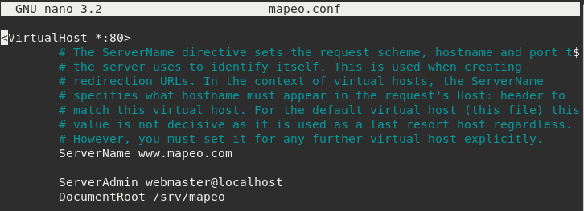

```
sudo nano ../apache2.conf
```

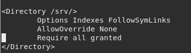

```
sudo a2ensite mapeo.conf
sudo mkdir /srv/mapeo
sudo cp /var/www/html/index.html /srv/mapeo
sudo systemctl reload apache2
```

Y en nuestra máquina fisica, modificamos el fichero _/etc/hosts_ con una línea
parecida a esta:

```192.168.0.100	www.mapeo.com```

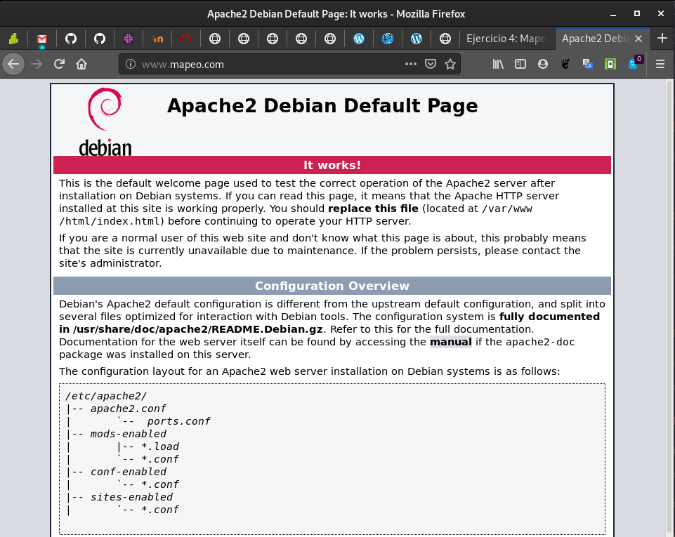

Ahora, para hacer redireccionar, deberemos modificar el fichero 
_mapeo.conf_ con lo siguiente:

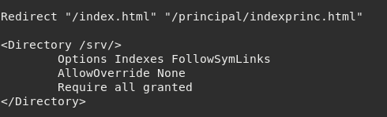

Y después crearemos el directorio _principal_ en _/srv/mapeo_ con un index para
que nos de la bienvenida.

El resultado cuando accedo a _www.mapeo.com_ es el siguiente:

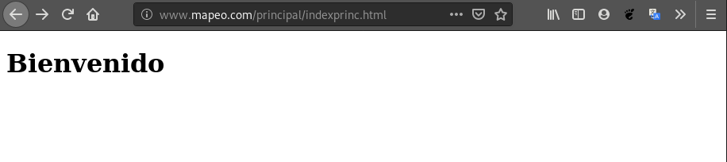

**Tarea 2**. En el directorio principal no se permite ver la lista de los 
ficheros, no se permite que se siga los enlaces simbólicos y no se permite 
negociación de contenido. Muestra al profesor el funcionamiento. 
¿Qué configuración tienes que poner?

Tenemos que modificar otra vez, el contenido del fichero _mapeo.conf_.
Crearemos las siguiente líneas:


Y en la configuración de apache2 del fichero _apache2.conf_, debemos modificar
lo siguiente:

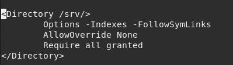

**Tarea 3**. Si accedes a la página www.mapeo.com/principal/documentos se 
visualizarán los documentos que hay en /home/usuario/doc. Por lo tanto se 
permitirá el listado de fichero y el seguimiento de enlaces simbólicos siempre 
que el propietario del enlace y del fichero al que apunta sean el mismo 
usuario. Explica bien y pon una prueba de funcionamiento donde se vea bien 
el seguimiento de los enlaces simbólicos.

La modificación realizada en el fichero _mapeo.conf_ ya está señalizada en el 
anterior apartado.

La opción de _SymLinksIfOwnerMatch_, permite seguir los enlaces simbólicos
de los ficheros o directorios si le pertenece al mismo usuario que al del
enlace.

Ahora procedemos a la creación del enlace simbólico:

```
cd /srv/mapeo
ln -s /home/usuario/Documentos documentos
```

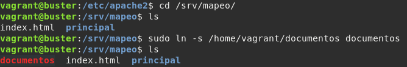

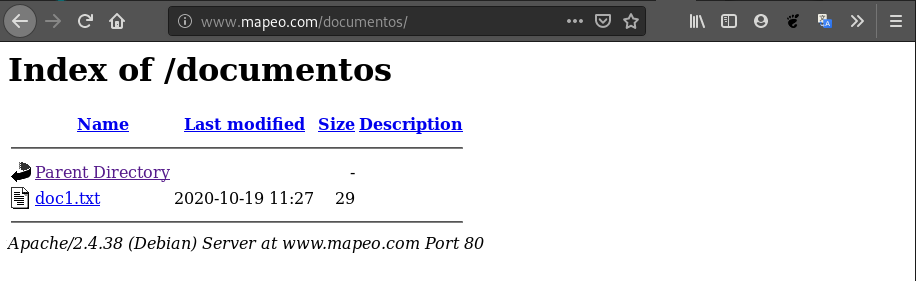

**Tarea 4**. En todo el host virtual se debe redefinir los mensajes de error 
de objeto no encontrado y no permitido. Para el ello se crearan dos ficheros 
html dentro del directorio error. Entrega las modificaciones necesarias en la 
configuración y una comprobación del buen funcionamiento.

Después, tenemos que editar el fichero _/etc/apache2/conf-avalaible/localizated-error-pages_
para descomentar la línea que pone _<IfModule mod_negotiation.c>_ en caso de 
que lo esté.

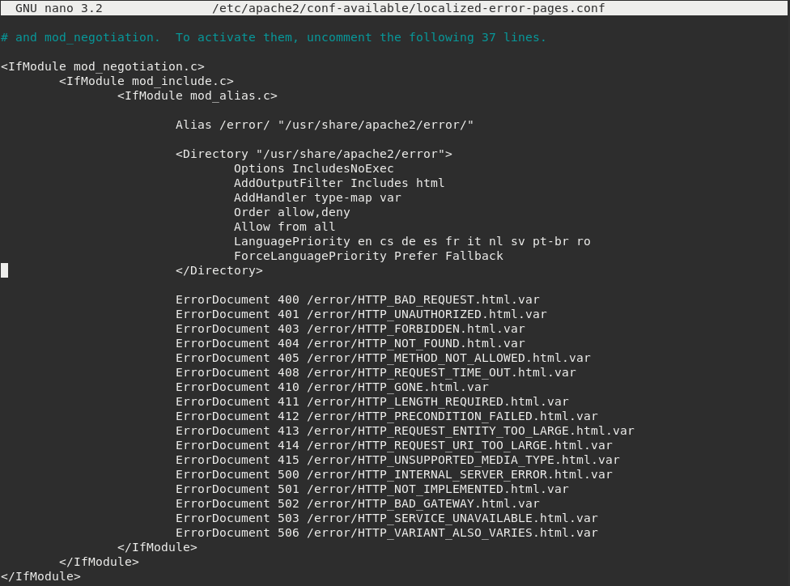

Y cambiamos el parámetro de _languagePriority_ a es primero para que el error 
sea en Español.

A continuación, activamos 3 módulos de nuestro apache:

```
a2enmod negotiation
a2enmod alias
a2enmod include
```

Y reiniciamos el servicio de apache2.

Ahora, para modificar los mensajes de error, debemos dirigirnos al directorio
_/usr/share/apache2/error.

No encontrado:

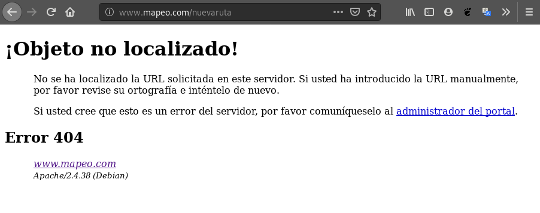

No permitido:

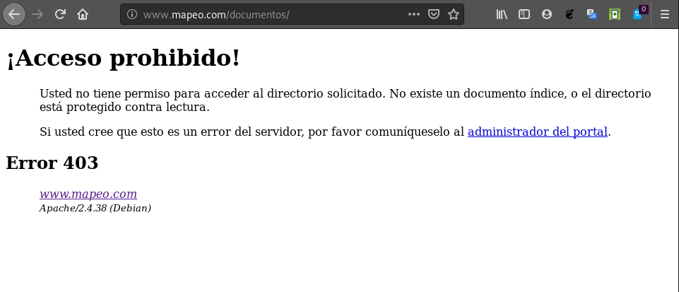
