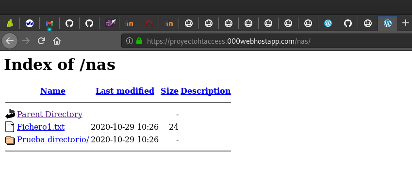
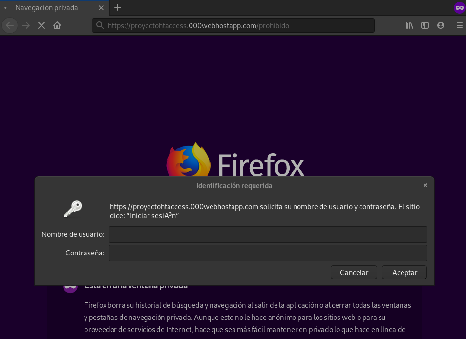

# Ejercicio 6: Configuración de apache mediante archivo .htaccess

Un fichero .htaccess (hypertext access), también conocido como archivo de 
configuración distribuida, es un fichero especial, popularizado por el 
Servidor HTTP Apache que nos permite definir diferentes directivas de 
configuración para cada directorio (con sus respectivos subdirectorios) 
sin necesidad de editar el archivo de configuración principal de Apache.

Para permitir el uso de los ficheros .htaccess o restringir las directivas 
que se pueden aplicar usamos ela directiva AllowOverride, que puede ir 
acompañada de una o varias opciones: All, AuthConfig, FileInfo, Indexes, Limit. 
Estudia para que sirve cada una de las opciones.

**Ejercicios**

Date de alta en un proveedor de hosting. ¿Si necesitamos configurar el 
servidor web que han configurado los administradores del proveedor?, 
¿qué podemos hacer? Explica la directiva AllowOverride de apache2. Utilizando 
archivos .htaccess realiza las siguientes configuraciones:

Nos daremos de alta en el proveedor de hosting _000webhost_. Llamaremos a
nuestrio proyecto _proyectohtaccess_.

Para configurar el servidor web realizado por los administradores, podemos 
modificar varias directivas usando ficheros _.htaccess_.

_AllowOverride_ de apache2 permite controlar que directivas se pueden usar en 
los ficheros _.htaccess_. Los valores que puede tomar son:

* **All**

* **None**

O una combinación de los siguientes:

* **AuthConfig** --> autorización como por ejemplo _AuthName_, _AuthType_, etc.

* **FileInfo** --> control de tipo de documentos(LanguagePriority, 
ErrorDocument, etc).

* **Indexes** --> índices de directorios (AddDescription, AddIcon, DefaultIcon, etc.)

* **Limit** --> acceso a hosts (RequireAll, RequireAny, RequireNone).

* **Options** --> permite el uso de los valores de la directiva Options.

Si AllowOverride no se corresponde al valor _None_, el servidor tendrá que 
buscar el fichero en todos los directorios hasta llegar al directorio solicitado
aplicando así la configuración. Esto puede afectar al rendimiento. Por eso,
es recomendable poner _AllowOverride None_ de forma global y después activar lo
necesario en los directorios concretos. 
 
* Habilita el listado de ficheros en la URL _http://host.dominio/nas_.

Para ello, en primer lugar, vamos a acceder a nuestro sitio web. Crearemos un
directorio _nas_ dentro del directorio public_html. Y posteriormente crearemos
un fichero _.htaccess_ con el siguiente contenido:

```Options +Indexes```

Creamos varios directorios y ficheros de ejemplo dentro de _nas_ y accedemos a
nuestra [página](https://proyectohtaccess.000webhostapp.com/nas/)



* Crea una redirección permanente: cuando entremos en 
_http://host.dominio/google_ salte a _www.google.es_.

Ahora, para este ejercicio, crearemos otro directorio llamado _google_ y dentro
de éste, añadiremos otro fichero _.htaccess_ que contenga la siguiente línea:

```RedirectMatch 301 ^/(.*)$ http://www.google.es```

Y cuando accedamos a dicho directorio, nos redireccionará a la página de 
google:


* Pedir autentificación para entrar en la URL _http://host.dominio/prohibido_. 
(No la hagas si has elegido como proveedor CDMON, en la plataforma de prueba, 
no funciona.)

Ahora creamos otro directorio llamado _prohibido_ junto con otro fichero
_.htaccess_ con las siguientes líneas:

```
AuthUserFile proyectohtaccess.000webhostapp.com/prohibido/pass.txt
AuthName "Iniciar sesión"
AuthType Basic
Require user admin
```

Crearemos un fichero _pass.txt_ con el comando:

```htpasswd -c pass.txt admin```

Y se lo enviaremos al servidor dentro del directorio prohibido. También 
crearemos un _index.html_ para mostrar la página cuando iniciemos sesión.

Ahora nos meteremos en el directorio prohibido y nos pedirá usuario y 
contraseña:



