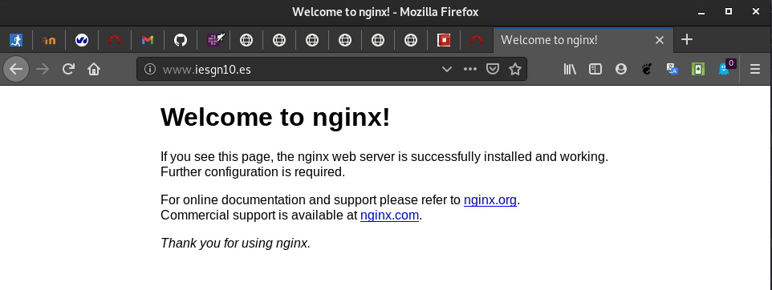
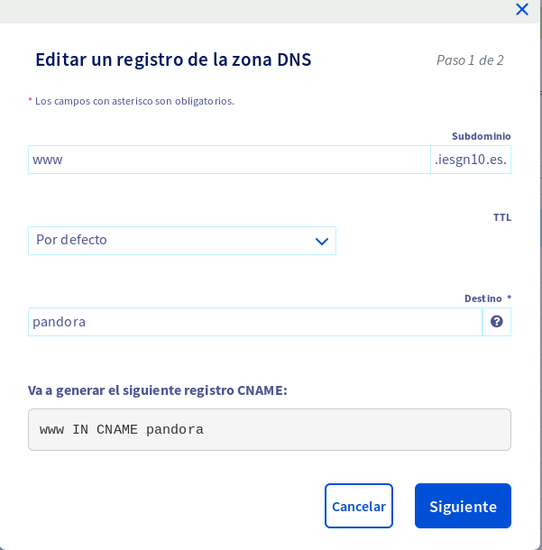

# Instalación de un servidor LEMP

1. Instala un servidor web nginx.

Ejecutaremos ```sudo apt-get install nginx``` para instalar el servidor web nginx.

2. Instala un servidor de base de datos MariaDB. Ejecuta el programa necesario 
para asegurar el servicio, ya que lo vamos a tener corriendo en el entorno de 
producción.

Ejecutaremos ```sudo apt-get install mariadb-server``` y después haremos lo
siguiente:

```
debian@pandora:~$ sudo mysql_secure_installation

NOTE: RUNNING ALL PARTS OF THIS SCRIPT IS RECOMMENDED FOR ALL MariaDB
      SERVERS IN PRODUCTION USE!  PLEASE READ EACH STEP CAREFULLY!

In order to log into MariaDB to secure it, we'll need the current
password for the root user.  If you've just installed MariaDB, and
you haven't set the root password yet, the password will be blank,
so you should just press enter here.

Enter current password for root (enter for none): 
OK, successfully used password, moving on...

Setting the root password ensures that nobody can log into the MariaDB
root user without the proper authorisation.

Set root password? [Y/n] Y
New password: 
Re-enter new password: 
Password updated successfully!
Reloading privilege tables..
 ... Success!


By default, a MariaDB installation has an anonymous user, allowing anyone
to log into MariaDB without having to have a user account created for
them.  This is intended only for testing, and to make the installation
go a bit smoother.  You should remove them before moving into a
production environment.

Remove anonymous users? [Y/n] Y
 ... Success!

Normally, root should only be allowed to connect from 'localhost'.  This
ensures that someone cannot guess at the root password from the network.

Disallow root login remotely? [Y/n] Y
 ... Success!

By default, MariaDB comes with a database named 'test' that anyone can
access.  This is also intended only for testing, and should be removed
before moving into a production environment.

Remove test database and access to it? [Y/n] Y
 - Dropping test database...
 ... Success!
 - Removing privileges on test database...
 ... Success!

Reloading the privilege tables will ensure that all changes made so far
will take effect immediately.

Reload privilege tables now? [Y/n] Y
 ... Success!

Cleaning up...

All done!  If you've completed all of the above steps, your MariaDB
installation should now be secure.

Thanks for using MariaDB!
debian@pandora:~$ 
```

3. Instala un servidor de aplicaciones php php-fpm.

Simplemente tenemos que ejecutar el siguiente comando:

```sudo apt-get install php php-fpm```

4. Crea un virtualhost al que vamos acceder con el nombre www.iesgnXX.es. 
Recuerda que tendrás que crear un registro CNAME en la zona DNS.


Iremos al directorio _/etc/nginx/sites-available_ y haremos una copia del 
fichero default:

```sudo cp /etc/nginx/sites-available/default /etc/nginx/sites-available/iesgn10```

Y modificaremos el fichero de configuración:

```
server {
        listen 80 default_server;
        listen [::]:80 default_server;
root /var/www/html;

index index.html index.htm index.nginx-debian.html;

server_name www.iesgn10.es;

location / {
       try_files $uri $uri/ =404;
}
}
```

Modificaremos el fichero _/etc/hosts_ de nuestra máquina para comprobar que la
instalación es correcta.



Para crear un registro CNAME en la zona DNS, nos iremos al ```Panel de Control --> Zona DNS```
y lo añadiremos:



5. Cuando se acceda al virtualhost por defecto default nos tiene que redirigir 
al virtualhost que hemos creado en el punto anterior.

6. Cuando se acceda a www.iesgnXX.es se nos redigirá a la página 
www.iesgnXX.es/principal.

7. En la página www.iesgnXX.es/principal se debe mostrar una página web 
estática (utiliza alguna plantilla para que tenga hoja de estilo). En esta 
página debe aparecer tu nombre, y una lista de enlaces a las aplicaciones que 
vamos a ir desplegando posteriormente.

8. Configura el nuevo virtualhost, para que pueda ejecutar PHP. Determina que 
configuración tiene por defecto php-fpm (socket unix o socket TCP) para 
configurar nginx de forma adecuada.

9. Crea un fichero info.php que demuestre que está funcionando el servidor LEMP.
