# Práctica: Servidor Web Nginx

**Tarea 1**: Crea una máquina del cloud con una red pública. Añade la clave 
pública del profesor a la máquina. Instala el servidor web nginx en la máquina. 
Modifica la página index.html que viene por defecto y accede a ella desde un 
navegador.
       
* Entrega la ip flotante de la máquina para que el profesor pueda acceder a 
ella.

* Entrega una captura de pantalla accediendo a ella.


Instalaremos una máquina en openstack con las siguientes características:

* Debian Buster

* m1.mini

* Grupo de seguridad default

* Nuestro par de claves

* IP FLOTANTE --> 172.22.200.117

A continuación, nos conectaremos a la máquina por ssh (previamente habiendole
añadido a la máquina una IP flotante):

```
manuel@debian:~/.ssh$ ssh -i clave_openstack.pem debian@172.22.200.117
Linux nginx 4.19.0-11-cloud-amd64 #1 SMP Debian 4.19.146-1 (2020-09-17) x86_64

The programs included with the Debian GNU/Linux system are free software;
the exact distribution terms for each program are described in the
individual files in /usr/share/doc/*/copyright.

Debian GNU/Linux comes with ABSOLUTELY NO WARRANTY, to the extent
permitted by applicable law.
debian@nginx:~$
```

Para añadirle la clave pública de nuestro profesor, se la mandaremos a la
máquina del cloud por scp:

```
scp -i ../.ssh/clave_openstack.pem ../Descargas/id_rsa.pub debian@172.22.200.117:/home/debian/.ssh
```

Y una vez ya en la máquina, haremos lo siguiente:

```
debian@nginx:~$ echo `cat .ssh/id_rsa.pub` >> .ssh/authorized_keys 
```

Para que el profesor pueda acceder a la máquina por medio de su clave privada.


Ahora procedemos a instalar Nginx. Una vez instalado copiaremos el fichero
_/etc/nginx/sites-avalaible/default_ en un fichero _ejemplo.com_
con la siguiente linea cambiada:

```
root /var/www/html;

        # Add index.php to the list if you are using PHP
        index index.html index.htm index.nginx-debian.html;

        server_name www.ejemplonginx.com;
```

Ahora haremos un enlace simbólico hacia _sites-enabled_ del fichero de 
configuración:

```
ln -s /etc/nginx/sites-avalaible/ejemplo.com /etc/nginx/sites-enabled/
```

Hecho esto, modificaremos el fichero _index.html_ generado automáticamente
ubicado en _/var/www/html/_.

Y comprobaremos su correcto funcionamiento:


## Virtual Hosting

Queremos que nuestro servidor web ofrezca dos sitios web, teniendo en cuenta 
lo siguiente:

* Cada sitio web tendrá nombres distintos.

* Cada sitio web compartirán la misma dirección IP y el mismo puerto (80).

Los dos sitios web tendrán las siguientes características:

* El nombre de dominio del primero será www.iesgn.org, su directorio base será 
/srv/www/iesgn y contendrá una página llamada index.html, donde sólo se verá 
una bienvenida a la página del Instituto Gonzalo Nazareno.

* En el segundo sitio vamos a crear una página donde se pondrán noticias por 
parte de los departamento, el nombre de este sitio será 
departamentos.iesgn.org, y su directorio base será /srv/www/departamentos. 
En este sitio sólo tendremos una página inicial index.html, dando la bienvenida 
a la página de los departamentos del instituto.
   
**Tarea 2:** Configura la resolución estática en los clientes y muestra el 
acceso a cada una de las páginas.

Lo primero que haremos es triplicar el fichero _/etc/nginx/sites-avalaible/default_
y los llamaremos _iesgn.com_ y _departamentos.com_, cuyos ficheros de
configuración son los siguientes:

* iesgn.com:

```
server {
        listen 80;
        root /srv/www/iesgn;

        index index.html index.htm index.nginx-debian.html;

        server_name www.iesgn.org;
	location / {
                try_files $uri $uri/ =404;
        }
}
```

* departamentos.com:

```
server {
        listen 80 default_server;
        listen [::]:80 default_server;
	root /srv/www/departamentos;


        index index.html index.htm index.nginx-debian.html;

        server_name departamentos.iesgn.org;
	location / {

                try_files $uri $uri/ =404;
        }
}
```

Una vez configurado esto, crearemos los respectivos directorios en las
ubicaciones marcadas en el parámetro _root_.

Y haremos también los enlaces simbólicos:

```
debian@nginx:/etc/nginx/sites-available$ sudo ln -s /etc/nginx/sites-available/iesgn.com /etc/nginx/sites-enabled/
debian@nginx:/etc/nginx/sites-available$ sudo ln -s /etc/nginx/sites-available/departamentos.com /etc/nginx/sites-enabled/
```

Ahora crearemos dos index.html en los directorios _/srv/www/iesgn_ y 
_/srv/www/departamentos_ y le ponemos una bienvenida diferente a cada una.

Reiniciamos el servicio de nginx y nos dirigiremos a la máquina física y
modificaremos el _/etc/hosts_ con las siguientes lineas:

```
172.22.200.117  www.iesgn.com
172.22.200.117  departamentos.iesgn.com
```

Y comprobamos su funcionamiento:


## Mapeo de URL

Cambia la configuración del sitio web www.iesgn.org para que se comporte 
de la siguiente forma:

**Tarea 3:** Cuando se entre a la dirección www.iesgn.org se redireccionará 
automáticamente a www.iesgn.org/principal, donde se mostrará el mensaje de 
bienvenida. En el directorio principal no se permite ver la lista de los 
ficheros, no se permite que se siga los enlaces simbólicos y no se permite 
negociación de contenido. Muestra al profesor el funcionamiento.

En primer lugar, crearemos el directorio principal en _/srv/www/iesgn/_ y
copiaremos el index.html ubicado en _iesgn_ y lo pondremos en el directorio
creado.

Ahora, modificaremos el fichero _iesgn.com_ con las siguientes líneas:

```
location / {
                return 301 /principal/index.html;
                autoindex off;
                try_files $uri $uri/ =404;
                location /principal {
                        disable_symlinks on;
                        autoindex off;
                }
        }

```
Creamos varios ficheros en el directorio principal para la comprobación.

Y comprobamos:

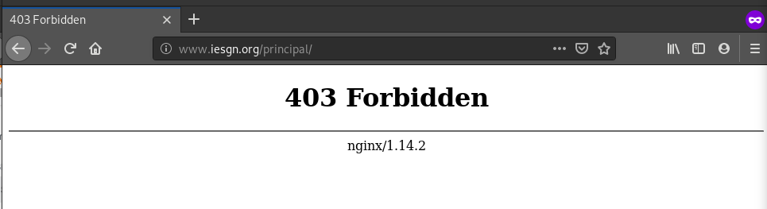

Si cambiamos la configuración y le cambios el parámetro _autoindex on_ a _off_
nos saldría el siguiente resultado:

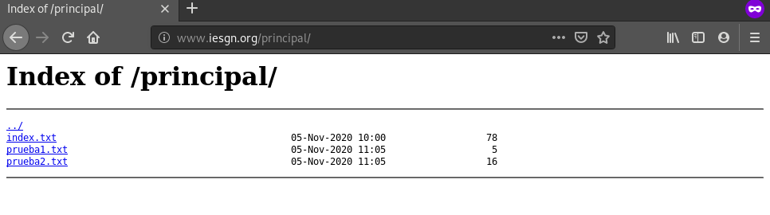

**Tarea 4:** Si accedes a la página www.iesgn.org/principal/documentos se 
visualizarán los documentos que hay en /srv/doc. Por lo tanto se permitirá el 
listado de fichero y el seguimiento de enlaces simbólicos siempre que sean a 
ficheros o directorios cuyo dueño sea el usuario. Muestra al profesor el 
funcionamiento.

Para ello, crearemos el directorio _/srv/doc_ y el enlace simbólico en 
_/principal/_ llamado documentos.

Después, modificaremos el fichero de configuración _iesgn.com_ con las 
siguientes lineas:

```
location / {
                return 301 /principal/index.html;
                autoindex off;
                try_files $uri $uri/ =404;
                location /principal {
                        autoindex on;
                        disable_symlinks if_not_owner;

                }
        }
```

Cambios el propietario de _documentos_ al usuario debian.

Una vez hecho esto, intentamos acceder a _documentos_:

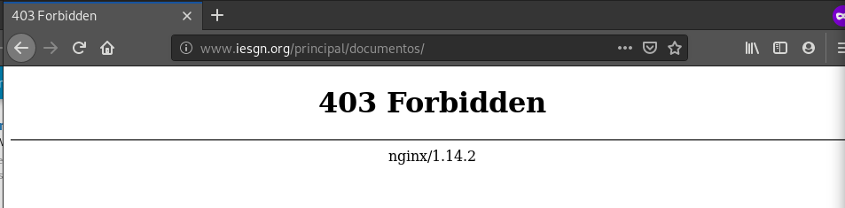

Si cambiamos el propietario a root:

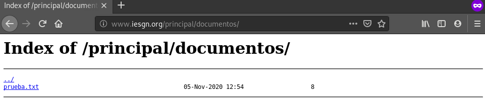

**Tarea 5:** En todo el host virtual se debe redefinir los mensajes de error 
de objeto no encontrado y no permitido. Para el ello se crearan dos ficheros 
html dentro del directorio error. Entrega las modificaciones necesarias en la 
configuración y una comprobación del buen funcionamiento.

Editaremos el fichero _/etc/nginx/sites-avalaible/iesgn.com_ y agregaremos 
estas lineas:

```
error_page 404 /404.html;
        location /404.html {
                internal;
        }

        error_page 403 /403.html;
        location /403.html {
                internal;
        }
```

Y ahora provocaremos ambos errores:

* 404

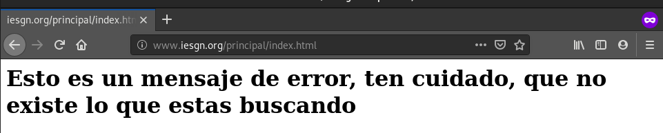

* 403

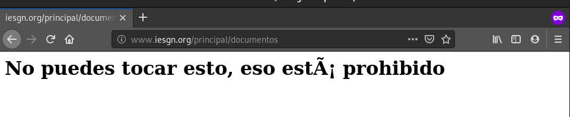


## Autentificación, Autorización y Control de Acceso

**Tarea 6:** Añade al escenario otra máquina conectada por una red interna al 
servidor. A la URL departamentos.iesgn.org/intranet sólo se debe tener acceso 
desde el cliente de la red local, y no se pueda acceder desde la anfitriona 
por la red pública. A la URL departamentos.iesgn.org/internet, sin embargo, 
sólo se debe tener acceso desde la anfitriona por la red pública, y no desde 
la red local.

Hemos añadido otra máquina a la red cuya IP Flotante es 172.22.200.149 y 
añadiremos la clave pública del profesor al fichero _authorized-keys_ como
hicimos anteriormente.

Una vez hecho esto, crearemos los dos directorios internet e intranet 
con ficheros de prueba en el directorio departamentos.

Y por último añadiremos las siguientes lineas en el fichero de configuración de
departamentos:

```
        location / {
                try_files $uri $uri/ =404;
                location /intranet {
                        allow 172.22.200.0/24;
                        deny all;
                }
                location /internet {
                        deny 172.22.200.0/24;
                        allow all;
                }
        }
```

Y comprobamos las conexiones:

* Si accedemos desde nuestra red interna a Intranet nos permite el acceso, pero
no si accedemos a Internet:

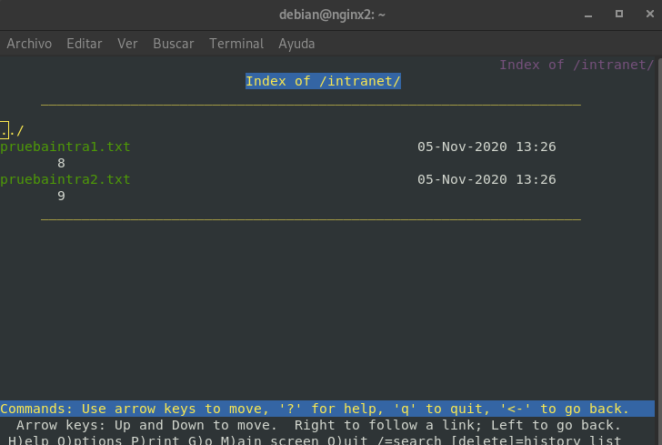

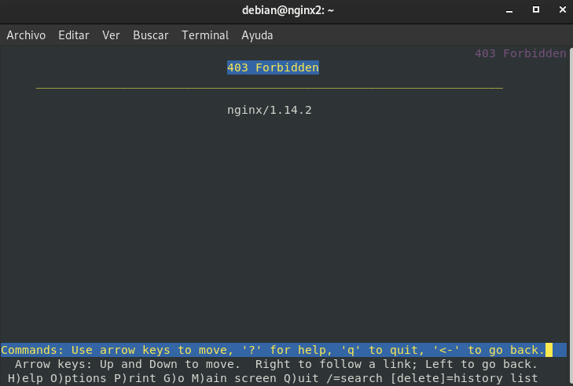
  
* Si accedemos desde una red pública a Internet nos permite el acceso, pero no
si accedemos a Intranet:

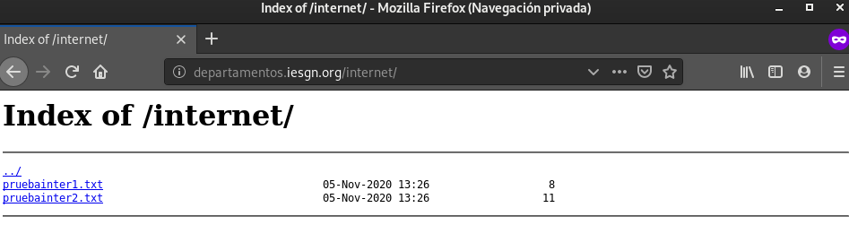

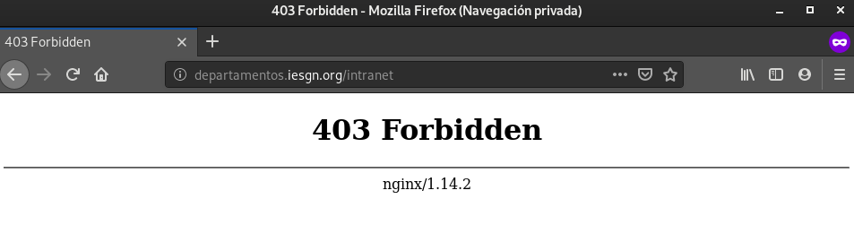

**Tarea 7:** Autentificación básica. Limita el acceso a la URL 
departamentos.iesgn.org/secreto. Comprueba las cabeceras de los mensajes HTTP 
que se intercambian entre el servidor y el cliente.

En primer lugar, nos descargaremos el paquete _apache2-utils_ para crear un
fichero de contraseñas. Una vez descargado, creamos ese fichero:

```
debian@nginx:/etc/nginx$ sudo htpasswd -c /etc/nginx/.htpasswd usuario
New password: 
Re-type new password: 
Adding password for user usuario
debian@nginx:/etc/nginx$ 
```
   
Configuramos las siguientes lineas del fichero _/etc/nginx/sites-available/departamentos.com_:

```
        location / {
                autoindex on;
                try_files $uri $uri/ =404;
                location /intranet {
                        allow 172.22.200.0/24;
                        deny all;
                }
                location /internet {
                        deny 172.22.200.0/24;
                        allow all;
                }
                location /secreto {
                        auth_basic "Administración secreto";
                        auth_basic_user_file /etc/nginx/.htpasswd;
                }
        }
```

Y ahora comprobamos el funcionamiento:

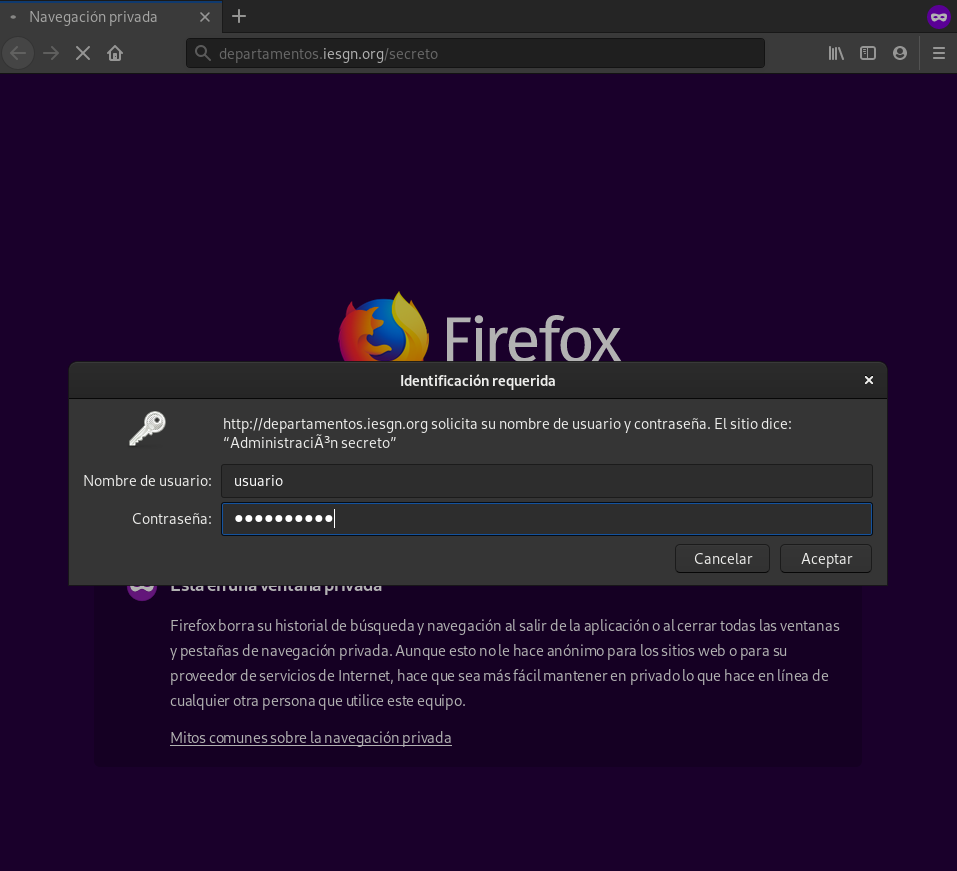

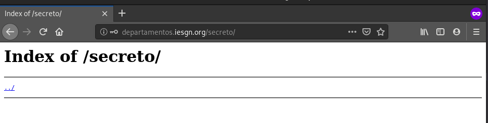

**Tarea 8:** Vamos a combinar el control de acceso (tarea 6) y la 
autentificación (tarea 7), y vamos a configurar el virtual host para que se 
comporte de la siguiente manera: el acceso a la URL 
departamentos.iesgn.org/secreto se hace forma directa desde la intranet, 
desde la red pública te pide la autentificación. Muestra el resultado al 
profesor.

Cambiaremos la configuración de departamentos con las siguientes lineas:

```
location /secreto {
        satisfy any;
        allow 172.22.200.0/24;
        deny all;
        auth_basic "Administración secreto";
        auth_basic_user_file /etc/nginx/.htpasswd;
}
```

Y comprobamos:

* Intranet:

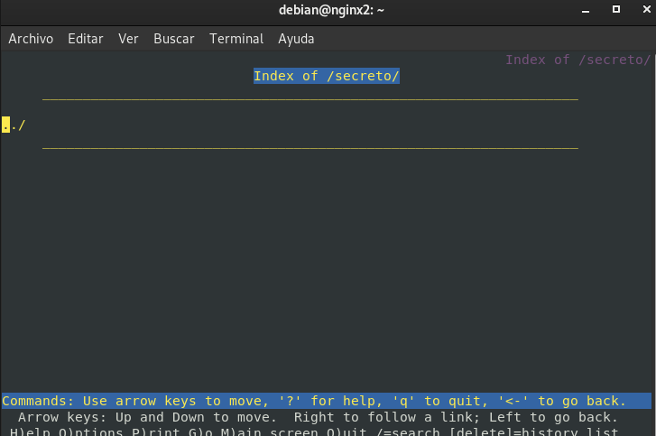

* Internet:

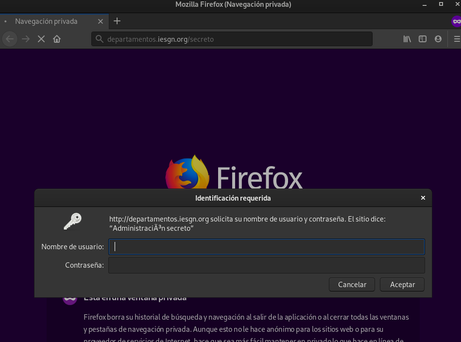
