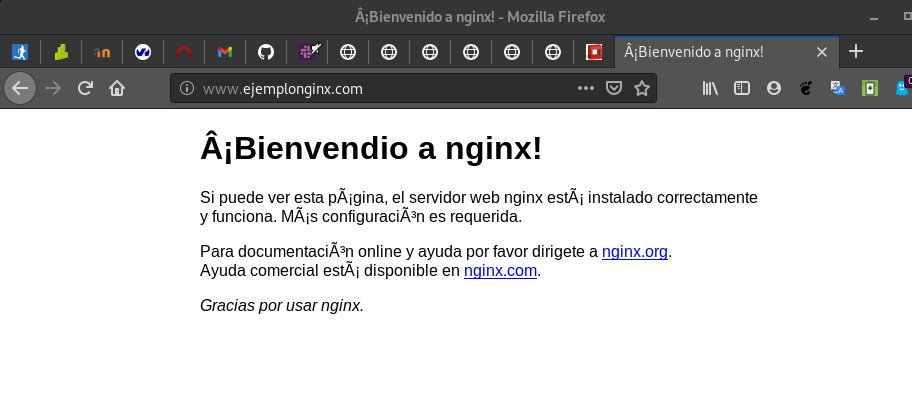
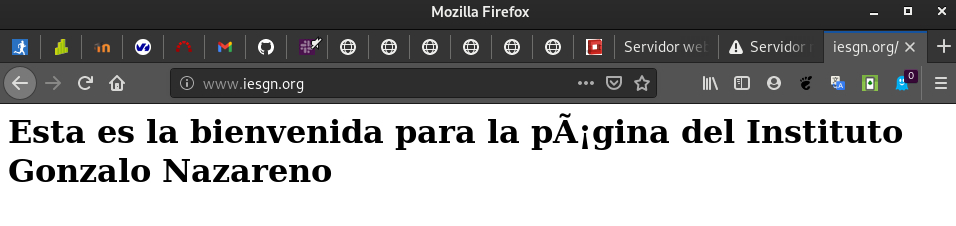
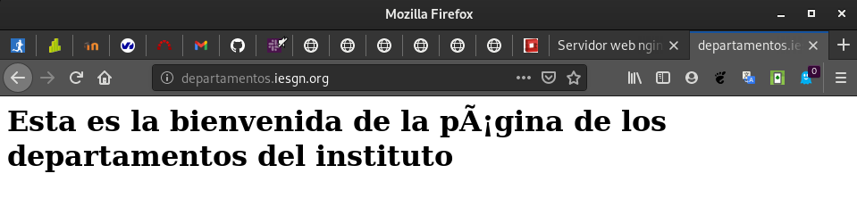

# Práctica: Servidor Web Nginx

**Tarea 1**: Crea una máquina del cloud con una red pública. Añade la clave 
pública del profesor a la máquina. Instala el servidor web nginx en la máquina. 
Modifica la página index.html que viene por defecto y accede a ella desde un 
navegador.
       
* Entrega la ip flotante de la máquina para que el profesor pueda acceder a 
ella.

* Entrega una captura de pantalla accediendo a ella.


Instalaremos una máquina en openstack con las siguientes características:

* Debian Buster

* m1.mini

* Grupo de seguridad default

* Nuestro par de claves

* IP FLOTANTE --> 172.22.200.117

A continuación, nos conectaremos a la máquina por ssh (previamente habiendole
añadido a la máquina una IP flotante):

```
manuel@debian:~/.ssh$ ssh -i clave_openstack.pem debian@172.22.200.117
Linux nginx 4.19.0-11-cloud-amd64 #1 SMP Debian 4.19.146-1 (2020-09-17) x86_64

The programs included with the Debian GNU/Linux system are free software;
the exact distribution terms for each program are described in the
individual files in /usr/share/doc/*/copyright.

Debian GNU/Linux comes with ABSOLUTELY NO WARRANTY, to the extent
permitted by applicable law.
debian@nginx:~$
```

Para añadirle la clave pública de nuestro profesor, se la mandaremos a la
máquina del cloud por scp:

```
scp -i ../.ssh/clave_openstack.pem ../Descargas/id_rsa.pub debian@172.22.200.117:/home/debian/.ssh
```

Y una vez ya en la máquina, haremos lo siguiente:

```
debian@nginx:~$ echo `cat .ssh/id_rsa.pub` >> .ssh/authorized_keys 
```

Para que el profesor pueda acceder a la máquina por medio de su clave privada.


Ahora procedemos a instalar Nginx. Una vez instalado copiaremos el fichero
_/etc/nginx/sites-avalaible/default_ en un fichero _ejemplo.com_
con la siguiente linea cambiada:

```
root /var/www/html;

        # Add index.php to the list if you are using PHP
        index index.html index.htm index.nginx-debian.html;

        server_name www.ejemplonginx.com;
```

Ahora haremos un enlace simbólico hacia _sites-enabled_ del fichero de 
configuración:

```
ln -s /etc/nginx/sites-avalaible/ejemplo.com /etc/nginx/sites-enabled/
```

Hecho esto, modificaremos el fichero _index.html_ generado automáticamente
ubicado en _/var/www/html/_.

Y comprobaremos su correcto funcionamiento:



## Virtual Hosting

Queremos que nuestro servidor web ofrezca dos sitios web, teniendo en cuenta 
lo siguiente:

* Cada sitio web tendrá nombres distintos.

* Cada sitio web compartirán la misma dirección IP y el mismo puerto (80).

Los dos sitios web tendrán las siguientes características:

* El nombre de dominio del primero será www.iesgn.org, su directorio base será 
/srv/www/iesgn y contendrá una página llamada index.html, donde sólo se verá 
una bienvenida a la página del Instituto Gonzalo Nazareno.

* En el segundo sitio vamos a crear una página donde se pondrán noticias por 
parte de los departamento, el nombre de este sitio será 
departamentos.iesgn.org, y su directorio base será /srv/www/departamentos. 
En este sitio sólo tendremos una página inicial index.html, dando la bienvenida 
a la página de los departamentos del instituto.
   
**Tarea 2:** Configura la resolución estática en los clientes y muestra el 
acceso a cada una de las páginas.

Lo primero que haremos es triplicar el fichero _/etc/nginx/sites-avalaible/default_
y los llamaremos _iesgn.com_ y _departamentos.com_, cuyos ficheros de
configuración son los siguientes:

* iesgn.com:

```
server {
        listen 80;
        root /srv/www/iesgn;

        index index.html index.htm index.nginx-debian.html;

        server_name www.iesgn.org;
	location / {
                try_files $uri $uri/ =404;
        }
}
```

* departamentos.com:

```
server {
        listen 80 default_server;
        listen [::]:80 default_server;
	root /srv/www/departamentos;


        index index.html index.htm index.nginx-debian.html;

        server_name www.departamentos.iesgn.org;
	location / {

                try_files $uri $uri/ =404;
        }
}
```

Una vez configurado esto, crearemos los respectivos directorios en las
ubicaciones marcadas en el parámetro _root_.

Y haremos también los enlaces simbólicos:

```
debian@nginx:/etc/nginx/sites-available$ sudo ln -s /etc/nginx/sites-available/iesgn.com /etc/nginx/sites-enabled/
debian@nginx:/etc/nginx/sites-available$ sudo ln -s /etc/nginx/sites-available/departamentos.com /etc/nginx/sites-enabled/
```

Ahora crearemos dos index.html en los directorios _/srv/www/iesgn_ y 
_/srv/www/departamentos_ y le ponemos una bienvenida diferente a cada una.

Reiniciamos el servicio de nginx y nos dirigiremos a la máquina física y
modificaremos el _/etc/hosts_ con las siguientes lineas:

```
172.22.200.117  www.iesgn.com
172.22.200.117  www.departamentos.iesgn.com
```

Y comprobamos su funcionamiento:






