# Ejercicio 3: VirtualHosting con Apache

El servidor web Apache2 se instala por defecto con un host virtual. 
La configuración de este sitio la podemos encontrar en:

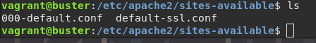

Cuyo contenido es:

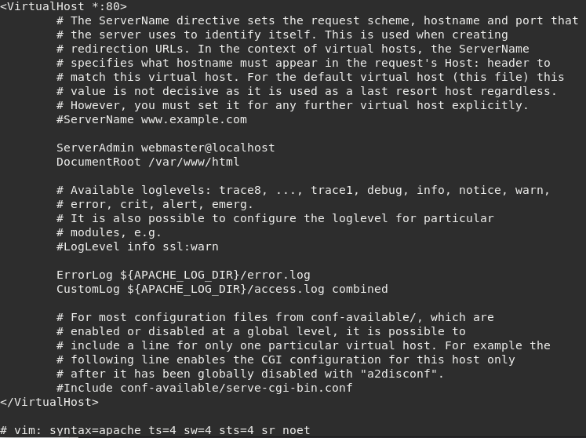

Hay un enlace simbólico a este fichero en el directorio _/etc/apache2/sites-enabled_.

Para habilitar nuestros host virtuales usaremos:

```
a2ensite
a2dissite
```

En el fichero de configuración general _/etc/apache2/apache2.conf_ vemos lo
siguiente:

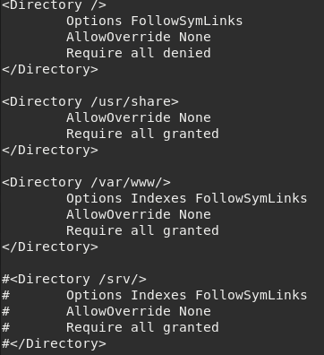

## Configuración de VirtualHosting

El objetivo de esta práctica es la puesta en marcha de dos sitios web 
utilizando el mismo servidor web apache. Hay que tener en cuenta lo siguiente:

* Cada sitio web tendrá nombres distintos.
* Cada sitio web compartirán la misma dirección IP y el mismo puerto (80).

Queremos construir en nuestro servidor web apache dos sitios web con las 
siguientes características:

* El nombre de dominio del primero será www.iesgn.org, su directorio base será 
/var/www/iesgn y contendrá una página llamada index.html, donde sólo se verá 
una bienvenida a la página del Instituto Gonzalo Nazareno.
    
* En el segundo sitio vamos a crear una página donde se pondrán noticias por 
parte de los departamento, el nombre de este sitio será 
www.departamentosgn.org, y su directorio base será /var/www/departamentos. 
En este sitio sólo tendremos una página inicial index.html, dando la 
bienvenida a la página de los departamentos del instituto.

Para conseguir estos dos sitios virtuales debes seguir los siguientes pasos:

1. Los ficheros de configuración de los sitios webs se encuentran en el 
directorio /etc/apache2/sites-available, por defecto hay dos ficheros, 
uno se llama 000-default.conf que es la configuración del sitio web por 
defecto. Necesitamos tener dos ficheros para realizar la configuración de los 
dos sitios virtuales, para ello vamos a copiar el fichero 000-default.conf:

```
 cd /etc/apache2/sites-available
 cp 000-default.conf iesgn.conf
 cp 000-default.conf departamentos.conf
```

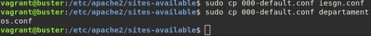

De esta manera tendremos un fichero llamado iesgn.conf para realizar la 
configuración del sitio web www.iesgn.org, y otro llamado departamentos.conf 
para el sitio web www.departamentosgn.org.

2. Modificamos los ficheros iesgn.conf y departamentos.conf, para indicar el 
nombre que vamos ausar para acceder al host virtual (ServerName) y el 
directorio de trabajo (DocumentRoot).

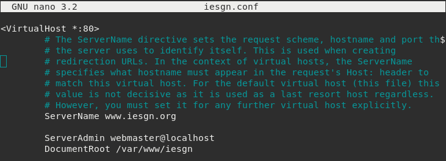

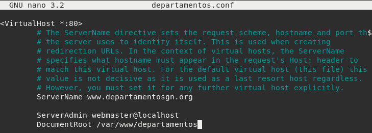

3. No es suficiente crear los ficheros de configuración de cada sitio web, 
es necesario crear un enlace simbólico a estos ficheros dentro del directorio 
/etc/apache2/sites-enabled, para ello:

```
 a2ensite iesgn
 a2ensite departamentos
```

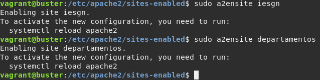

La creación de los enlaces simbólicos se puede hacer con la instrucción 
a2ensite nombre_fichero_configuracion, para deshabilitar el sitio tenemos que 
borrar el enlace simbólico o usar la instrucción a2dissite 
nombre_fichero_configuracion.

4. Crea los directorios y los ficheros index.html necesarios en /var/www y 
reiniciamos el servicio.

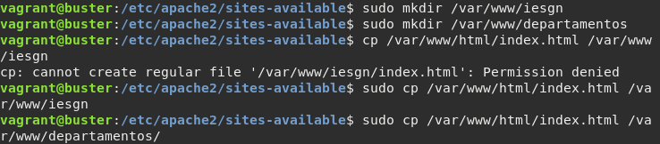

Y hacemos un:

```systemctl reload apache2```

5. Para terminar lo único que tendremos que hacer es cambiar el fichero hosts 
en los clientes y poner dos nuevas líneas donde se haga la conversión entre 
los dos nombre de dominio y la dirección IP del servidor.

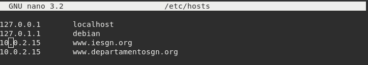

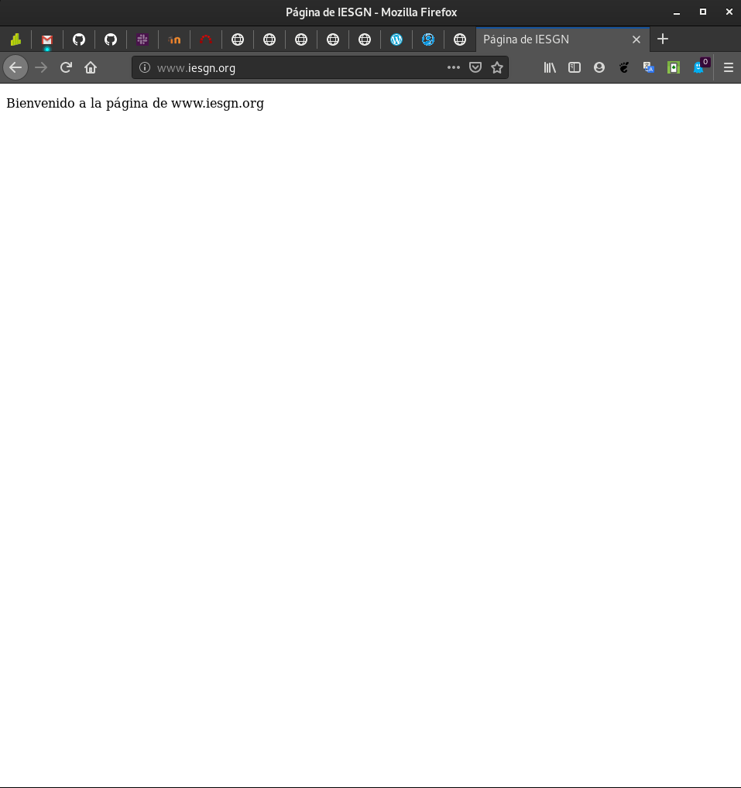

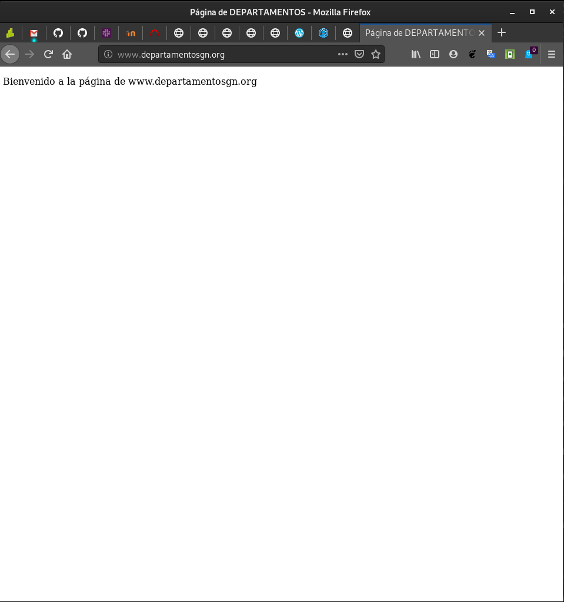

6. Repite el ejercicio cambiando los directorios de trabajo a /srv/www. 
¿Qué modificación debes hacer en el fichero /etc/apache2/apache2.conf?

Para ello, habría que cambiar el _DocumentRoot_ de iesgn.conf y 
departamentos.conf por _/srv/www/_.

Después, en apache2.conf deberíamos dejarlo así:

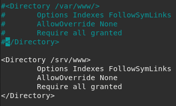 
