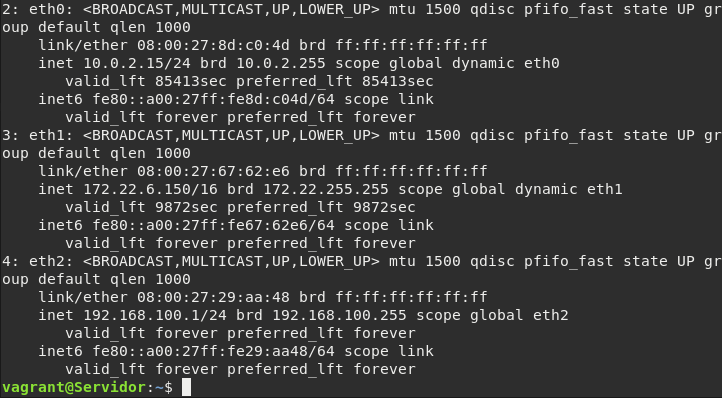
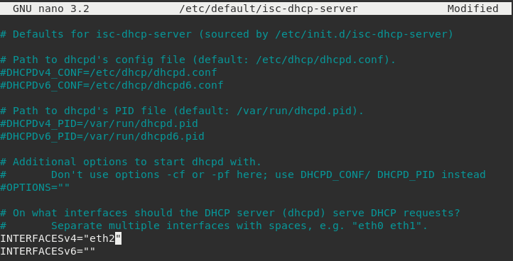
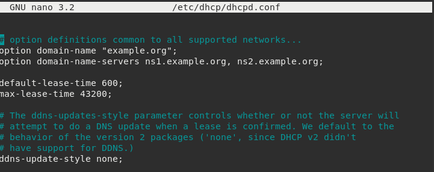
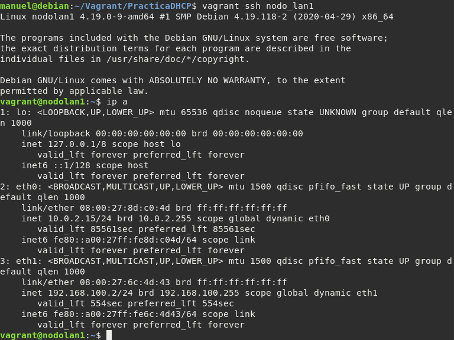
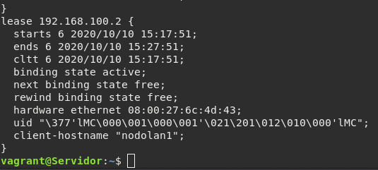
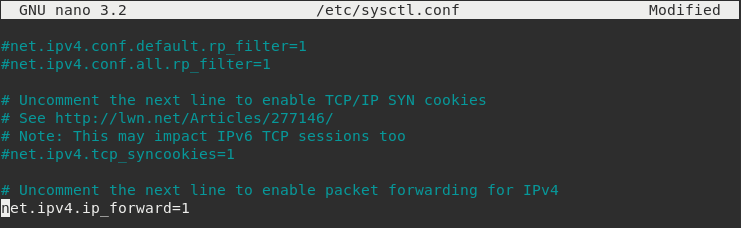
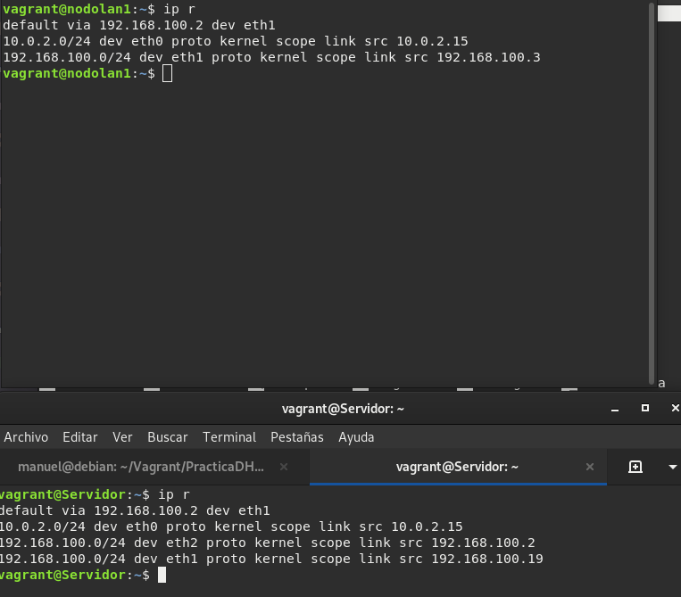
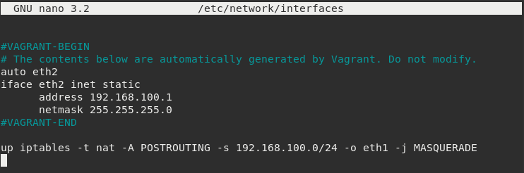
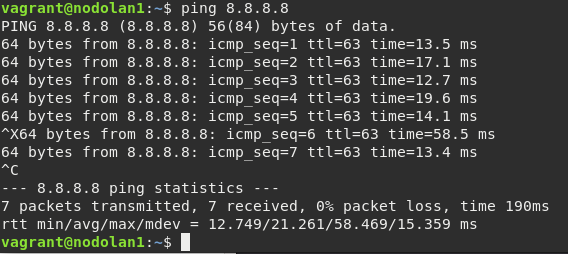
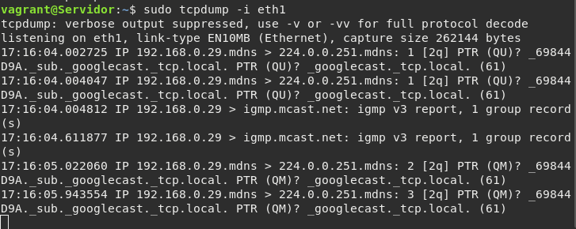

# Práctica: Servidor DHCP

**Tarea 1.** Lee el documento _Teoría: Servidor DHCP_ y explica el 
funcionamiento del servidor DHCP resumido en este gráfico.

* **Paso 1**: se inicializa el cliente DHCP, comenzando en el estado INIT.

* **Paso 2**: como desconoce sus parámetros IP, envía un broadcast DHCPDISCOVER. Este, se 
encapsula en un paquete UDP. El DHCPDISCOVER usa la dirección IP de broadcast 255.255.255.255.

* **Paso 3**: si no hay un servidor DHCP en la red local, el router debe tener un DHCP relay
que soporte la retransmisión de esta petición hacia otras subredes. 

* **Paso 4**: antes de enviar el DHCPDISCOVER, el cliente espera un tiempo aleatorio para 
evitar colisiones.

* **Paso 5**: el cliente ingresa al estado SELECTING, donde recibirá mensaje DHCPOFFER de 
los servidores DHCP. 

* **Paso 6**: si el cliente recibe varias respuestas, elegirá una. Como respuesta a esto, 
enviará un mensaje DHCPREQUEST para elegir un servidor DHCP, que responderá con un DHCPACK.

* **Paso 7**: el cliente controla la dirección IP enviada en el DHCPACK para verificar si
está en uso o no. En caso de estarlo, el DHCPACK se ignora y se envía un DHCPDECLINE, con lo
cual el cliente vuelve al estado INIT y vuelve a comenzar los pasos de nuevo.

* **Paso 8**: si se acepta el DHCPACK, se colocan 3 valores de temporización y el cliente 
DHCP pasa al estado BOUND.

	* **T1**: temporizador de renovación de alquiler.
	* **T2**: temporizador de reenganche.
	* **T3**: duración del alquiler.

* **Paso 9**: el DHCPACK trae consigo el T3. Los demás se configuran en el servidor

* **Paso 10**: después de la expiración del T1, el cliente pasa del estado BOUND al 
RENEWING. En este último, se debe negociar un nuevo alquiler para la dirección IP. 

* **Paso 11**: si por algún motivo, no se renueva el alquiler, enviará un DHCPNACK y el 
cliente pasará otra vez al estado INIT, y lo volverá a intentar. En caso contrario, el 
servidor DHCP enviará un DHCPACK el cual contiene la duración del nuevo alquiler. Entonces 
el cliente pasará al estado BOUND.

* **Paso 12**: si el T2 expira mientras el cliente está esperando en el estado RENEWING una 
respuesta DHCPACK o DHCPNACK, el cliente pasará al estado REBINDING. 

* **Paso 13**: al expirar el T2, el cliente DHCP enviará un DHCPREQUEST a la red, para 
contactar con cualquier servidor DHCP para extender su alquiler, pasando al estado 
REBINDING. Espera a que cualquier servidor DHCP le conteste, y si alguno responde con un 
DHCPACK, el cliente renueva el alquiler y retorna al BOUND.

* **Paso 14**: si no hay servidor DHCP, entonces el alquiler cesa, y retorna al estado INIT.

* **Paso 15**: al acabar el T3, el cliente debe devolver su dirección IP y cesar las 
acciones con dicha dirección IP.

* **Paso 16**: si un usuario se libera armoniosamente, el cliente DHCP enviará un
DHCPRELEASE al servidor DHCP para cancelar el alquiler, y la dirección IP estará disponible.


## Preparación del escenario

Crea un escenario usando Vagrant que defina las siguientes máquinas:

* **Servidor**: Tiene dos tarjetas de red: una pública y una privada que 
se conectan a la red local.
    
* **nodo_lan1**: Un cliente conectado a la red local.

Instala un servidor dhcp en el ordenador “servidor” que de servicio a los 
ordenadores de red local, teniendo en cuenta que el tiempo de concesión 
sea 12 horas y que la red local tiene el direccionamiento _192.168.100.0/24_.

Instalaremos el paquete _isc-dhcp-server_ en la máquina servidor.

**Tarea 2**: Entrega el fichero Vagrantfile que define el escenario.

Aquí el fichero [Vagrantfile](./Vagrantfile)
    
**Tarea 3**: Muestra el fichero de configuración del servidor, la lista de 
concesiones, la modificación en la configuración que has hecho en el cliente 
para que tome la configuración de forma automática y muestra la salida 
del comando _`ip address`_.

Primero, vamos a mostrar la salida del comando _ip a_:



Los dos ficheros que tenemos que modificar son _/etc/default/isc-dhcp-server_ y 
_/etc/dhcp/dhcpd.conf_.

En primer lugar _/etc/default/isc-dhcp-server_:



Después, procederemos a modificar el fichero _/etc/dhcp/dhcpd.conf_:

Modificamos el parámetro _max-lease-time_ a 43200 para que sean 12 horas:



Y ahora procedemos a configurar el servidor DHCP: 


Reiniciamos el servicio y ahora nos dirigimos al _nodolan1_ y hacemos un 
_ip address_ para ver si recibe la configuración automático del servidor DHCP:



Como podemos observar, obtiene la IP "_192.168.100.2_".

Para mayor comprobación del funcionamiento de dicho proceso, podemos visualizar
el contenido del fichero _/var/lib/dhcp/dhcpd.leases_:



**Tarea 4**: Configura el servidor para que funcione como router y NAT, 
de esta forma los clientes tengan internet.Muestra las rutas por defecto del 
servidor y el cliente. Realiza una prueba de funcionamiento para comprobar 
que el cliente tiene acceso a internet (utiliza nombres, para comprobar 
que tiene resolución DNS).

Para configurar el sevidor para que actue como router, debemos activar el bit
de enrutamiento en el fichero _/etc/sysctl.conf_:



Antes de configurar la NAT, debemos borrar las rutas por defecto de ambas 
máquinas, servidor y nodo, y configurar unas nuevas. Para borrar las rutas, 
debemos realizar lo siguiente:

```ip route del default```

Y después añadir ambas rutas nuevas:



Y para configurar NAT en nuestro servidor, añadimos la siguiente línea en el 
fichero _/etc/network/interfaces_:



Y una vez modificado esto, reiniciamos el servicio de red con 

```/etc/init.d/networking restart```

Y ahora comprobamos la conexión en el _nodolan1_:



**Tarea 5**: Realizar una captura, desde el servidor usando tcpdump, 
de los cuatro paquetes que corresponden a una concesión: DISCOVER, OFFER, 
REQUEST, ACK.



**Tarea 6**: Los clientes toman una configuración, y a continuación apagamos 
el servidor dhcp. ¿qué ocurre con el cliente windows? ¿Y con el cliente linux?

Lo que haremos para comprobarlo será modificar el archivo _/etc/dhcp/dhcpd.conf_
el parámetro de _max-lease-time_ y le pondremos un valor bajo, para que cuando
paremos el servicio dhcp y pasado ese tiempo de concesión, nuestro cliente
pierda su ip:

```
vagrant@nodolan1:~$ ip a
1: lo: <LOOPBACK,UP,LOWER_UP> mtu 65536 qdisc noqueue state UNKNOWN group default qlen 1000
    link/loopback 00:00:00:00:00:00 brd 00:00:00:00:00:00
    inet 127.0.0.1/8 scope host lo
       valid_lft forever preferred_lft forever
    inet6 ::1/128 scope host 
       valid_lft forever preferred_lft forever
2: eth0: <BROADCAST,MULTICAST,UP,LOWER_UP> mtu 1500 qdisc pfifo_fast state UP group default qlen 1000
    link/ether 08:00:27:8d:c0:4d brd ff:ff:ff:ff:ff:ff
    inet 10.0.2.15/24 brd 10.0.2.255 scope global dynamic eth0
       valid_lft 84566sec preferred_lft 84566sec
    inet6 fe80::a00:27ff:fe8d:c04d/64 scope link 
       valid_lft forever preferred_lft forever
3: eth1: <BROADCAST,MULTICAST,UP,LOWER_UP> mtu 1500 qdisc pfifo_fast state UP group default qlen 1000
    link/ether 08:00:27:6b:6c:f9 brd ff:ff:ff:ff:ff:ff
    inet6 fe80::a00:27ff:fe6b:6cf9/64 scope link 
       valid_lft forever preferred_lft forever
vagrant@nodolan1:~$ 
```

Ahora reiniciamos otra vez el servicio, y su nueva ip será la siguiente:

```
vagrant@nodolan1:~$ ip a
1: lo: <LOOPBACK,UP,LOWER_UP> mtu 65536 qdisc noqueue state UNKNOWN group default qlen 1000
    link/loopback 00:00:00:00:00:00 brd 00:00:00:00:00:00
    inet 127.0.0.1/8 scope host lo
       valid_lft forever preferred_lft forever
    inet6 ::1/128 scope host 
       valid_lft forever preferred_lft forever
2: eth0: <BROADCAST,MULTICAST,UP,LOWER_UP> mtu 1500 qdisc pfifo_fast state UP group default qlen 1000
    link/ether 08:00:27:8d:c0:4d brd ff:ff:ff:ff:ff:ff
    inet 10.0.2.15/24 brd 10.0.2.255 scope global dynamic eth0
       valid_lft 84166sec preferred_lft 84166sec
    inet6 fe80::a00:27ff:fe8d:c04d/64 scope link 
       valid_lft forever preferred_lft forever
3: eth1: <BROADCAST,MULTICAST,UP,LOWER_UP> mtu 1500 qdisc pfifo_fast state UP group default qlen 1000
    link/ether 08:00:27:6b:6c:f9 brd ff:ff:ff:ff:ff:ff
    inet 192.168.100.5/24 brd 192.168.100.255 scope global dynamic eth1
       valid_lft 18sec preferred_lft 18sec
    inet6 fe80::a00:27ff:fe6b:6cf9/64 scope link 
       valid_lft forever preferred_lft forever
vagrant@nodolan1:~$ 
```

**Tarea 7**: Los clientes toman una configuración, y a continuación cambiamos 
la configuración del servidor dhcp (por ejemplo el rango). ¿qué ocurriría 
con un cliente windows? ¿Y con el cliente linux?

Como hemos hecho anteriormente, modificaremos el fichero _/etc/dhcp/dhcpd.conf_
y donde se encuentra el rango, lo modificaremos:

```
option subnet-mask 255.255.255.0;
option broadcast-address 192.168.100.255;
option routers 192.168.100.2;
option domain-name-servers 192.168.100.1;

subnet 192.168.100.0 netmask 255.255.255.0 {
  range 192.168.100.20 192.168.100.253;
}
```

Y pasado el tiempo de concesión, se renovaría la ip del cliente:

```
vagrant@nodolan1:~$ ip a
1: lo: <LOOPBACK,UP,LOWER_UP> mtu 65536 qdisc noqueue state UNKNOWN group default qlen 1000
    link/loopback 00:00:00:00:00:00 brd 00:00:00:00:00:00
    inet 127.0.0.1/8 scope host lo
       valid_lft forever preferred_lft forever
    inet6 ::1/128 scope host 
       valid_lft forever preferred_lft forever
2: eth0: <BROADCAST,MULTICAST,UP,LOWER_UP> mtu 1500 qdisc pfifo_fast state UP group default qlen 1000
    link/ether 08:00:27:8d:c0:4d brd ff:ff:ff:ff:ff:ff
    inet 10.0.2.15/24 brd 10.0.2.255 scope global dynamic eth0
       valid_lft 83249sec preferred_lft 83249sec
    inet6 fe80::a00:27ff:fe8d:c04d/64 scope link 
       valid_lft forever preferred_lft forever
3: eth1: <BROADCAST,MULTICAST,UP,LOWER_UP> mtu 1500 qdisc pfifo_fast state UP group default qlen 1000
    link/ether 08:00:27:6b:6c:f9 brd ff:ff:ff:ff:ff:ff
    inet 192.168.100.21/24 brd 192.168.100.255 scope global dynamic eth1
       valid_lft 12sec preferred_lft 12sec
    inet 192.168.100.20/24 brd 192.168.100.255 scope global secondary dynamic eth1
       valid_lft 16sec preferred_lft 16sec
    inet6 fe80::a00:27ff:fe6b:6cf9/64 scope link 
       valid_lft forever preferred_lft forever
vagrant@nodolan1:~$ 
```


**Tarea 8**: Crea una reserva para el que el cliente tome siempre la dirección 
192.168.100.100. Indica las modificaciones realizadas en los ficheros de 
configuración y entrega una comprobación de que el cliente ha tomado esa 
dirección.

Tenemos que añadir al fichero _/etc/dhcp/dhcpd.conf_ esto, para realizar una
reserva ip a nuestro cliente:

```
host nodolan1 {
hardware ethernet 08:00:27:6b:6c:f9;
fixed-address 192.168.100.100;
}
```

Y reiniciamos el servicio. Pasado el tiempo de concesión, la nueva ip del 
cliente es la reservada:

```
vagrant@nodolan1:~$ ip a
1: lo: <LOOPBACK,UP,LOWER_UP> mtu 65536 qdisc noqueue state UNKNOWN group default qlen 1000
    link/loopback 00:00:00:00:00:00 brd 00:00:00:00:00:00
    inet 127.0.0.1/8 scope host lo
       valid_lft forever preferred_lft forever
    inet6 ::1/128 scope host 
       valid_lft forever preferred_lft forever
2: eth0: <BROADCAST,MULTICAST,UP,LOWER_UP> mtu 1500 qdisc pfifo_fast state UP group default qlen 1000
    link/ether 08:00:27:8d:c0:4d brd ff:ff:ff:ff:ff:ff
    inet 10.0.2.15/24 brd 10.0.2.255 scope global dynamic eth0
       valid_lft 82692sec preferred_lft 82692sec
    inet6 fe80::a00:27ff:fe8d:c04d/64 scope link 
       valid_lft forever preferred_lft forever
3: eth1: <BROADCAST,MULTICAST,UP,LOWER_UP> mtu 1500 qdisc pfifo_fast state UP group default qlen 1000
    link/ether 08:00:27:6b:6c:f9 brd ff:ff:ff:ff:ff:ff
    inet 192.168.100.100/24 brd 192.168.100.255 scope global dynamic eth1
       valid_lft 20sec preferred_lft 20sec
    inet6 fe80::a00:27ff:fe6b:6cf9/64 scope link 
       valid_lft forever preferred_lft forever
vagrant@nodolan1:~$ 
```

## Uso de varios ámbitos

Modifica el escenario Vagrant para añadir una nueva red local y un nuevo nodo:

* **Servidor**: En el servidor hay que crear una nueva interfaz.
    
* **nodo_lan2**: Un cliente conectado a la segunda red local.

Configura el servidor dhcp en el ordenador “servidor” para que de servicio a 
los ordenadores de la nueva red local, teniendo en cuenta que el tiempo de 
concesión sea 24 horas y que la red local tiene el direccionamiento 
_192.168.200.0/24_.

**Tarea 9**: Entrega el nuevo fichero Vagrantfile que define el escenario.

Aquí estaría el nuevo fichero [Vagrantfile](https://github.com/ManuelLoraRoman/ApuntesASIR/blob/master/Servicios%20de%20Red%20e%20Internet/Vagrantfile2)

**Tarea 10**: Explica las modificaciones que has hecho en los distintos 
ficheros de configuración. Entrega las comprobaciones necesarias de que 
los dos ámbitos están funcionando.
    
**Tarea 11**: Realiza las modificaciones necesarias para que los cliente de 
la segunda red local tengan acceso a internet. Entrega las comprobaciones 
necesarias.


