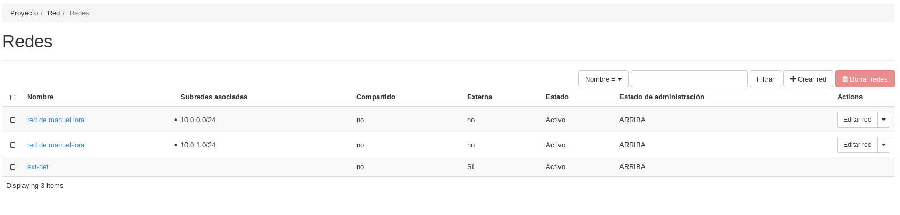
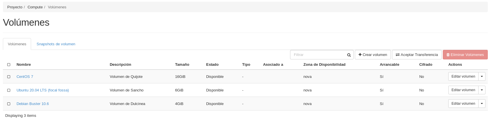

# Instalación y configuración inicial de los servidores


**Tarea 1:** Creación de la red interna:

	1.1. Nombre red interna de <nombre de usuario>
	1.2. 10.0.1.0/24
 
En primer lugar nos iremos a Openstack, y en el apartado de _RED --> Redes_
seleccionaremos la opción de _Crear red_.

Crearemos una red llamada _red de manuel-lora_ con las siguientes opciones:

* Nombre: red de manuel-lora

* Estado de administración: ARRIBA

* Crear subred: TRUE

* Direcciones de red: 10.0.1.0/24

* Versión de IP: IPv4

Y ya tendriamos nuestra red operativa:


   
**Tarea 2:** Creación de las instancias

Antes de la creación de ninguna máquina, vamos a crear 3 volúmenes de imagen
de Debian Buster 10.6, Ubuntu 20.04 LTS y CentOS 7, con una capacidad de 
4, 6 y 16 GiB respectivamente.

Estas operaciones las podemos realizar en la pestaña de Openstack _COMPUTE --> Volúmenes --> Crear Volumen_


        
	2.1. Dulcinea:
           2.1.1. Debian Buster sobre volumen con sabor m1.mini
           2.1.2. Accesible directamente a través de la red externa y con una 
		  IP flotante
           2.1.3. Conectada a la red interna, de la que será la puerta de enlace
        
	
Crearemos la máquina con las respectivas configuracion anteriormente comentadas,
y nos quedaría una máquina como esta:


	
Y una comprobación de conectividad:

```
manuel@debian:~/.ssh$ ssh -i clave_openstack.pem debian@172.22.200.146
The authenticity of host '172.22.200.146 (172.22.200.146)' can't be established.
ECDSA key fingerprint is SHA256:KyvO3NYfqO8qxyViGkVvjnNtS01PAd1WUN8xzo+Umxk.
Are you sure you want to continue connecting (yes/no)? yes
Warning: Permanently added '172.22.200.146' (ECDSA) to the list of known hosts.
Linux dulcinea 4.19.0-11-cloud-amd64 #1 SMP Debian 4.19.146-1 (2020-09-17) x86_64

The programs included with the Debian GNU/Linux system are free software;
the exact distribution terms for each program are described in the
individual files in /usr/share/doc/*/copyright.

Debian GNU/Linux comes with ABSOLUTELY NO WARRANTY, to the extent
permitted by applicable law.
debian@dulcinea:~$ ip a
1: lo: <LOOPBACK,UP,LOWER_UP> mtu 65536 qdisc noqueue state UNKNOWN group default qlen 1000
    link/loopback 00:00:00:00:00:00 brd 00:00:00:00:00:00
    inet 127.0.0.1/8 scope host lo
       valid_lft forever preferred_lft forever
    inet6 ::1/128 scope host 
       valid_lft forever preferred_lft forever
2: eth0: <BROADCAST,MULTICAST,UP,LOWER_UP> mtu 8950 qdisc pfifo_fast state UP group default qlen 1000
    link/ether fa:16:3e:f3:34:21 brd ff:ff:ff:ff:ff:ff
    inet 10.0.1.4/24 brd 10.0.1.255 scope global dynamic eth0
       valid_lft 86256sec preferred_lft 86256sec
    inet6 fe80::f816:3eff:fef3:3421/64 scope link 
       valid_lft forever preferred_lft forever
3: eth1: <BROADCAST,MULTICAST,UP,LOWER_UP> mtu 8950 qdisc pfifo_fast state UP group default qlen 1000
    link/ether fa:16:3e:87:e0:77 brd ff:ff:ff:ff:ff:ff
    inet 10.0.0.9/24 brd 10.0.0.255 scope global dynamic eth1
       valid_lft 86256sec preferred_lft 86256sec
    inet6 fe80::f816:3eff:fe87:e077/64 scope link 
       valid_lft forever preferred_lft forever
debian@dulcinea:~$ 
```

	2.2. Sancho:
            2.2.1. Ubuntu 20.04 sobre volumen con sabor m1.mini
            2.2.2. Conectada a la red interna
            2.2.3. Accesible indirectamente a través de dulcinea

Crearemos la siguiente máquina siguiendo las mismas directrices que los puntos
marcados.

Al final, la máquina Sancho debería quedar de la siguiente manera:


Pasaremos el par de claves a la máquina de Dulcinea mediante scp para poder 
realizar la conectividad desde ahí. 

Una vez hecho esto, vamos a comprobar la conectividad desde Dulcinea y desde
nuestra máquina:

```
debian@dulcinea:~$ ssh -i .ssh/clave_openstack.pem ubuntu@10.0.1.11
Welcome to Ubuntu 20.04.1 LTS (GNU/Linux 5.4.0-48-generic x86_64)

 * Documentation:  https://help.ubuntu.com
 * Management:     https://landscape.canonical.com
 * Support:        https://ubuntu.com/advantage

  System information as of Sat Nov  7 16:46:54 UTC 2020

  System load:  0.17              Processes:             96
  Usage of /:   21.8% of 5.64GB   Users logged in:       0
  Memory usage: 38%               IPv4 address for ens3: 10.0.1.11
  Swap usage:   0%


1 update can be installed immediately.
0 of these updates are security updates.
To see these additional updates run: apt list --upgradable


The list of available updates is more than a week old.
To check for new updates run: sudo apt update

Last login: Sat Nov  7 16:46:43 2020 from 10.0.1.4
To run a command as administrator (user "root"), use "sudo <command>".
See "man sudo_root" for details.

ubuntu@sancho:~$ ip a
1: lo: <LOOPBACK,UP,LOWER_UP> mtu 65536 qdisc noqueue state UNKNOWN group default qlen 1000
    link/loopback 00:00:00:00:00:00 brd 00:00:00:00:00:00
    inet 127.0.0.1/8 scope host lo
       valid_lft forever preferred_lft forever
    inet6 ::1/128 scope host 
       valid_lft forever preferred_lft forever
2: ens3: <BROADCAST,MULTICAST,UP,LOWER_UP> mtu 8950 qdisc fq_codel state UP group default qlen 1000
    link/ether fa:16:3e:da:59:73 brd ff:ff:ff:ff:ff:ff
    inet 10.0.1.11/24 brd 10.0.1.255 scope global dynamic ens3
       valid_lft 85440sec preferred_lft 85440sec
    inet6 fe80::f816:3eff:feda:5973/64 scope link 
       valid_lft forever preferred_lft forever
ubuntu@sancho:~$ 
```
        2.3. Quijote:
            2.3.1. CentOS 7 sobre volumen con sabor m1.mini
            2.3.2. Conectada a la red interna
            2.3.3. Accesible indirectamente a través de dulcinea

Haremos lo mismo que con las otras dos máquinas y tendría que quedarnos así:


Y la comprobación de la conectividad:

```
debian@dulcinea:~$ ssh -i .ssh/clave_openstack.pem centos@10.0.1.12
The authenticity of host '10.0.1.12 (10.0.1.12)' can't be established.
ECDSA key fingerprint is SHA256:zfaz5ovbe6LO0PqUB9Xa6mL/vurmZT6K61ym+WWcFXY.
Are you sure you want to continue connecting (yes/no)? yes
Warning: Permanently added '10.0.1.12' (ECDSA) to the list of known hosts.
[centos@quijote ~]$ ip a
1: lo: <LOOPBACK,UP,LOWER_UP> mtu 65536 qdisc noqueue state UNKNOWN group default qlen 1000
    link/loopback 00:00:00:00:00:00 brd 00:00:00:00:00:00
    inet 127.0.0.1/8 scope host lo
       valid_lft forever preferred_lft forever
    inet6 ::1/128 scope host 
       valid_lft forever preferred_lft forever
2: eth0: <BROADCAST,MULTICAST,UP,LOWER_UP> mtu 8950 qdisc pfifo_fast state UP group default qlen 1000
    link/ether fa:16:3e:db:75:33 brd ff:ff:ff:ff:ff:ff
    inet 10.0.1.12/24 brd 10.0.1.255 scope global dynamic eth0
       valid_lft 86367sec preferred_lft 86367sec
    inet6 fe80::f816:3eff:fedb:7533/64 scope link 
       valid_lft forever preferred_lft forever
[centos@quijote ~]$ 
```
    
**Tarea 3:** Configuración de NAT en Dulcinea (Es necesario deshabilitar la 
seguridad en todos los puertos de dulcinea) [[https://youtu.be/jqfILWzHrS0]]
    
Iniciaremos openstack desde la terminal. Una vez lo tengamos configurado,
vamos a eliminar el grupo de seguridad configurado desde openstack de la
máquina Dulcinea de la siguiente manera:

```
(openstackclient) manuel@debian:~$ openstack server remove security group Dulcinea default
```

De esta manera comprobaremos que no tenemos conectividad con Dulcinea:

```
(openstackclient) manuel@debian:~$ ping 172.22.200.146
PING 172.22.200.146 (172.22.200.146) 56(84) bytes of data.
^C
--- 172.22.200.146 ping statistics ---
4 packets transmitted, 0 received, 100% packet loss, time 54ms

(openstackclient) manuel@debian:~$ ssh -i .ssh/clave_openstack.pem debian@172.22.200.146
^C
```

A continuación, vamos a listar los puertos y elegiremos la dirección MAC 
correspondiente a la máquina Dulcinea, para después realizar:

```
(openstackclient) manuel@debian:~$ openstack port set --disable-port-security 17ad903c-923a-4dec-88e5-285022b42da1
```

Como hemos deshabilitado la seguridad de los puertos, volvemos a tener
conectividad:

```
(openstackclient) manuel@debian:~$ ping 172.22.200.146
PING 172.22.200.146 (172.22.200.146) 56(84) bytes of data.
64 bytes from 172.22.200.146: icmp_seq=1 ttl=61 time=230 ms
64 bytes from 172.22.200.146: icmp_seq=2 ttl=61 time=254 ms
64 bytes from 172.22.200.146: icmp_seq=3 ttl=61 time=111 ms
64 bytes from 172.22.200.146: icmp_seq=4 ttl=61 time=199 ms
^C
--- 172.22.200.146 ping statistics ---
4 packets transmitted, 4 received, 0% packet loss, time 4ms
rtt min/avg/max/mdev = 110.790/198.613/254.447/54.348 ms
(openstackclient) manuel@debian:~$ ssh -i .ssh/clave_openstack.pem debian@172.22.200.146
Linux dulcinea 4.19.0-11-cloud-amd64 #1 SMP Debian 4.19.146-1 (2020-09-17) x86_64

The programs included with the Debian GNU/Linux system are free software;
the exact distribution terms for each program are described in the
individual files in /usr/share/doc/*/copyright.

Debian GNU/Linux comes with ABSOLUTELY NO WARRANTY, to the extent
permitted by applicable law.
Last login: Tue Nov 10 17:19:39 2020 from 172.23.0.78
debian@dulcinea:~$
```

Realizada la deshabilitación de puertos, vamos a pasar a la configuración de NAT.
En Dulcinea, para que está pueda funcionar como dispositivo de NAT, hay que 
activar el bit de forward:

```
root@dulcinea:/home/debian# echo 1 > /proc/sys/net/ipv4/ip_forward
```

Esta configuración es volátil, por lo tanto, la definiremos en el fichero
_/etc/sysctl.conf_:

```
# Uncomment the next line to enable packet forwarding for IPv4
net.ipv4.ip_forward=1
```

Ahora definimos en la cadena POSTROUTING lo siguiente:

```
iptables -t nat -A POSTROUTING -s 10.0.1.0/24 -o eth1 -j MASQUERADE
```

Cada vez que iniciamos el cliente Dulcinea, la información de las iptables se 
reiniciará, por lo tanto, la guardaremos con ```iptables-save``` y cuando 
volvamos a iniciar la máquina, restauraremos la configuración con 
```iptables-restore```.

Antes de reiniciar el servicio, modificaremos el fichero _/etc/network/interfaces_
para poner la ip estática de Dulcinea:

```
# This file describes the network interfaces available on your system
# and how to activate them. For more information, see interfaces(5).

# The loopback network interface
auto lo
iface lo inet loopback

# The normal eth0
allow-hotplug eth0
iface eth0 inet dhcp
 address 10.0.1.4
 netmask 255.255.255.0
 broadcast 10.0.1.255

# Additional interfaces, just in case we're using
# multiple networks
allow-hotplug eth1
iface eth1 inet dhcp
 address 10.0.0.9
 netmask 255.255.255.0
 broadcast 10.0.0.255
 gateway 10.0.0.1

allow-hotplug eth2
iface eth2 inet dhcp

# Set this one last, so that cloud-init or user can
# override defaults.
source /etc/network/interfaces.d/*
```

Reiniciamos el servicio de networking y comprobamos que efectivamente tenemos
conectividad:

```
debian@dulcinea:~$ ping 10.0.0.1
PING 10.0.0.1 (10.0.0.1) 56(84) bytes of data.
64 bytes from 10.0.0.1: icmp_seq=1 ttl=64 time=0.537 ms
64 bytes from 10.0.0.1: icmp_seq=2 ttl=64 time=0.805 ms
64 bytes from 10.0.0.1: icmp_seq=3 ttl=64 time=0.807 ms
^C
--- 10.0.0.1 ping statistics ---
3 packets transmitted, 3 received, 0% packet loss, time 28ms
rtt min/avg/max/mdev = 0.537/0.716/0.807/0.128 ms
debian@dulcinea:~$ ping 10.0.0.2
PING 10.0.0.2 (10.0.0.2) 56(84) bytes of data.
64 bytes from 10.0.0.2: icmp_seq=1 ttl=64 time=2.21 ms
64 bytes from 10.0.0.2: icmp_seq=2 ttl=64 time=0.857 ms
64 bytes from 10.0.0.2: icmp_seq=3 ttl=64 time=0.765 ms
^C
--- 10.0.0.2 ping statistics ---
3 packets transmitted, 3 received, 0% packet loss, time 5ms
rtt min/avg/max/mdev = 0.765/1.276/2.206/0.658 ms
debian@dulcinea:~$ ping 10.0.1.11
PING 10.0.1.11 (10.0.1.11) 56(84) bytes of data.
64 bytes from 10.0.1.11: icmp_seq=1 ttl=64 time=2.33 ms
64 bytes from 10.0.1.11: icmp_seq=2 ttl=64 time=1.16 ms
^C
--- 10.0.1.11 ping statistics ---
2 packets transmitted, 2 received, 0% packet loss, time 3ms
rtt min/avg/max/mdev = 1.159/1.742/2.325/0.583 ms
debian@dulcinea:~$ ping 10.0.1.12
PING 10.0.1.12 (10.0.1.12) 56(84) bytes of data.
64 bytes from 10.0.1.12: icmp_seq=1 ttl=64 time=0.985 ms
64 bytes from 10.0.1.12: icmp_seq=2 ttl=64 time=0.689 ms
^C
--- 10.0.1.12 ping statistics ---
2 packets transmitted, 2 received, 0% packet loss, time 2ms
rtt min/avg/max/mdev = 0.689/0.837/0.985/0.148 ms
```

Ahora, nos introduciremos en la máquina Ubuntu (Sancho) y modificaremos el 
fichero _/etc/netplan/50-cloud-init.yaml_ con la siguiente información:

```
# This file is generated from information provided by the datasource.  Changes
# to it will not persist across an instance reboot.  To disable cloud-init's
# network configuration capabilities, write a file
# /etc/cloud/cloud.cfg.d/99-disable-network-config.cfg with the following:
# network: {config: disable}

network:
  version: 2
  renderer: networkd
  ethernets:
    ens3:
      dhcp4: no
      addresses:
        - 10.0.1.11/24
      gateway4: 10.0.1.4
      nameservers:
          addresses: [192.168.202.2, 8.8.8.8, 8.8.4.4]
```

Reiniciamos el servicio y comprobamos que tenemos conectividad:

```
ubuntu@sancho:~$ ping www.google.es
PING www.google.es (216.58.201.163) 56(84) bytes of data.
64 bytes from arn02s06-in-f163.1e100.net (216.58.201.163): icmp_seq=1 ttl=112 time=251 ms
64 bytes from arn02s06-in-f163.1e100.net (216.58.201.163): icmp_seq=2 ttl=112 time=275 ms
64 bytes from arn02s06-in-f163.1e100.net (216.58.201.163): icmp_seq=3 ttl=112 time=269 ms
^C
--- www.google.es ping statistics ---
3 packets transmitted, 3 received, 0% packet loss, time 2003ms
rtt min/avg/max/mdev = 251.187/265.202/275.299/10.226 ms
ubuntu@sancho:~$ ping 10.0.1.4
PING 10.0.1.4 (10.0.1.4) 56(84) bytes of data.
64 bytes from 10.0.1.4: icmp_seq=1 ttl=64 time=0.949 ms
64 bytes from 10.0.1.4: icmp_seq=2 ttl=64 time=1.26 ms
64 bytes from 10.0.1.4: icmp_seq=3 ttl=64 time=0.872 ms
^C
--- 10.0.1.4 ping statistics ---
3 packets transmitted, 3 received, 0% packet loss, time 2003ms
rtt min/avg/max/mdev = 0.872/1.026/1.258/0.166 ms
ubuntu@sancho:~$ ping 10.0.1.12
PING 10.0.1.12 (10.0.1.12) 56(84) bytes of data.
64 bytes from 10.0.1.12: icmp_seq=1 ttl=64 time=3.98 ms
64 bytes from 10.0.1.12: icmp_seq=2 ttl=64 time=1.12 ms
64 bytes from 10.0.1.12: icmp_seq=3 ttl=64 time=1.04 ms
^C
--- 10.0.1.12 ping statistics ---
3 packets transmitted, 3 received, 0% packet loss, time 2003ms
rtt min/avg/max/mdev = 1.041/2.047/3.978/1.365 ms
ubuntu@sancho:~$ 
```

Ahora pasándonos a CentOs (Quijote), para poner la IP estática, modificaremos el
fichero _/etc/sysconfig/network-scripts/ifcfg-eth0:

```
# Created by cloud-init on instance boot automatically, do not edit.
#
DEVICE="eth0"
BOOTPROTO="static"
IPADDR="10.0.1.12"
NETMASK="255.255.255.0"
NETWORK="10.0.1.0"
GATEWAY="10.0.1.4"
ONBOOT="yes"
TYPE="Ethernet"
~                                                                               
~                                                                               
~                                                                               
~                                                                               
~                                                                               
~                                                                               
~                                                                               
~                                                                               
~                                                                               
~                                                                               
~                                                                               
~                                                                               
~                                                                               
"/etc/sysconfig/network-scripts/ifcfg-eth0" 10L, 214C
```

Y también, tenemos que modificar el fichero _/etc/resolv.config_ si queremos
que nos resuelve el DNS.

Y comprobamos su funcionamiento:

```
[centos@quijote ~]$ ping www.google.es
PING www.google.es (216.58.201.163) 56(84) bytes of data.
64 bytes from arn02s06-in-f163.1e100.net (216.58.201.163): icmp_seq=1 ttl=112 time=826 ms
64 bytes from arn02s06-in-f163.1e100.net (216.58.201.163): icmp_seq=3 ttl=112 time=929 ms
64 bytes from arn02s06-in-f163.1e100.net (216.58.201.163): icmp_seq=4 ttl=112 time=433 ms
64 bytes from arn02s06-in-f163.1e100.net (216.58.201.163): icmp_seq=5 ttl=112 time=43.3 ms
^C
--- www.google.es ping statistics ---
5 packets transmitted, 4 received, 20% packet loss, time 4000ms
rtt min/avg/max/mdev = 43.346/558.257/929.146/350.137 ms
[centos@quijote ~]$ ping 10.0.1.4
PING 10.0.1.4 (10.0.1.4) 56(84) bytes of data.
64 bytes from 10.0.1.4: icmp_seq=1 ttl=64 time=0.464 ms
64 bytes from 10.0.1.4: icmp_seq=2 ttl=64 time=0.790 ms
64 bytes from 10.0.1.4: icmp_seq=3 ttl=64 time=0.705 ms
^C
--- 10.0.1.4 ping statistics ---
3 packets transmitted, 3 received, 0% packet loss, time 2000ms
rtt min/avg/max/mdev = 0.464/0.653/0.790/0.138 ms
[centos@quijote ~]$ ping 10.0.1.11
PING 10.0.1.11 (10.0.1.11) 56(84) bytes of data.
64 bytes from 10.0.1.11: icmp_seq=1 ttl=64 time=2.42 ms
64 bytes from 10.0.1.11: icmp_seq=2 ttl=64 time=1.28 ms
^C
--- 10.0.1.11 ping statistics ---
2 packets transmitted, 2 received, 0% packet loss, time 1001ms
rtt min/avg/max/mdev = 1.282/1.851/2.420/0.569 ms
[centos@quijote ~]$ 
```

**Tarea 4:** Definición de contraseña en todas las instancias (para poder 
modificarla desde consola en caso necesario)

Para configurar las contraseñas de las máquinas es necesario ejecutar el 
comando ```sudo passwd```. Aquí las comprobaciones:

* Dulcinea

```
debian@dulcinea:~$ sudo passwd
New password: 
Retype new password: 
passwd: password updated successfully
debian@dulcinea:~$ 
```
    
* Sancho

Editaremos el fichero /etc/ssh/sshd_config y cambiamos las lineas:

```
#PermitRootLogin yes
#PasswordAuthentication yes
```

```
ubuntu@sancho:~$ sudo passwd
New password: 
Retype new password: 
passwd: password updated successfully
ubuntu@sancho:~$ 
```

* Quijote

```
[centos@quijote ~]$ sudo passwd
Changing password for user root.
New password: 
BAD PASSWORD: The password is shorter than 8 characters
Retype new password: 
passwd: all authentication tokens updated successfully.
[centos@quijote ~]$
```

**Tarea 5:** Modificación de las instancias sancho y quijote para que usen 
direccionamiento estático y dulcinea como puerta de enlace
    
Realizado en el ejercicio de NAT.

**Tarea 6:** Modificación de la subred de la red interna, deshabilitando el 
servidor DHCP

Nos meteremos en Openstack y en la sección de _RED --> Redes_ y nos metemos
en la Subred de la dirección 10.0.1.0, editamos la subred, y en detalles de la
subred, deseleccionamos la habilitación de DHCP.
    
**Tarea 7:** Utilización de ssh-agent para acceder a las instancias

Antes de nada, ejecutamos el comando ```eval `ssh-agent` ``` para que empiece
funcionando la herramienta del agente de ssh.

Después, tenemos que verificar el valor de la variable de entorno
SSH_AUTH_SOCK. Si está configurada, el agente se estaría ejecutando.

```
debian@dulcinea:~/.ssh$ echo $SSH_AUTH_SOCK
/tmp/ssh-8YFDfSjY6loN/agent.1800
```

De forma predeterminada, el agente utiliza las claves almacenadas en el 
directorio _.ssh_. Usaremos ```ssh-add``` para agregar identidades al
agente.

```
debian@dulcinea:~/.ssh$ ssh-add clave_openstack.pem 
Identity added: clave_openstack.pem (clave_openstack.pem)
```

Podemos listar las claves privadas actualmente accesibles para el agente:

```
debian@dulcinea:~/.ssh$ ssh-add -l
2048 SHA256:v4a+YdJCSD5ggAQqJasflkDIKQiK1usKYPnLojG8m/c clave_openstack.pem (RSA)
```

EL reenvio de agentes es un mecanismo mediante el cual un cliente permite 
al servidor ssh que use el agente ssh local ahi, como si fuese local. Para
utilizar este reenvío de agentes, tenemos que modificar el fichero de 
configuración _/etc/ssh/ssh_config_ y /etc/ssh/sshd_config:

```
#AllowAgentForwarding yes
#ForwardAgent yes
```

El parámetro _AllowAgentForwarding_ se establecerá en el servidor y el otro
en el cliente. 

Comprobación:

```
debian@dulcinea:~$ ssh ubuntu@sancho
Welcome to Ubuntu 20.04.1 LTS (GNU/Linux 5.4.0-48-generic x86_64)

 * Documentation:  https://help.ubuntu.com
 * Management:     https://landscape.canonical.com
 * Support:        https://ubuntu.com/advantage

  System information as of Sat Nov 14 19:37:26 UTC 2020

  System load:  0.0               Processes:             100
  Usage of /:   27.4% of 5.64GB   Users logged in:       0
  Memory usage: 38%               IPv4 address for ens3: 10.0.1.11
  Swap usage:   0%


62 updates can be installed immediately.
26 of these updates are security updates.
To see these additional updates run: apt list --upgradable


Last login: Sat Nov 14 19:36:30 2020 from 10.0.1.4
ubuntu@sancho:~$ 
```

```
debian@dulcinea:~$ ssh centos@quijote
Last login: Sat Nov 14 19:34:12 2020 from gateway
[centos@quijote ~]$ 
```

**Tarea 8:** Creación del usuario profesor en todas las instancias. Usuario 
que puede utilizar sudo sin contraseña

Para crear un usuario, nos meteremos como root, y ejecutamos el comando:

```
debian@dulcinea:~$ sudo adduser profesor
Adding user `profesor' ...
Adding new group `profesor' (1001) ...
Adding new user `profesor' (1001) with group `profesor' ...
Creating home directory `/home/profesor' ...
Copying files from `/etc/skel' ...
New password: 
Retype new password: 
passwd: password updated successfully
Changing the user information for profesor
Enter the new value, or press ENTER for the default
	Full Name []: Profesor
	Room Number []: 
	Work Phone []: 
	Home Phone []: 
	Other []: 
Is the information correct? [Y/n] Y
```

Nos pedirá que le agreguemos una contraseña (en nuestro caso "profesor") y una
vez terminado, añadiremos dicho usuario al fichero _/etc/sudoers_ con la
siguiente linea:

```
# User privilege specification
root    ALL=(ALL:ALL) ALL
profesor ALL=(ALL:ALL) NOPASSWD:ALL
# Allow members of group sudo to execute any command
%sudo   ALL=(ALL:ALL) ALL
```

En Ubuntu los pasos a seguir son los mismos.
En CentOs cambia la cosa un poco. En primer lugar, ejecutaremos el siguiente
comando:

```
[root@quijote centos]# adduser profesor
[root@quijote centos]# passwd profesor
Changing password for user profesor.
New password: 
BAD PASSWORD: The password contains the user name in some form
Retype new password: 
passwd: all authentication tokens updated successfully.
[root@quijote centos]# [root@quijote centos]# usermod -aG wheel profesor
```

Así creamos el usuario, con contraseña y lo añadimos al grupo que puede utilizar
el comando sudo.

Para que pueda acceder sin contraseña ejecutaremos el comando ```sudo visudo```
y incorporaremos la siguiente linea:

```profesor ALL=(ALL) NOPASSWD:ALL```

Y ya podriamos acceder sin contraseña a root en todas las máquinas desde el
usuario profesor.

**Tarea 9:** Copia de las claves públicas de todos los profesores en las 
instancias para que puedan acceder con el usuario profesor

Enviaremos mediante scp las claves de los profesores descargadas desde la wiki 
de Redmine a las máquinas.

Una vez en la máquina, la añadiremos con el siguiente comando al fichero
_authorized_keys_:

```
debian@dulcinea:~$ echo `cat .ssh/clave-openstack.pub` >> .ssh/authorized_keys 
debian@dulcinea:~$ echo `cat .ssh/rafa.pub` >> .ssh/authorized_keys 
debian@dulcinea:~$ echo `cat .ssh/id_rsa.pub` >> .ssh/authorized_keys
```

Y ya podrían acceder a la máquina con dichas claves.
El procedimiento es el mismo para todas las máquinas.

**Tarea 10:**Realiza una actualización completa de todos los servidores

```
debian@dulcinea:~$ sudo apt-get update
Get:1 http://security.debian.org/debian-security buster/updates InRelease [65.4 kB]
Hit:2 http://deb.debian.org/debian buster InRelease  
Get:3 http://deb.debian.org/debian buster-updates InRelease [51.9 kB]
Get:4 http://security.debian.org/debian-security buster/updates/main Sources [154 kB]
Get:5 http://deb.debian.org/debian buster-updates/main Sources.diff/Index [4,180 B]
Get:6 http://deb.debian.org/debian buster-updates/main amd64 Packages.diff/Index [4,180 B]
Get:7 http://security.debian.org/debian-security buster/updates/main amd64 Packages [248 kB]
Get:8 http://deb.debian.org/debian buster-updates/main Sources 2020-10-24-2001.35.pdiff [414 B]
Get:8 http://deb.debian.org/debian buster-updates/main Sources 2020-10-24-2001.35.pdiff [414 B]
Get:9 http://security.debian.org/debian-security buster/updates/main Translation-en [135 kB]
Get:10 http://deb.debian.org/debian buster-updates/main amd64 Packages 2020-10-24-2001.35.pdiff [286 B]
Get:10 http://deb.debian.org/debian buster-updates/main amd64 Packages 2020-10-24-2001.35.pdiff [286 B]
Fetched 664 kB in 2s (270 kB/s)
Reading package lists... Done
debian@dulcinea:~$ 
```

```
ubuntu@sancho:~$ sudo apt-get update
Hit:1 http://archive.ubuntu.com/ubuntu focal InRelease                   
Get:2 http://security.ubuntu.com/ubuntu focal-security InRelease [107 kB]
Get:3 http://archive.ubuntu.com/ubuntu focal-updates InRelease [111 kB]
Get:4 http://archive.ubuntu.com/ubuntu focal-backports InRelease [98.3 kB]
Get:5 http://security.ubuntu.com/ubuntu focal-security/main amd64 Packages [368 kB]
Get:6 http://archive.ubuntu.com/ubuntu focal/universe amd64 Packages [8628 kB] 
Get:7 http://security.ubuntu.com/ubuntu focal-security/main Translation-en [84.1 kB]
Get:8 http://security.ubuntu.com/ubuntu focal-security/main amd64 c-n-f Metadata [5396 B]
Get:9 http://security.ubuntu.com/ubuntu focal-security/restricted amd64 Packages [69.9 kB]
Get:10 http://security.ubuntu.com/ubuntu focal-security/restricted Translation-en [11.4 kB]
Get:11 http://security.ubuntu.com/ubuntu focal-security/universe amd64 Packages [517 kB]
Get:12 http://archive.ubuntu.com/ubuntu focal/universe Translation-en [5124 kB]
Get:13 http://security.ubuntu.com/ubuntu focal-security/universe Translation-en [66.9 kB]
Get:14 http://archive.ubuntu.com/ubuntu focal/universe amd64 c-n-f Metadata [265 kB]
Get:15 http://security.ubuntu.com/ubuntu focal-security/universe amd64 c-n-f Metadata [9220 B]
Get:16 http://archive.ubuntu.com/ubuntu focal/multiverse amd64 Packages [144 kB]
Get:17 http://archive.ubuntu.com/ubuntu focal/multiverse Translation-en [104 kB]
Get:18 http://security.ubuntu.com/ubuntu focal-security/multiverse amd64 Packages [1256 B]
Get:19 http://archive.ubuntu.com/ubuntu focal/multiverse amd64 c-n-f Metadata [9136 B]
Get:20 http://security.ubuntu.com/ubuntu focal-security/multiverse Translation-en [540 B]
Get:21 http://security.ubuntu.com/ubuntu focal-security/multiverse amd64 c-n-f Metadata [116 B]
Get:22 http://archive.ubuntu.com/ubuntu focal-updates/main amd64 Packages [655 kB]
Get:23 http://archive.ubuntu.com/ubuntu focal-updates/main Translation-en [164 kB]
Get:24 http://archive.ubuntu.com/ubuntu focal-updates/main amd64 c-n-f Metadata [11.0 kB]
Get:25 http://archive.ubuntu.com/ubuntu focal-updates/restricted amd64 Packages [86.3 kB]
Get:26 http://archive.ubuntu.com/ubuntu focal-updates/restricted Translation-en [13.5 kB]
Get:27 http://archive.ubuntu.com/ubuntu focal-updates/universe amd64 Packages [689 kB]
Get:28 http://archive.ubuntu.com/ubuntu focal-updates/universe Translation-en [133 kB]
Get:29 http://archive.ubuntu.com/ubuntu focal-updates/universe amd64 c-n-f Metadata [13.0 kB]
Get:30 http://archive.ubuntu.com/ubuntu focal-updates/multiverse amd64 Packages [15.6 kB]
Get:31 http://archive.ubuntu.com/ubuntu focal-updates/multiverse Translation-en [4352 B]
Get:32 http://archive.ubuntu.com/ubuntu focal-updates/multiverse amd64 c-n-f Metadata [508 B]
Get:33 http://archive.ubuntu.com/ubuntu focal-backports/main amd64 c-n-f Metadata [112 B]
Get:34 http://archive.ubuntu.com/ubuntu focal-backports/restricted amd64 c-n-f Metadata [116 B]
Get:35 http://archive.ubuntu.com/ubuntu focal-backports/universe amd64 Packages [4012 B]
Get:36 http://archive.ubuntu.com/ubuntu focal-backports/universe Translation-en [1448 B]
Get:37 http://archive.ubuntu.com/ubuntu focal-backports/universe amd64 c-n-f Metadata [224 B]
Get:38 http://archive.ubuntu.com/ubuntu focal-backports/multiverse amd64 c-n-f Metadata [116 B]
Fetched 17.5 MB in 10s (1709 kB/s)                                             
Reading package lists... Done
ubuntu@sancho:~$ 
```

```
[centos@quijote ~]$ sudo yum update
Loaded plugins: fastestmirror
Loading mirror speeds from cached hostfile
 * base: ftp.cica.es
 * extras: ftp.cica.es
 * updates: ftp.cica.es
No packages marked for update
[centos@quijote ~]$ 
```

**Tarea 11:**Configura el servidor con el nombre de dominio 
<nombre-usuario>.gonzalonazareno.org

Configuraremos el fichero _/etc/hostname_ con el nombre de:

```
manuel-lora.gonzalonazareno.org
```

Y después configuraremos el fichero _/etc/hosts_ y cambiaremos la de la 
dirección 127...... con manuel-lora.gonzalonazareno.org.

```
127.0.1.1 manuel-lora.gonzalonazareno.org dulcinea
127.0.0.1 localhost
```

**Tarea 12:**Hasta que no esté configurado el servidor DNS, incluye resolución 
estática en las tres instancias tanto usando nombre completo como hostname.

Modicamos el fichero /etc/hosts y editamos las siguientes lineas:

```
10.0.1.12 quijote
10.0.1.11 sancho
```

```
debian@dulcinea:~$ ping sancho
PING sancho (10.0.1.11) 56(84) bytes of data.
64 bytes from sancho (10.0.1.11): icmp_seq=1 ttl=64 time=2.21 ms
64 bytes from sancho (10.0.1.11): icmp_seq=2 ttl=64 time=0.960 ms
64 bytes from sancho (10.0.1.11): icmp_seq=3 ttl=64 time=0.797 ms
^C
--- sancho ping statistics ---
3 packets transmitted, 3 received, 0% packet loss, time 5ms
rtt min/avg/max/mdev = 0.797/1.323/2.214/0.634 ms
debian@dulcinea:~$ ping quijote
PING quijote (10.0.1.12) 56(84) bytes of data.
64 bytes from quijote (10.0.1.12): icmp_seq=1 ttl=64 time=0.493 ms
64 bytes from quijote (10.0.1.12): icmp_seq=2 ttl=64 time=0.770 ms
64 bytes from quijote (10.0.1.12): icmp_seq=3 ttl=64 time=0.685 ms
^C
--- quijote ping statistics ---
3 packets transmitted, 3 received, 0% packet loss, time 35ms
rtt min/avg/max/mdev = 0.493/0.649/0.770/0.117 ms
debian@dulcinea:~$ 
```

Para Ubuntu:

```
10.0.1.12 quijote
10.0.1.4 dulcinea
```

```
ubuntu@sancho:~$ ping quijote
PING quijote (10.0.1.12) 56(84) bytes of data.
64 bytes from quijote (10.0.1.12): icmp_seq=1 ttl=64 time=2.09 ms
64 bytes from quijote (10.0.1.12): icmp_seq=2 ttl=64 time=0.993 ms
64 bytes from quijote (10.0.1.12): icmp_seq=3 ttl=64 time=1.11 ms
^C
--- quijote ping statistics ---
3 packets transmitted, 3 received, 0% packet loss, time 2003ms
rtt min/avg/max/mdev = 0.993/1.398/2.092/0.493 ms
ubuntu@sancho:~$ ping dulcinea
PING dulcinea (10.0.1.4) 56(84) bytes of data.
64 bytes from dulcinea (10.0.1.4): icmp_seq=1 ttl=64 time=0.880 ms
64 bytes from dulcinea (10.0.1.4): icmp_seq=2 ttl=64 time=1.02 ms
^C
--- dulcinea ping statistics ---
2 packets transmitted, 2 received, 0% packet loss, time 1001ms
rtt min/avg/max/mdev = 0.880/0.949/1.018/0.069 ms
ubuntu@sancho:~$ 
```

Para CentOs:

```
10.0.1.11 sancho
10.0.1.4 dulcinea
```

```
[centos@quijote ~]$ ping sancho
PING sancho (10.0.1.11) 56(84) bytes of data.
64 bytes from sancho (10.0.1.11): icmp_seq=1 ttl=64 time=2.47 ms
64 bytes from sancho (10.0.1.11): icmp_seq=2 ttl=64 time=1.05 ms
^C
--- sancho ping statistics ---
2 packets transmitted, 2 received, 0% packet loss, time 1001ms
rtt min/avg/max/mdev = 1.056/1.764/2.473/0.709 ms
[centos@quijote ~]$ ping dulcinea
PING dulcinea (10.0.1.4) 56(84) bytes of data.
64 bytes from dulcinea (10.0.1.4): icmp_seq=1 ttl=64 time=0.608 ms
64 bytes from dulcinea (10.0.1.4): icmp_seq=2 ttl=64 time=0.586 ms
^C
--- dulcinea ping statistics ---
2 packets transmitted, 2 received, 0% packet loss, time 1000ms
rtt min/avg/max/mdev = 0.586/0.597/0.608/0.011 ms
[centos@quijote ~]$ 
```

**Tarea 13:**Asegúrate que el servidor tiene sincronizado su reloj utilizando 
un servidor NTP externo.


Para configurar el servidor NTP en Linux, debemos instalar el paquete _ntp_ y 
 el paquete _ntpdate_. De seguido, habilitamos el servicio:

```
debian@dulcinea:~$ sudo apt-get install ntp
Reading package lists... Done
Building dependency tree       
Reading state information... Done
ntp is already the newest version (1:4.2.8p12+dfsg-4).
0 upgraded, 0 newly installed, 0 to remove and 3 not upgraded.
debian@dulcinea:~$ sudo systemctl enable ntp
Synchronizing state of ntp.service with SysV service script with /lib/systemd/systemd-sysv-install.
Executing: /lib/systemd/systemd-sysv-install enable ntp
debian@dulcinea:~$ sudo apt-get install ntpdate
Reading package lists... Done
Building dependency tree       
Reading state information... Done
The following NEW packages will be installed:
  ntpdate
0 upgraded, 1 newly installed, 0 to remove and 3 not upgraded.
Need to get 153 kB of archives.
After this operation, 242 kB of additional disk space will be used.
Get:1 http://deb.debian.org/debian buster/main amd64 ntpdate amd64 1:4.2.8p12+dfsg-4 [153 kB]
Fetched 153 kB in 0s (737 kB/s)
Selecting previously unselected package ntpdate.
(Reading database ... 27036 files and directories currently installed.)
Preparing to unpack .../ntpdate_1%3a4.2.8p12+dfsg-4_amd64.deb ...
Unpacking ntpdate (1:4.2.8p12+dfsg-4) ...
Setting up ntpdate (1:4.2.8p12+dfsg-4) ...
```

Una vez descargado y habilitado, editaremos el fichero _/etc/ntp.conf_
y añadiremos las siguientes lineas:

```
server 0.es.pool.ntp.org
server 0.europe.pool.ntp.org
server 2.europe.pool.ntp.org
```

Acto seguido, reiniciaremos el servicio NTP y ejecutamos el comando:

```
debian@dulcinea:~$ sudo ntpdate -u pool.ntp.org
14 Nov 20:00:42 ntpdate[1675]: adjust time server 213.251.52.234 offset -0.002713 sec
```

Y comprobamos que funciona:

```
debian@dulcinea:~$ sudo date
Sat 14 Nov 2020 08:00:48 PM UTC
```
